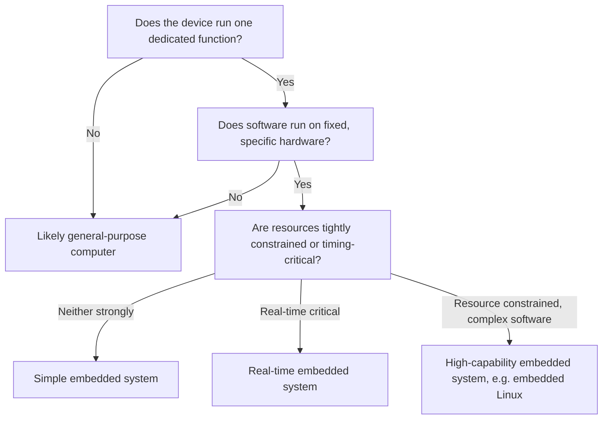

## What Defines an Embedded System

### Definition

An embedded system is a combination of computer hardware and software — and often additional mechanical or electronic parts — designed to perform a dedicated function within a larger mechanical or electrical system. Unlike a general-purpose computer, which is built to run a wide variety of applications chosen by the user, an embedded system is engineered for a specific task or a narrow set of tasks, and this specialization shapes nearly every design decision made around it.

The term applies across an enormous range of scale: a simple 8-bit microcontroller running a few hundred bytes of firmware inside a digital thermostat is an embedded system, and so is a multi-core System-on-Chip (SoC) running a full operating system inside a car's infotainment cluster. What unifies them is not complexity but purpose: the computing element exists to serve the host device's function, not to be a general computing platform in its own right.

### Core Characteristics

Several defining traits separate embedded systems from general-purpose computers. A given real-world device rarely exhibits all of these to the same degree, but most embedded systems exhibit several of them simultaneously.

**Dedicated Functionality**

The software (firmware) and hardware are designed around one application domain. A washing machine controller runs wash cycles; it does not run a spreadsheet application or a web browser. This narrow scope allows designers to optimize aggressively for that one job rather than for general flexibility.

**Resource Constraints**

Embedded systems typically operate under tighter constraints than desktop or server computing:
- Limited RAM (often kilobytes rather than gigabytes)
- Limited program storage (flash memory measured in kilobytes to a few megabytes on smaller devices)
- Limited processing power relative to general-purpose CPUs
- Limited power budget, especially in battery-operated devices

These constraints are not incidental — they are often the primary design driver, since cost, size, and power consumption targets are frequently fixed before the software is written.

**Real-Time Behavior**

Many embedded systems must respond to events within a defined time window. This requirement is often described using two categories:

- **Hard real-time**: missing a deadline constitutes a system failure (e.g., an airbag deployment controller).
- **Soft real-time**: missing a deadline degrades quality but does not cause outright failure (e.g., a slightly delayed frame update on a digital dashboard).

[Inference] Not every embedded system has real-time requirements — a simple data-logging device with no strict timing constraints is still commonly classified as embedded, so real-time behavior is a common but not universal defining trait.

**Reliability and Longevity**

Embedded systems are frequently deployed in contexts where failure is costly, inconvenient, or dangerous, and where the device may run continuously for years without a reboot. This drives design emphasis toward:
- Predictable, tested behavior over frequent feature updates
- Long operational lifetimes (industrial and automotive systems often target 10+ years of service)
- Resistance to environmental stress (temperature extremes, vibration, humidity, electrical noise)

**Tight Hardware-Software Coupling**

Embedded software is usually written with intimate knowledge of the specific hardware it runs on — register layouts, peripheral behavior, timing characteristics, and memory maps. This is different from general-purpose application software, which is written against an abstracted operating system API and is largely hardware-agnostic.

**Fixed or Narrow User Interface**

Many embedded systems have minimal or no traditional user interface — a few LEDs and buttons, a small character display, or no direct human interaction at all (as in an engine control unit). When richer interfaces exist (touchscreens, voice), they are still scoped tightly to the device's function rather than serving as a general application platform.

### Embedded Systems vs. General-Purpose Computers

| Aspect | Embedded System | General-Purpose Computer |
|---|---|---|
| Purpose | One dedicated function or narrow function set | Many arbitrary, user-selected applications |
| Software | Fixed firmware, often unchangeable after deployment | User-installable, frequently updated applications |
| Resources | Constrained (RAM, storage, power) | Comparatively abundant |
| Timing | Often real-time, deterministic requirements | Generally best-effort, non-deterministic |
| User Interaction | Minimal or none; task-specific | Rich, general-purpose (keyboard, mouse, GUI) |
| Lifespan | Long (years), often unattended | Shorter refresh cycles, actively maintained |
| Hardware Coupling | Tight; software written for exact hardware | Loose; abstracted via OS and drivers |

[Inference] This table describes typical or common cases at each end of the spectrum; many real devices sit somewhere in between rather than fitting cleanly into one column.

### The Spectrum of Embedded Systems

Embedded systems are not a single category of device but a spectrum defined by increasing capability and complexity:

- **Simple microcontroller-based systems**: A single-chip microcontroller (MCU) with integrated RAM, flash, and peripherals, running no operating system or a minimal scheduler. Example: a keyless entry fob.
- **RTOS-based systems**: An MCU or small processor running a Real-Time Operating System (RTOS) to manage multiple concurrent tasks with timing guarantees. Example: a motor controller coordinating sensor sampling, PID control loops, and communication.
- **Embedded Linux / high-level OS systems**: A more powerful processor (often an SoC) running a general-purpose OS like embedded Linux, trading some real-time determinism and resource efficiency for richer software capability (networking stacks, file systems, graphical interfaces). Example: a network router or a smart TV set-top box.
- **Cyber-physical and connected systems**: Embedded systems that interact closely with physical processes and increasingly with networks (IoT), blurring the line between "embedded" and "distributed computing" as they gain wireless connectivity and cloud interaction.

This spectrum illustrates that "embedded" describes a system's *relationship to its host device and its degree of specialization*, not a fixed hardware tier.

### Illustration: Embedded System in Context

<svg xmlns="http://www.w3.org/2000/svg" viewBox="0 0 800 420" font-family="sans-serif">
  <text x="400" y="30" text-anchor="middle" font-size="18" font-weight="bold" fill="#1a1a1a">Embedded System in Its Host Device (svg_diagram)</text>

  <rect x="40" y="60" width="720" height="330" rx="12" fill="none" stroke="#555" stroke-width="2" stroke-dasharray="6,4" />
  <text x="60" y="90" font-size="14" fill="#555">Host Device (e.g., Washing Machine)</text>

  <rect x="90" y="120" width="620" height="240" rx="10" fill="#eef4fb" stroke="#2b6cb0" stroke-width="2" />
  <text x="110" y="145" font-size="14" font-weight="bold" fill="#2b6cb0">Embedded System</text>

  <rect x="120" y="165" width="160" height="70" rx="6" fill="#ffffff" stroke="#2b6cb0" />
  <text x="200" y="195" text-anchor="middle" font-size="12" fill="#1a1a1a">Microcontroller</text>
  <text x="200" y="212" text-anchor="middle" font-size="10" fill="#555">(CPU + RAM + Flash)</text>

  <rect x="320" y="165" width="160" height="70" rx="6" fill="#ffffff" stroke="#2b6cb0" />
  <text x="400" y="195" text-anchor="middle" font-size="12" fill="#1a1a1a">Firmware</text>
  <text x="400" y="212" text-anchor="middle" font-size="10" fill="#555">(Dedicated Logic)</text>

  <rect x="520" y="165" width="160" height="70" rx="6" fill="#ffffff" stroke="#2b6cb0" />
  <text x="600" y="195" text-anchor="middle" font-size="12" fill="#1a1a1a">Peripherals</text>
  <text x="600" y="212" text-anchor="middle" font-size="10" fill="#555">(Timers, ADC, I/O)</text>

  <line x1="280" y1="200" x2="320" y2="200" stroke="#2b6cb0" stroke-width="2" />
  <line x1="480" y1="200" x2="520" y2="200" stroke="#2b6cb0" stroke-width="2" />

  <rect x="150" y="270" width="140" height="60" rx="6" fill="#fff7e6" stroke="#b7791f" />
  <text x="220" y="305" text-anchor="middle" font-size="12" fill="#7c5a00">Sensors</text>

  <rect x="330" y="270" width="140" height="60" rx="6" fill="#fff7e6" stroke="#b7791f" />
  <text x="400" y="305" text-anchor="middle" font-size="12" fill="#7c5a00">Actuators</text>

  <rect x="510" y="270" width="140" height="60" rx="6" fill="#fff7e6" stroke="#b7791f" />
  <text x="580" y="305" text-anchor="middle" font-size="12" fill="#7c5a00">Display/Buttons</text>

  <line x1="220" y1="235" x2="220" y2="270" stroke="#b7791f" stroke-width="2" />
  <line x1="400" y1="235" x2="400" y2="270" stroke="#b7791f" stroke-width="2" />
  <line x1="580" y1="235" x2="580" y2="270" stroke="#b7791f" stroke-width="2" />
</svg>

### Illustration: Categorizing an Unknown Device

### Practical Example

Consider a digital kitchen scale:

- **Function**: measure weight and display it — nothing else.
- **Hardware**: a low-cost microcontroller, a load cell sensor, an analog-to-digital converter (ADC), and a small LCD or LED display.
- **Firmware behavior**: continuously sample the ADC, apply calibration and filtering, and update the display — a simple, repeating control loop.
- **Constraints**: the firmware must fit in a few kilobytes of flash, run on a coin-cell or small battery for months, and respond to weight changes within a fraction of a second.
- **No general-purpose behavior**: it cannot run arbitrary user programs, browse the internet, or be repurposed without replacing its firmware and possibly its hardware.

This example demonstrates the defining traits in miniature: dedicated function, tight hardware-software coupling, resource constraints, and a narrow (here, near-nonexistent) user interface.

### Common Misconceptions

- **"Embedded systems are always tiny and simple."** [Inference] This is a common association but not a strict rule — automotive and industrial embedded systems can involve multi-core SoCs with more processing power than early desktop computers; the "embedded" label describes role and integration, not raw capability.
- **"Embedded systems never run an operating system."** Many do run operating systems, ranging from lightweight RTOSes to full embedded Linux distributions; the distinguishing factor is still the system's dedication to a specific host function.
- **"IoT devices are a separate category from embedded systems."** IoT devices are generally embedded systems with added network connectivity; the underlying design principles (resource constraints, dedicated function, hardware coupling) still apply.

### Related Topics

- Microcontrollers vs. microprocessors
- Real-Time Operating Systems (RTOS) fundamentals
- Embedded system architecture (Harvard vs. Von Neumann)
- Firmware development and the embedded software lifecycle
- Power management strategies in embedded design
- Communication protocols in embedded systems (UART, SPI, I2C, CAN)
- Bare-metal programming vs. RTOS-based development
- Embedded Linux fundamentals
- Cyber-physical systems and IoT integration