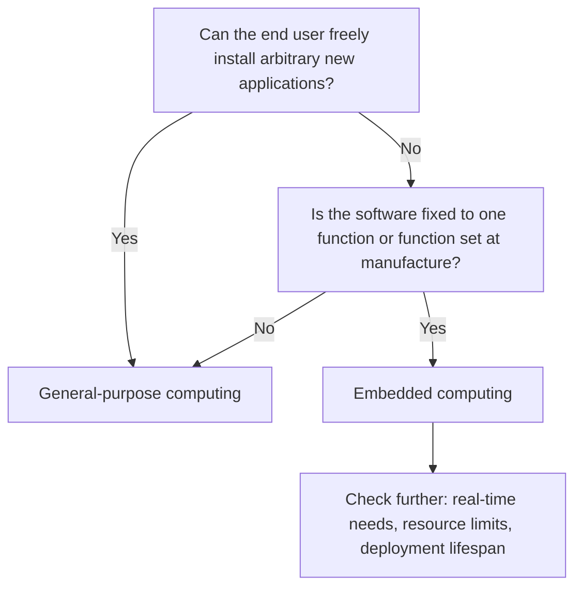

## Embedded vs. General-Purpose Computing

### Overview

Embedded computing and general-purpose computing represent two distinct design philosophies for building computer systems. The distinction is not primarily about raw hardware power — a modern embedded SoC can outperform a decade-old desktop — but about *purpose, scope, and the constraints that purpose imposes*. Understanding this contrast clarifies why embedded engineering involves different tools, tradeoffs, and priorities than desktop or server software development.

### Defining the Two Paradigms

**General-purpose computing** refers to systems designed to run an open-ended, user-selectable set of applications. A desktop PC, laptop, or smartphone is built so that the owner can install a web browser today and a video editor tomorrow, without the hardware or base software being redesigned for either task. The operating system provides broad abstractions (file systems, process scheduling, networking stacks, graphics APIs) so that arbitrary future software can run on it.

**Embedded computing** refers to systems designed around one function or a fixed, narrow set of functions, determined at design time and rarely changed by the end user. The hardware, firmware, and any operating system present are all selected and tuned specifically to serve that function efficiently.

### Key Points of Comparison

**Purpose and Flexibility**

A general-purpose computer's value comes from its flexibility — it is a platform. An embedded system's value comes from its fitness for a specific job — it is a component or product feature. This single difference cascades into most of the other contrasts below.

**Hardware Design Philosophy**

General-purpose hardware is designed for broad compatibility and headroom: manufacturers cannot know in advance what software will run, so they provision generous, general-purpose resources (multi-core CPUs, gigabytes of RAM, expandable storage). Embedded hardware is designed to meet a known, fixed workload as cheaply, compactly, and efficiently as possible — over-provisioning wastes money, board space, and power in a way that matters at production volumes of thousands or millions of units.

**Software and Operating System**

| Aspect | General-Purpose Computing | Embedded Computing |
|---|---|---|
| OS type | Full-featured OS (Windows, macOS, desktop Linux) | No OS, minimal RTOS, or a stripped embedded OS |
| Software install | User installs/removes applications freely | Firmware fixed at manufacture or via controlled updates |
| Update model | Frequent, user-initiated | Infrequent, vendor-controlled (if updatable at all) |
| Multitasking | General-purpose process scheduling | Often single-purpose loop or fixed, cooperative task set |
| Abstraction level | High (rich APIs, hardware abstraction layers) | Often low (direct register access, minimal abstraction) |

**Resource Availability**

General-purpose systems typically have resources that are abundant relative to any single task, allowing inefficiency in individual applications to go unnoticed. Embedded systems are commonly resource-constrained by design — memory, storage, CPU cycles, and power are all treated as finite budgets that the firmware must respect precisely, since the hardware is chosen to match a known workload rather than to leave headroom for unknown future needs.

**Timing Behavior**

General-purpose operating systems are usually optimized for average-case throughput and responsiveness (a slow frame render is inconvenient but not catastrophic). Embedded systems more frequently carry real-time requirements, where **hard real-time** means missing a deadline is a system failure (e.g., a brake controller) and **soft real-time** means missing a deadline degrades quality without causing failure (e.g., a stutter in a digital display refresh). [Inference] Not all embedded systems are real-time systems, but the discipline of real-time design is far more central to embedded computing than to general-purpose computing.

**Development Process**

Developing for general-purpose computing typically means writing against a well-documented, hardware-abstracted OS API, testing on the same architecture the deployment machine uses, and shipping updates over the internet whenever needed. Developing for embedded computing typically means:
- Cross-compiling on a development machine for a different target architecture
- Working closely with datasheets and register-level documentation for the specific chip
- Using debuggers connected via hardware interfaces (JTAG/SWD) rather than OS-level debugging tools
- Validating behavior on the actual physical hardware, since simulators/emulators may not capture all timing or electrical nuances

**Reliability and Deployment Context**

General-purpose computers are usually attended by a user who can reboot, reinstall, or troubleshoot when something goes wrong. Embedded systems are frequently deployed unattended, sometimes in inaccessible or safety-critical locations (inside a sealed medical device, underground, in a vehicle engine bay), which raises the cost of failure and drives more conservative, heavily tested design and longer pre-release validation cycles.

**Lifespan and Maintenance**

General-purpose computing hardware and software both have relatively short refresh cycles — operating systems and applications are updated frequently, and hardware is often replaced every few years. Embedded systems, especially in industrial, automotive, and medical contexts, are frequently expected to remain in service for a decade or more with minimal or no software changes after deployment.

### Visual Comparison

<svg xmlns="http://www.w3.org/2000/svg" viewBox="0 0 800 380" font-family="sans-serif">
  <text x="400" y="28" text-anchor="middle" font-size="18" font-weight="bold" fill="#1a1a1a">Embedded vs. General-Purpose Computing (svg_diagram)</text>

  <rect x="40" y="60" width="340" height="290" rx="10" fill="#eef4fb" stroke="#2b6cb0" stroke-width="2" />
  <text x="210" y="90" text-anchor="middle" font-size="15" font-weight="bold" fill="#2b6cb0">General-Purpose Computing</text>
  <text x="60" y="125" font-size="12" fill="#1a1a1a">• Runs arbitrary user applications</text>
  <text x="60" y="150" font-size="12" fill="#1a1a1a">• Abundant, flexible resources</text>
  <text x="60" y="175" font-size="12" fill="#1a1a1a">• Full OS with rich abstractions</text>
  <text x="60" y="200" font-size="12" fill="#1a1a1a">• Best-effort timing/throughput</text>
  <text x="60" y="225" font-size="12" fill="#1a1a1a">• Frequent user-driven updates</text>
  <text x="60" y="250" font-size="12" fill="#1a1a1a">• Short hardware refresh cycles</text>
  <text x="60" y="275" font-size="12" fill="#1a1a1a">• Attended, user-recoverable</text>
  <text x="60" y="310" font-size="12" font-style="italic" fill="#2b6cb0">Example: laptop, smartphone</text>

  <rect x="420" y="60" width="340" height="290" rx="10" fill="#fff7e6" stroke="#b7791f" stroke-width="2" />
  <text x="590" y="90" text-anchor="middle" font-size="15" font-weight="bold" fill="#7c5a00">Embedded Computing</text>
  <text x="440" y="125" font-size="12" fill="#1a1a1a">• Runs one fixed function or task set</text>
  <text x="440" y="150" font-size="12" fill="#1a1a1a">• Constrained, budgeted resources</text>
  <text x="440" y="175" font-size="12" fill="#1a1a1a">• No OS, RTOS, or minimal OS</text>
  <text x="440" y="200" font-size="12" fill="#1a1a1a">• Often real-time, deterministic</text>
  <text x="440" y="225" font-size="12" fill="#1a1a1a">• Rare, vendor-controlled updates</text>
  <text x="440" y="250" font-size="12" fill="#1a1a1a">• Long service life (years+)</text>
  <text x="440" y="275" font-size="12" fill="#1a1a1a">• Often unattended, high failure cost</text>
  <text x="440" y="310" font-size="12" font-style="italic" fill="#7c5a00">Example: engine controller, scale</text>
</svg>

### Where the Line Blurs

The boundary between the two paradigms is not always sharp:

- **Smartphones** run a full general-purpose-style OS (Android, iOS) but are built on tightly integrated, power-constrained hardware with many embedded-style design pressures.
- **Embedded Linux devices** (routers, smart TVs, industrial HMIs) run a general-purpose-class OS but remain embedded in purpose: the end user cannot freely install arbitrary applications in most consumer cases, and the hardware is fixed to the product.
- **Single-board computers** (e.g., Raspberry Pi–class boards) are general-purpose in capability but are frequently used as the computing core of embedded products.

[Inference] Because of this overlap, the more useful distinguishing question is often "does this device exist to run whatever software the user chooses, or to perform a function defined by its manufacturer?" rather than relying on hardware specifications alone.

### Decision Flow: Classifying a System

### Practical Example: Same Task, Two Paradigms

Consider building a temperature-logging tool:

- **General-purpose approach**: Write a Python script on a laptop that reads a USB temperature sensor and logs to a CSV file. Relies on the OS for USB drivers, file I/O, and scheduling; can be modified or extended trivially; consumes tens of watts; not designed for unattended multi-year operation.
- **Embedded approach**: Design a microcontroller board with an integrated temperature sensor, running firmware that samples the sensor every few seconds and writes to onboard flash or transmits over a low-power radio. Consumes microwatts to milliwatts in sleep/active cycles, can run for years on a small battery, and has firmware fixed to this single task with no general application support.

Both solve the same conceptual problem, but the design constraints, tools, and mindsets are almost entirely different — this contrast is the practical essence of "embedded vs. general-purpose."

### Related Topics

- What defines an embedded system
- Microcontrollers vs. microprocessors
- Real-Time Operating Systems (RTOS) fundamentals
- Resource-constrained programming techniques
- Cross-compilation and embedded toolchains
- Power management in embedded vs. general-purpose systems
- Embedded Linux vs. bare-metal firmware
- System-on-Chip (SoC) architecture