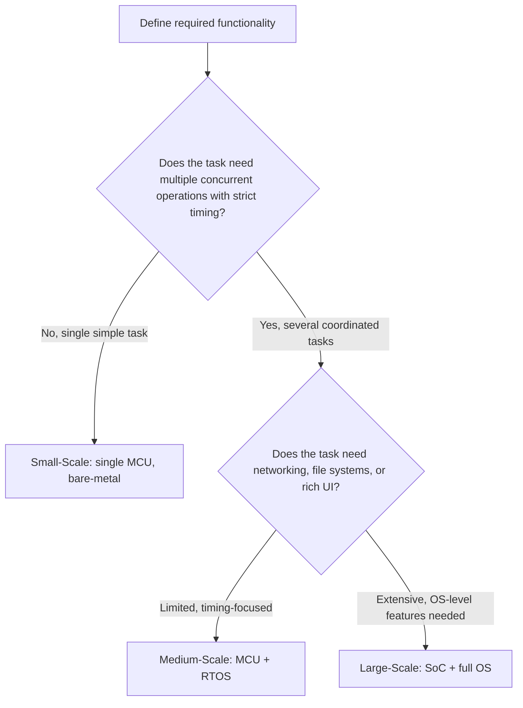

## Classes of Embedded Systems by Scale

### Overview

Embedded systems span an enormous range of computational scale, from a single-chip controller with a few kilobytes of memory to multi-core processors running full operating systems. Classifying systems by scale helps clarify which design techniques, tools, and tradeoffs are relevant to a given project, since a technique appropriate for a tiny sensor node (aggressive memory optimization, bare-metal control loops) may be irrelevant or even counterproductive for a large embedded Linux system (which instead benefits from process isolation, file systems, and standard OS tooling).

There is no single universally standardized taxonomy for these classes — different organizations and textbooks draw the lines somewhat differently — but a commonly used framework divides embedded systems into small-scale, medium-scale, and large-scale/sophisticated categories, with real-time and networked characteristics layered across all three. [Inference] The exact boundaries (e.g., precise RAM/clock-speed thresholds) vary by source and shift over time as hardware capability increases; the categories below should be read as general zones on a continuum, not fixed specifications.

### Small-Scale Embedded Systems

**Characteristics**

Small-scale embedded systems are built around a single 8-bit or 16-bit microcontroller, typically with:
- A few kilobytes of RAM (often under 8 KB)
- Program storage in the tens of kilobytes
- Clock speeds from a few MHz up to a few tens of MHz
- No operating system, or at most a very small cooperative scheduler

**Development Approach**

Firmware for small-scale systems is usually written in C or assembly, with direct register manipulation and no memory management unit. Development tends to be "bare-metal": the firmware is effectively the entire runtime environment, with no process isolation and no dynamic memory allocation in many designs (to avoid heap fragmentation on constrained RAM).

**Typical Examples**

- Simple digital watches and calculators
- Basic remote controls and keyless entry fobs
- Low-end toys with simple logic
- Simple sensor nodes reporting a single measurement

### Medium-Scale Embedded Systems

**Characteristics**

Medium-scale embedded systems typically use a 16-bit or 32-bit microcontroller or a low-power application processor, with:
- RAM ranging from tens of kilobytes to a few megabytes
- Flash storage from hundreds of kilobytes to several megabytes
- Clock speeds from tens of MHz to a few hundred MHz
- Frequently run a Real-Time Operating System (RTOS) to manage multiple concurrent tasks with defined priorities and timing guarantees

**Development Approach**

Development commonly involves an RTOS (such as FreeRTOS, Zephyr, or a vendor-specific RTOS), which provides task scheduling, inter-task communication (queues, semaphores), and sometimes basic networking or file system support. Software is more modular than bare-metal small-scale designs, since multiple tasks (sensor sampling, communication, user interface, control logic) typically run concurrently.

**Typical Examples**

- Industrial motor and process controllers
- Home appliances with multiple coordinated functions (washing machines, thermostats)
- Wearable fitness trackers
- Automotive body control modules (window control, lighting)

### Large-Scale / Sophisticated Embedded Systems

**Characteristics**

Large-scale embedded systems use powerful 32-bit or 64-bit processors, often multi-core System-on-Chip (SoC) designs, with:
- Hundreds of megabytes to several gigabytes of RAM
- Storage in the gigabyte range (eMMC, SD card, or onboard flash)
- Clock speeds from several hundred MHz to multiple GHz
- Usually run a full-featured operating system, most commonly embedded Linux, sometimes alongside a real-time co-processor

**Development Approach**

Development resembles general-purpose software development in many ways: developers write applications against OS APIs, use standard build systems, and can leverage rich libraries for networking, graphics, and file handling. However, embedded-specific concerns remain: boot time, power management, driver development for custom peripherals, and often a real-time subsystem for latency-critical tasks running alongside the general-purpose OS.

**Typical Examples**

- Network routers and set-top boxes
- Infotainment systems in vehicles
- Industrial human-machine interfaces (HMIs) with touchscreens
- Advanced medical imaging equipment control systems

### Comparative Summary

| Attribute | Small-Scale | Medium-Scale | Large-Scale |
|---|---|---|---|
| Typical processor | 8/16-bit MCU | 16/32-bit MCU | 32/64-bit SoC (often multi-core) |
| RAM | KB range (often < 8 KB) | Tens of KB to a few MB | Hundreds of MB to GB range |
| Storage | Tens of KB | Hundreds of KB to a few MB | GB range |
| OS | None / bare-metal | RTOS common | Full OS (often embedded Linux) |
| Concurrency model | Single loop or interrupt-driven | Task-based (RTOS scheduler) | Process/thread-based (OS scheduler) |
| Typical development language | C, assembly | C, sometimes C++ | C/C++, plus higher-level languages (Python, etc.) |
| Example | Digital watch | Industrial motor controller | Automotive infotainment system |

[Inference] Actual products often blend characteristics across these tiers — for instance, a medium-scale RTOS device might include a size of flash typical of large-scale systems — so this table describes central tendencies rather than strict rules.

### Illustration: Scale Spectrum

<svg xmlns="http://www.w3.org/2000/svg" viewBox="0 0 800 300" font-family="sans-serif">
  <text x="400" y="28" text-anchor="middle" font-size="18" font-weight="bold" fill="#1a1a1a">Embedded System Classes by Scale (svg_diagram)</text>

  <line x1="60" y1="150" x2="740" y2="150" stroke="#555" stroke-width="3" />
  <polygon points="740,150 725,143 725,157" fill="#555" />
  <text x="700" y="175" font-size="12" fill="#555">Increasing scale/complexity</text>

  <circle cx="140" cy="150" r="10" fill="#2b6cb0" />
  <text x="140" y="120" text-anchor="middle" font-size="13" font-weight="bold" fill="#2b6cb0">Small-Scale</text>
  <text x="140" y="200" text-anchor="middle" font-size="11" fill="#1a1a1a">8/16-bit MCU</text>
  <text x="140" y="216" text-anchor="middle" font-size="11" fill="#1a1a1a">No OS / bare-metal</text>
  <text x="140" y="232" text-anchor="middle" font-size="11" fill="#1a1a1a">e.g., digital watch</text>

  <circle cx="400" cy="150" r="10" fill="#b7791f" />
  <text x="400" y="120" text-anchor="middle" font-size="13" font-weight="bold" fill="#b7791f">Medium-Scale</text>
  <text x="400" y="200" text-anchor="middle" font-size="11" fill="#1a1a1a">16/32-bit MCU</text>
  <text x="400" y="216" text-anchor="middle" font-size="11" fill="#1a1a1a">RTOS common</text>
  <text x="400" y="232" text-anchor="middle" font-size="11" fill="#1a1a1a">e.g., motor controller</text>

  <circle cx="660" cy="150" r="10" fill="#2f855a" />
  <text x="660" y="120" text-anchor="middle" font-size="13" font-weight="bold" fill="#2f855a">Large-Scale</text>
  <text x="660" y="200" text-anchor="middle" font-size="11" fill="#1a1a1a">32/64-bit SoC</text>
  <text x="660" y="216" text-anchor="middle" font-size="11" fill="#1a1a1a">Full OS (e.g., embedded Linux)</text>
  <text x="660" y="232" text-anchor="middle" font-size="11" fill="#1a1a1a">e.g., infotainment system</text>
</svg>

### Cross-Cutting Dimensions

Two additional dimensions apply across all scale classes rather than defining a separate tier:

**Real-Time Requirements**

A system's timing criticality (hard real-time, soft real-time, or non-real-time) is independent of its scale class. A small-scale airbag trigger circuit can be hard real-time, while a large-scale infotainment system may have only soft real-time requirements for its user interface, alongside a small, separate hard real-time subsystem for safety-critical vehicle functions.

**Networked / Connected Systems**

Connectivity (Wi-Fi, Bluetooth, cellular, industrial fieldbus protocols) can be added at any scale. A small-scale sensor node with a low-power radio and a large-scale industrial gateway are both "networked embedded systems" despite occupying opposite ends of the scale spectrum. This has become increasingly common with the growth of the Internet of Things (IoT), where even small-scale devices frequently include wireless connectivity.

### Choosing a Scale Class in Practice

### Practical Example

A smart irrigation controller can illustrate how scale choice follows functional requirements:

- If it only needs to open a valve on a fixed schedule, a **small-scale** design (a basic MCU with a real-time clock and a relay driver) suffices.
- If it needs to read multiple soil moisture sensors, apply control logic, and manage several valves with precise timing, a **medium-scale** design (an MCU running an RTOS to coordinate sensor tasks and valve control tasks) is more appropriate.
- If it needs a touchscreen interface, Wi-Fi connectivity, cloud data logging, and a mobile app backend, a **large-scale** design (an SoC running embedded Linux) becomes justified despite the higher cost and power draw.

This progression shows that scale class is chosen based on functional and interface demands, not treated as a fixed starting point.

### Related Topics

- What defines an embedded system
- Embedded vs. general-purpose computing
- Microcontrollers vs. microprocessors
- Real-Time Operating Systems (RTOS) fundamentals
- Bare-metal programming techniques
- Embedded Linux fundamentals
- System-on-Chip (SoC) architecture
- IoT device design considerations