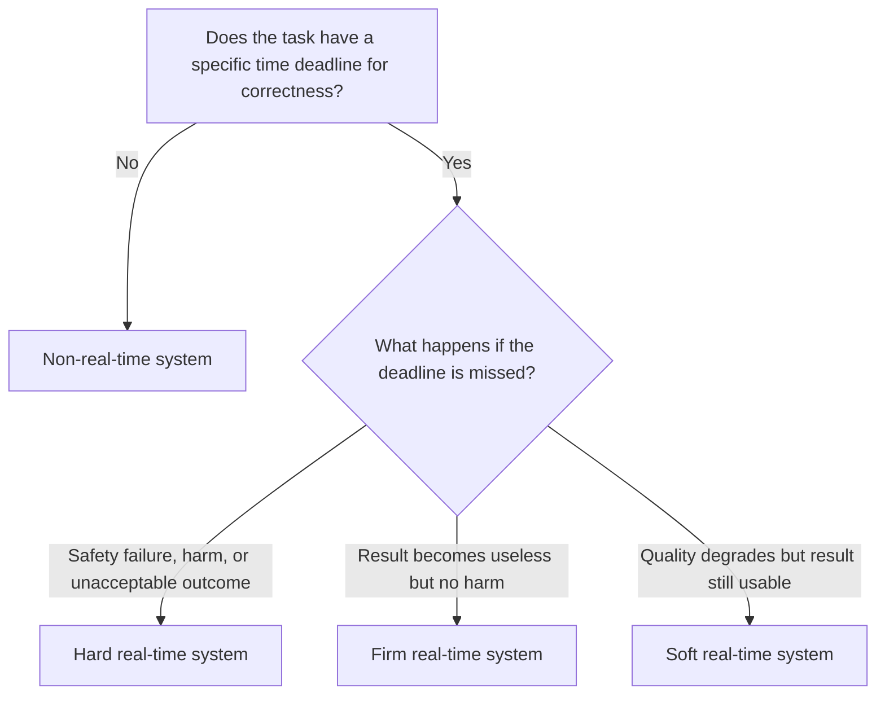

## Real-Time vs. Non-Real-Time Systems

### Overview

The distinction between real-time and non-real-time systems is one of the most important classifications in embedded design, because it determines what "correct" behavior even means. In a non-real-time system, correctness is defined purely by the accuracy of the output. In a real-time system, correctness depends on both the accuracy of the output *and* whether it was produced within a required time window — a logically correct result delivered too late is treated as a failure.

### Defining Real-Time Systems

A real-time system is one in which the correctness of an operation depends not only on its logical result but on the time at which that result is produced. The defining feature is a **deadline**: a point in time by which a computation or response must complete for the system to behave correctly.

Real-time does not mean "fast" in an absolute sense — a real-time system can have a deadline of milliseconds or of several seconds, depending on the physical process it controls. What matters is **determinism and predictability**: the system must reliably meet its deadlines under all specified operating conditions, not merely on average.

### Hard Real-Time Systems

**Definition**

In a hard real-time system, missing a deadline constitutes a system failure, regardless of how accurate or complete the result would otherwise have been. There is no partial credit for a late response.

**Characteristics**

- Deadlines are absolute; the consequence of missing one ranges from degraded safety to catastrophic failure.
- Worst-case execution time (WCET) analysis is critical: designers must prove the system meets its deadline even in the worst case, not just the typical case.
- Hardware and software are usually over-provisioned relative to average-case load, specifically to guarantee worst-case timing.
- Testing emphasizes exhaustive timing verification, not just functional correctness.

**Typical Examples**

- Automotive airbag deployment controllers (must trigger within a defined window after a collision is detected)
- Aircraft flight control systems
- Industrial safety interlocks (e.g., an emergency stop circuit)
- Pacemakers and other life-critical medical devices

[Inference] The specific deadline values in these examples vary by system design and regulatory requirement and are not universal constants; the point is that a late response is treated the same as a wrong one.

### Soft Real-Time Systems

**Definition**

In a soft real-time system, missing a deadline degrades the quality or usefulness of the result but does not constitute an outright system failure. Occasional missed deadlines are tolerated, though frequent or severe misses undermine the system's usefulness.

**Characteristics**

- Deadlines represent a target for good performance rather than an absolute pass/fail line.
- Occasional lateness produces a graceful degradation in user experience or output quality, not a safety event.
- Design effort focuses on keeping the *average-case* and *typical worst-case* performance within acceptable bounds, with less emphasis on exhaustive worst-case proofs than hard real-time systems.

**Typical Examples**

- Digital video/audio streaming (an occasional dropped or delayed frame degrades quality but doesn't stop the system)
- A dashboard display slightly lagging behind the underlying sensor data
- Non-critical telemetry reporting in an industrial system

**Firm Real-Time (a Related Subcategory)**

Some classifications add a middle category, **firm real-time**, where late results are simply discarded as useless (no benefit, but also no severe penalty), distinguishing it from soft real-time (late results are still somewhat useful) and hard real-time (late results are actively harmful). [Inference] Not all textbooks or engineering teams use "firm real-time" as a distinct term — some treat it as a subset of soft real-time — so this subcategory should be treated as a common but non-universal refinement.

### Non-Real-Time (Best-Effort) Systems

**Definition**

Non-real-time systems have no timing deadlines tied to correctness. They are expected to complete tasks as quickly as reasonably possible, but there is no specific point at which a delay becomes an error.

**Characteristics**

- Performance is measured by throughput, average latency, or user-perceived responsiveness rather than deadline compliance.
- Scheduling can prioritize overall system efficiency (e.g., maximizing total work done) rather than guaranteeing any single task's completion time.
- Common in general-purpose computing, but also present in embedded contexts where no physical process imposes a timing constraint.

**Typical Examples**

- A simple data-logging device that stores sensor readings whenever convenient, with no strict interval requirement
- A firmware update process that runs in the background of an otherwise real-time device
- Non-time-critical configuration or diagnostic reporting

### Comparative Summary

| Attribute | Hard Real-Time | Soft Real-Time | Non-Real-Time |
|---|---|---|---|
| Missed deadline consequence | System failure | Degraded quality, tolerable | No defined deadline to miss |
| Design focus | Worst-case guarantee | Typical-case performance | Throughput/efficiency |
| Verification emphasis | Exhaustive timing proof (WCET) | Statistical/typical-case testing | Functional correctness |
| Resource provisioning | Often over-provisioned for worst case | Provisioned for typical load | Provisioned for average throughput |
| Example | Airbag controller | Video streaming display | Background data logger |

### Illustration: Deadline Consequence Comparison

<svg xmlns="http://www.w3.org/2000/svg" viewBox="0 0 800 340" font-family="sans-serif">
  <text x="400" y="28" text-anchor="middle" font-size="18" font-weight="bold" fill="#1a1a1a">Value of Result vs. Time of Completion (svg_diagram)</text>

  <line x1="80" y1="280" x2="740" y2="280" stroke="#333" stroke-width="2" />
  <line x1="80" y1="280" x2="80" y2="60" stroke="#333" stroke-width="2" />
  <text x="410" y="310" text-anchor="middle" font-size="12" fill="#333">Time</text>
  <text x="40" y="170" text-anchor="middle" font-size="12" fill="#333" transform="rotate(-90 40 170)">Value of Result</text>

  <line x1="80" y1="100" x2="330" y2="100" stroke="#2f855a" stroke-width="3" />
  <line x1="330" y1="100" x2="330" y2="260" stroke="#2f855a" stroke-width="3" stroke-dasharray="4,3" />
  <line x1="330" y1="260" x2="700" y2="260" stroke="#2f855a" stroke-width="3" />
  <text x="500" y="245" font-size="12" fill="#2f855a" font-weight="bold">Hard Real-Time (value drops to failure/harm)</text>

  <line x1="80" y1="130" x2="330" y2="130" stroke="#b7791f" stroke-width="3" />
  <path d="M330,130 C 420,150 500,190 700,220" stroke="#b7791f" stroke-width="3" fill="none" />
  <text x="500" y="195" font-size="12" fill="#b7791f" font-weight="bold">Soft Real-Time (value degrades gradually)</text>

  <line x1="80" y1="160" x2="700" y2="160" stroke="#2b6cb0" stroke-width="3" stroke-dasharray="2,2" />
  <text x="500" y="150" font-size="12" fill="#2b6cb0" font-weight="bold">Non-Real-Time (value roughly constant)</text>

  <line x1="330" y1="60" x2="330" y2="280" stroke="#888" stroke-width="1" stroke-dasharray="3,3" />
  <text x="330" y="50" text-anchor="middle" font-size="11" fill="#888">Deadline</text>
</svg>

### Classifying a System: Decision Flow

### Real-Time Behavior and Operating System Choice

The real-time classification directly influences software architecture decisions:

- **Hard real-time systems** typically require a **Real-Time Operating System (RTOS)** with deterministic, priority-based preemptive scheduling, or run bare-metal with carefully controlled interrupt handling, so that worst-case timing can be bounded and proven.
- **Soft real-time systems** may use an RTOS for convenience but can sometimes tolerate a general-purpose OS (including embedded Linux) if its typical-case scheduling latency is acceptable for the application.
- **Non-real-time systems** can generally run on any OS or scheduling model, since there is no deadline to violate.

[Inference] "Can tolerate a general-purpose OS" depends heavily on the specific latency requirements and the OS's configuration (e.g., a real-time-patched Linux kernel behaves differently from a stock kernel); this is a general tendency rather than a strict rule.

### Practical Example

Consider an anti-lock braking system (ABS) paired with an infotainment touchscreen in the same vehicle:

- The **ABS control loop** (sensing wheel speed, computing slip, actuating brake pressure) is **hard real-time**: a delayed response of even a few tens of milliseconds could mean the difference between the wheel maintaining traction and it locking up, so the system is engineered and tested against a proven worst-case response time.
- The **infotainment display** showing speed and media information is **soft real-time**: if a frame renders a little late during a system hiccup, the display looks slightly less smooth, but nothing dangerous occurs, and the system continues operating normally.
- A **trip-logging feature** that records average fuel economy over the drive is **non-real-time**: it has no deadline at all, and can update whenever convenient without affecting anything else.

All three run within the same vehicle, illustrating that real-time classification is a property of a specific task or subsystem, not necessarily the vehicle's electronics as a single whole.

### Related Topics

- What defines an embedded system
- Real-Time Operating Systems (RTOS) fundamentals
- Worst-case execution time (WCET) analysis
- Task scheduling algorithms (rate monotonic, earliest deadline first)
- Interrupt handling and latency in embedded systems
- Embedded Linux vs. RTOS tradeoffs
- Safety-critical embedded system design (e.g., IEC 61508, ISO 26262)