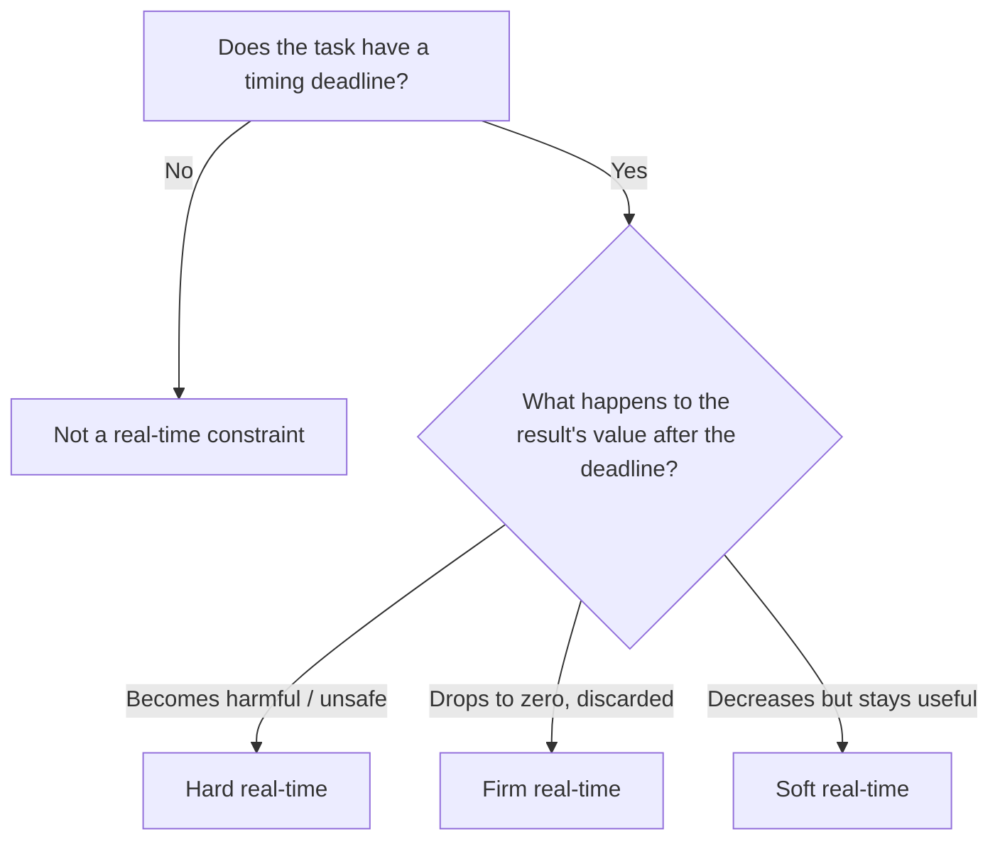

## Hard, Firm, and Soft Real-Time Constraints

### Overview

Real-time constraints describe how a system's correctness depends on timing, and they are commonly divided into three tiers — hard, firm, and soft — based on the consequence of missing a deadline. This three-way split refines the simpler hard/soft dichotomy by isolating a middle case: deadlines whose lateness makes a result *useless* without necessarily making it *harmful*. Understanding which tier a given task falls into shapes nearly every downstream engineering decision, from scheduling algorithm choice to how much worst-case analysis and testing effort a task deserves.

### The Core Distinction: Utility of a Late Result

The cleanest way to distinguish the three tiers is to ask: **what is the value of the result if it arrives after the deadline?**

- **Hard real-time**: the value of a late result is negative — it causes harm, damage, or unacceptable risk.
- **Firm real-time**: the value of a late result drops to zero — it is discarded and provides no benefit, but it also causes no direct harm.
- **Soft real-time**: the value of a late result decreases but remains positive — it is still useful, just less so than an on-time result.

This framing — rather than simply "how severe is a miss" — is what allows firm real-time to be cleanly separated from both of its neighbors.

### Hard Real-Time Constraints

**Definition**

A hard real-time constraint is one where missing the deadline is treated as a complete system failure, equivalent in severity to producing a wrong answer. There is no tolerance for lateness under any specified operating condition.

**Engineering Implications**

- Requires **worst-case execution time (WCET)** analysis: the system must be proven to meet its deadline in the worst case, not merely on average.
- Typically demands a deterministic scheduler (fixed-priority preemptive scheduling is common) and tightly bounded interrupt latency.
- Resources are often over-provisioned specifically to guarantee the worst case, which can mean the system appears "underutilized" in typical operation.
- Verification emphasizes formal or exhaustive timing analysis, static analysis of code paths, and hardware-in-the-loop testing under worst-case load.

**Typical Examples**

- Automotive airbag deployment triggering
- Aircraft fly-by-wire flight control loops
- Industrial emergency-stop and safety interlock circuits
- Pacemaker pacing pulse generation

[Inference] The precise deadline magnitude in each example (milliseconds vs. microseconds) depends on the specific physical process being controlled and the governing safety standard; hard real-time is defined by the *consequence* of lateness, not by any fixed numeric threshold.

### Firm Real-Time Constraints

**Definition**

A firm real-time constraint is one where a late result becomes useless and is discarded, but its lateness does not cause harm or a safety event. The system tolerates occasional missed deadlines by simply dropping the stale result and moving on, rather than treating the miss as a failure requiring a fault response.

**Engineering Implications**

- Occasional missed deadlines are expected and handled gracefully (e.g., by discarding a stale sensor reading rather than triggering a shutdown).
- Design effort focuses on keeping the *frequency* of missed deadlines low enough that overall system usefulness is preserved, rather than proving zero misses are possible.
- Buffering and staleness-detection logic (timestamping results and discarding those past their validity window) are common architectural patterns.

**Typical Examples**

- A financial trading system's price quote that becomes worthless if it arrives after the trade window closes, but causes no direct harm — it is simply ignored.
- A single missed frame's worth of radar data in a non-safety-critical tracking display, where the system discards it and uses the next update instead.
- A factory quality-inspection camera frame that, if processed too late to matter for that specific item on the line, is simply skipped for that item.

[Inference] Firm real-time is a less universally standardized term than hard or soft real-time — some references fold it into "soft real-time" rather than treating it as a distinct middle category, so practitioners should not assume every text uses this three-way split.

### Soft Real-Time Constraints

**Definition**

A soft real-time constraint is one where a late result still provides some benefit, but that benefit diminishes the later it arrives. The system experiences graceful degradation rather than an abrupt drop to zero or negative value.

**Engineering Implications**

- Design targets acceptable *average-case* and *typical worst-case* performance rather than exhaustive worst-case proof.
- Occasional or minor lateness is an accepted quality tradeoff, often invisible or only mildly noticeable to the end user.
- Scheduling can prioritize overall throughput and fairness across tasks rather than guaranteeing any single deadline unconditionally.

**Typical Examples**

- Streaming video/audio playback, where an occasional delayed frame causes a minor visible glitch but does not stop playback
- A smart thermostat's display update, where a brief lag in refreshing the shown temperature is imperceptible or mildly noticeable but harmless
- Background telemetry reporting in an industrial system, where slightly delayed data still informs operators usefully

### Comparative Summary

| Attribute | Hard Real-Time | Firm Real-Time | Soft Real-Time |
|---|---|---|---|
| Value of late result | Negative (harmful) | Zero (discarded, useless) | Positive but reduced |
| Missed deadline treated as | System failure | Expected, handled gracefully | Quality degradation |
| Verification focus | Exhaustive WCET proof | Bounding miss frequency | Typical-case performance |
| Common handling mechanism | Fault response / shutdown | Discard stale result | Accept degraded output |
| Example | Airbag trigger | Discarded stale trading quote | Streaming video frame |

### Illustration: Value-of-Result Curves

<svg xmlns="http://www.w3.org/2000/svg" viewBox="0 0 800 340" font-family="sans-serif">
  <text x="400" y="28" text-anchor="middle" font-size="18" font-weight="bold" fill="#1a1a1a">Hard vs. Firm vs. Soft: Value After Deadline (svg_diagram)</text>

  <line x1="80" y1="280" x2="740" y2="280" stroke="#333" stroke-width="2" />
  <line x1="80" y1="280" x2="80" y2="60" stroke="#333" stroke-width="2" />
  <text x="410" y="310" text-anchor="middle" font-size="12" fill="#333">Time</text>
  <text x="40" y="170" text-anchor="middle" font-size="12" fill="#333" transform="rotate(-90 40 170)">Value of Result</text>
  <line x1="80" y1="180" x2="740" y2="180" stroke="#999" stroke-width="1" stroke-dasharray="2,2" />
  <text x="750" y="184" font-size="10" fill="#999">0</text>

  <line x1="80" y1="100" x2="330" y2="100" stroke="#c53030" stroke-width="3" />
  <line x1="330" y1="100" x2="330" y2="240" stroke="#c53030" stroke-width="3" stroke-dasharray="4,3" />
  <line x1="330" y1="240" x2="700" y2="240" stroke="#c53030" stroke-width="3" />
  <text x="500" y="225" font-size="12" fill="#c53030" font-weight="bold">Hard (drops below zero: harmful)</text>

  <line x1="80" y1="130" x2="330" y2="130" stroke="#805ad5" stroke-width="3" />
  <line x1="330" y1="130" x2="330" y2="180" stroke="#805ad5" stroke-width="3" stroke-dasharray="4,3" />
  <line x1="330" y1="180" x2="700" y2="180" stroke="#805ad5" stroke-width="3" />
  <text x="500" y="165" font-size="12" fill="#805ad5" font-weight="bold">Firm (drops to zero: discarded)</text>

  <line x1="80" y1="160" x2="330" y2="160" stroke="#b7791f" stroke-width="3" />
  <path d="M330,160 C 420,175 500,195 700,215" stroke="#b7791f" stroke-width="3" fill="none" />
  <text x="500" y="120" font-size="12" fill="#b7791f" font-weight="bold">Soft (gradually degrades, stays positive)</text>

  <line x1="330" y1="60" x2="330" y2="280" stroke="#888" stroke-width="1" stroke-dasharray="3,3" />
  <text x="330" y="50" text-anchor="middle" font-size="11" fill="#888">Deadline</text>
</svg>

### Classifying a Task's Constraint Tier

### Interactions Within a Single System

A single embedded product frequently contains tasks spanning all three tiers simultaneously, since different subsystems serve different physical or functional roles:

- A drone flight controller's **attitude stabilization loop** is hard real-time (a late correction can cause loss of control).
- The same drone's **collision-avoidance sensor fusion**, where a single late frame is simply dropped in favor of the next sensor cycle, is firm real-time.
- The drone's **live video downlink** to an operator's screen is soft real-time (an occasional dropped or delayed frame degrades the view but does not affect flight safety).

[Inference] This layering — mixing hard, firm, and soft tasks on shared hardware — is common in practice, but it introduces its own engineering challenge: ensuring that lower-tier tasks (soft, firm) cannot interfere with the scheduling guarantees required by hard real-time tasks, which is typically addressed through priority-based preemptive scheduling and careful resource partitioning.

### Practical Example

Consider a networked industrial sensor hub reporting vibration data from rotating machinery:

- **Hard real-time task**: an integrated over-vibration cutoff that must trigger a motor shutdown within a strict window if vibration exceeds a dangerous threshold — a late shutdown risks equipment damage or injury.
- **Firm real-time task**: periodic vibration samples sent to a local buffer for a rolling analysis window; if a sample arrives late enough to miss its window, it is simply dropped and excluded from that window's calculation, with no fault raised.
- **Soft real-time task**: a dashboard graph on a control room screen showing the vibration trend, where a brief lag in updating the display is a minor inconvenience, not a functional problem.

This example reinforces that the three tiers are typically assigned per-task based on the consequence of lateness for that specific function, not applied uniformly to an entire device.

### Related Topics

- Real-time vs. non-real-time systems
- Worst-case execution time (WCET) analysis
- Task scheduling algorithms (rate monotonic, earliest deadline first)
- Real-Time Operating Systems (RTOS) fundamentals
- Interrupt latency and jitter in embedded systems
- Priority inversion and priority inheritance
- Safety-critical embedded system standards (IEC 61508, ISO 26262, DO-178C)