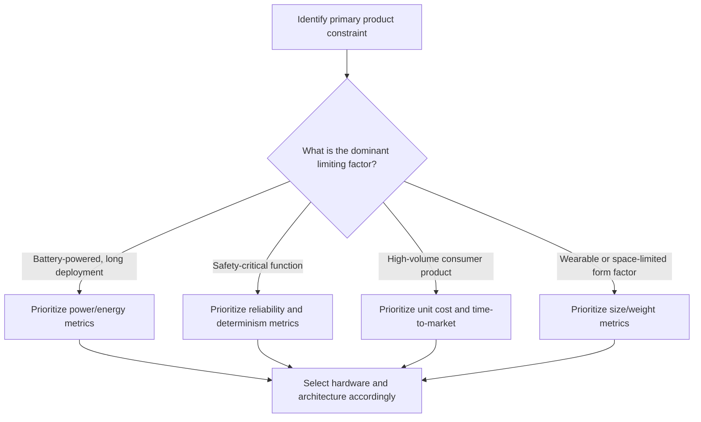

## Embedded System Design Metrics

### Overview

Embedded system design involves balancing a set of competing, quantifiable metrics rather than optimizing for any single measure of "goodness." Because embedded products are typically produced at volume and deployed with fixed hardware, decisions made early in design — choice of processor, memory size, clock speed — lock in tradeoffs across cost, performance, power, size, and reliability that are difficult or impossible to change later. Design metrics give engineers a shared vocabulary for reasoning about these tradeoffs explicitly rather than intuitively.

This topic is broad by nature, since "design metrics" spans cost, performance, power, size, reliability, and time-related engineering metrics; the sections below aim to cover the major categories comprehensively while noting where exact figures are context-dependent rather than fixed.

### Cost Metrics

**Unit (Manufacturing) Cost**

The cost to produce a single unit at volume — dominated by component cost (processor, memory, sensors, PCB, enclosure) and manufacturing/assembly cost. In high-volume consumer embedded products, unit cost is often the single most aggressively optimized metric, since even a few cents of savings per unit compounds across millions of units.

**Non-Recurring Engineering (NRE) Cost**

The one-time cost of designing the product: engineering labor, tooling, certification, and prototyping. NRE cost is amortized across the total production volume, so it matters more for low-volume products (where NRE per unit can dominate) than for high-volume consumer goods.

**Total Cost of Ownership**

Includes costs beyond initial manufacture: maintenance, field support, software updates, warranty replacement, and end-of-life disposal or recycling. [Inference] The relative weight given to total cost of ownership versus unit cost varies significantly by industry — industrial and medical embedded systems often weigh long-term support cost more heavily than high-volume consumer electronics do.

### Performance Metrics

**Throughput**

The rate at which a system processes work — instructions per second, samples per second, frames per second, or transactions per second, depending on the application domain.

**Latency**

The time delay between an input event and the corresponding output or response. In real-time systems, latency (and especially *worst-case* latency) is often more critical than average throughput, since a single late response can constitute a failure regardless of how fast the system performs on average.

**Determinism**

The degree to which a system's timing behavior is predictable and repeatable under the same conditions. High determinism is essential for real-time systems and is often achieved by sacrificing some average-case performance (e.g., disabling caches or using fixed-priority scheduling) in exchange for tightly bounded worst-case behavior.

**Jitter**

The variation in timing between repeated occurrences of an event that is expected to be periodic (e.g., variation in the interval between successive sensor samples). Low jitter is important in applications like audio/video synchronization and control loop stability.

### Power and Energy Metrics

**Active Power Consumption**

The power drawn while the system is actively computing, typically measured in milliwatts or watts, and directly influenced by clock speed, voltage, and workload.

**Sleep/Idle Power Consumption**

The power drawn during low-activity or sleep states, often measured in microwatts for well-optimized battery-powered devices. For devices that spend the vast majority of their operational time idle (e.g., a battery-powered sensor that wakes briefly to transmit), sleep power can dominate total energy consumption more than active power does.

**Energy per Operation**

A composite metric (often expressed in joules or microjoules per operation) capturing the total energy cost of completing a discrete task, useful for comparing efficiency across different hardware or software implementations independent of how fast or slow each one runs.

**Battery Life**

A derived, application-level metric combining energy consumption patterns with battery capacity, typically the figure most visible to end users and product marketing (e.g., "two years on a coin cell").

### Size and Physical Metrics

**Silicon Area / Die Size**

Relevant primarily to chip designers rather than product engineers using off-the-shelf components; smaller die size generally reduces per-unit chip cost.

**Board Footprint**

The physical PCB area required by the embedded system, which constrains enclosure size and can be a hard requirement in space-limited products (wearables, implantable medical devices).

**Weight**

Particularly critical in mobile, wearable, drone, and aerospace applications, where added mass has direct performance or usability consequences (e.g., reduced drone flight time per unit of added weight).

### Reliability and Robustness Metrics

**Mean Time Between Failures (MTBF)**

A statistical estimate of the average operating time between failures for a repairable system, commonly used to compare reliability across design alternatives or component choices.

**Mean Time To Failure (MTTF)**

Similar to MTBF but used for non-repairable systems or components, representing expected operating lifetime before failure.

**Fault Tolerance**

The degree to which a system continues operating correctly (possibly in a degraded mode) in the presence of a fault, often achieved through redundancy (duplicate sensors, redundant processing paths) in safety-critical designs.

**Environmental Robustness**

Tolerance to operating conditions such as temperature range, humidity, vibration, and electromagnetic interference, often specified against industry standards relevant to the deployment environment (automotive, industrial, aerospace).

### Time-Related Engineering Metrics

**Time-to-Market**

The elapsed time from project start to product launch, which can be a decisive competitive metric in fast-moving consumer markets.

**Development Time**

The engineering effort and calendar time required to design, implement, and validate the embedded system, influenced heavily by team experience, tool maturity, and design complexity.

**Maintainability**

How easily the system's software or hardware can be modified, debugged, or extended after initial deployment — an increasingly important metric as embedded devices gain remote update capability and longer service lifetimes.

### Comparative Summary

| Metric Category | Primary Concern | Example Metric | Typical Tradeoff Partner |
|---|---|---|---|
| Cost | Economic feasibility | Unit cost, NRE cost | Performance, reliability |
| Performance | Speed and predictability | Latency, throughput, jitter | Power, cost |
| Power/Energy | Battery life, thermal budget | Active power, energy per operation | Performance |
| Size/Physical | Form factor fit | Board footprint, weight | Cost, performance |
| Reliability | Failure resistance | MTBF, fault tolerance | Cost, size |
| Time-related | Delivery and evolution | Time-to-market, maintainability | Cost, performance |

[Inference] The "tradeoff partner" column reflects commonly observed tensions in embedded design practice rather than fixed mathematical relationships; the strength of each tradeoff depends heavily on the specific application and technology choices involved.

### Illustration: The Embedded Design Tradeoff Space

<svg xmlns="http://www.w3.org/2000/svg" viewBox="0 0 800 420" font-family="sans-serif">
  <text x="400" y="30" text-anchor="middle" font-size="18" font-weight="bold" fill="#1a1a1a">Embedded Design Metric Tradeoffs (svg_diagram)</text>

  <polygon points="400,70 620,190 530,370 270,370 180,190" fill="#eef4fb" stroke="#2b6cb0" stroke-width="2" />

  <text x="400" y="60" text-anchor="middle" font-size="13" font-weight="bold" fill="#2b6cb0">Performance</text>
  <text x="650" y="195" font-size="13" font-weight="bold" fill="#b7791f">Power Efficiency</text>
  <text x="560" y="395" font-size="13" font-weight="bold" fill="#2f855a">Reliability</text>
  <text x="180" y="395" text-anchor="middle" font-size="13" font-weight="bold" fill="#c53030">Cost</text>
  <text x="60" y="195" font-size="13" font-weight="bold" fill="#805ad5">Size/Weight</text>

  <line x1="400" y1="220" x2="400" y2="70" stroke="#999" stroke-width="1" stroke-dasharray="3,3" />
  <line x1="400" y1="220" x2="620" y2="190" stroke="#999" stroke-width="1" stroke-dasharray="3,3" />
  <line x1="400" y1="220" x2="530" y2="370" stroke="#999" stroke-width="1" stroke-dasharray="3,3" />
  <line x1="400" y1="220" x2="270" y2="370" stroke="#999" stroke-width="1" stroke-dasharray="3,3" />
  <line x1="400" y1="220" x2="180" y2="190" stroke="#999" stroke-width="1" stroke-dasharray="3,3" />

  <circle cx="400" cy="220" r="5" fill="#333" />
  <text x="400" y="245" text-anchor="middle" font-size="11" fill="#333">Design point</text>
</svg>

### Applying Metrics: A Decision Flow

### Practical Example

Consider designing a wireless soil moisture sensor for agricultural use, evaluated against these metrics:

- **Cost**: targeting a low unit cost (since many units are deployed across a field) drives selection of a low-cost microcontroller and a simple, low-cost moisture sensor rather than a premium alternative.
- **Power**: since the device runs on a small battery or solar cell for years, sleep power consumption becomes the dominant energy metric — the device spends the vast majority of its life in a low-power sleep state, waking briefly to sample and transmit.
- **Latency/Performance**: since soil moisture changes slowly, latency requirements are minimal — a soft or effectively non-real-time constraint — allowing the design to favor power savings over responsiveness.
- **Size**: the device must fit into a compact, field-deployable enclosure, constraining board footprint and battery size.
- **Reliability**: the device must tolerate outdoor environmental conditions (moisture, temperature swings) over a multi-year deployment, pushing environmental robustness and MTBF considerations into the design.

This example shows how a single product's dominant metrics (here, cost and power) are identified from its use case, while other metrics (performance, size) are satisfied at a "good enough" level rather than maximized.

### Related Topics

- Classes of embedded systems by scale
- Power management strategies in embedded design
- Real-time vs. non-real-time systems
- Worst-case execution time (WCET) analysis
- Embedded system reliability and fault tolerance
- Hardware/software co-design tradeoffs
- Embedded systems certification standards (IEC 61508, ISO 26262, DO-178C)