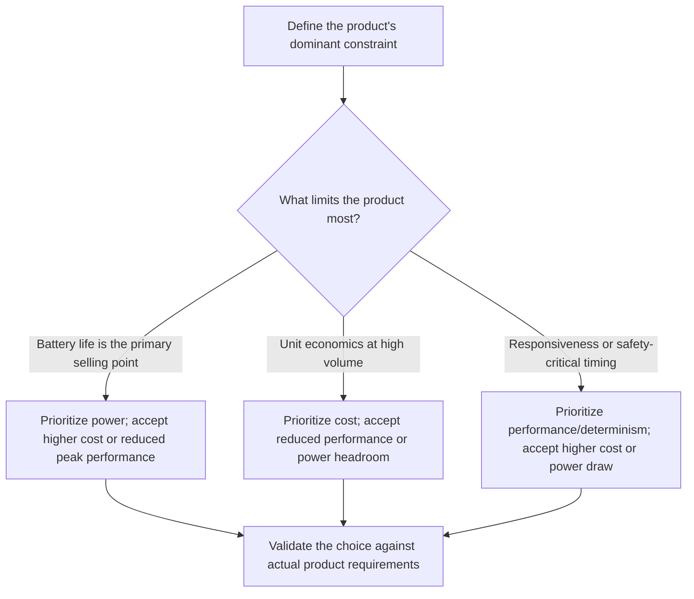

## Power, Cost, and Performance Tradeoffs

### Overview

Power, cost, and performance form the most fundamental tradeoff triangle in embedded system design. Nearly every architectural decision — processor selection, clock speed, memory sizing, peripheral choice — pulls these three metrics in different directions, and improving one typically comes at the expense of at least one of the others. Because embedded products are usually produced at volume with fixed hardware, these tradeoffs must be resolved early and deliberately, since they are expensive or impossible to revisit after tooling and mass production begin.

### The Nature of the Triangle

A useful mental model treats power, cost, and performance as three vertices of a triangle: pushing a design toward one vertex generally pulls it away from the other two. A design cannot simultaneously be maximally fast, maximally cheap, and maximally power-efficient — some combination of compromises is inevitable, and the engineer's job is choosing *which* compromise fits the product's actual requirements.

This is a simplification: certain technology improvements (a more efficient process node, a better compiler, a smarter algorithm) can shift the entire triangle favorably without a direct one-for-one tradeoff. [Inference] Such improvements are valuable but are not unlimited or free — they typically involve their own costs, such as NRE investment in a new fabrication process or engineering time spent on optimization, so the triangle framing remains a useful approximation even when technology shifts the achievable frontier.

### Performance vs. Power

**The Core Relationship**

Higher performance generally requires higher clock speeds, more transistors switching per cycle, or more parallel execution units — all of which increase power consumption. This relationship is not linear: dynamic power in CMOS circuits scales roughly with the square of voltage and linearly with frequency, meaning that pushing clock speed higher (which often also requires higher voltage to maintain stable operation) increases power consumption disproportionately.

$$P_{dynamic} \propto C \cdot V^2 \cdot f$$

Where $C$ is switching capacitance, $V$ is supply voltage, and $f$ is clock frequency. [Inference] This is a simplified first-order model; real power consumption also includes static/leakage power and depends on process technology, so actual measured power on a given chip will not follow this formula exactly.

**Common Mitigation Techniques**

- **Dynamic Voltage and Frequency Scaling (DVFS)**: reducing clock speed and voltage during low-demand periods to save power, then scaling up when performance is needed.
- **Sleep and low-power modes**: powering down unused peripherals or entire subsystems when idle, since many embedded workloads spend the majority of their time waiting rather than computing.
- **Parallelism over frequency**: using multiple slower cores or specialized hardware accelerators (e.g., a DSP or dedicated crypto engine) can sometimes achieve required throughput at lower power than a single core running at very high frequency, since power scales worse than linearly with frequency.

**Typical Tension**

A battery-powered wearable device illustrates this tension directly: increasing processor speed to run more sophisticated sensor-fusion algorithms improves feature richness and responsiveness but directly shortens battery life, often forcing a choice between "smarter" behavior and "longer runtime."

### Performance vs. Cost

**The Core Relationship**

Higher-performance processors and larger memory typically cost more per unit, both because of the silicon itself (larger die area, more advanced process nodes) and because of the surrounding system requirements (more PCB layers for high-speed signal integrity, additional power regulation, more expensive memory chips).

**Common Mitigation Techniques**

- **Right-sizing**: selecting the minimum processor capability that meets the application's actual performance requirement, rather than defaulting to the most powerful available option.
- **Hardware acceleration for specific tasks**: adding a small, inexpensive dedicated peripheral (e.g., a hardware CRC engine or a basic DSP block) can sometimes deliver needed performance more cheaply than upgrading to a faster general-purpose core.
- **Software optimization**: improving algorithmic efficiency or code quality can extract more performance from existing (cheaper) hardware, avoiding a hardware upgrade altogether.

**Typical Tension**

A consumer IoT device manufacturer choosing between two microcontroller options faces this tradeoff concretely: a faster, more capable chip may simplify software development and enable richer features, but at a few dollars more per unit — a difference that, multiplied across a production run of millions of units, can represent a large swing in overall product margin.

### Power vs. Cost

**The Core Relationship**

Power-efficient components (advanced low-power process nodes, specialized power management ICs, higher-quality batteries) frequently cost more than their less efficient counterparts. Achieving very low power consumption often requires additional engineering effort and more expensive components rather than being a "free" property of good design alone.

**Common Mitigation Techniques**

- **Selective efficiency investment**: spending extra on power efficiency only for the specific components that dominate the power budget (e.g., the radio in a wireless sensor), while using cheaper, less efficient components elsewhere where power is not the bottleneck.
- **System-level power architecture**: using efficient voltage regulators (switching regulators rather than linear regulators) can reduce power waste at a modest cost increase, often paying for itself through extended battery life or reduced battery size requirements.
- **Battery sizing as a cost lever**: a less power-efficient design can sometimes be "fixed" by simply using a larger battery, but this increases cost, size, and weight — meaning the tradeoff shifts rather than disappears.

**Typical Tension**

A battery-powered remote sensor deployed in a hard-to-access location (e.g., a pipeline monitor) illustrates this well: investing more upfront in a lower-power radio and processor can be justified by avoiding the much higher cost of physically visiting the site to replace batteries — meaning the "cheapest" component-level choice is not necessarily the lowest total-cost design.

### Comparative Summary

| Tradeoff Pair | Pushing Toward One Side | Typical Cost to the Other Side |
|---|---|---|
| Performance vs. Power | Higher clock speed, more cores | Increased active power draw, shorter battery life |
| Performance vs. Cost | Faster processor, more memory | Higher unit cost, higher BOM |
| Power vs. Cost | Advanced low-power components | Higher component and engineering cost |

### Illustration: The Tradeoff Triangle

<svg xmlns="http://www.w3.org/2000/svg" viewBox="0 0 800 460" font-family="sans-serif">
  <text x="400" y="30" text-anchor="middle" font-size="18" font-weight="bold" fill="#1a1a1a">Power, Cost, and Performance Triangle (svg_diagram)</text>

  <polygon points="400,80 640,380 160,380" fill="#eef4fb" stroke="#2b6cb0" stroke-width="2" />

  <circle cx="400" cy="80" r="6" fill="#2f855a" />
  <text x="400" y="60" text-anchor="middle" font-size="14" font-weight="bold" fill="#2f855a">Performance</text>
  <text x="400" y="115" text-anchor="middle" font-size="10" fill="#1a1a1a">(speed, throughput,</text>
  <text x="400" y="130" text-anchor="middle" font-size="10" fill="#1a1a1a">determinism)</text>

  <circle cx="640" cy="380" r="6" fill="#b7791f" />
  <text x="700" y="385" font-size="14" font-weight="bold" fill="#b7791f">Cost</text>
  <text x="700" y="405" font-size="10" fill="#1a1a1a">(unit cost, NRE)</text>

  <circle cx="160" cy="380" r="6" fill="#805ad5" />
  <text x="60" y="385" font-size="14" font-weight="bold" fill="#805ad5">Power</text>
  <text x="60" y="405" font-size="10" fill="#1a1a1a">(active, sleep,</text>
  <text x="60" y="420" font-size="10" fill="#1a1a1a">battery life)</text>

  <circle cx="400" cy="280" r="7" fill="#333" />
  <text x="400" y="305" text-anchor="middle" font-size="11" fill="#333">Example design point</text>

  <line x1="400" y1="80" x2="640" y2="380" stroke="#2b6cb0" stroke-width="1" stroke-dasharray="4,3" />
  <line x1="640" y1="380" x2="160" y2="380" stroke="#2b6cb0" stroke-width="1" stroke-dasharray="4,3" />
  <line x1="160" y1="380" x2="400" y2="80" stroke="#2b6cb0" stroke-width="1" stroke-dasharray="4,3" />
</svg>

### Navigating the Tradeoffs: Decision Flow

### Practical Example

Consider three variants of a smart doorbell camera design, each resolving the triangle differently:

- **Budget variant**: uses a low-cost, moderate-performance SoC with basic motion detection running entirely on-device. Cheapest to produce, but limited AI features and shorter battery life due to a less power-optimized chip running longer to compensate for lower per-cycle efficiency.
- **Battery-optimized variant**: uses a more expensive, highly power-efficient SoC with a dedicated low-power vision accelerator, achieving long battery life at a noticeably higher bill-of-materials cost, while performance for complex on-device AI tasks remains modest.
- **Performance-optimized variant**: uses a powerful SoC capable of running sophisticated on-device person/package recognition in real time, at the cost of both higher unit price and reliance on a wired power connection (sidestepping the power constraint by removing battery operation from the requirements entirely).

This example shows that the "best" resolution of the triangle depends entirely on which constraint the product's market position and use case make dominant — there is no universally correct balance point.

### Related Topics

- Embedded system design metrics
- Power management strategies in embedded design
- Dynamic Voltage and Frequency Scaling (DVFS)
- Microcontroller vs. microprocessor selection criteria
- Hardware/software co-design tradeoffs
- System-on-Chip (SoC) architecture
- Battery technology and energy budgeting for embedded devices