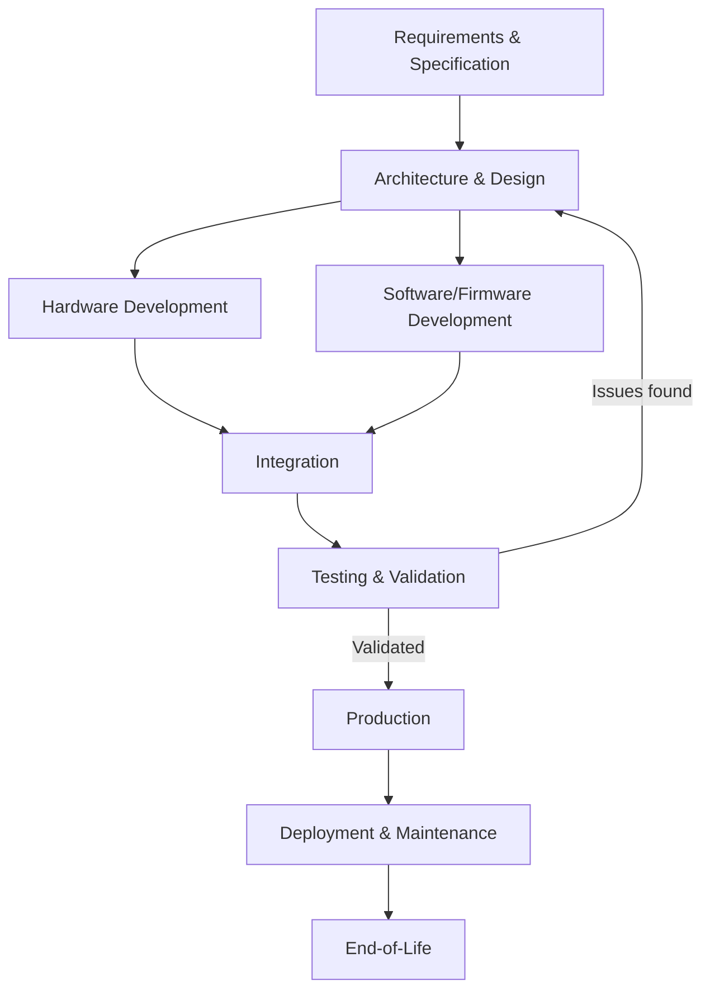

## Embedded System Lifecycle and Development Flow

### Overview

The embedded system lifecycle describes the sequence of phases a product moves through from initial concept to end-of-life, spanning both hardware and software development in a way that general-purpose software rarely requires. Because embedded hardware is typically fixed at manufacture and firmware is harder to update than desktop or cloud software, embedded development places disproportionate emphasis on upfront requirements definition, hardware/software co-design, and thorough validation before mass production begins — mistakes discovered after tooling is committed or units are shipped are far more expensive to fix than in purely software-based products.

This topic is broad by nature, spanning the full product lifecycle from requirements through end-of-life; the sections below aim for comprehensive coverage of each major phase.

### Requirements and Specification

**Defining the Problem**

The lifecycle begins with defining what the system must do: functional requirements (what the device does), non-functional requirements (performance, power, cost, reliability targets), and constraints (regulatory, environmental, physical size). This phase typically produces a requirements specification that later phases are validated against.

**Feasibility Analysis**

Before committing engineering resources, teams typically assess whether the requirements are achievable within cost, power, and schedule targets — for example, confirming that a target battery life is physically achievable given the required sensor sampling rate and available low-power components.

### Architecture and Design

**System Architecture Definition**

At this stage, the overall structure is decided: which functions will be implemented in hardware versus software, what processor class is needed (see embedded system classes by scale), what peripherals and sensors are required, and how subsystems will communicate.

**Hardware/Software Co-Design**

Embedded development frequently involves co-design, where hardware and software decisions are made in tandem rather than sequentially — a software requirement (e.g., needing to process sensor data at a certain rate) can drive a hardware choice (e.g., adding a hardware accelerator), while a hardware constraint (e.g., limited RAM) can drive a software architecture choice (e.g., avoiding dynamic memory allocation).

**Selecting the Processor and Toolchain**

Processor selection (microcontroller vs. microprocessor, specific vendor and part) and toolchain selection (compiler, debugger, RTOS if applicable) typically happen in this phase, since they constrain nearly all subsequent implementation work.

### Hardware Development

**Schematic Design**

Engineers design the circuit schematic: the processor, power supply, sensors, connectors, and supporting components, along with their electrical connections.

**PCB Layout**

The schematic is translated into a physical printed circuit board layout, accounting for signal integrity, thermal management, electromagnetic compatibility (EMC), and manufacturability constraints.

**Prototyping**

Early hardware prototypes (often hand-assembled or produced in small quantities) allow initial hardware bring-up and software development before committing to mass-production tooling.

### Software/Firmware Development

**Low-Level Driver Development**

Software closest to the hardware — drivers for peripherals, interrupt handlers, and basic hardware initialization — is typically developed and validated first, often directly against early prototype hardware.

**Application Logic Development**

Higher-level firmware implementing the device's actual function (control algorithms, communication protocols, user interface logic) is built on top of the validated driver layer.

**Real-Time Task Design (Where Applicable)**

For systems with real-time constraints, this phase includes defining task priorities, scheduling policy, and timing budgets (see hard, firm, and soft real-time constraints), often using an RTOS to manage concurrent tasks.

### Integration

**Hardware/Software Integration**

Firmware is integrated with the actual target hardware (rather than a simulator or development board), surfacing issues that only appear when software meets the real electrical and timing behavior of production-representative hardware.

**Subsystem Integration**

For larger systems, individually developed subsystems (e.g., a communication module, a sensor subsystem, a user interface subsystem) are combined and tested together, since interactions between subsystems often reveal issues invisible during isolated development.

### Testing and Validation

**Unit and Functional Testing**

Verifies that individual software modules and overall device functions behave correctly against the requirements specification.

**Timing and Performance Validation**

For real-time systems, this includes worst-case execution time analysis and stress testing under maximum load conditions to confirm deadlines are met even in adverse scenarios.

**Environmental and Reliability Testing**

Validates behavior under specified environmental conditions (temperature extremes, vibration, humidity, electromagnetic interference) and estimates reliability metrics such as MTBF, particularly important for industrial, automotive, and medical products.

**Regulatory and Compliance Testing**

Many embedded products must pass formal certification testing (EMC/EMI compliance, safety standards, industry-specific certifications) before they can be legally sold in target markets.

### Production

**Design for Manufacturing (DFM) Finalization**

Hardware design is refined for efficient, reliable mass production, addressing issues like component availability, assembly tolerances, and test point accessibility.

**Manufacturing and Provisioning**

Units are mass-produced, and firmware is typically flashed onto each device during manufacturing, often alongside unique identifiers, calibration data, or security keys provisioned per unit.

**Manufacturing Test**

Automated test procedures verify each produced unit functions correctly before shipment, catching manufacturing defects that design validation would not have found.

### Deployment and Maintenance

**Field Deployment**

Units are shipped and installed or activated in their operating environment, sometimes requiring on-site configuration or commissioning for industrial and infrastructure products.

**Firmware Updates**

For updatable devices, this phase includes ongoing firmware maintenance: bug fixes, security patches, and occasionally new features, delivered via a controlled update mechanism (physical connection, local network, or over-the-air update).

**Field Support and Monitoring**

Especially for connected or industrial embedded systems, ongoing monitoring of deployed units can catch emerging issues (e.g., unexpected failure patterns) before they become widespread.

### End-of-Life

**Discontinuation Planning**

At some point, a product reaches end-of-life: manufacturing stops, and vendors typically define a support timeline for existing deployed units (final firmware update commitments, spare parts availability).

**Decommissioning and Disposal**

Deployed units are eventually retired, raising considerations around data security (ensuring sensitive data or credentials are wiped) and environmentally responsible disposal or recycling, particularly relevant given electronic waste regulations in many regions.

### Comparative Summary

| Lifecycle Phase | Primary Activity | Key Risk if Skipped or Rushed |
|---|---|---|
| Requirements | Define functional/non-functional needs | Building the wrong product |
| Architecture/Design | Hardware/software co-design, processor selection | Costly rework after commitment |
| Hardware Development | Schematic, PCB layout, prototyping | Electrical or manufacturability defects |
| Software/Firmware Development | Drivers, application logic, real-time tasks | Unreliable or non-deterministic behavior |
| Integration | Combine hardware, firmware, subsystems | Late discovery of interaction bugs |
| Testing/Validation | Functional, timing, environmental, compliance | Field failures, recalls, certification denial |
| Production | Manufacturing, provisioning, test | Defective units shipped at scale |
| Deployment/Maintenance | Field operation, updates, support | Security vulnerabilities, unaddressed bugs |
| End-of-Life | Discontinuation, decommissioning | Data exposure, e-waste mismanagement |

### Illustration: Lifecycle Flow

### Illustration: V-Model of Embedded Development

A commonly used framework for visualizing how design and testing phases correspond is the V-Model, which pairs each design stage on the left with a corresponding validation stage on the right.

<svg xmlns="http://www.w3.org/2000/svg" viewBox="0 0 800 460" font-family="sans-serif">
  <text x="400" y="28" text-anchor="middle" font-size="18" font-weight="bold" fill="#1a1a1a">V-Model of Embedded Development (svg_diagram)</text>

  <line x1="100" y1="80" x2="400" y2="380" stroke="#2b6cb0" stroke-width="3" />
  <line x1="400" y1="380" x2="700" y2="80" stroke="#2f855a" stroke-width="3" />

  <circle cx="100" cy="80" r="6" fill="#2b6cb0" />
  <text x="115" y="75" font-size="12" fill="#2b6cb0">Requirements</text>
  <text x="640" y="75" font-size="12" fill="#2f855a" text-anchor="end">Acceptance Testing</text>
  <circle cx="700" cy="80" r="6" fill="#2f855a" />

  <circle cx="175" cy="155" r="6" fill="#2b6cb0" />
  <text x="190" y="150" font-size="12" fill="#2b6cb0">System Architecture</text>
  <text x="565" y="150" font-size="12" fill="#2f855a" text-anchor="end">System Integration Testing</text>
  <circle cx="625" cy="155" r="6" fill="#2f855a" />

  <circle cx="250" cy="230" r="6" fill="#2b6cb0" />
  <text x="265" y="225" font-size="12" fill="#2b6cb0">Detailed HW/SW Design</text>
  <text x="490" y="225" font-size="12" fill="#2f855a" text-anchor="end">Subsystem Testing</text>
  <circle cx="550" cy="230" r="6" fill="#2f855a" />

  <circle cx="325" cy="305" r="6" fill="#2b6cb0" />
  <text x="340" y="300" font-size="12" fill="#2b6cb0">Module Implementation</text>
  <text x="415" y="300" font-size="12" fill="#2f855a" text-anchor="end">Unit Testing</text>
  <circle cx="475" cy="305" r="6" fill="#2f855a" />

  <circle cx="400" cy="380" r="7" fill="#333" />
  <text x="400" y="405" text-anchor="middle" font-size="12" fill="#333">Coding</text>
</svg>

### Practical Example: Developing a Smart Water Meter

Tracing a smart water meter product through the lifecycle illustrates how the phases connect:

- **Requirements**: must measure flow accurately, report readings over a low-power wireless network, and run for 10+ years on a single battery.
- **Architecture**: a low-power microcontroller paired with a flow sensor and a low-power wide-area network (LPWAN) radio is chosen; most processing time is spent in sleep mode.
- **Hardware development**: schematic and PCB designed around the chosen components, with careful attention to sealing against water ingress and minimizing quiescent current draw.
- **Firmware development**: drivers for the flow sensor and radio module, plus application logic for periodic measurement, local data buffering, and scheduled transmission.
- **Integration and testing**: firmware validated on prototype hardware; battery life estimated and measured under realistic duty cycles; environmental testing confirms the sealed enclosure withstands moisture and temperature swings.
- **Production**: units manufactured at volume, each flashed with firmware and provisioned with a unique network identifier during final test.
- **Deployment**: meters installed in the field, often requiring a commissioning step to register each unit with the utility's data collection system.
- **Maintenance**: firmware updates are rare post-deployment (given the sealed, battery-powered nature of the device), so software is validated unusually thoroughly before shipment to minimize the need for field intervention.
- **End-of-life**: after a decade or more of service, meters are retired and replaced, with utility companies typically responsible for proper disposal or recycling.

This example shows how early requirements (10-year battery life) cascade into hardware choices (low-power components), firmware discipline (aggressive sleep-mode usage), and even organizational decisions (extra-thorough pre-deployment testing to compensate for limited field update capability).

### Related Topics

- What defines an embedded system
- Classes of embedded systems by scale
- Hardware/software co-design tradeoffs
- Real-time vs. non-real-time systems
- Embedded system design metrics
- Firmware update mechanisms and over-the-air updates
- Embedded systems certification standards (IEC 61508, ISO 26262, DO-178C)
- Design for manufacturing (DFM) in embedded hardware