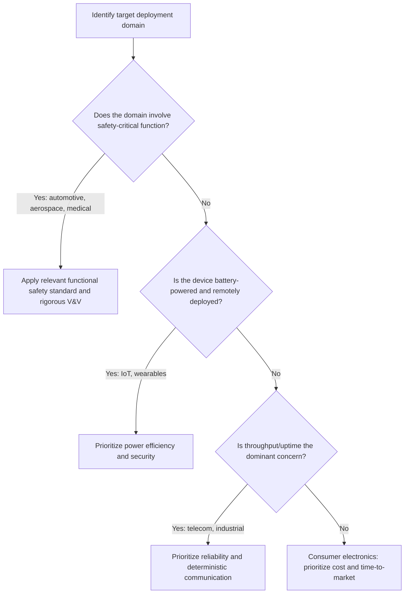

## Industry Domains and Application Areas

### Overview

Embedded systems appear across nearly every industry, but the specific engineering priorities, regulatory requirements, and design constraints differ substantially from domain to domain. A consumer wearable and an aircraft flight control computer are both embedded systems in the technical sense, yet they demand almost entirely different development rigor, certification processes, and risk tolerances. Surveying the major application domains clarifies how the general principles covered in earlier topics (real-time constraints, power/cost/performance tradeoffs, reliability) are weighted differently depending on where a system is deployed.

This topic is broad by nature, spanning many distinct industries; the sections below aim for comprehensive coverage of the major domains and their characteristic constraints.

### Automotive

**Characteristic Systems**

Modern vehicles contain dozens to over a hundred embedded electronic control units (ECUs) handling functions from engine management and anti-lock braking to infotainment and advanced driver-assistance systems (ADAS).

**Dominant Constraints**

- Hard real-time requirements for safety-critical functions (braking, steering assistance, airbag deployment)
- Extreme environmental robustness (wide temperature range, vibration, electrical noise from the vehicle's electrical system)
- Long product lifespans (vehicles often remain in service for a decade or more)
- Strict functional safety standards, notably **ISO 26262**, which governs risk classification and development rigor for automotive electronic systems

**Communication Standards**

Automotive embedded systems commonly use the **CAN bus (Controller Area Network)** and increasingly **Automotive Ethernet** for high-bandwidth applications like camera-based ADAS.

### Aerospace and Defense

**Characteristic Systems**

Flight control computers, navigation systems, engine control units, and mission-critical avionics.

**Dominant Constraints**

- Extremely stringent hard real-time and fault-tolerance requirements, since failures can be catastrophic and unrecoverable mid-flight
- Governed by rigorous certification standards, notably **DO-178C** for airborne software, which defines development and verification rigor tied to the severity of potential failure
- Redundancy is a common design pattern (triple-modular redundancy, dissimilar backup systems) to tolerate hardware faults
- Long certification timelines and correspondingly long development cycles relative to consumer electronics

### Medical Devices

**Characteristic Systems**

Patient monitors, infusion pumps, pacemakers and other implantables, diagnostic imaging equipment, and surgical robotics.

**Dominant Constraints**

- Patient safety is paramount; many devices are hard real-time and require extensive fault tolerance
- Governed by regulatory frameworks such as the **FDA** (United States) and **IEC 62304** (medical device software lifecycle standard) internationally
- Implantable and wearable medical devices face extreme power constraints (some implants must operate for years without battery replacement, which may require surgery)
- Biocompatibility and sterilization requirements add constraints beyond typical electronic design

[Inference] The specific regulatory pathway and required evidence vary by device risk classification and target market, so this description covers general tendencies rather than a specific device's exact certification requirements.

### Industrial Automation

**Characteristic Systems**

Programmable Logic Controllers (PLCs), motor drives, robotic controllers, process control systems, and industrial sensor networks.

**Dominant Constraints**

- Mix of hard, firm, and soft real-time requirements depending on the specific control loop (see hard, firm, and soft real-time constraints)
- Long deployment lifespans (industrial equipment often runs for 15–20+ years) with expectations of backward compatibility
- Harsh environmental conditions (dust, heat, electrical noise from heavy machinery)
- Reliance on industrial fieldbus protocols such as **Modbus**, **PROFINET**, and **EtherCAT** for deterministic communication between controllers and field devices

### Consumer Electronics

**Characteristic Systems**

Smartphones, smart home devices, wearables, gaming consoles, and household appliances.

**Dominant Constraints**

- Unit cost and time-to-market are usually the dominant metrics, given intense competition and short product cycles
- Battery life is a major selling point for portable devices, driving aggressive power optimization
- User experience and interface responsiveness (typically soft real-time) matter more than hard determinism in most consumer contexts
- Regulatory requirements are generally lighter than automotive, aerospace, or medical (though EMC/EMI compliance and regional certifications like FCC or CE still apply)

### Internet of Things (IoT)

**Characteristic Systems**

Connected sensors, smart home hubs, asset trackers, environmental monitors, and industrial IoT (IIoT) gateways.

**Dominant Constraints**

- Extremely low power consumption is often central, since many IoT devices are battery-powered and deployed for years without maintenance access
- Connectivity protocol choice (Wi-Fi, Bluetooth Low Energy, Zigbee, LoRaWAN, cellular IoT such as NB-IoT/LTE-M) is a major architectural decision balancing range, power, and bandwidth
- Security is a significant and growing concern, since network-connected devices are exposed to remote attack in ways that isolated embedded systems historically were not
- Scale often matters more than per-unit sophistication — many IoT deployments involve large numbers of relatively simple nodes rather than fewer complex ones

### Telecommunications

**Characteristic Systems**

Network routers, base stations, modems, and networking infrastructure equipment.

**Dominant Constraints**

- High throughput and low latency are central performance metrics, since these systems form the backbone of data transport
- Often run embedded Linux or specialized network operating systems on powerful multi-core SoCs (see classes of embedded systems by scale)
- Reliability and uptime are critical, since failures affect many downstream users simultaneously
- Must handle continuous, high-volume operation with minimal service interruption, often incorporating redundancy and failover mechanisms

### Comparative Summary

| Domain | Dominant Metric(s) | Typical Real-Time Tier | Key Standard(s) |
|---|---|---|---|
| Automotive | Safety, reliability, cost at scale | Hard (safety functions), soft (infotainment) | ISO 26262 |
| Aerospace/Defense | Safety, fault tolerance | Hard | DO-178C |
| Medical Devices | Patient safety, power (implantables) | Hard (critical functions) | IEC 62304, FDA regulations |
| Industrial Automation | Reliability, long lifespan | Mix of hard, firm, soft | Modbus, PROFINET, EtherCAT |
| Consumer Electronics | Cost, time-to-market, battery life | Soft | FCC/CE (general compliance) |
| IoT | Power efficiency, security, scale | Firm/soft (mostly) | Varies by connectivity protocol |
| Telecommunications | Throughput, uptime | Soft to firm | Networking/carrier standards |

[Inference] This table reflects typical or central-tendency characteristics for each domain; individual products within any domain can deviate significantly (for example, a consumer medical wearable straddles both the consumer electronics and medical device domains with blended constraints).

### Illustration: Domain Constraint Emphasis

<svg xmlns="http://www.w3.org/2000/svg" viewBox="0 0 800 420" font-family="sans-serif">
  <text x="400" y="28" text-anchor="middle" font-size="18" font-weight="bold" fill="#1a1a1a">Relative Emphasis by Industry Domain (svg_diagram)</text>

  <text x="150" y="55" font-size="12" font-weight="bold" fill="#1a1a1a">Domain</text>
  <text x="330" y="55" font-size="12" font-weight="bold" fill="#c53030">Safety/Reliability</text>
  <text x="500" y="55" font-size="12" font-weight="bold" fill="#b7791f">Cost/Time-to-Market</text>
  <text x="690" y="55" font-size="12" font-weight="bold" fill="#805ad5">Power Efficiency</text>

  <text x="60" y="90" font-size="12" fill="#1a1a1a">Aerospace/Defense</text>
  <rect x="300" y="78" width="90" height="14" fill="#c53030" />
  <rect x="480" y="78" width="20" height="14" fill="#b7791f" />
  <rect x="660" y="78" width="20" height="14" fill="#805ad5" />

  <text x="60" y="130" font-size="12" fill="#1a1a1a">Automotive</text>
  <rect x="300" y="118" width="75" height="14" fill="#c53030" />
  <rect x="480" y="118" width="45" height="14" fill="#b7791f" />
  <rect x="660" y="118" width="30" height="14" fill="#805ad5" />

  <text x="60" y="170" font-size="12" fill="#1a1a1a">Medical Devices</text>
  <rect x="300" y="158" width="80" height="14" fill="#c53030" />
  <rect x="480" y="158" width="30" height="14" fill="#b7791f" />
  <rect x="660" y="158" width="55" height="14" fill="#805ad5" />

  <text x="60" y="210" font-size="12" fill="#1a1a1a">Industrial Automation</text>
  <rect x="300" y="198" width="55" height="14" fill="#c53030" />
  <rect x="480" y="198" width="35" height="14" fill="#b7791f" />
  <rect x="660" y="198" width="35" height="14" fill="#805ad5" />

  <text x="60" y="250" font-size="12" fill="#1a1a1a">Consumer Electronics</text>
  <rect x="300" y="238" width="25" height="14" fill="#c53030" />
  <rect x="480" y="238" width="85" height="14" fill="#b7791f" />
  <rect x="660" y="238" width="55" height="14" fill="#805ad5" />

  <text x="60" y="290" font-size="12" fill="#1a1a1a">IoT</text>
  <rect x="300" y="278" width="30" height="14" fill="#c53030" />
  <rect x="480" y="278" width="55" height="14" fill="#b7791f" />
  <rect x="660" y="278" width="90" height="14" fill="#805ad5" />

  <text x="60" y="330" font-size="12" fill="#1a1a1a">Telecommunications</text>
  <rect x="300" y="318" width="60" height="14" fill="#c53030" />
  <rect x="480" y="318" width="50" height="14" fill="#b7791f" />
  <rect x="660" y="318" width="20" height="14" fill="#805ad5" />

  <text x="150" y="370" font-size="10" fill="#666">(Bar length is illustrative of relative emphasis, not a precise measurement)</text>
</svg>

### Choosing a Domain-Informed Design Approach

### Practical Example: One Sensor, Three Domains

A temperature sensor module illustrates how the same basic function is engineered differently depending on domain:

- **Consumer domain** (smart home thermostat sensor): optimized for low unit cost and quick integration; moderate accuracy is acceptable; minimal certification burden beyond basic EMC compliance.
- **Automotive domain** (engine coolant temperature sensor): must operate reliably across a wide temperature range, tolerate vibration and electrical noise, and meet ISO 26262 process requirements if tied to a safety-relevant function like overheating protection.
- **Medical domain** (patient temperature monitoring sensor): must meet strict accuracy and calibration requirements, undergo formal regulatory clearance, and often includes redundant measurement or alarm logic to avoid missed clinically significant readings.

The underlying sensing technology may be similar across all three, but the surrounding engineering, testing, and certification effort differs enormously — illustrating that "embedded systems engineering" is not a single uniform discipline but one shaped heavily by its application domain.

### Related Topics

- What defines an embedded system
- Classes of embedded systems by scale
- Real-time vs. non-real-time systems
- Hard, firm, and soft real-time constraints
- Embedded system design metrics
- Power, cost, and performance tradeoffs
- Embedded systems certification standards (ISO 26262, DO-178C, IEC 62304)
- Industrial communication protocols (CAN, Modbus, PROFINET, EtherCAT)
- IoT connectivity protocols and security considerations