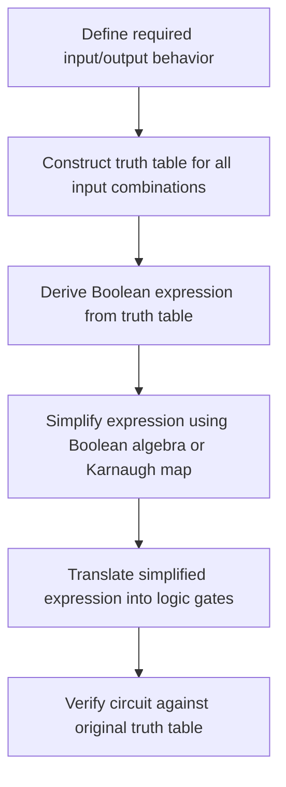

## Combinational Logic Circuits

### Overview

Combinational logic circuits are digital circuits whose outputs depend solely on the current combination of inputs, with no dependence on past inputs or internal stored state. This distinguishes them from sequential logic circuits, which incorporate memory and whose outputs depend on history as well as current inputs. Combinational circuits are built directly from the basic logic gates (AND, OR, NOT, and their derivatives) covered in Boolean algebra, and they form the building blocks for essential embedded system components such as adders, multiplexers, decoders, and comparators — all of which appear, in some form, inside a microcontroller's internal datapath.

### Defining Characteristics

**No Memory**

A combinational circuit has no internal state that persists between evaluations. Given the same set of inputs at any two different times, it always produces the same output, regardless of what inputs occurred previously.

**Output as a Pure Function of Input**

Formally, a combinational circuit implements a Boolean function $f$ such that each output is expressible as $Y = f(X_1, X_2, \ldots, X_n)$, where the $X_i$ are the current input values. This is a direct extension of the Boolean expressions covered previously into multi-gate circuits.

**Propagation Delay**

Although combinational circuits have no *stored* state, real gates are not instantaneous — a change in input takes a small but nonzero amount of time (propagation delay) to produce the corresponding change in output, due to physical switching characteristics of the transistors involved. [Inference] The specific propagation delay value depends on the manufacturing process, gate design, and operating voltage/temperature, so it is a characteristic of the specific implementation rather than a fixed property of combinational logic in the abstract.

### Common Combinational Circuit Building Blocks

**Half Adder**

Adds two single-bit binary numbers, producing a sum bit and a carry-out bit. The sum is computed via XOR, and the carry via AND:

$$\text{Sum} = A \oplus B \qquad \text{Carry} = A \cdot B$$

| A | B | Sum | Carry |
|---|---|---|---|
| 0 | 0 | 0 | 0 |
| 0 | 1 | 1 | 0 |
| 1 | 0 | 1 | 0 |
| 1 | 1 | 0 | 1 |

**Full Adder**

Extends the half adder to also accept a carry-in bit, allowing multiple adders to be chained together to add multi-bit binary numbers:

$$\text{Sum} = A \oplus B \oplus C_{in} \qquad C_{out} = (A \cdot B) + (C_{in} \cdot (A \oplus B))$$

Chaining full adders (a **ripple-carry adder**) allows addition of arbitrarily wide binary numbers, with each stage's carry-out feeding the next stage's carry-in — this is conceptually how a processor's arithmetic logic unit (ALU) performs multi-bit integer addition.

**Multiplexer (MUX)**

A circuit that selects one of several input signals to pass through to a single output, based on the value of one or more select lines. A 2-to-1 multiplexer with select line $S$ implements:

$$Y = \overline{S} \cdot A + S \cdot B$$

Multiplexers are used pervasively in processor datapaths to select between data sources (e.g., choosing whether the ALU input comes from a register or an immediate value encoded in an instruction).

**Demultiplexer (DEMUX)**

The inverse of a multiplexer: routes a single input signal to one of several possible outputs based on select line values, commonly used to direct data to a specific destination register or memory location.

**Decoder**

Converts a binary-encoded input into a set of individual output lines, activating exactly one output line corresponding to the input's binary value. A common application is address decoding, where a memory address's binary value is decoded to select exactly one memory chip or peripheral register to activate.

**Encoder**

The inverse of a decoder: converts an active signal on one of several input lines into a corresponding binary-encoded output, useful for compressing multiple status signals into a compact binary representation.

**Comparator**

A circuit that compares two binary numbers and produces outputs indicating whether one is greater than, less than, or equal to the other — commonly used in embedded systems for threshold detection (e.g., comparing a sensor reading against a limit value).

### Illustration: Full Adder Circuit

<svg xmlns="http://www.w3.org/2000/svg" viewBox="0 0 800 340" font-family="sans-serif">
  <text x="400" y="28" text-anchor="middle" font-size="18" font-weight="bold" fill="#1a1a1a">Full Adder Built from Gates (svg_diagram)</text>

  <text x="60" y="80" font-size="12" fill="#1a1a1a">A</text>
  <text x="60" y="140" font-size="12" fill="#1a1a1a">B</text>
  <text x="60" y="200" font-size="12" fill="#1a1a1a">Cin</text>

  <line x1="75" y1="80" x2="140" y2="80" stroke="#333" stroke-width="1.5" />
  <line x1="75" y1="140" x2="140" y2="140" stroke="#333" stroke-width="1.5" />
  <line x1="75" y1="200" x2="140" y2="200" stroke="#333" stroke-width="1.5" />

  <path d="M 140 70 Q 165 100 140 130" fill="none" stroke="#2b6cb0" stroke-width="2" />
  <path d="M 140 60 Q 175 100 140 140" fill="#eef4fb" stroke="#2b6cb0" stroke-width="2" />
  <text x="150" y="105" font-size="10" fill="#2b6cb0">XOR1</text>

  <line x1="140" y1="140" x2="140" y2="200" stroke="#333" stroke-width="1.5" />
  <path d="M 200 130 Q 225 160 200 190" fill="none" stroke="#2b6cb0" stroke-width="2" />
  <path d="M 200 120 Q 235 160 200 200" fill="#eef4fb" stroke="#2b6cb0" stroke-width="2" />
  <text x="210" y="165" font-size="10" fill="#2b6cb0">XOR2</text>
  <line x1="175" y1="100" x2="200" y2="130" stroke="#333" stroke-width="1.5" />
  <line x1="175" y1="200" x2="200" y2="190" stroke="#333" stroke-width="1.5" />

  <line x1="235" y1="160" x2="300" y2="160" stroke="#333" stroke-width="1.5" />
  <text x="305" y="164" font-size="12" font-weight="bold" fill="#2f855a">Sum</text>

  <path d="M 200 240 L 200 280 L 225 280 A 15 15 0 0 0 225 240 Z" fill="#fff7e6" stroke="#b7791f" stroke-width="2" />
  <text x="235" y="264" font-size="10" fill="#b7791f">AND1</text>
  <line x1="140" y1="80" x2="180" y2="80" stroke="#333" stroke-width="1.5" />
  <line x1="180" y1="80" x2="180" y2="250" stroke="#333" stroke-width="1.5" />
  <line x1="180" y1="250" x2="200" y2="250" stroke="#333" stroke-width="1.5" />
  <line x1="140" y1="140" x2="190" y2="140" stroke="#333" stroke-width="1.5" />
  <line x1="190" y1="140" x2="190" y2="270" stroke="#333" stroke-width="1.5" />
  <line x1="190" y1="270" x2="200" y2="270" stroke="#333" stroke-width="1.5" />

  <path d="M 300 235 L 300 265 L 320 265 A 12 12 0 0 0 320 235 Z" fill="#fff7e6" stroke="#b7791f" stroke-width="2" />
  <text x="330" y="253" font-size="10" fill="#b7791f">AND2</text>
  <line x1="175" y1="100" x2="270" y2="100" stroke="#333" stroke-width="1.5" />
  <line x1="270" y1="100" x2="270" y2="240" stroke="#333" stroke-width="1.5" />
  <line x1="270" y1="240" x2="300" y2="240" stroke="#333" stroke-width="1.5" />
  <line x1="140" y1="200" x2="260" y2="200" stroke="#333" stroke-width="1.5" />
  <line x1="260" y1="200" x2="260" y2="260" stroke="#333" stroke-width="1.5" />
  <line x1="260" y1="260" x2="300" y2="260" stroke="#333" stroke-width="1.5" />

  <path d="M 380 240 Q 400 260 380 280 Q 415 280 430 260 Q 415 240 380 240 Z" fill="#fff7e6" stroke="#c53030" stroke-width="2" />
  <text x="440" y="264" font-size="10" fill="#c53030">OR</text>
  <line x1="232" y1="258" x2="380" y2="248" stroke="#333" stroke-width="1.5" />
  <line x1="320" y1="250" x2="380" y2="270" stroke="#333" stroke-width="1.5" />

  <line x1="430" y1="260" x2="480" y2="260" stroke="#333" stroke-width="1.5" />
  <text x="485" y="264" font-size="12" font-weight="bold" fill="#c53030">Cout</text>
</svg>

### Combinational Logic Design Process

### Design Process: From Truth Table to Circuit

Combinational circuit design typically follows a structured process:

1. **Specify behavior**: define what output is required for every possible combination of inputs, usually captured in a truth table.
2. **Derive a Boolean expression**: from the truth table, write a Boolean expression (commonly in sum-of-products form, ORing together AND terms for each row where the output is 1).
3. **Simplify**: apply Boolean algebra identities or a Karnaugh map to reduce the expression to the minimum number of gates, since fewer gates typically mean lower cost, less silicon area, and often lower propagation delay.
4. **Implement**: translate the simplified expression directly into a gate-level circuit.
5. **Verify**: confirm the resulting circuit's truth table matches the original specification.

### Comparative Summary

| Building Block | Function | Common Embedded Use |
|---|---|---|
| Half/Full Adder | Binary addition | ALU arithmetic operations |
| Multiplexer | Select one of several inputs | Datapath source selection |
| Demultiplexer | Route input to one of several outputs | Signal distribution |
| Decoder | Activate one output per binary input value | Memory/peripheral address decoding |
| Encoder | Compress active line into binary code | Status signal compression |
| Comparator | Compare two values | Threshold detection, conditional branching support |

### Combinational vs. Sequential: A Quick Contrast

| Aspect | Combinational Logic | Sequential Logic |
|---|---|---|
| Memory | None | Present (flip-flops/latches) |
| Output depends on | Current inputs only | Current inputs and past state |
| Example | Adder, multiplexer, decoder | Counter, register, state machine |
| Clock dependency | Typically none | Usually clocked (synchronous designs) |

[Inference] Some combinational circuits, such as address decoders in certain designs, may still be influenced by timing considerations in practice (e.g., avoiding transient glitches during input transitions), but this does not add memory in the formal sense — the output remains fully determined by the current stable input values.

### Practical Example: Address Decoding in a Microcontroller

A concrete embedded application of combinational logic is memory-mapped peripheral address decoding. Suppose a microcontroller's address bus must select between four peripherals based on the top two address bits:

| A1 | A0 | Selected Peripheral |
|---|---|---|
| 0 | 0 | Timer |
| 0 | 1 | UART |
| 1 | 0 | GPIO |
| 1 | 1 | ADC |

This behavior is implemented by a simple 2-to-4 decoder: the two address bits serve as select inputs, and exactly one of four output lines (each connected to a peripheral's chip-select input) becomes active depending on the address bits' combination. This is a direct, practical instance of the decoder building block described above, and illustrates how combinational logic underlies something as fundamental as how a processor communicates with its peripherals.

### Related Topics

- Boolean algebra and logic gates
- Number systems and binary arithmetic
- Sequential logic: flip-flops, latches, and state machines
- Karnaugh maps and logic minimization techniques
- Microcontroller architecture and the arithmetic logic unit (ALU)
- Memory-mapped I/O and address decoding