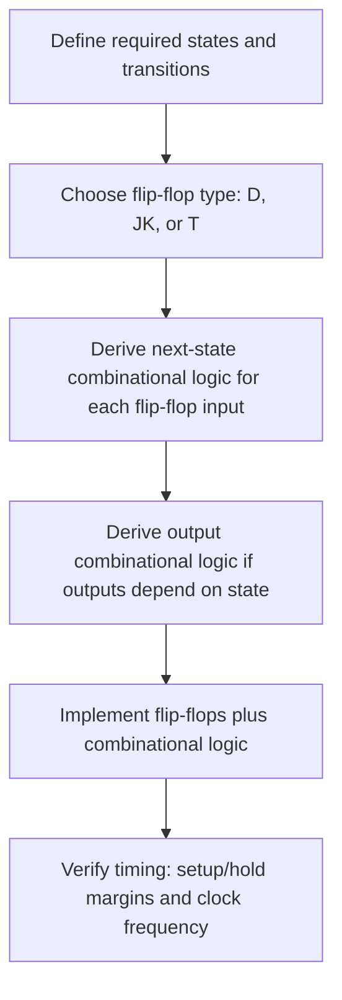

## Sequential Logic and Flip-Flops

### Overview

Sequential logic circuits extend combinational logic by adding memory: their outputs depend not only on the current inputs but also on the circuit's past state. This capacity to "remember" is what makes registers, counters, and processor state possible — without sequential logic, a digital system could compute instantaneous functions of its inputs but could never store a value, track progress through a sequence of steps, or maintain the program counter that drives instruction execution. The fundamental memory-storing building block of sequential logic is the **flip-flop** (and its simpler cousin, the **latch**), from which all higher-level sequential structures are built.

### Combinational vs. Sequential Logic Recap

As established in the discussion of combinational logic, a combinational circuit's output is a pure function of its current inputs alone. A sequential circuit's output is instead a function of both current inputs and the circuit's stored **state**:

$$Y(t) = f(X(t), Q(t))$$

where $Q(t)$ represents the circuit's current internal state, which itself updates over time based on inputs and the previous state. This feedback relationship — state influencing output, and inputs influencing the next state — is the defining structural feature of sequential logic.

### Latches: Level-Sensitive Memory

**SR Latch (Set-Reset Latch)**

The simplest memory element, typically built from two cross-coupled NOR or NAND gates. It has two inputs, Set (S) and Reset (R), and two outputs, Q and its complement $\overline{Q}$:

- Setting S=1, R=0 forces Q to 1 (set state).
- Setting S=0, R=1 forces Q to 0 (reset state).
- Setting S=0, R=0 holds the current state (memory behavior).
- Setting S=1, R=1 simultaneously is typically an invalid or undefined state for the basic SR latch, depending on the specific gate implementation.

**Level-Sensitive Behavior**

Latches are described as level-sensitive: they respond to and can change state whenever their control input is at the active level, rather than only at a specific instant. This makes latches simple but also more prone to unintended state changes if inputs are not carefully controlled, which is why most higher-level digital designs use edge-triggered flip-flops instead of raw latches for general-purpose storage.

### Flip-Flops: Edge-Triggered Memory

**The Clock Signal**

Flip-flops are typically **edge-triggered**, meaning they only capture and update their stored value at a specific instant — the rising edge (transition from 0 to 1) or falling edge (transition from 1 to 0) of a periodic clock signal — rather than continuously responding to input levels. This clock-synchronized behavior is central to how digital systems, including processors, coordinate the timing of state changes across many circuit elements simultaneously.

**D Flip-Flop (Data Flip-Flop)**

The most commonly used flip-flop type in practical digital design. It has a single data input D and a clock input; on the active clock edge, the output Q takes on whatever value D held at that instant, and holds that value until the next active clock edge:

$$Q(t+1) = D(t) \text{ at the active clock edge; otherwise } Q(t+1) = Q(t)$$

D flip-flops are the fundamental building block of registers, since a group of D flip-flops sharing a common clock can store a multi-bit value (e.g., 8, 16, or 32 bits) that updates synchronously.

**JK Flip-Flop**

A more flexible flip-flop with two inputs, J and K, that resolves the undefined-state problem of the basic SR latch: J=1,K=0 sets Q to 1; J=0,K=1 resets Q to 0; J=0,K=0 holds state; and J=1,K=1 toggles the current state (rather than being undefined). [Inference] JK flip-flops are less commonly used directly in modern synchronous digital design compared to D flip-flops, though they remain a standard topic in digital logic education and appear in some specialized circuit designs.

**T Flip-Flop (Toggle Flip-Flop)**

A simplified flip-flop with a single input T: when T=1, the output toggles (inverts) on each active clock edge; when T=0, the output holds its state. T flip-flops are particularly useful for building binary counters, since a chain of toggling flip-flops naturally produces a binary counting sequence.

### Truth Table Comparison

| Flip-Flop Type | Inputs | Behavior at Active Clock Edge |
|---|---|---|
| D | D | $Q_{next} = D$ |
| JK | J, K | Set (10), Reset (01), Hold (00), Toggle (11) |
| T | T | Hold (T=0), Toggle (T=1) |

### Illustration: D Flip-Flop Symbol and Timing

<svg xmlns="http://www.w3.org/2000/svg" viewBox="0 0 800 360" font-family="sans-serif">
  <text x="400" y="28" text-anchor="middle" font-size="18" font-weight="bold" fill="#1a1a1a">D Flip-Flop: Symbol and Timing (svg_diagram)</text>

  <rect x="80" y="70" width="120" height="100" fill="#eef4fb" stroke="#2b6cb0" stroke-width="2" />
  <text x="140" y="115" text-anchor="middle" font-size="14" font-weight="bold" fill="#2b6cb0">D FF</text>
  <text x="60" y="95" font-size="12" fill="#1a1a1a">D</text>
  <line x1="70" y1="90" x2="80" y2="90" stroke="#333" stroke-width="1.5" />
  <text x="60" y="150" font-size="12" fill="#1a1a1a">CLK</text>
  <polygon points="80,145 90,150 80,155" fill="#333" />
  <line x1="200" y1="95" x2="220" y2="95" stroke="#333" stroke-width="1.5" />
  <text x="225" y="99" font-size="12" fill="#2f855a">Q</text>
  <line x1="200" y1="150" x2="220" y2="150" stroke="#333" stroke-width="1.5" />
  <text x="225" y="154" font-size="12" fill="#2f855a">Q̄</text>

  <text x="330" y="220" font-size="12" fill="#1a1a1a">CLK</text>
  <path d="M 380 230 L 380 250 L 410 250 L 410 230 L 440 230 L 440 250 L 470 250 L 470 230 L 500 230 L 500 250 L 530 250 L 530 230 L 560 230 L 560 250" fill="none" stroke="#333" stroke-width="1.5" />

  <text x="330" y="270" font-size="12" fill="#1a1a1a">D</text>
  <path d="M 380 260 L 440 260 L 440 285 L 500 285 L 500 260 L 560 260" fill="none" stroke="#2b6cb0" stroke-width="1.5" />

  <text x="330" y="320" font-size="12" fill="#1a1a1a">Q</text>
  <path d="M 380 320 L 410 320 L 410 300 L 470 300 L 470 320 L 530 320 L 530 300 L 560 300" fill="none" stroke="#2f855a" stroke-width="1.5" />

  <line x1="410" y1="200" x2="410" y2="330" stroke="#999" stroke-width="1" stroke-dasharray="3,3" />
  <line x1="470" y1="200" x2="470" y2="330" stroke="#999" stroke-width="1" stroke-dasharray="3,3" />
  <line x1="530" y1="200" x2="530" y2="330" stroke="#999" stroke-width="1" stroke-dasharray="3,3" />
  <text x="410" y="345" text-anchor="middle" font-size="10" fill="#999">Q captures D</text>
  <text x="530" y="345" text-anchor="middle" font-size="10" fill="#999">Q captures D</text>
</svg>

The timing diagram shows Q updating to match D only at each rising clock edge, holding its value between edges regardless of how D changes in between — the defining behavior of edge-triggered storage.

### Setup Time, Hold Time, and Timing Constraints

**Setup Time**

The minimum time before the active clock edge that the D input must remain stable for the flip-flop to reliably capture it. If D changes too close to the clock edge, the flip-flop may capture an incorrect or unpredictable value.

**Hold Time**

The minimum time after the active clock edge that the D input must remain stable, for similar reliability reasons.

**Metastability**

If setup or hold time requirements are violated (commonly when an input signal is asynchronous to the clock, such as an external interrupt or button press), a flip-flop can enter a **metastable state**, briefly settling at neither a clean 0 nor 1 before eventually resolving unpredictably to one or the other. [Inference] The specific timing margins and susceptibility to metastability depend on the manufacturing process and flip-flop design, so exact numeric requirements must be obtained from a given component's datasheet rather than assumed generically; this is why embedded designs interfacing with asynchronous external signals commonly use synchronizer circuits (chains of flip-flops) to reduce metastability risk before the signal reaches critical logic.

### Building Higher-Level Structures from Flip-Flops

**Registers**

A group of D flip-flops sharing a common clock, used to store a multi-bit value. Processor registers, pipeline stage registers, and memory-mapped peripheral registers are all built from this basic structure.

**Counters**

Chains of flip-flops (commonly T or JK flip-flops, or D flip-flops configured to count) that progress through a defined sequence of binary states on each clock edge, used for timing, event counting, and address sequencing.

**Shift Registers**

Chains of D flip-flops where each flip-flop's output feeds the next flip-flop's input, causing a bit pattern to shift through the chain on each clock edge — used in serial communication interfaces to convert between serial and parallel data representations.

**Finite State Machines (FSMs)**

A more general sequential structure combining flip-flops (to hold the current state) with combinational logic (to compute the next state and outputs based on current state and inputs), used to implement control logic that must progress through a defined sequence of behaviors, such as a communication protocol handler or a peripheral controller's internal control unit.

### Sequential Circuit Design Flow

### Comparative Summary

| Element | Memory Behavior | Common Embedded Use |
|---|---|---|
| SR Latch | Level-sensitive, basic set/reset | Rarely used directly in modern synchronous design |
| D Flip-Flop | Edge-triggered, captures D at clock edge | Registers, pipeline stages |
| JK Flip-Flop | Edge-triggered, set/reset/hold/toggle | Educational contexts, some specialized designs |
| T Flip-Flop | Edge-triggered, hold/toggle | Binary counters |
| Register (group of D FFs) | Stores multi-bit value | CPU registers, peripheral control/status registers |
| Shift Register | Shifts bit pattern each clock edge | Serial-to-parallel/parallel-to-serial conversion |
| Finite State Machine | State + transition logic | Protocol handlers, peripheral controllers |

### Practical Example: A Simple Debounce Circuit Concept

A common embedded hardware/firmware problem is **switch bounce**: a mechanical button, when pressed, does not produce a single clean transition but instead rapidly oscillates between 0 and 1 for a brief period before settling. Sequential logic concepts underpin one hardware-based solution:

- The raw, bouncing button signal is treated as an asynchronous input.
- A chain of two D flip-flops (a synchronizer) first brings the signal safely into the system's clock domain, reducing metastability risk.
- Additional sequential logic (often a simple counter or state machine) then requires the signal to remain stable for a minimum number of consecutive clock cycles before accepting it as a valid press, filtering out the rapid bounce transitions.

While many embedded systems instead debounce buttons in software (polling and requiring a stable reading over a short time window), the underlying principle — using clocked, sequential logic to filter noisy or bouncing signals into a clean, stable result — directly reflects the flip-flop and synchronizer concepts covered here, and the hardware approach is common in designs where a debounced signal must be available to fast digital logic without software involvement.

### Related Topics

- Combinational logic circuits
- Boolean algebra and logic gates
- Microcontroller architecture and the arithmetic logic unit (ALU)
- Clock distribution and timing analysis in digital systems
- Finite state machine design for embedded control logic
- Metastability and synchronizer design for asynchronous inputs
- Registers and memory-mapped I/O