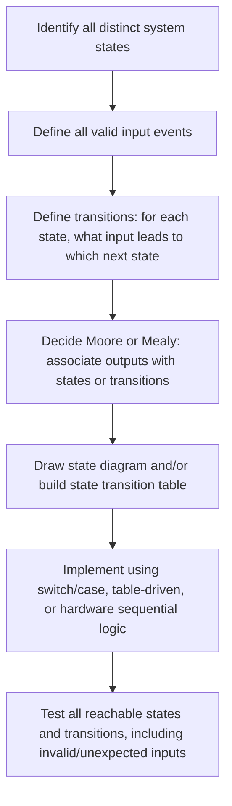

## Finite State Machines

### Overview

A finite state machine (FSM) is a computational model that describes a system as existing in exactly one of a finite number of defined **states** at any given time, transitioning between states in response to inputs, and optionally producing outputs based on the current state and/or the transition taken. FSMs are one of the most widely used design patterns in embedded systems because so much embedded behavior is naturally sequential and event-driven: a communication protocol handler, a button-press interpreter, a motor control sequencer, and a user interface menu system are all readily expressed as a set of well-defined states with clear rules for moving between them.

### Core Concepts

**States**

A state represents one distinct condition or mode the system can be in at a given moment. At any instant, an FSM occupies exactly one state — this exclusivity is a defining property that distinguishes FSM-based design from ad hoc flag-based logic, where multiple independent flags can combine into an unintended or unanticipated combination.

**Transitions**

A transition defines how the system moves from one state to another in response to an input event or condition. Transitions are typically labeled with the triggering condition and, in machines that produce output on transitions, the output produced.

**Inputs and Events**

The stimuli that can trigger a state transition — a sensor reading crossing a threshold, a received communication byte, a button press, or a timer expiring are all common embedded examples of FSM inputs.

**Outputs**

The actions or signals the FSM produces, which can be associated either with a state (see Moore machines below) or with a transition (see Mealy machines below).

**Initial State**

The state the FSM occupies when the system starts or resets, from which all subsequent behavior proceeds according to the defined transitions.

### Moore Machines vs. Mealy Machines

**Moore Machine**

In a Moore machine, outputs depend only on the current state, not on the specific input causing a transition. This means the output associated with a state remains constant for as long as the system stays in that state, regardless of what inputs occur (as long as they don't trigger a transition).

$$\text{Output} = f(\text{current state})$$

**Mealy Machine**

In a Mealy machine, outputs depend on both the current state and the current input, meaning the output can change immediately in response to an input even without a full state transition, or can differ depending on which specific transition is taken out of a given state.

$$\text{Output} = f(\text{current state}, \text{current input})$$

**Practical Comparison**

| Aspect | Moore Machine | Mealy Machine |
|---|---|---|
| Output depends on | Current state only | Current state and current input |
| Output timing | Changes only on state transition | Can change immediately with input |
| Typical gate count | Often more states needed for equivalent behavior | Often fewer states, but more complex output logic |
| Design clarity | Output behavior easier to reason about per state | Can be more compact but sometimes less intuitive |

[Inference] Any behavior implementable by a Mealy machine can also be implemented by an equivalent Moore machine (and vice versa), often by adding additional states to separate what would otherwise be input-dependent output variations — the choice between the two models is a design tradeoff rather than a difference in fundamental capability.

### Representing FSMs

**State Diagrams**

The most common visual representation: states are drawn as circles or rounded shapes, and transitions are drawn as labeled arrows between them, with the initial state typically marked distinctly.

**State Transition Tables**

A tabular representation listing, for each combination of current state and input, the resulting next state (and output, for a Mealy machine).

**State Transition Table Example**

Consider a simple FSM detecting a specific two-bit input sequence "10" arriving serially, one bit per clock cycle:

| Current State | Input | Next State | Output |
|---|---|---|---|
| S0 (idle) | 0 | S0 | 0 |
| S0 (idle) | 1 | S1 (saw "1") | 0 |
| S1 (saw "1") | 0 | S2 (detected "10") | 1 |
| S1 (saw "1") | 1 | S1 (saw "1") | 0 |
| S2 (detected "10") | 0 | S0 | 0 |
| S2 (detected "10") | 1 | S1 (saw "1") | 0 |

### Illustration: State Diagram for Sequence Detector

<svg xmlns="http://www.w3.org/2000/svg" viewBox="0 0 800 380" font-family="sans-serif">
  <text x="400" y="28" text-anchor="middle" font-size="18" font-weight="bold" fill="#1a1a1a">FSM: Detecting Input Sequence "10" (svg_diagram)</text>

  <circle cx="150" cy="200" r="55" fill="#eef4fb" stroke="#2b6cb0" stroke-width="3" />
  <text x="150" y="195" text-anchor="middle" font-size="14" font-weight="bold" fill="#2b6cb0">S0</text>
  <text x="150" y="215" text-anchor="middle" font-size="11" fill="#2b6cb0">Idle</text>

  <circle cx="400" cy="90" r="55" fill="#fff7e6" stroke="#b7791f" stroke-width="3" />
  <text x="400" y="85" text-anchor="middle" font-size="14" font-weight="bold" fill="#b7791f">S1</text>
  <text x="400" y="105" text-anchor="middle" font-size="11" fill="#b7791f">Saw "1"</text>

  <circle cx="650" cy="200" r="55" fill="#e6f4ea" stroke="#2f855a" stroke-width="3" />
  <text x="650" y="195" text-anchor="middle" font-size="14" font-weight="bold" fill="#2f855a">S2</text>
  <text x="650" y="215" text-anchor="middle" font-size="11" fill="#2f855a">Detected "10"</text>

  <path d="M 110 165 Q 60 100 105 60" fill="none" stroke="#333" stroke-width="1.5" marker-end="url(#arrow)" />
  <text x="40" y="90" font-size="11" fill="#333">0 / 0</text>

  <path d="M 195 175 L 355 105" fill="none" stroke="#333" stroke-width="1.5" marker-end="url(#arrow)" />
  <text x="250" y="120" font-size="11" fill="#333">1 / 0</text>

  <path d="M 440 125 L 605 175" fill="none" stroke="#333" stroke-width="1.5" marker-end="url(#arrow)" />
  <text x="530" y="135" font-size="11" fill="#333">0 / 1</text>

  <path d="M 400 145 Q 430 200 400 145" fill="none" stroke="#333" stroke-width="1.5" marker-end="url(#arrow)" />
  <text x="420" y="200" font-size="11" fill="#333">1 / 0</text>

  <path d="M 610 240 Q 400 330 165 250" fill="none" stroke="#333" stroke-width="1.5" marker-end="url(#arrow)" />
  <text x="380" y="325" font-size="11" fill="#333">0 / 0</text>

  <path d="M 620 155 Q 550 100 445 90" fill="none" stroke="#333" stroke-width="1.5" marker-end="url(#arrow)" />
  <text x="530" y="80" font-size="11" fill="#333">1 / 0</text>

  <path d="M 95 175 Q 70 175 95 200" fill="none" stroke="#333" stroke-width="1.5" marker-end="url(#arrow)" />
  <text x="40" y="185" font-size="11" fill="#333">0 / 0</text>

  </svg>

### FSM Types by Structural Role

**Detector/Recognizer FSMs**

Identify whether a specific pattern or sequence has occurred in an input stream, such as the "10" sequence detector above, or a protocol handler recognizing a specific start/stop byte pattern.

**Controller FSMs**

Sequence a series of actions in response to events, commonly used for peripheral control (e.g., an FSM managing the multi-step sequence of initiating, transmitting, and completing an I2C bus transaction).

**Generator FSMs**

Produce a defined output sequence over time, such as an FSM generating the timing sequence for a stepper motor's coil energization pattern.

### FSM Design Process



### Implementing FSMs in Embedded Firmware

**Switch-Case Implementation**

The most common software implementation pattern: a variable holds the current state, and a switch statement (evaluated on each iteration of a control loop or in response to each event) checks the current state and determines the next state based on the input.

```c
typedef enum { STATE_IDLE, STATE_SAW_ONE, STATE_DETECTED } fsm_state_t;

fsm_state_t current_state = STATE_IDLE;

void fsm_process_input(int input_bit) {
    switch (current_state) {
        case STATE_IDLE:
            current_state = input_bit ? STATE_SAW_ONE : STATE_IDLE;
            break;
        case STATE_SAW_ONE:
            if (input_bit == 0) {
                current_state = STATE_DETECTED;
                signal_detection();
            }
            // input_bit == 1 stays in STATE_SAW_ONE (handled by default fall-through)
            break;
        case STATE_DETECTED:
            current_state = input_bit ? STATE_SAW_ONE : STATE_IDLE;
            break;
    }
}
```

**Table-Driven Implementation**

An alternative approach storing the state transition table as a data structure (e.g., a 2D array indexed by current state and input), which can make the FSM's logic more compact and easier to modify without changing code structure, at some cost to readability for very simple machines.

**Hardware FSM Implementation**

As introduced in the discussion of sequential logic, an FSM can also be implemented directly in digital hardware using flip-flops (to hold the current state) combined with combinational logic (to compute the next state and outputs), which is common inside custom digital peripherals or FPGA-based embedded designs where the FSM must operate with hardware-level timing guarantees rather than software loop timing.

### Comparative Summary

| Implementation Approach | Typical Use Case | Key Advantage |
|---|---|---|
| Switch-case (software) | General firmware control logic | Simple, readable, easy to debug |
| Table-driven (software) | FSMs with many states/transitions | Compact, data-driven, easy to modify |
| Hardware (flip-flops + logic) | Timing-critical or FPGA-based designs | Deterministic hardware-level timing |

### Practical Example: Debounced Button FSM

Building on the debounce concept introduced in the discussion of sequential logic, a software FSM can implement button debouncing without dedicated hardware:

- **State: IDLE** — waiting for the button to be pressed; output remains "not pressed."
- **State: DEBOUNCING** — button appears pressed but the system is waiting a short confirmation period before accepting it as valid, filtering out mechanical bounce.
- **State: PRESSED** — button press has been confirmed; output signals "pressed," and the system waits for release.
- **State: RELEASING** — button appears released but the system waits a short confirmation period before accepting the release as valid.

Transitions between these states are driven by the raw button signal combined with a timer, and the FSM structure makes the debounce logic's behavior explicit and easy to verify against each possible sequence of button signal changes — illustrating how the abstract FSM concepts translate directly into a common, practical embedded firmware pattern.

### Related Topics

- Sequential logic and flip-flops
- Combinational logic circuits
- Real-time vs. non-real-time systems
- Communication protocol implementation (UART, I2C, SPI) using FSMs
- Interrupt-driven vs. polling-based firmware design
- Embedded software architecture patterns