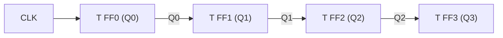

## Registers and Counters


### Overview

Registers and counters are sequential logic building blocks constructed from flip-flops that store and manipulate binary data. In embedded systems, they form the backbone of CPU internals, peripheral timing units, communication interfaces, and control logic. A register holds a group of bits; a counter is a specialized register that steps through a predefined sequence of states, most commonly a binary count sequence.

### Registers

#### Basic Register Structure

A register is a set of $n$ flip-flops (typically D-type) that share a common clock signal, storing an $n$-bit value. Each flip-flop stores one bit, and all bits update simultaneously on the active clock edge.

**Key Points**

- Built from edge-triggered D flip-flops in most modern designs
- All flip-flops share a common clock line for synchronous operation
- Width matches the data bus size (8-bit, 16-bit, 32-bit, etc.)
- May include an enable input to selectively allow or block updates
- May include asynchronous or synchronous reset/clear inputs

#### Types of Registers

**Buffer Register (Storage Register)**

Simplest form — captures and holds a value on the clock edge without shifting or transforming it. Used to latch data from a bus or peripheral for stable access.

**Shift Register**

Data moves between adjacent flip-flops on each clock pulse rather than loading in parallel. Shift registers are covered in depth in a dedicated topic, but their core variants are:

- Serial-In Serial-Out (SISO)
- Serial-In Parallel-Out (SIPO)
- Parallel-In Serial-Out (PISO)
- Parallel-In Parallel-Out (PIPO)

**Accumulator**

A register that holds an intermediate result and feeds it back into an ALU (Arithmetic Logic Unit) for successive operations, common in simple CPU datapaths.

**General-Purpose Register (GPR)**

Found in CPU register files; used by the instruction set to hold operands, addresses, or temporary values. Modern embedded cores (ARM Cortex-M, RISC-V) expose 8–32 GPRs to the programmer.

**Special-Purpose Registers**

Fixed-function registers such as:

- Program Counter (PC) — holds the address of the next instruction
- Stack Pointer (SP) — tracks the top of the call stack
- Status/Flags Register — holds condition codes (zero, carry, overflow, negative)
- Instruction Register (IR) — holds the currently decoded instruction

**Memory-Mapped Peripheral Registers**

In microcontrollers, hardware peripherals (GPIO, UART, timers, ADC) expose control, status, and data registers at fixed memory addresses. Firmware interacts with hardware entirely by reading and writing these registers.

#### Register Transfer Level (RTL) Notation

Register operations are commonly described using transfer notation:

$$R_1 \leftarrow R_2$$

This indicates the contents of $R_2$ are copied into $R_1$ on the next clock edge. Conditional transfers are written as:

$$\text{if } (E = 1) \text{ then } R_1 \leftarrow R_2$$

where $E$ is an enable control signal.

#### Register Diagram

<svg xmlns="http://www.w3.org/2000/svg" viewBox="0 0 640 220" font-family="monospace" font-size="13">
<text x="320" y="20" text-anchor="middle" font-size="15" font-weight="bold">4-Bit Parallel Load Register (svg_diagram)</text>
<g stroke="black" stroke-width="1.5" fill="none">
<rect x="80" y="50" width="60" height="60" fill="#f4f4f4" />
<rect x="180" y="50" width="60" height="60" fill="#f4f4f4" />
<rect x="280" y="50" width="60" height="60" fill="#f4f4f4" />
<rect x="380" y="50" width="60" height="60" fill="#f4f4f4" />
</g>
<text x="110" y="85" text-anchor="middle">D FF₃</text>
<text x="210" y="85" text-anchor="middle">D FF₂</text>
<text x="310" y="85" text-anchor="middle">D FF₁</text>
<text x="410" y="85" text-anchor="middle">D FF₀</text>
<g stroke="black" stroke-width="1.2">
<line x1="90" y1="50" x2="90" y2="30" />
<line x1="190" y1="50" x2="190" y2="30" />
<line x1="290" y1="50" x2="290" y2="30" />
<line x1="390" y1="50" x2="390" y2="30" />
</g>
<text x="90" y="25" text-anchor="middle" font-size="11">D₃</text>
<text x="190" y="25" text-anchor="middle" font-size="11">D₂</text>
<text x="290" y="25" text-anchor="middle" font-size="11">D₁</text>
<text x="390" y="25" text-anchor="middle" font-size="11">D₀</text>
<g stroke="black" stroke-width="1.2">
<line x1="90" y1="110" x2="90" y2="140" />
<line x1="190" y1="110" x2="190" y2="140" />
<line x1="290" y1="110" x2="290" y2="140" />
<line x1="390" y1="110" x2="390" y2="140" />
</g>
<text x="90" y="155" text-anchor="middle" font-size="11">Q₃</text>
<text x="190" y="155" text-anchor="middle" font-size="11">Q₂</text>
<text x="290" y="155" text-anchor="middle" font-size="11">Q₁</text>
<text x="390" y="155" text-anchor="middle" font-size="11">Q₀</text>
<line x1="60" y1="190" x2="460" y2="190" stroke="black" stroke-width="1.2" />
<g stroke="black" stroke-width="1.2">
<line x1="100" y1="190" x2="100" y2="110" />
<line x1="200" y1="190" x2="200" y2="110" />
<line x1="300" y1="190" x2="300" y2="110" />
<line x1="400" y1="190" x2="400" y2="110" />
</g>
<polygon points="60,190 68,185 68,195" fill="black" />
<text x="45" y="195" text-anchor="middle" font-size="11">CLK</text>
</svg>

### Counters

#### Definition

A counter is a register that progresses through a fixed sequence of binary states in response to clock pulses, typically counting up, down, or through a custom sequence (Gray code, BCD, etc.). Counters are classified primarily by how the clock signal propagates through the flip-flops: **asynchronous (ripple)** or **synchronous**.

#### Asynchronous (Ripple) Counters

In a ripple counter, only the first flip-flop receives the external clock. Each subsequent flip-flop is clocked by the output of the previous one (typically using the $Q$ or $\overline{Q}$ output), causing state changes to "ripple" through the chain.

**Key Points**

- Simple to design — each T or JK flip-flop is wired in toggle mode
- Cumulative propagation delay: total delay $\approx n \times t_{pd}$ where $n$ is the number of stages and $t_{pd}$ is per-flip-flop propagation delay
- Prone to transient/glitch states during transitions since outputs don't change simultaneously
- Not suitable for high-speed or timing-critical embedded applications without additional synchronization
- Lower gate count than synchronous equivalents

**4-Bit Ripple Counter (Mermaid)**



#### Synchronous Counters

In a synchronous counter, all flip-flops share the same clock signal, and combinational logic (typically AND gates feeding T or J/K inputs) determines which flip-flops toggle on each clock edge based on the current state.

**Key Points**

- All bits change simultaneously — eliminates ripple delay and glitches
- Requires more combinational logic than ripple designs (enable/toggle logic per stage)
- Preferred in embedded systems where timing predictability matters (e.g., driving a timer peripheral or bus protocol)
- Maximum operating frequency is limited by the slowest single flip-flop plus gate delay, not by the sum of all stages

**Synchronous Up-Counter Toggle Logic (4-bit)**

$$T_0 = 1$$


$$T_1 = Q_0$$


$$T_2 = Q_0 \cdot Q_1$$


$$T_3 = Q_0 \cdot Q_1 \cdot Q_2$$

Each stage toggles only when all lower-order bits are 1, replicating binary carry propagation.

#### Up, Down, and Up/Down Counters

- **Up-counter**: increments the stored value by 1 each active clock edge ($0, 1, 2, \dots, 2^n-1, 0, \dots$)
- **Down-counter**: decrements by 1 each edge ($2^n-1, \dots, 1, 0, 2^n-1, \dots$)
- **Up/Down counter**: direction controlled by a mode input, commonly used in quadrature encoder decoding for motor position/speed sensing in embedded motion-control systems

#### Modulus (MOD-N) Counters

The modulus of a counter is the number of unique states in its count sequence before it repeats. An $n$-bit binary counter is naturally MOD-$2^n$. Counters can be forced to shorter cycles using reset/load logic.

**Common Example: MOD-10 (Decade) Counter**

A 4-bit counter that resets to 0000 after reaching 1001 (9), used to generate BCD digit sequences (e.g., for 7-segment display drivers). Achieved by decoding state 1010 and forcing a synchronous or asynchronous clear.

$$\text{Reset condition: } Q_3 Q_1 = 1 \text{ (detects state } 1010\text{)}$$

#### Ring Counters and Johnson Counters

**Ring Counter**

A shift register where the output of the last flip-flop feeds back to the input of the first, circulating a single active bit (typically one `1` among `0`s) around the loop. An $n$-bit ring counter has a modulus of $n$.

**Johnson Counter (Twisted-Ring Counter)**

Similar to a ring counter, but the *inverted* output of the last stage feeds back to the first stage's input. This doubles the modulus compared to a ring counter of the same length: an $n$-bit Johnson counter has a modulus of $2n$.

**Comparison Table**

| Counter Type | Modulus (n stages) | Decoding Complexity | Typical Use |
| --- | --- | --- | --- |
| Ring Counter | $n$ | Very low (one gate per state) | Sequencer, LED chaser |
| Johnson Counter | $2n$ | Low (2-input gate per state) | Low-glitch state sequencing |
| Standard Binary | $2^n$ | Higher (multi-input decode) | General counting |

#### Presettable / Programmable Counters

Counters with parallel load capability allow a starting count value to be loaded before counting begins. This is the mechanism behind programmable timer/prescaler peripherals: loading a specific value determines the count-to-overflow interval.

**Example**

A 16-bit down-counter loaded with $65535 - N$ and clocked at frequency $f_{clk}$ overflows after:

$$t_{overflow} = \frac{N}{f_{clk}}$$

This is the operating principle behind hardware timer peripherals used for PWM generation, delay timing, and periodic interrupts in microcontrollers.

### Embedded Systems Applications

**Key Points**

- **Hardware Timers/Counters**: MCU peripherals (e.g., STM32 TIM, AVR Timer0/1/2) are synchronous up/down counters with prescalers, compare registers, and auto-reload registers
- **Watchdog Timers**: Free-running counters that reset the system if not periodically cleared by firmware, used for fault recovery
- **Program Counter**: A specialized register/counter that increments each instruction fetch and can be loaded (jump/branch) or pushed/popped (call/return)
- **Baud Rate Generators**: Counters divide a reference clock to produce UART/SPI timing
- **Event Counters**: Count external pulses (e.g., rotary encoder edges, flow-meter pulses) rather than clock edges
- **PWM Generation**: A counter compared against a threshold register produces a duty-cycle-controlled square wave
- **ADC Sample Timing**: Counter/timer peripherals trigger periodic ADC conversions

[Inference] The exact register naming, bit-widths, and prescaler architecture vary significantly across MCU vendors (e.g., STM32 vs. AVR vs. PIC), so firmware register maps should always be verified against the specific part's reference manual rather than generalized from one family.

### Timing Considerations

**Setup and Hold Time**

Each flip-flop in a register requires the D input to be stable for a minimum setup time ($t_{su}$) before the clock edge and a minimum hold time ($t_h$) after it. Violating these can cause metastability — an unpredictable, potentially unstable output state.

**Metastability in Embedded Context**

When a counter or register samples an asynchronous external signal (e.g., a button press or external interrupt line) without proper synchronization, metastability risk increases. A common mitigation is a 2-flip-flop synchronizer chain placed before the signal reaches counting or control logic.

[Inference] The specific number of synchronizer stages needed depends on clock frequency, MTBF requirements, and process technology; two stages is a common baseline but higher-reliability systems may use three.

### Practical Example: Simple Debounce Counter (Firmware)

```c
#include <stdint.h>

#define DEBOUNCE_THRESHOLD 20  // ~20 polls before accepting state change

uint8_t debounce_counter = 0;
uint8_t stable_state = 0;

// Called periodically (e.g., every 1ms from a timer interrupt)
void debounce_poll(uint8_t raw_pin_state) {
    if (raw_pin_state != stable_state) {
        debounce_counter++;
        if (debounce_counter >= DEBOUNCE_THRESHOLD) {
            stable_state = raw_pin_state;
            debounce_counter = 0;
        }
    } else {
        debounce_counter = 0;
    }
}
```

This illustrates a software counter (not a hardware flip-flop chain) used to filter mechanical switch bounce by requiring a consistent input level across multiple polling intervals before accepting a state change.

### Design Comparison: Ripple vs. Synchronous

| Attribute | Ripple (Asynchronous) | Synchronous |
| --- | --- | --- |
| Clock distribution | Only first stage | All stages |
| Max frequency | Lower (cumulative delay) | Higher |
| Glitches | Present during transitions | Absent (single clock edge) |
| Gate count | Lower | Higher |
| Use in embedded timing peripherals | Rare | Standard |

**Related Topics**

- Shift Registers (SISO, SIPO, PISO, PIPO)
- Finite State Machines (Moore and Mealy Models)
- Hardware Timer/Counter Peripherals (Prescalers, Compare/Capture Registers)
- Clock Domain Crossing and Synchronizer Design
- PWM Generation Using Counters
- Watchdog Timer Design and Fault Recovery
- Program Counter and Instruction Fetch Cycle
- Quadrature Encoder Decoding
- BCD and Gray Code Counters
- Flip-Flops (SR, D, JK, T) Fundamentals