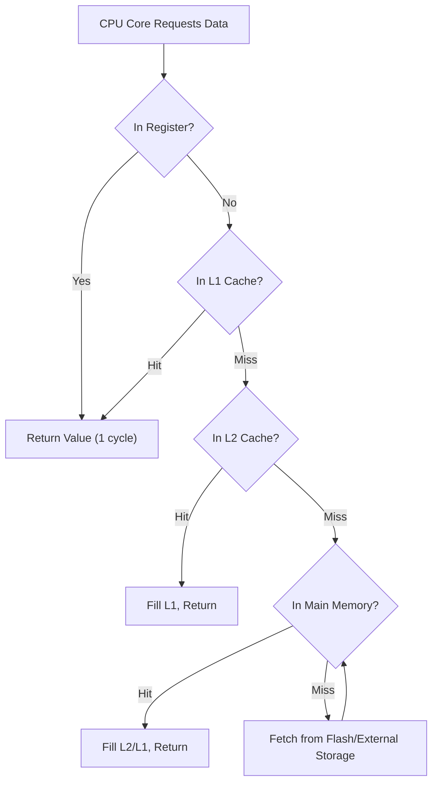

## Memory Hierarchy Fundamentals


### Overview

Memory hierarchy is the layered organization of storage technologies in a computing system, arranged by proximity to the processor, access speed, cost per bit, and capacity. Faster, more expensive, smaller memories sit closest to the CPU; slower, cheaper, larger memories sit further away. In embedded systems, this hierarchy is often more constrained and explicit than in general-purpose computing, since many microcontrollers expose separate address spaces for different memory types rather than relying on complex cache/virtual memory subsystems.

### The Hierarchy Pyramid

The general principle: as you move down the hierarchy, capacity increases while speed decreases and cost per bit decreases.

<svg xmlns="http://www.w3.org/2000/svg" viewBox="0 0 640 380" font-family="monospace" font-size="13">
<text x="320" y="20" text-anchor="middle" font-size="15" font-weight="bold">Memory Hierarchy Pyramid (svg_diagram)</text>
<polygon points="320,45 400,105 240,105" fill="#e8e8e8" stroke="black" stroke-width="1.5" />
<text x="320" y="85" text-anchor="middle" font-size="12">Registers</text>
<polygon points="240,105 400,105 430,165 210,165" fill="#e0e0e0" stroke="black" stroke-width="1.5" />
<text x="320" y="140" text-anchor="middle" font-size="12">L1 / L2 Cache</text>
<polygon points="210,165 430,165 460,225 180,225" fill="#d8d8d8" stroke="black" stroke-width="1.5" />
<text x="320" y="200" text-anchor="middle" font-size="12">Main Memory (SRAM / DRAM)</text>
<polygon points="180,225 460,225 490,285 150,285" fill="#d0d0d0" stroke="black" stroke-width="1.5" />
<text x="320" y="260" text-anchor="middle" font-size="12">On-Chip Flash / EEPROM</text>
<polygon points="150,285 490,285 520,345 120,345" fill="#c8c8c8" stroke="black" stroke-width="1.5" />
<text x="320" y="320" text-anchor="middle" font-size="12">External Storage (SD, NOR/NAND Flash)</text>
<line x1="540" y1="55" x2="540" y2="335" stroke="black" stroke-width="1" />
<polygon points="540,55 535,65 545,65" fill="black" />
<text x="565" y="60" font-size="11">Faster</text>
<text x="565" y="330" font-size="11">Slower</text>
<text x="565" y="345" font-size="11">Larger</text>
<line x1="100" y1="55" x2="100" y2="335" stroke="black" stroke-width="1" />
<polygon points="100,335 95,325 105,325" fill="black" />
<text x="30" y="60" font-size="11">Costlier</text>
<text x="30" y="330" font-size="11">Cheaper</text>
</svg>

### Levels of the Hierarchy

#### Registers

The fastest storage available, located directly inside the CPU core. Register access typically completes in a single clock cycle with zero addressing overhead beyond instruction decode.

**Key Points**

- Extremely limited in number (typically 8–32 general-purpose registers in embedded cores like ARM Cortex-M or RISC-V)
- Directly operated on by the ALU
- Not addressable via a memory address — accessed by name/number in the instruction encoding
- No caching layer needed; access is inherently as fast as logic allows

#### Cache Memory (L1/L2)

A small, fast SRAM-based buffer that stores recently or frequently accessed data and instructions, reducing the need to access slower main memory.

**Key Points**

- Present in higher-end embedded cores (e.g., ARM Cortex-A, some Cortex-M7 implementations); absent in many low-end microcontrollers
- Exploits **temporal locality** (recently accessed data is likely to be accessed again) and **spatial locality** (nearby addresses are likely to be accessed soon)
- Organized in cache lines (commonly 16–64 bytes) rather than single bytes
- L1 is typically split into separate instruction (I-cache) and data (D-cache) caches; L2 is usually unified

[Inference] Whether a given embedded part includes cache, and its exact size/associativity, depends heavily on the specific silicon vendor and core license — this must be confirmed against the part's datasheet rather than assumed from the core family name alone.

**Cache Mapping Strategies**

| Strategy | Description | Trade-off |
| --- | --- | --- |
| Direct-mapped | Each memory block maps to exactly one cache line | Simple, fast, higher conflict-miss rate |
| Fully associative | Any block can go in any cache line | Best hit rate, most complex/expensive lookup |
| Set-associative | Block maps to one of $N$ lines within a set | Balance between the two extremes |

#### Main Memory (SRAM / DRAM)

**SRAM (Static RAM)**

- Stores each bit using a flip-flop-like latch circuit (commonly six transistors)
- No refresh required — data persists as long as power is applied
- Faster and more expensive per bit than DRAM
- Common as the primary working RAM inside microcontrollers (tightly-coupled memory / TCM)

**DRAM (Dynamic RAM)**

- Stores each bit as charge on a capacitor, requiring periodic refresh cycles to prevent data loss
- Higher density and lower cost per bit than SRAM
- Common in embedded Linux systems (e.g., DDR2/DDR3/LPDDR on SoCs running embedded Linux) but rare in small microcontrollers due to controller complexity and power draw

**Comparison**

| Attribute | SRAM | DRAM |
| --- | --- | --- |
| Storage cell | Latch (typically 6T) | Capacitor + transistor (1T1C) |
| Refresh needed | No | Yes |
| Speed | Faster | Slower |
| Density | Lower | Higher |
| Cost per bit | Higher | Lower |
| Typical embedded use | On-chip MCU RAM | External RAM on SoC-based embedded Linux boards |

#### Non-Volatile On-Chip Storage: Flash and EEPROM

**Flash Memory**

- Non-volatile; retains data without power
- Erased in blocks/sectors (not individually addressable for erase operations), then programmed
- Used to store firmware (program code) in nearly all microcontrollers
- Finite write/erase endurance, commonly rated in the range of thousands to low hundreds of thousands of cycles depending on the technology [Unverified — exact endurance figures vary by vendor, process node, and flash type, and must be checked against the specific part's datasheet]

**EEPROM**

- Non-volatile, byte-addressable for both read and write (unlike flash's block-erase constraint)
- Slower to write than flash, but more convenient for storing small amounts of frequently changing configuration data (calibration values, counters, settings)
- Often emulated within flash sectors on MCUs that lack dedicated EEPROM, using wear-leveling techniques in firmware

#### External / Secondary Storage

- **NOR Flash**: Byte-addressable, supports execute-in-place (XIP), commonly used for bootloaders and firmware storage in systems requiring direct code execution from flash
- **NAND Flash**: Higher density, block/page-addressed, cannot generally execute in place, used for bulk data storage (data logging, filesystems)
- **SD/microSD cards**: Common for embedded data logging, media storage, and firmware update images
- **eMMC**: Embedded managed NAND with an integrated controller, common in embedded Linux SoCs

### Locality of Reference

The efficiency of the memory hierarchy depends fundamentally on programs exhibiting locality:

- **Temporal locality**: A memory location accessed once is likely to be accessed again soon (e.g., a loop counter)
- **Spatial locality**: Accessing one memory location makes nearby locations likely to be accessed soon (e.g., iterating through an array)

Firmware and compiler optimizations (loop unrolling, array-of-structs vs. struct-of-arrays layout, code placement) are frequently guided by maximizing these properties to improve cache and prefetch effectiveness.

### Memory Hierarchy Access Flow



[Inference] This flow represents a generalized cache-hierarchy access path common in higher-end embedded cores with caches; many low-end microcontrollers skip the cache stages entirely and access on-chip SRAM/Flash directly, since they lack a cache subsystem.

### Embedded-Specific Memory Hierarchy Characteristics

**Harvard vs. Von Neumann Architecture Impact**

Many microcontrollers use a Harvard architecture, maintaining separate address spaces (and often separate buses) for program memory (flash) and data memory (SRAM). This differs from general-purpose CPUs, which typically use a Von Neumann model with a unified address space, and affects how the "hierarchy" concept applies — program and data hierarchies can be somewhat independent.

**Memory-Mapped Peripherals**

Beyond the traditional register/cache/RAM/storage layers, embedded systems add a parallel address space (or map it into the same space) for memory-mapped I/O — peripheral control and status registers accessed with normal load/store instructions.

**Tightly-Coupled Memory (TCM)**

Some ARM cores (e.g., Cortex-M7, Cortex-R series) provide TCM: a small SRAM block connected directly to the core via a dedicated low-latency bus, bypassing the cache entirely, used for time-critical code or data (interrupt handlers, DSP buffers) where deterministic access latency matters more than cache-driven averages.

**Deterministic Timing Requirements**

Unlike general-purpose systems optimizing for average-case throughput, many embedded/real-time systems prioritize **worst-case execution time (WCET)** predictability. Caches can complicate WCET analysis because cache hits/misses are data-dependent; some safety-critical embedded designs disable caching or use cache-locking features for this reason.

### Practical Example: Memory Map Awareness in Firmware

```c
// Typical Cortex-M memory map regions (illustrative, verify against specific part)
#define FLASH_BASE      0x08000000UL  // Program (code) memory
#define SRAM_BASE       0x20000000UL  // Data memory (RAM)
#define PERIPH_BASE     0x40000000UL  // Memory-mapped peripheral registers

// Placing a time-critical buffer in fast on-chip RAM explicitly
__attribute__((section(".ccmram")))
volatile uint8_t fast_dsp_buffer[256];

int main(void) {
    volatile uint32_t *gpio_odr = (uint32_t *)(PERIPH_BASE + 0x0014);
    *gpio_odr |= (1 << 5);  // Direct memory-mapped register write
    while (1) {
        // Main loop
    }
}
```

This illustrates how embedded firmware often makes memory hierarchy placement explicit — via linker sections and attributes — rather than relying purely on compiler/OS-driven caching decisions.

[Inference] The exact linker section names (`.ccmram`, `.tcm`, etc.) and memory map offsets are vendor- and part-specific; this snippet illustrates the general pattern of manual placement rather than a universally portable example.

### Design Trade-offs Summary

| Level | Speed | Typical Capacity (Embedded) | Volatile | Cost/Bit |
| --- | --- | --- | --- | --- |
| Registers | Fastest (~1 cycle) | Tens of bytes | Yes | Highest |
| Cache (L1/L2) | Very fast | KB range | Yes | Very high |
| On-chip SRAM | Fast | KB–low MB | Yes | High |
| On-chip Flash | Moderate | KB–MB | No | Moderate |
| External Flash/SD/eMMC | Slow | MB–GB | No | Low |

**Related Topics**

- Cache Coherency and Cache Locking in Real-Time Systems
- Harvard vs. Von Neumann Architecture
- Memory-Mapped I/O Design
- Flash Memory Wear-Leveling and EEPROM Emulation
- DMA (Direct Memory Access) and Memory Bus Contention
- Tightly-Coupled Memory (TCM) and Deterministic Execution
- Worst-Case Execution Time (WCET) Analysis
- Linker Scripts and Memory Section Placement
- Virtual Memory and MPU (Memory Protection Unit) in Embedded Systems
- Bus Architectures (AHB, APB, AXI) in SoC Design