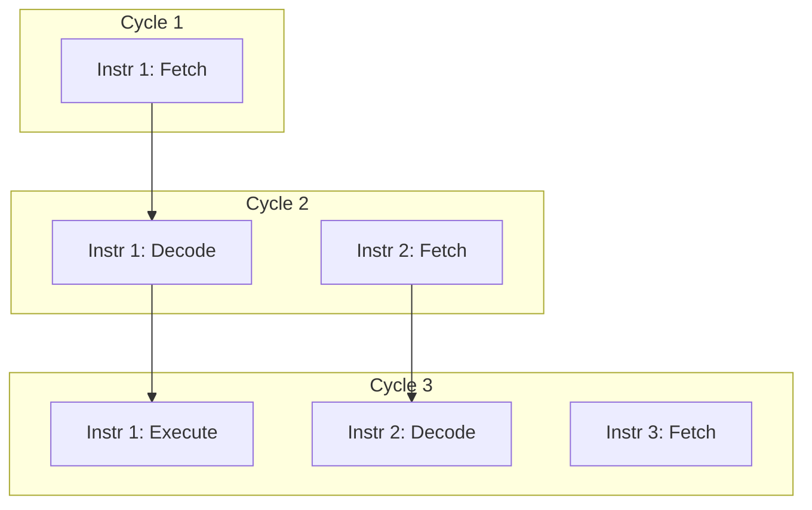
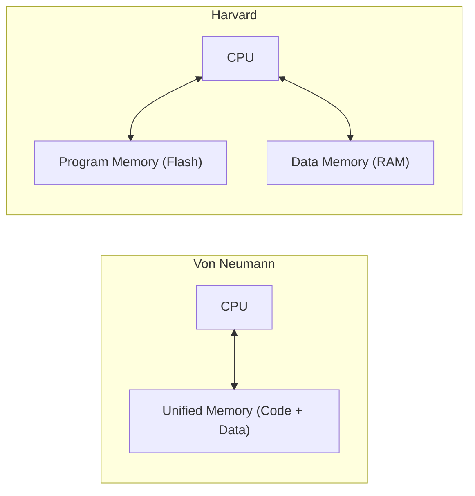

## CPU Architecture Basics

### Overview

A CPU (Central Processing Unit) executes instructions by fetching them from memory, decoding what operation they specify, and performing that operation on data. In embedded systems, CPU architecture choices directly affect power consumption, real-time responsiveness, code density, and cost — factors that are often secondary concerns in general-purpose computing but are primary design constraints in embedded design.

### Core Components of a CPU

#### Arithmetic Logic Unit (ALU)

The ALU performs arithmetic (addition, subtraction, sometimes multiplication/division) and bitwise logical operations (AND, OR, XOR, NOT, shifts) on data. It typically produces status flags (zero, carry, overflow, negative/sign) alongside the result.

#### Control Unit (CU)

The control unit generates the sequence of control signals that coordinate data movement between registers, memory, and the ALU, based on the currently decoded instruction. It can be implemented as:

- **Hardwired control**: Fixed combinational/sequential logic generating control signals directly — fast, but inflexible and harder to modify
- **Microprogrammed control**: Control signals are generated by executing a small internal "microprogram" stored in control memory — more flexible, easier to update, but historically slower; less common in modern small embedded cores, more associated with complex instruction set designs

#### Register File

A small, fast array of storage locations (see Registers and Counters, and Memory Hierarchy Fundamentals) used to hold operands and intermediate results directly accessible to the ALU without a memory access cycle.

#### Program Counter (PC)

A specialized register holding the memory address of the next instruction to fetch. It normally increments automatically after each fetch but can be overwritten by branch, jump, call, and interrupt operations.

#### Instruction Register (IR) and Decoder

The IR holds the instruction currently being executed; the instruction decoder interprets its opcode and operand fields to generate the appropriate control signals.

### The Fetch-Decode-Execute Cycle

Every instruction passes through this basic cycle, though pipelined designs overlap these stages across multiple instructions (see Pipelining).

**Key Points**

- Fetch retrieves the instruction word from program memory at the address in the PC
- Decode extracts the operation type, source/destination registers, and immediate values
- Execute performs the actual computation or address calculation
- Memory Access applies only to load/store-type instructions
- Write-back commits the result to the destination register

### Instruction Set Architecture (ISA) Philosophies

#### CISC (Complex Instruction Set Computer)

Characterized by a large number of instructions, variable instruction lengths, and instructions that can perform multi-step operations (e.g., memory-to-memory arithmetic) in a single instruction. x86 is the most well-known CISC ISA.

#### RISC (Reduced Instruction Set Computer)

Characterized by a smaller, more uniform instruction set, fixed instruction length, load/store architecture (only load/store instructions access memory; arithmetic operates on registers only), and a design philosophy favoring simpler instructions executed in fewer cycles, often enabling more effective pipelining. ARM and RISC-V — the two dominant embedded ISAs — are RISC designs.

**Comparison**

| Attribute | CISC | RISC |
| --- | --- | --- |
| Instruction count | Large, varied | Small, uniform |
| Instruction length | Variable | Typically fixed |
| Memory access | Direct in many instructions | Load/store only |
| Cycles per instruction | Variable, often higher | Typically 1 (pipelined) |
| Code density | Higher | Lower (mitigated by Thumb/compressed modes) |
| Common embedded example | Less common in modern MCUs | ARM Cortex-M, RISC-V |

[Inference] The CISC/RISC distinction has blurred over decades — modern x86 CPUs internally decode CISC instructions into RISC-like micro-operations — but for embedded ISA selection purposes (ARM vs. RISC-V vs. legacy 8051/PIC), the practical distinction remains meaningful.

### Datapath Width

The datapath width (8-bit, 16-bit, 32-bit, 64-bit) describes the size of the registers and the ALU's native operand size, which strongly influences addressable memory range, arithmetic throughput, and cost/power.

| Width | Typical Embedded Use | Example Cores |
| --- | --- | --- |
| 8-bit | Simple sensors, low-cost appliances | 8051, AVR (ATmega) |
| 16-bit | Mid-range control, legacy industrial | MSP430, PIC24 |
| 32-bit | Mainstream MCUs, most modern embedded designs | ARM Cortex-M, RISC-V RV32 |
| 64-bit | Embedded Linux, high-performance edge compute | ARM Cortex-A (AArch64), RISC-V RV64 |

[Inference] The mapping of width to use case reflects common industry practice as of recent years, but 8/16-bit cores remain in active production for ultra-low-cost, high-volume applications, so width alone does not indicate a part's suitability without checking peripheral set, power profile, and cost.

### Addressing Modes

Addressing modes determine how an instruction specifies the location of its operands.

**Key Points**

- **Immediate**: Operand value is embedded directly in the instruction
- **Register**: Operand is located in a specified register
- **Direct (absolute)**: Instruction contains the full memory address of the operand
- **Register indirect**: A register holds the address of the operand
- **Indexed**: A base address plus an offset (often from another register) computes the effective address, used heavily for array/struct access
- **Auto-increment/decrement**: The addressing register is automatically adjusted after (or before) access, useful for stepping through buffers

### Pipelining

Pipelining overlaps the execution of multiple instructions by dividing the fetch-decode-execute cycle into discrete stages, each handled by separate hardware, so a new instruction can enter the pipeline before the previous one finishes.

**Pipeline Hazards**

- **Structural hazard**: Two instructions require the same hardware resource simultaneously
- **Data hazard**: An instruction depends on the result of a prior instruction still in the pipeline
- **Control hazard**: A branch instruction changes the PC, potentially invalidating instructions already fetched into the pipeline

[Inference] The severity of pipeline hazards and the specific mitigation techniques used (forwarding/bypassing, branch prediction, pipeline stalls/bubbles) vary by core design; many small embedded cores use short, simple pipelines (2–3 stages) specifically to reduce hazard complexity and keep timing predictable, at some cost to peak throughput.

### Von Neumann vs. Harvard Architecture

**Von Neumann Architecture**

A single unified memory address space and bus stores both program instructions and data. Simpler to implement, but instruction fetch and data access compete for the same bus (the "Von Neumann bottleneck").

**Harvard Architecture**

Separate memory spaces (and often separate physical buses) for program instructions and data, allowing simultaneous instruction fetch and data access. Common in embedded microcontrollers (AVR, many PIC and ARM Cortex-M implementations use a modified Harvard model).

### Interrupts and Exception Handling

An interrupt is an event (hardware or software generated) that causes the CPU to suspend normal instruction flow and execute a dedicated handler routine, then resume where it left off. This is fundamental to embedded responsiveness — sensor events, timer expirations, communication data-ready signals, and faults are typically handled via interrupts rather than polling.

**Key Points**

- **Interrupt Vector Table**: A table mapping interrupt/exception sources to their corresponding handler addresses
- **Priority levels**: Many embedded cores support nested/prioritized interrupts, allowing higher-priority events to preempt lower-priority handlers
- **Context saving**: Registers (at minimum PC and status flags, often more) must be saved before entering a handler and restored on return, either by hardware automatically (common on ARM Cortex-M) or by handler prologue/epilogue code
- **Exceptions**: CPU-internal error/fault conditions (illegal instruction, memory access fault, divide-by-zero) handled through a mechanism similar to interrupts

### Instruction Execution Example

Consider a simple RISC-style add instruction: `ADD R1, R2, R3` (computes $R1 \leftarrow R2 + R3$).

$$R1 \leftarrow R2 + R3$$

**Execution breakdown:**

1. Fetch: instruction word read from program memory at address in PC; PC incremented
2. Decode: opcode identifies this as an ADD; register fields identify R1 (destination), R2, R3 (sources)
3. Execute: ALU computes $R2 + R3$, sets flags (zero, carry, overflow, negative) based on result
4. Memory Access: not needed (register-only operation)
5. Write-back: sum is written into R1

### Embedded-Specific CPU Design Priorities

**Key Points**

- **Power efficiency**: Sleep modes, clock gating, and low dynamic power consumption are often prioritized over raw clock speed
- **Code density**: Compressed instruction encodings (e.g., ARM Thumb/Thumb-2, RISC-V "C" compressed extension) reduce flash footprint and can improve fetch bandwidth
- **Deterministic timing**: Simpler pipelines and predictable instruction timing are favored in real-time control applications over aggressive out-of-order/speculative execution
- **Integrated peripherals**: Unlike general-purpose CPUs, embedded cores are typically paired tightly with on-chip peripherals (timers, ADC, communication interfaces) as part of a complete microcontroller, not a standalone CPU
- **Fault tolerance features**: Memory Protection Units (MPU), watchdog timers, and lockstep dual-core designs appear in safety-critical embedded CPU implementations

### Simplified CPU Block Diagram

<svg xmlns="http://www.w3.org/2000/svg" viewBox="0 0 640 360" font-family="monospace" font-size="12">
<text x="320" y="20" text-anchor="middle" font-size="15" font-weight="bold">Simplified CPU Block Diagram (svg_diagram)</text>
<rect x="40" y="60" width="120" height="50" fill="#f0f0f0" stroke="black" stroke-width="1.5" />
<text x="100" y="90" text-anchor="middle">Program Counter</text>
<rect x="220" y="60" width="120" height="50" fill="#f0f0f0" stroke="black" stroke-width="1.5" />
<text x="280" y="85" text-anchor="middle">Instruction</text>
<text x="280" y="100" text-anchor="middle">Register</text>
<rect x="400" y="60" width="180" height="50" fill="#f0f0f0" stroke="black" stroke-width="1.5" />
<text x="490" y="90" text-anchor="middle">Control Unit</text>
<rect x="40" y="160" width="160" height="60" fill="#e8e8e8" stroke="black" stroke-width="1.5" />
<text x="120" y="195" text-anchor="middle">Register File</text>
<rect x="260" y="160" width="140" height="60" fill="#e0e0e0" stroke="black" stroke-width="1.5" />
<text x="330" y="195" text-anchor="middle">ALU</text>
<rect x="440" y="160" width="140" height="60" fill="#f0f0f0" stroke="black" stroke-width="1.5" />
<text x="510" y="185" text-anchor="middle">Status Flags</text>
<text x="510" y="200" text-anchor="middle">Register</text>
<rect x="180" y="270" width="280" height="50" fill="#d8d8d8" stroke="black" stroke-width="1.5" />
<text x="320" y="300" text-anchor="middle">Memory / Bus Interface</text>
<line x1="160" y1="85" x2="220" y2="85" stroke="black" stroke-width="1.2" />
<line x1="340" y1="85" x2="400" y2="85" stroke="black" stroke-width="1.2" />
<line x1="280" y1="110" x2="280" y2="270" stroke="black" stroke-width="1.2" />
<line x1="490" y1="110" x2="490" y2="160" stroke="black" stroke-width="1.2" />
<line x1="120" y1="220" x2="120" y2="270" stroke="black" stroke-width="1.2" />
<line x1="200" y1="190" x2="260" y2="190" stroke="black" stroke-width="1.2" />
<line x1="400" y1="190" x2="440" y2="190" stroke="black" stroke-width="1.2" />
<line x1="330" y1="220" x2="330" y2="270" stroke="black" stroke-width="1.2" />
</svg>

### Design Trade-offs Summary

| Factor | Design Choice A | Design Choice B | Embedded Relevance |
| --- | --- | --- | --- |
| ISA style | CISC | RISC | RISC dominates modern MCU cores |
| Memory model | Von Neumann | Harvard | Harvard/modified-Harvard common in MCUs |
| Pipeline depth | Deep | Shallow | Shallow favored for timing predictability |
| Control unit | Microprogrammed | Hardwired | Hardwired typical in small embedded cores |
| Instruction encoding | Fixed-length | Compressed/variable | Compressed modes save flash space |

**Related Topics**

- Registers and Counters
- Memory Hierarchy Fundamentals
- Pipelining and Hazard Mitigation in Depth
- Interrupt Controllers and Vector Tables (NVIC and Equivalents)
- ARM Cortex-M vs. RISC-V Core Comparison
- Memory Protection Units (MPU) and Fault Isolation
- Instruction Set Encoding and Assembly Language Fundamentals
- Low-Power CPU Design and Sleep Mode Architectures
- Bus Architectures (AHB, APB, AXI)
- Superscalar and Out-of-Order Execution (General-Purpose Contrast)