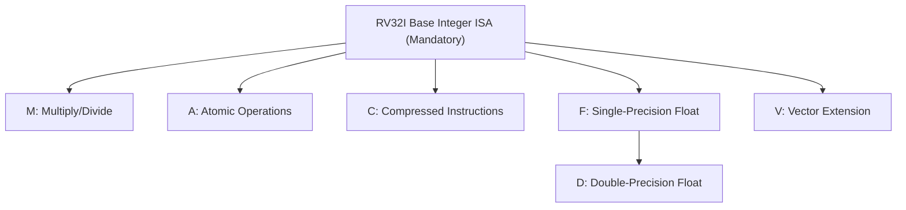

## Instruction Set Architectures Overview


### Overview

An Instruction Set Architecture (ISA) is the interface contract between hardware and software — it defines the set of instructions a processor can execute, the registers available, the addressing modes, data types, and how instructions are encoded in binary. The ISA determines what a compiler can target and what a programmer writing assembly can do, independent of how the underlying hardware implements those instructions. In embedded systems, ISA choice affects code density, power draw, licensing cost, toolchain maturity, and ecosystem availability.

### What an ISA Defines

**Key Points**

- **Instruction formats**: opcode layout, operand fields, instruction length (fixed or variable)
- **Register model**: number, width, and purpose of general-purpose and special-purpose registers
- **Addressing modes**: how operands are located (see CPU Architecture Basics)
- **Data types**: supported native widths (byte, halfword, word, sometimes floating point)
- **Memory model**: byte ordering (endianness), alignment requirements, address space size
- **Control flow instructions**: branches, jumps, calls, returns, and their conditional variants
- **Privilege levels**: separation between user and supervisor/kernel execution modes (where applicable)
- **Exception/interrupt behavior**: how the ISA specifies entry/exit from interrupt and fault handlers

An ISA is distinct from a microarchitecture: the ISA is the specification (what), while microarchitecture is a specific hardware implementation of that specification (how). Multiple different chips can implement the same ISA differently — e.g., two different vendors' Cortex-M4 implementations share the ARMv7-M ISA but may differ in cache, pipeline depth, or peripheral integration.

### Major ISA Families in Embedded Systems

#### ARM

The dominant ISA family in embedded and mobile computing. ARM licenses core designs (and, more recently, architecture licenses allowing custom implementations) rather than manufacturing chips itself, leading to a broad ecosystem of vendors (STMicroelectronics, NXP, Microchip, TI, Nordic, and others) producing ARM-based microcontrollers.

**Key Points**

- **Cortex-M series**: Microcontroller-class cores (M0, M0+, M3, M4, M7, M23, M33, M55, M85), optimized for low power, deterministic interrupt latency, and cost; typically no MMU, often a simple 2–3 stage pipeline
- **Cortex-R series**: Real-time cores with more performance headroom than Cortex-M, used in hard real-time contexts (automotive, storage controllers) — may include an MPU but generally not a full MMU
- **Cortex-A series**: Application-class cores with MMU support, used for embedded Linux/Android systems (single-board computers, infotainment, networking equipment)
- **Thumb/Thumb-2**: Compressed 16-bit (and mixed 16/32-bit) instruction encoding reducing code size compared to full 32-bit ARM encoding, widely used in Cortex-M
- **TrustZone**: Hardware-enforced security extension providing isolated "secure" and "non-secure" execution states, present in some Cortex-M23/M33 and Cortex-A implementations

#### RISC-V

An open, royalty-free ISA specification originating from UC Berkeley, governed by RISC-V International. Unlike ARM, RISC-V is not licensed — anyone can implement it without paying royalties, which has driven rapid adoption in academic, open-source, and increasingly commercial embedded contexts.

**Key Points**

- **Base ISAs**: RV32I (32-bit integer base), RV64I (64-bit integer base), RV128I (rare, largely experimental)
- **Standard extensions**: modular add-ons such as "M" (integer multiply/divide), "A" (atomic operations), "F"/"D" (single/double-precision floating point), "C" (compressed 16-bit instructions)
- Common embedded profile: RV32IMC (integer base + multiply/divide + compressed instructions)
- Growing vendor support (e.g., SiFive cores, Espressif ESP32-C series, GigaDevice) though the ecosystem is younger and toolchain/peripheral library maturity varies by vendor

[Inference] RISC-V's commercial embedded ecosystem is expanding quickly, but as of the current period, ARM retains a substantially larger installed base and more mature vendor tooling for most mainstream embedded product categories; this balance should be re-checked periodically since it is actively shifting.

#### x86 / x86-64

A CISC ISA dominant in desktop, server, and laptop computing, originating from Intel. Rare in resource-constrained embedded designs due to higher power consumption and cost relative to ARM/RISC-V, but present in embedded PC-class systems (industrial PCs, kiosks, some single-board computers) where legacy software compatibility or raw performance outweighs power/cost concerns.

#### AVR

An 8-bit RISC-style ISA developed by Atmel (now part of Microchip), widely known through the ATmega and ATtiny families used in Arduino boards and simple embedded controllers. Characterized by a Harvard architecture, single-cycle instruction execution for most instructions, and a large general-purpose register file (32 8-bit registers).

#### 8051 (MCS-51)

A legacy 8-bit CISC-style architecture originally developed by Intel, now implemented by many vendors as IP cores. Despite its age, it remains in production for extremely cost-sensitive, low-complexity applications due to low per-unit licensing/silicon cost and design familiarity.

#### PIC

A family of microcontroller ISAs from Microchip, spanning 8-bit (PIC16, PIC18), 16-bit (PIC24, dsPIC), and 32-bit (PIC32, which uses a MIPS-derived core) product lines. Widely used in cost-sensitive industrial and consumer applications, often paired with Microchip's own MPLAB toolchain.

#### MSP430

A 16-bit ISA from Texas Instruments, designed specifically around ultra-low-power operation, commonly used in battery-powered sensing and metering applications.

### ISA Comparison Table

| ISA | Bit Width | Style | Typical Embedded Use | Licensing Model |
| --- | --- | --- | --- | --- |
| ARM Cortex-M | 32-bit | RISC | Mainstream MCUs | Licensed IP |
| ARM Cortex-A | 32/64-bit | RISC | Embedded Linux/Android | Licensed IP |
| RISC-V | 32/64-bit | RISC | Growing MCU/SoC use | Open, royalty-free |
| x86-64 | 64-bit | CISC | Embedded PCs, industrial computers | Proprietary (Intel/AMD) |
| AVR | 8-bit | RISC-style | Arduino, simple control | Proprietary (Microchip) |
| 8051 | 8-bit | CISC-style | Ultra-low-cost legacy designs | Multiple IP vendors |
| PIC | 8/16/32-bit | Mixed | Industrial, consumer | Proprietary (Microchip) |
| MSP430 | 16-bit | RISC-style | Ultra-low-power sensing | Proprietary (TI) |

### RISC vs. CISC Revisited in ISA Context

This distinction was introduced in CPU Architecture Basics; in ISA terms specifically:

- **RISC ISAs** (ARM, RISC-V, AVR, MIPS) favor a load/store model, fixed or near-fixed instruction width, and a larger number of general-purpose registers
- **CISC ISAs** (x86, 8051) favor variable-length instructions, memory-operand arithmetic, and often fewer general-purpose registers, historically trading instruction-count efficiency for implementation complexity

### Instruction Encoding Example

Comparing a conceptual add operation across encoding styles illustrates the differences:

**RISC-V RV32I add instruction (R-type format, 32 bits fixed):**



```
| funct7  | rs2   | rs1   | funct3 | rd    | opcode  |
| 7 bits  | 5 bits| 5 bits| 3 bits | 5 bits| 7 bits  |
```

**ARM Thumb 16-bit add (register form):**



```
| opcode  | Rm    | Rn    | Rd    |
| 7 bits  | 3 bits| 3 bits| 3 bits|
```

**Key Points**

- Fixed-width encodings (RISC-V, ARM Thumb) simplify instruction decoding hardware and enable predictable fetch alignment
- Field widths directly constrain capability — e.g., a 5-bit register field limits addressable registers to 32
- Compressed formats (ARM Thumb, RISC-V "C" extension) sacrifice some field width/flexibility for reduced code size

### Extensibility and Modularity

Modern ISA design increasingly favors modularity — a small mandatory base plus optional extensions — allowing implementers to include only what a target application needs.



**Key Points**

- Reduces silicon area and power for applications that don't need certain capability (e.g., omitting the floating-point extension in a simple sensor node)
- Allows a single ISA family to scale from tiny microcontrollers to high-performance application processors
- ARM achieves a similar effect through architecture profiles (M/R/A) and optional extensions (DSP, FPU, TrustZone) rather than a fully modular base-plus-extension model

### Toolchain and Ecosystem Considerations

**Key Points**

- **Compiler support**: GCC and LLVM/Clang support ARM and RISC-V; vendor-specific or older ISAs (8051, some PIC variants) may rely on proprietary or less actively maintained compilers
- **Standard calling conventions**: Each ISA defines an Application Binary Interface (ABI) specifying how function arguments are passed, which registers are caller/callee-saved, and stack frame layout — critical for interoperability between compiled modules and hand-written assembly
- **Debug and trace support**: Availability of standardized debug interfaces (e.g., ARM CoreSight, RISC-V Debug Specification) affects development tooling quality
- **RTOS and library ecosystem**: Maturity of ports for common RTOSes (FreeRTOS, Zephyr, RT-Thread) and hardware abstraction layers varies significantly by ISA and vendor

[Inference] Ecosystem maturity is one of the most practically significant differentiators when selecting an ISA for a new embedded project, often outweighing raw ISA feature comparisons — but this is a product-specific, time-sensitive judgment that depends on the target vendor's SDK, community size, and long-term support commitments at the time of selection.

### Endianness

The ISA (or specific implementation configuration) determines byte ordering for multi-byte values in memory:

- **Little-endian**: Least significant byte stored at the lowest memory address (default for most ARM and RISC-V configurations, and x86)
- **Big-endian**: Most significant byte stored at the lowest memory address
- Some ISAs (including many ARM implementations) support **bi-endian** operation, configurable at reset or boot

$$\text{Value } 0x12345678 \text{ at address } 0x1000\text{:}$$

| Address | Little-Endian | Big-Endian |
| --- | --- | --- |
| 0x1000 | 0x78 | 0x12 |
| 0x1001 | 0x56 | 0x34 |
| 0x1002 | 0x34 | 0x56 |
| 0x1003 | 0x12 | 0x78 |

Endianness mismatches are a common source of bugs when exchanging binary data between systems or over communication protocols — network protocols conventionally specify big-endian ("network byte order") regardless of host endianness, requiring explicit byte-swapping in firmware.

### Selecting an ISA for an Embedded Project

**Key Points**

- **Power budget**: battery-powered, energy-harvesting designs favor ultra-low-power ISAs/cores (MSP430, low-power Cortex-M0+/M23, low-power RISC-V implementations)
- **Performance requirements**: signal processing or high-throughput control loops may require DSP extensions, hardware floating point, or higher clock/pipeline capability
- **Code size constraints**: cost-sensitive designs with small flash budgets benefit from compressed encodings (Thumb, RISC-V "C")
- **Real-time determinism**: hard real-time systems benefit from simple, shallow-pipeline cores with predictable interrupt latency (Cortex-M, Cortex-R)
- **Security requirements**: designs needing isolated execution domains may require TrustZone or equivalent security extensions
- **Ecosystem/tooling**: availability of mature compilers, debuggers, RTOS ports, and vendor SDKs often dominates the final decision in practice
- **Licensing/cost model**: royalty-free RISC-V vs. licensed ARM IP vs. proprietary vendor-specific ISAs affects per-unit and NRE (non-recurring engineering) cost structures

**Related Topics**

- CPU Architecture Basics
- Registers and Counters
- Memory Hierarchy Fundamentals
- ARM Cortex-M vs. RISC-V Core Comparison
- Assembly Language Fundamentals and Calling Conventions
- Compiler Toolchains for Embedded Targets (GCC, LLVM/Clang)
- Real-Time Operating Systems (FreeRTOS, Zephyr, RT-Thread)
- Interrupt Controllers and Vector Tables
- Hardware Security Extensions (TrustZone and Equivalents)
- Endianness and Binary Data Interchange in Embedded Protocols