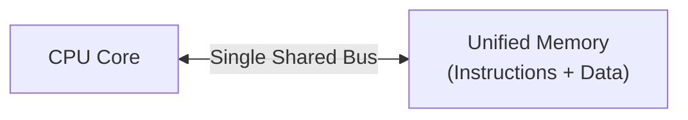
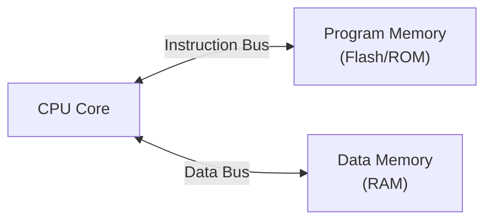

## Von Neumann vs. Harvard Architecture

### Overview

Von Neumann and Harvard architecture describe two fundamentally different ways of organizing memory access for program instructions and data within a computing system. This distinction was introduced briefly in CPU Architecture Basics; this topic covers it in depth, since the choice has direct, practical consequences for embedded system design — affecting bus bandwidth, code/data separation, self-modifying code feasibility, and how firmware is structured and stored.

### Von Neumann Architecture

#### Definition

Named after mathematician John von Neumann, this architecture uses a single, unified memory address space and a single bus (or bus set) to store and access both program instructions and data.

**Key Points**

- One memory space holds both code and data
- A single bus carries both instruction fetches and data reads/writes
- Simpler hardware design — one memory controller, one addressing scheme
- Instructions and data are indistinguishable to the memory system itself; interpretation depends entirely on how the CPU uses the fetched bits

#### The Von Neumann Bottleneck

Because instruction fetch and data access share the same bus, the CPU cannot simultaneously fetch the next instruction and read/write data — these operations must be serialized, competing for the same bandwidth. This constraint is commonly called the **Von Neumann bottleneck**.

$$\text{Effective throughput} \leq \frac{\text{Bus bandwidth}}{\text{Instruction fetches} + \text{Data accesses}}$$

[Inference] The practical severity of the Von Neumann bottleneck depends heavily on cache presence, memory hierarchy, and workload characteristics; in cached designs the bottleneck is substantially mitigated for typical access patterns, though it remains a foundational architectural constraint.

#### Diagram



### Harvard Architecture

#### Definition

Named after the Harvard Mark I relay-based computer, this architecture maintains physically or logically separate memory spaces — and often separate buses — for program instructions and data.

**Key Points**

- Separate address spaces for program memory and data memory
- Separate buses allow simultaneous instruction fetch and data access
- Enables higher effective throughput for a given clock speed, since fetch and data operations don't contend for the same bus
- Historically more complex and costly to implement in general-purpose computing, but well-suited to microcontroller design where program memory (flash) and data memory (RAM) are naturally different technologies anyway

#### Diagram



### Modified (Pseudo) Harvard Architecture

Most real-world embedded cores use a **modified Harvard architecture**: separate instruction and data address spaces (and typically separate internal buses close to the core) but with mechanisms allowing data to be read from program memory space, or in some designs allowing limited code execution from data memory. This hybrid approach captures most of Harvard's performance benefit while retaining practical flexibility.

**Key Points**

- ARM Cortex-M cores typically implement a modified Harvard model at the bus level (separate instruction and data bus interfaces, e.g., ARM's AHB-based I-code/D-code buses) while presenting a unified logical address map to the programmer
- AVR (ATmega/ATtiny) uses a stricter Harvard split, with separate instruction words in flash and a distinct data address space, requiring special instructions (`LPM` — Load Program Memory) to read constant data stored in flash
- Reading constants or string literals stored in program memory on strict-Harvard parts requires explicit compiler/library support, since normal data-space pointers cannot directly dereference program memory addresses

### Side-by-Side Comparison

| Attribute | Von Neumann | Harvard | Modified Harvard |
| --- | --- | --- | --- |
| Memory spaces | Unified | Separate | Separate (often unified addressing view) |
| Buses | Single (shared) | Separate (instruction + data) | Separate at core level, may appear unified externally |
| Simultaneous fetch + data access | No | Yes | Generally yes |
| Hardware complexity | Lower | Higher | Moderate |
| Self-modifying code | Natural (code is just data) | Difficult or requires special mechanisms | Vendor/design-dependent, often restricted |
| Typical use | General-purpose CPUs, x86 | Classic DSPs, simple microcontrollers | Most modern embedded MCUs (ARM Cortex-M, many others) |

### Practical Embedded Implications

#### Program Memory as Read-Only Storage

Because embedded systems typically execute code directly from non-volatile flash while using volatile RAM for working data (see Memory Hierarchy Fundamentals), the Harvard-style separation maps naturally onto the underlying hardware reality — program memory and data memory are already physically distinct technologies with different access characteristics, unlike general-purpose systems that load code into RAM before execution.

#### Constant Data Placement

On strict-Harvard 8-bit parts (classic AVR), placing lookup tables or string constants in flash to conserve limited RAM requires explicit tooling support:

```c
#include <avr/pgmspace.h>

// Stored in flash (program memory), not RAM
const char message[] PROGMEM = "Sensor initialized";

char read_char_from_flash(uint16_t index) {
    return pgm_read_byte(&message[index]);
}
```

This illustrates why the Harvard/Von Neumann distinction is not merely academic in embedded firmware — it directly shapes how source code must be written to correctly place and access constant data, since a naive pointer dereference would attempt to read the data address space rather than program memory on a strict-Harvard part.

[Inference] This `PROGMEM`/`pgm_read_byte` pattern is specific to AVR-GCC toolchain conventions; other strict-Harvard architectures use their own vendor- or toolchain-specific mechanisms for the same underlying problem, so the exact API should be verified against the target platform's documentation.

#### Instruction and Data Bandwidth

In control loops that are both instruction-fetch-heavy (tight loops, complex branching) and data-heavy (buffer processing, DSP-style filtering), Harvard-style parallel access can measurably improve throughput per clock cycle compared to a Von Neumann design at the same clock speed, since the core is not stalled waiting for a shared bus to become free between fetch and data phases.

#### Security and Reliability Considerations

Strict separation between instruction and data memory in Harvard designs can also serve as a natural barrier against certain classes of code-injection attacks that rely on writing executable code into a data buffer and then redirecting execution into it, since data memory is not directly fetchable as instructions on many strict-Harvard implementations. [Speculation] This should not be treated as a complete security guarantee on its own; modified-Harvard and unified-address-space designs generally require explicit protections (e.g., MPU no-execute regions, ARM TrustZone, W^X memory policies) to achieve equivalent protection, and the actual security posture depends on the full system design, not architecture family alone.

### Historical and Conceptual Notes

**Key Points**

- The Von Neumann model is closely associated with the "stored-program concept" — the idea that instructions and data share a common representation and storage, which was itself a significant conceptual advance over earlier fixed-wiring or plugboard-programmed machines
- Classic DSP (Digital Signal Processor) chips historically favored strict Harvard architecture (often with two separate data memories in addition to program memory) to maximize the parallel multiply-accumulate throughput central to signal processing workloads
- Most modern general-purpose CPUs (desktop/server x86, ARM Cortex-A) are Von Neumann at the programmer-visible instruction set level but implement Harvard-style separation internally via **split L1 caches** (separate instruction and data caches), gaining much of Harvard's throughput benefit while preserving a unified programming model

### Decision Considerations for Embedded Design

| Consideration | Favors Von Neumann | Favors Harvard / Modified Harvard |
| --- | --- | --- |
| Simplicity of memory system | Yes | No |
| Maximizing fetch/data throughput | No | Yes |
| Natural fit with flash + RAM hardware split | Partial | Strong |
| Self-modifying / dynamically generated code | Easier | Harder or restricted |
| Code-injection resistance (architectural baseline) | Weaker | Stronger baseline, still needs explicit protections |
| Prevalence in modern microcontrollers | Rare in pure form | Dominant (usually modified) |

**Related Topics**

- CPU Architecture Basics
- Memory Hierarchy Fundamentals
- Instruction Set Architectures Overview
- Memory Protection Units (MPU) and Execute-Never Regions
- Flash Memory Organization and Constant Data Placement
- DSP Architecture and Multiply-Accumulate Pipelines
- Cache Design (Split I-Cache/D-Cache)
- Code Injection and Buffer Execution Vulnerabilities
- Bus Architectures (AHB, APB, AXI) in SoC Design