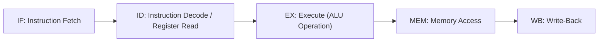
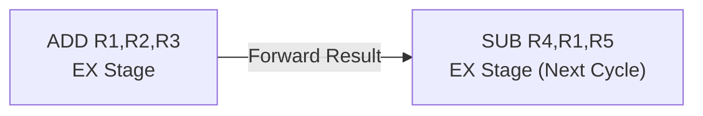

## Pipelining and Instruction Execution


### Overview

Pipelining is a CPU implementation technique that overlaps the execution of multiple instructions by dividing instruction processing into discrete sequential stages, each handled by dedicated hardware. Rather than waiting for one instruction to fully complete before starting the next, a pipelined CPU begins fetching a new instruction each cycle while previous instructions progress through later stages. This topic builds on the fetch-decode-execute cycle introduced in CPU Architecture Basics, examining pipelining's mechanics, hazards, and specific relevance to embedded core design.

### Why Pipelining Exists

Without pipelining, a CPU completes one instruction's entire fetch-decode-execute-memory-writeback sequence before beginning the next, wasting hardware that sits idle during each stage the current instruction isn't using. Pipelining allows each stage's hardware to work on a different instruction simultaneously, increasing instruction throughput without necessarily increasing clock frequency.

$$\text{Ideal speedup} \approx \text{Number of pipeline stages (for a fully filled pipeline, no hazards)}$$

[Inference] This ideal speedup figure represents a theoretical upper bound; actual speedup is reduced by pipeline fill/drain time, hazards, and stalls, and the realized benefit depends heavily on the specific workload's instruction mix and branch behavior.

### Classic 5-Stage Pipeline

A commonly used teaching model (and historically representative of early RISC pipelines such as the original MIPS design) divides execution into five stages:



**Key Points**

- **IF**: Read the instruction word from program memory at the address in the PC; increment PC
- **ID**: Decode the opcode, read source register values from the register file
- **EX**: Perform the ALU operation, or calculate a memory address, or resolve a branch condition
- **MEM**: Access data memory (only used by load/store instructions; other instructions pass through without action)
- **WB**: Write the result back into the destination register

### Pipeline Timing Diagram

The overlap becomes visible when multiple instructions are shown across clock cycles:

| Cycle | 1 | 2 | 3 | 4 | 5 | 6 | 7 |
| --- | --- | --- | --- | --- | --- | --- | --- |
| Instr 1 | IF | ID | EX | MEM | WB |  |  |
| Instr 2 |  | IF | ID | EX | MEM | WB |  |
| Instr 3 |  |  | IF | ID | EX | MEM | WB |

By cycle 5, three instructions are simultaneously in different stages of completion, and in the steady state, one instruction completes every cycle rather than every five cycles.

### Pipeline Hazards

Hazards are situations where the next instruction cannot execute in its designated clock cycle without producing an incorrect result, breaking the ideal one-instruction-per-cycle throughput.

#### Structural Hazards

Occur when two instructions in different pipeline stages require the same hardware resource simultaneously — for example, if instruction fetch and data memory access share a single memory port. Harvard and modified-Harvard memory architectures (see Von Neumann vs. Harvard Architecture) directly reduce this hazard class by providing separate instruction and data buses.

**Mitigation**: Duplicate hardware resources (separate instruction/data memory ports or caches), or insert a stall cycle.

#### Data Hazards

Occur when an instruction depends on the result of a prior instruction that has not yet completed the pipeline.

**Example:**



```
ADD R1, R2, R3   ; R1 = R2 + R3
SUB R4, R1, R5   ; R4 = R1 - R5  (depends on R1, still in pipeline)
```

Without mitigation, the `SUB` instruction would read the old, stale value of `R1` during its ID stage, since `ADD`'s WB stage (where R1 is actually updated) has not yet occurred.

**Mitigation techniques:**

- **Forwarding (bypassing)**: Route the ALU result directly from the EX or MEM stage of the producing instruction to the EX stage input of the dependent instruction, without waiting for the write-back to complete
- **Pipeline stalling (bubble insertion)**: Delay the dependent instruction by inserting idle cycles until the required value is available
- **Compiler instruction scheduling**: Reorder independent instructions to fill the gap between a producer and its dependent consumer, reducing or eliminating the need for hardware stalls



#### Control Hazards

Occur when a branch or jump instruction changes the program counter, but the pipeline has already fetched one or more subsequent instructions assuming sequential execution — those fetched instructions may need to be discarded ("flushed") if the branch is taken.

**Mitigation techniques:**

- **Branch prediction**: Guess whether a branch will be taken (static prediction based on instruction type, or dynamic prediction based on branch history) and speculatively fetch along the predicted path; if the prediction is wrong, flush incorrectly fetched instructions and restart fetch at the correct address
- **Delayed branching**: Define the instruction immediately following a branch as always executing regardless of branch outcome (the "delay slot"), allowing the compiler to fill it with useful, independent work — used in some classic RISC ISAs, less common in modern designs
- **Pipeline flush and stall**: Simplest approach — treat every branch as causing a stall until the outcome is resolved, at a direct throughput cost proportional to pipeline depth

**Key Points**

- Deeper pipelines suffer a larger misprediction penalty (more fetched-but-invalid instructions to discard), since more stages sit between fetch and branch resolution
- Branch prediction accuracy and misprediction cost are major performance factors in general-purpose CPUs, but many small embedded cores intentionally avoid complex dynamic branch prediction to keep timing behavior simple and analyzable

### Pipeline Depth Trade-offs

| Pipeline Depth | Clock Speed Potential | Hazard/Misprediction Penalty | Design Complexity | Timing Predictability |
| --- | --- | --- | --- | --- |
| Shallow (2–3 stages) | Lower | Lower | Lower | Higher |
| Moderate (5 stages) | Moderate | Moderate | Moderate | Moderate |
| Deep (10+ stages) | Higher | Higher | Higher | Lower |

[Inference] The specific stage count and design of a given embedded core's pipeline is vendor- and implementation-specific — for example, different ARM Cortex-M variants use different pipeline depths (some as shallow as 2 stages, others deeper) — so exact figures should be confirmed against the specific core's technical reference manual rather than assumed from the architecture family alone.

### Embedded-Specific Pipelining Considerations

**Key Points**

- **Interrupt latency**: A pipeline in a mid-flush or mid-stall state when an interrupt occurs can complicate precise interrupt entry; many embedded cores are designed so pipeline state can be cleanly resolved or discarded quickly to keep interrupt response times bounded and predictable
- **Worst-Case Execution Time (WCET) analysis**: Deep pipelines with dynamic branch prediction make WCET analysis significantly harder, since instruction timing becomes data- and history-dependent rather than fixed; safety-critical and hard real-time embedded designs often favor simpler, shallower pipelines specifically to keep WCET analysis tractable
- **Power consumption**: Deeper pipelines generally consume more power due to additional pipeline registers and control logic switching every cycle, an important factor for battery-powered or energy-harvesting embedded designs
- **Instruction fetch bandwidth**: Compressed instruction encodings (ARM Thumb, RISC-V "C" extension, discussed in Instruction Set Architectures Overview) interact with pipeline design, since variable-length compressed instructions can complicate straightforward parallel fetch/decode compared to fixed-width encoding

### Precise vs. Imprecise Exceptions

A **precise exception/interrupt** model guarantees that when an exception occurs, all instructions before the faulting instruction have fully completed, and none after it have taken effect — critical for predictable debugging and reliable interrupt handler behavior. Pipelining complicates this guarantee, since multiple instructions are in-flight simultaneously at different completion stages when an exception occurs.

**Key Points**

- Most modern embedded cores (including ARM Cortex-M) are designed to provide precise exception behavior despite pipelining, using careful pipeline flush and instruction completion/rollback logic
- Imprecise exceptions (where the exact faulting instruction cannot be unambiguously identified) were more common in some early deeply pipelined designs and remain a design consideration in highly aggressive out-of-order implementations, which are rare in the embedded microcontroller space

### Simple Practical Illustration

Consider this sequence executed on a simple embedded core:



```
LDR R1, [R0]      ; Load: R1 = value at address in R0
ADD R2, R1, #4    ; R2 = R1 + 4  (data hazard: needs R1 from LDR)
CMP R2, #100      ; Compare R2 to 100
BEQ target_label  ; Branch if equal (control hazard)
```

**Hazard walkthrough:**

1. `LDR` reads memory in its MEM stage — the loaded value is not available until after that stage completes
2. `ADD` needs `R1` in its EX stage; if `ADD` immediately follows `LDR`, a **load-use data hazard** typically forces at least one stall cycle even with forwarding, since the loaded value isn't available until MEM completes, which is later than a same-cycle ALU-to-ALU forward would allow
3. `CMP` sets condition flags based on the subtraction of `#100` from `R2`
4. `BEQ` is a control hazard — the pipeline must either predict the branch outcome or stall until `CMP`'s result is resolved before fetching the correct next instruction

[Inference] The exact stall cycle count for a load-use hazard depends on the specific pipeline's stage arrangement and forwarding paths; some architectures document this precisely as a fixed number of "load delay slots," which compilers can account for during instruction scheduling.

### Superscalar and Advanced Techniques (Brief Context)

Beyond basic single-issue pipelining, some higher-end processors implement:

- **Superscalar execution**: Multiple instructions issued and executed in parallel within the same clock cycle, using duplicated execution units
- **Out-of-order execution**: Instructions execute as their operands become ready rather than strictly in program order, with results reordered at commit to preserve correct program semantics
- **Speculative execution**: Instructions execute before it's certain they should (e.g., past a predicted branch), with results discarded if the speculation proves wrong

These techniques are common in application-class processors (ARM Cortex-A, x86) but are rare in microcontroller-class embedded cores (ARM Cortex-M, most RISC-V MCU implementations), since they add substantial complexity, power draw, and — critically for many embedded use cases — timing unpredictability that conflicts with real-time determinism goals.

### Design Trade-offs Summary

| Technique | Throughput Benefit | Complexity Cost | Embedded MCU Relevance |
| --- | --- | --- | --- |
| Basic pipelining | High | Moderate | Standard in nearly all modern embedded cores |
| Forwarding/bypassing | Reduces stalls | Moderate | Common |
| Branch prediction (dynamic) | High (general-purpose) | High | Rare in small MCU cores; timing unpredictability disfavored |
| Superscalar issue | High | Very high | Rare; mostly Cortex-A/application-class |
| Out-of-order execution | High (general-purpose) | Very high | Essentially absent in microcontroller-class cores |

**Related Topics**

- CPU Architecture Basics
- Von Neumann vs. Harvard Architecture
- Instruction Set Architectures Overview
- Interrupt Latency and Exception Entry/Exit Behavior
- Worst-Case Execution Time (WCET) Analysis
- Branch Prediction Algorithms (Static and Dynamic)
- Compiler Instruction Scheduling and Optimization
- Cache Design and Its Interaction with Pipelining
- Superscalar and Out-of-Order Execution (General-Purpose Contrast)