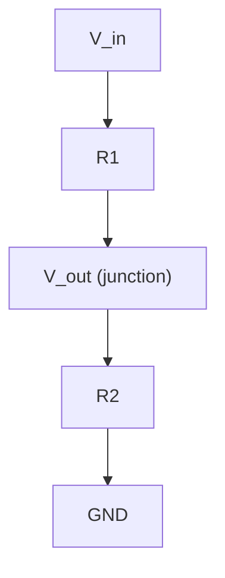

## Voltage, Current, Resistance, and Power

### Overview

Voltage, current, resistance, and power are the four foundational electrical quantities underlying every embedded hardware design decision — from selecting a pull-up resistor value to sizing a power supply for a sensor board. This topic establishes the fundamental relationships (Ohm's Law and the power equations) and their direct, practical application in embedded circuit design, distinct from the digital logic and CPU architecture topics covered previously, which assumed idealized digital signals without examining their underlying electrical basis.

### Voltage

#### Definition

Voltage (electric potential difference), measured in volts (V), represents the energy per unit charge available to move electric charge between two points in a circuit. It is fundamentally a *relative* quantity — always measured between two points, one of which is conventionally designated as a reference (ground/0V).

$$V = \frac{W}{Q}$$

where $W$ is energy (joules) and $Q$ is charge (coulombs).

**Key Points**

- Voltage is what drives current to flow through a circuit, analogous to pressure driving water flow through a pipe
- Common embedded logic voltage levels: 5V (legacy TTL/5V logic), 3.3V (dominant modern MCU logic level), 1.8V and lower (low-power/advanced process nodes)
- Voltage is always specified relative to a reference point — "ground" (GND) in most embedded circuits, conventionally treated as 0V
- Battery-powered embedded systems must account for voltage sag under load and voltage decline over the discharge cycle, not just the nominal rated voltage

### Current

#### Definition

Current, measured in amperes (A), represents the rate of flow of electric charge past a point in a circuit.

$$I = \frac{Q}{t}$$

where $Q$ is charge (coulombs) and $t$ is time (seconds).

**Key Points**

- Conventional current flow direction is defined as the direction positive charge would move (from high to low potential), even though in most conductors it is actually electrons — negatively charged — moving in the opposite direction
- Embedded current magnitudes span an enormous range: microcontroller sleep-mode currents may be in the nanoampere-to-microampere range, active operation in the milliampere range, and motor/actuator loads in the range of hundreds of milliamps to several amps
- Current draw, not voltage alone, is typically the limiting factor for battery life calculations and for how many peripherals a given GPIO pin or power rail can safely support

### Resistance

#### Definition

Resistance, measured in ohms (Ω), quantifies a material or component's opposition to current flow for a given applied voltage.

**Key Points**

- Determined by a conductor's material, length, cross-sectional area, and temperature: $R = \rho \frac{L}{A}$, where $\rho$ is resistivity, $L$ is length, and $A$ is cross-sectional area
- Resistors are used throughout embedded circuits for current limiting (LED protection), voltage division, pull-up/pull-down termination on digital I/O lines, and setting bias points for analog circuits
- Real conductors (PCB traces, wires) have small but non-zero resistance, which becomes relevant in high-current paths (voltage drop) or high-precision analog design

### Ohm's Law

The foundational relationship linking voltage, current, and resistance for a purely resistive (linear, ohmic) element:

$$V = IR$$

This can be algebraically rearranged for any unknown quantity:

$$I = \frac{V}{R} \qquad R = \frac{V}{I}$$

**Key Points**

- Applies directly and exactly to ideal resistors; many real components (diodes, transistors, LEDs) are non-linear and do not obey Ohm's Law across their full operating range, though small-signal or piecewise-linear approximations are often used in practical analysis
- Fundamental to nearly every discrete-component calculation in embedded hardware: current-limiting resistor sizing, pull-up/pull-down resistor selection, voltage divider design

### Power

#### Definition

Power, measured in watts (W), represents the rate of energy transfer or conversion — how quickly electrical energy is being delivered, consumed, or dissipated (often as heat) in a circuit.

$$P = VI$$

Combined with Ohm's Law, power can be expressed purely in terms of resistance and either voltage or current alone:

$$P = I^2 R \qquad P = \frac{V^2}{R}$$

**Key Points**

- All three power formulas are algebraically equivalent for a purely resistive element and yield the same result; the most convenient form depends on which two quantities are already known
- Power dissipated in a resistor is released as heat — a key concern in resistor selection (power rating) and in current-limiting designs where excess power translates directly to wasted energy and thermal load
- In embedded systems, power consumption directly determines battery life, thermal design requirements, and regulatory/efficiency compliance

### Relationship Diagram

<svg xmlns="http://www.w3.org/2000/svg" viewBox="0 0 480 480" font-family="monospace" font-size="14">
<text x="240" y="25" text-anchor="middle" font-size="15" font-weight="bold">Ohm's Law / Power Wheel (svg_diagram)</text>
<circle cx="240" cy="260" r="180" fill="none" stroke="black" stroke-width="1.5" />

<text x="240" y="120" text-anchor="middle" font-size="20" font-weight="bold">P</text>

<text x="380" y="260" text-anchor="middle" font-size="20" font-weight="bold">V</text>

<text x="100" y="260" text-anchor="middle" font-size="20" font-weight="bold">I</text>

<text x="240" y="400" text-anchor="middle" font-size="20" font-weight="bold">R</text>

<line x1="240" y1="150" x2="240" y2="370" stroke="black" stroke-width="1" />
<line x1="130" y1="260" x2="350" y2="260" stroke="black" stroke-width="1" />

<text x="185" y="200" font-size="11">P=VI</text>

<text x="185" y="330" font-size="11">P=I²R</text>

<text x="290" y="200" font-size="11">P=V²/R</text>

<text x="290" y="330" font-size="11">V=IR</text>

<text x="130" y="215" font-size="11">I=P/V</text>

<text x="290" y="215" font-size="11">V=P/I</text>

<text x="130" y="305" font-size="11">I=V/R</text>

<text x="290" y="305" font-size="11">R=V/I</text>

</svg>

### Practical Example: LED Current-Limiting Resistor

A standard embedded design task — driving an LED from a GPIO pin — directly applies all four quantities.

**Given:**

- GPIO output voltage: $V_{supply} = 3.3\text{V}$
- LED forward voltage drop: $V_{f} = 2.0\text{V}$ (typical for a red LED; varies by color/type)
- Desired LED current: $I = 10\text{mA} = 0.01\text{A}$

**Step 1 — Find the voltage that must be dropped across the resistor:**

$$V_R = V_{supply} - V_f = 3.3\text{V} - 2.0\text{V} = 1.3\text{V}$$

**Step 2 — Apply Ohm's Law to find the required resistance:**

$$R = \frac{V_R}{I} = \frac{1.3\text{V}}{0.01\text{A}} = 130\,\Omega$$

**Step 3 — Verify resistor power dissipation (to select an appropriately rated resistor):**

$$P_R = I^2 R = (0.01\text{A})^2 \times 130\,\Omega = 0.013\text{W} = 13\text{mW}$$

A standard 1/8W (125mW) or 1/4W (250mW) resistor provides ample margin above the 13mW dissipated here. [Inference] The specific LED forward voltage varies meaningfully by LED color and manufacturer (commonly roughly 1.8–2.2V for red, higher for blue/white/green), so this should be confirmed against the specific LED's datasheet rather than assumed from color alone.

### GPIO Current Limits and Fan-Out

**Key Points**

- Microcontroller GPIO pins have a maximum rated source/sink current per pin (commonly in the range of a few milliamps to tens of milliamps, varying significantly by part) — exceeding this can damage the pin driver or cause excessive voltage drop
- Total current across all simultaneously active GPIO pins is also typically limited by an aggregate maximum per port or per package, distinct from the per-pin limit — both figures must be checked against the specific part's datasheet
- Driving higher-current loads (motors, relays, multiple LEDs) directly from a GPIO pin without a transistor, MOSFET driver, or dedicated driver IC risks exceeding these limits

[Inference] Exact per-pin and aggregate current limits vary substantially across microcontroller families and even across different pins on the same part (some pins are rated for higher current); this must always be verified against the specific part's datasheet before finalizing a design, not estimated from a typical/average value.

### Pull-Up and Pull-Down Resistors

A common embedded application of resistance: ensuring a digital input pin has a defined logic level when not actively driven.

**Key Points**

- A **pull-up resistor** connects a signal line to the supply voltage through a resistor, so the line reads HIGH by default and is pulled LOW only when actively driven low (e.g., by an open-drain output or a switch to ground)
- A **pull-down resistor** connects a signal line to ground through a resistor, so the line reads LOW by default and is pulled HIGH only when actively driven
- Typical pull-up/pull-down values range from roughly 1kΩ to 100kΩ depending on the application; the value trades off between noise immunity (favoring lower resistance) and power consumption/rise-time (favoring higher resistance)
- Many microcontroller GPIO peripherals include configurable internal pull-up/pull-down resistors, eliminating the need for a discrete external resistor in many cases

$$I_{pullup} = \frac{V_{supply}}{R_{pullup}}$$

This current flows continuously whenever the line is held low by an open-drain device, directly contributing to static power consumption — a relevant consideration for battery-powered designs using bus protocols like I2C, which conventionally requires pull-up resistors on its SDA/SCL lines.

### Voltage Divider

A fundamental resistive circuit for deriving a lower voltage from a higher supply voltage, or for interfacing signals at different logic levels:

$$V_{out} = V_{in} \times \frac{R_2}{R_1 + R_2}$$

**Key Points**

- Commonly used for level-shifting a higher-voltage sensor signal down to a microcontroller's ADC input range, or for creating a reference voltage
- A voltage divider used as a signal source (e.g., feeding an ADC input) draws continuous current through $R_1$ and $R_2$ whenever powered, contributing to static power draw — resistor values should be chosen with this trade-off in mind for battery-powered designs
- Loading effects: if the node between $R_1$ and $R_2$ feeds a load with non-negligible current draw (rather than a high-impedance ADC input), the simple divider formula above no longer holds accurately and the load's impedance must be accounted for

### Power Budget Considerations for Embedded Design

**Key Points**

- Total system power draw is the sum of all active component currents multiplied by their respective supply voltages, but must account for different subsystems potentially operating at different voltage rails (e.g., 3.3V logic plus a separate 5V or higher rail for actuators)
- Battery capacity is commonly specified in milliamp-hours (mAh) or watt-hours (Wh); estimated battery life follows approximately:

$$t_{battery} \approx \frac{\text{Battery Capacity (mAh)}}{\text{Average Current Draw (mA)}}$$

- This is a simplified estimate; real battery behavior is affected by discharge curve non-linearity, temperature, and load current magnitude (higher discharge currents typically reduce effective capacity for many battery chemistries) [Inference — the specific relationship between discharge rate and effective capacity depends on the particular battery chemistry and cell, and should be evaluated against that cell's datasheet discharge curves for accurate battery-life estimation]
- Sleep/low-power mode current draw often dominates total energy budget in duty-cycled embedded designs (e.g., a sensor that wakes briefly to sample and transmit, then sleeps for extended periods), making microamp-level sleep current specifications a critical selection criterion

### Summary Table

| Quantity | Symbol | Unit | Formula (from other two) |
| --- | --- | --- | --- |
| Voltage | $V$ | Volt (V) | $V = IR$ |
| Current | $I$ | Ampere (A) | $I = V/R$ |
| Resistance | $R$ | Ohm (Ω) | $R = V/I$ |
| Power | $P$ | Watt (W) | $P = VI = I^2R = V^2/R$ |

**Related Topics**

- Digital Logic Voltage Levels and Noise Margins
- GPIO Electrical Characteristics and Driver Types (Push-Pull, Open-Drain)
- I2C, SPI, UART Electrical Signaling Fundamentals
- Battery Chemistries and Discharge Characteristics
- Voltage Regulators (Linear and Switching) and Power Supply Design
- PCB Trace Resistance and Current Capacity
- Analog-to-Digital Conversion Fundamentals
- Thermal Design and Heat Dissipation in Embedded Enclosures
- Capacitance and Inductance Fundamentals