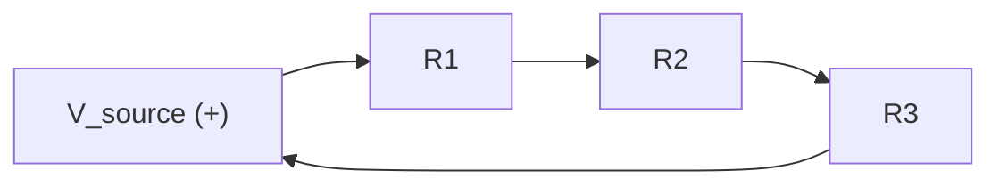

## Ohm's Law and Kirchhoff's Laws

### Overview

Ohm's Law and Kirchhoff's Laws together form the fundamental analytical toolkit for solving any linear resistive circuit — from a single current-limiting resistor to a multi-branch sensor bias network. Ohm's Law relates voltage, current, and resistance at a single component; Kirchhoff's Current Law (KCL) and Kirchhoff's Voltage Law (KVL) govern how voltage and current behave across an entire circuit's nodes and loops. This topic builds directly on Voltage, Current, Resistance, and Power, moving from single-component relationships to whole-circuit analysis techniques used routinely in embedded hardware design.

### Ohm's Law Recap

$$V = IR$$

Ohm's Law states that for an ideal resistor, voltage across it is directly proportional to the current through it, with resistance as the constant of proportionality. This was covered in depth previously; here it serves as the base building block for the network analysis techniques below.

**Key Points**

- Applies exactly to ideal linear resistors; many real embedded circuit elements (diodes, transistors, LEDs) are non-linear and require different or piecewise models
- Forms one of the two "law" categories needed for circuit analysis — Ohm's Law describes component behavior, Kirchhoff's Laws describe how components interact within a network

### Kirchhoff's Current Law (KCL)

#### Statement

The sum of currents entering a node (junction) equals the sum of currents leaving that node. Equivalently, the algebraic sum of all currents at a node — with entering currents taken as positive and leaving currents as negative (or vice versa, by consistent convention) — equals zero.

$$\sum_{k=1}^{n} I_k = 0$$

**Key Points**

- Reflects conservation of electric charge: charge cannot accumulate indefinitely at a node under steady-state (DC) conditions
- Applies at any node, regardless of how many branches connect to it
- Essential for analyzing parallel resistor networks, current-splitting in sensor bias circuits, and multi-branch power distribution

#### KCL Diagram

<svg xmlns="http://www.w3.org/2000/svg" viewBox="0 0 480 320" font-family="monospace" font-size="14">
<text x="240" y="25" text-anchor="middle" font-size="15" font-weight="bold">Kirchhoff's Current Law at a Node (svg_diagram)</text>
<circle cx="240" cy="160" r="8" fill="black" />
<line x1="100" y1="100" x2="234" y2="154" stroke="black" stroke-width="1.5" />
<polygon points="234,154 220,150 226,164" fill="black" />
<text x="110" y="90" font-size="13">I₁ (in)</text>
<line x1="100" y1="220" x2="234" y2="166" stroke="black" stroke-width="1.5" />
<polygon points="234,166 220,170 226,156" fill="black" />
<text x="110" y="240" font-size="13">I₂ (in)</text>
<line x1="246" y1="160" x2="380" y2="100" stroke="black" stroke-width="1.5" />
<polygon points="380,100 366,104 372,112" fill="black" />
<text x="350" y="90" font-size="13">I₃ (out)</text>
<line x1="246" y1="160" x2="380" y2="220" stroke="black" stroke-width="1.5" />
<polygon points="380,220 366,216 372,208" fill="black" />
<text x="350" y="245" font-size="13">I₄ (out)</text>

<text x="240" y="280" text-anchor="middle" font-size="14">I₁ + I₂ = I₃ + I₄</text>

</svg>

#### Application: Parallel Resistors

For resistors connected in parallel between the same two nodes, KCL directly leads to the parallel resistance formula. The total current entering the parallel combination splits among the branches:

$$I_{total} = I_1 + I_2 + \dots + I_n$$

Since each branch shares the same voltage $V$ across it, $I_k = V/R_k$, giving:

$$\frac{1}{R_{parallel}} = \frac{1}{R_1} + \frac{1}{R_2} + \dots + \frac{1}{R_n}$$

For exactly two resistors, this simplifies to the commonly used form:

$$R_{parallel} = \frac{R_1 R_2}{R_1 + R_2}$$

### Kirchhoff's Voltage Law (KVL)

#### Statement

The sum of voltage rises and drops around any closed loop in a circuit equals zero. Equivalently, the sum of all voltage sources in a loop equals the sum of all voltage drops across passive components in that loop.

$$\sum_{k=1}^{n} V_k = 0$$

**Key Points**

- Reflects conservation of energy: a charge returning to its starting point around a closed loop experiences zero net change in potential
- Requires a consistent sign convention (typically: voltage rises across sources are positive, voltage drops across resistors in the direction of current flow are negative, or vice versa) applied uniformly around the loop
- Essential for analyzing series resistor networks, voltage dividers, and any circuit with multiple loops

#### KVL Diagram

For this single-loop series circuit:

$$V_{source} = I R_1 + I R_2 + I R_3$$

#### Application: Series Resistors

For resistors in series, the same current $I$ flows through each, and KVL states the source voltage equals the sum of individual voltage drops:

$$V_{source} = I R_1 + I R_2 + \dots + I R_n = I(R_1 + R_2 + \dots + R_n)$$

This directly yields the series resistance formula:

$$R_{series} = R_1 + R_2 + \dots + R_n$$

### Series vs. Parallel Comparison

| Attribute | Series | Parallel |
| --- | --- | --- |
| Current | Same through all elements | Splits among branches (KCL) |
| Voltage | Splits among elements (KVL) | Same across all branches |
| Total resistance | $R_1 + R_2 + \dots$ | $\left(\frac{1}{R_1} + \frac{1}{R_2} + \dots\right)^{-1}$ |
| Governing law | KVL | KCL |
| Failure mode (open circuit in one element) | Breaks entire loop | Other branches unaffected |

### Worked Example: Two-Loop Resistor Network

Consider a circuit with a 9V source, $R_1 = 100\,\Omega$ in series with the source, feeding a node where $R_2 = 200\,\Omega$ and $R_3 = 300\,\Omega$ are connected in parallel to ground.

**Step 1 — Find the parallel combination of $R_2$ and $R_3$:**

$$R_{23} = \frac{R_2 R_3}{R_2 + R_3} = \frac{200 \times 300}{200 + 300} = \frac{60000}{500} = 120\,\Omega$$

**Step 2 — Find total circuit resistance (KVL applied across the series combination of $R_1$ and $R_{23}$):**

$$R_{total} = R_1 + R_{23} = 100\,\Omega + 120\,\Omega = 220\,\Omega$$

**Step 3 — Find total current from the source (Ohm's Law):**

$$I_{total} = \frac{V_{source}}{R_{total}} = \frac{9\text{V}}{220\,\Omega} \approx 40.9\text{mA}$$

**Step 4 — Find the voltage at the parallel node (Ohm's Law applied to $R_{23}$):**

$$V_{node} = I_{total} \times R_{23} = 0.0409\text{A} \times 120\,\Omega \approx 4.91\text{V}$$

**Step 5 — Find individual branch currents (KCL, Ohm's Law per branch):**

$$I_2 = \frac{V_{node}}{R_2} = \frac{4.91\text{V}}{200\,\Omega} \approx 24.5\text{mA}$$

$$I_3 = \frac{V_{node}}{R_3} = \frac{4.91\text{V}}{300\,\Omega} \approx 16.4\text{mA}$$

**Verification (KCL):** $I_2 + I_3 \approx 24.5\text{mA} + 16.4\text{mA} = 40.9\text{mA} \approx I_{total}$ ✓

### Sign Conventions and Common Pitfalls

**Key Points**

- Consistently choosing and maintaining a reference direction for current (and corresponding polarity for voltage drops) before applying KVL/KCL is essential; an inconsistent sign convention is one of the most common sources of analysis errors
- If an assumed current direction turns out to be wrong, the analysis will simply yield a negative value for that current — this is a valid and expected outcome, not necessarily an error, and indicates the actual current flows opposite to the assumed reference direction
- KCL and KVL apply to both DC and instantaneous AC analysis; for AC circuits with reactive elements (capacitors, inductors), the same laws hold but voltage/current relationships involve impedance (complex numbers) rather than pure resistance

### Application to Embedded Hardware Design

**Key Points**

- **Voltage divider analysis**: The voltage divider formula introduced previously is itself a direct consequence of KVL and Ohm's Law applied to a two-resistor series loop
- **Pull-up/pull-down networks**: Determining the actual logic-level voltage at a shared bus node (e.g., an I2C line with multiple pull-up resistors from different devices) requires KCL/parallel-resistance analysis when more than one pull-up is present
- **Sensor bias networks**: Many analog sensors (thermistors, photoresistors, strain gauges) are read via a voltage divider or bridge configuration; correctly predicting the ADC input voltage across the sensor's variable resistance range requires this analysis
- **Current-sense resistors**: A small-value resistor placed in series with a load, with the voltage drop across it measured to infer current (via Ohm's Law: $I = V_{sense}/R_{sense}$), is a standard technique for current monitoring in embedded power management
- **Debug and fault diagnosis**: Understanding expected node voltages and branch currents via KVL/KCL analysis is essential when troubleshooting a malfunctioning circuit with a multimeter, since measured values can be compared against calculated expectations to localize a fault

### Superposition (Brief Extension)

For circuits with multiple independent sources, the **superposition theorem** — a direct consequence of the linearity of Ohm's Law and Kirchhoff's Laws — states that the response (voltage or current) at any point equals the sum of the responses caused by each independent source acting alone, with all other independent voltage sources replaced by short circuits and all other independent current sources replaced by open circuits.

**Key Points**

- Only valid for linear circuits (obeying Ohm's Law); does not apply directly to circuits containing non-linear elements like diodes without additional piecewise handling
- Useful for analyzing circuits with both a DC bias source and an AC signal source superimposed, a common scenario in analog sensor interfacing

### Design Trade-offs and Practical Notes

| Analysis Goal | Primary Law Used | Typical Embedded Application |
| --- | --- | --- |
| Total resistance of parallel branches | KCL (derived) | Multiple pull-ups on a shared bus |
| Total resistance of series chain | KVL (derived) | Current-limiting resistor chains |
| Node voltage in a multi-branch network | KCL + Ohm's Law | Sensor bias network output |
| Loop current in a multi-loop circuit | KVL (mesh analysis) | Complex analog front-end design |
| Current through a specific branch | KCL + Ohm's Law | Current-sense resistor readings |

**Related Topics**

- Voltage, Current, Resistance, and Power
- Voltage Dividers and Sensor Bias Networks
- Thevenin and Norton Equivalent Circuits
- Analog-to-Digital Conversion Fundamentals
- Current-Sense Amplifiers and Power Monitoring
- AC Circuit Analysis and Impedance
- I2C Bus Electrical Characteristics and Multi-Pull-Up Networks
- Multimeter-Based Circuit Debugging Techniques