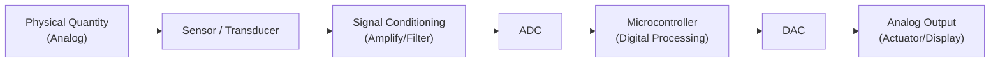
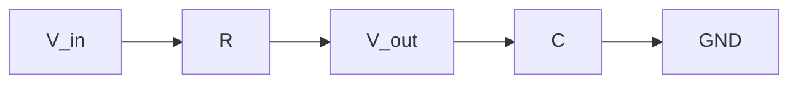
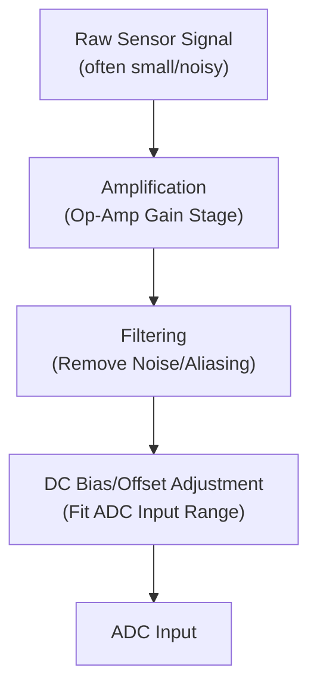

## Analog Circuit Basics

### Overview

Analog circuits process continuously varying signals — as opposed to the discrete high/low states of digital logic — and form the essential interface layer between the physical world and digital embedded systems. Nearly every embedded system that senses real-world quantities (temperature, light, sound, motion) or drives real-world outputs (motors, speakers, analog displays) relies on analog circuitry at some stage. This topic builds on Ohm's Law and Kirchhoff's Laws to introduce the core analog building blocks embedded engineers routinely encounter: signal characteristics, passive and active components beyond simple resistors, filtering, amplification, and the analog-digital boundary.

### Analog vs. Digital Signals

**Key Points**

- An **analog signal** can take any value within a continuous range at any instant in time (e.g., a microphone's output voltage varying smoothly with sound pressure)
- A **digital signal** is restricted to a finite set of discrete states, most commonly two (high/low), sampled at defined time intervals
- Real-world physical quantities (temperature, pressure, light intensity, sound) are inherently analog; digital systems must convert these via an Analog-to-Digital Converter (ADC) to process them, and convert digital values back via a Digital-to-Analog Converter (DAC) to produce analog outputs

### Signal Characteristics

**Key Points**

- **Amplitude**: the magnitude of a signal, typically measured in volts for voltage signals
- **Frequency**: the rate of repetition for periodic signals, measured in hertz (Hz); $f = 1/T$ where $T$ is the period
- **Phase**: the timing offset of a periodic signal relative to a reference, typically expressed in degrees or radians
- **DC offset (bias)**: a constant voltage component added to an otherwise time-varying (AC) signal, often required to keep an analog signal within a circuit's valid operating range
- **Noise**: unwanted random or interfering variation superimposed on a signal, a major practical concern in low-level analog sensor interfacing

### Capacitors

#### Definition

A capacitor stores electrical energy in an electric field between two conductive plates separated by an insulating dielectric. Capacitance, measured in farads (F), quantifies the amount of charge stored per unit voltage.

$$C = \frac{Q}{V}$$

The current-voltage relationship for a capacitor (distinguishing it fundamentally from a resistor) is:

$$I = C \frac{dV}{dt}$$

**Key Points**

- Current through a capacitor depends on the *rate of change* of voltage across it, not on the voltage itself — a capacitor passes AC signals but blocks steady-state DC
- Common embedded uses: power supply decoupling/bypass capacitors (filtering supply noise near IC power pins), timing circuits, signal coupling (blocking DC while passing AC), and energy storage for brief high-current pulses
- Practical capacitance values in embedded design commonly range from picofarads (pF, e.g., crystal oscillator loading) to hundreds of microfarads (µF, e.g., bulk power supply filtering)
- Real capacitors have parasitic effects (equivalent series resistance, equivalent series inductance) that limit their effectiveness at high frequencies; different capacitor technologies (ceramic, tantalum, electrolytic) trade off cost, size, capacitance value, and frequency response differently [Inference — specific parasitic characteristics vary significantly by capacitor technology, package, and manufacturer, and should be checked against the specific component's datasheet for high-frequency or precision applications]

### Inductors

#### Definition

An inductor stores electrical energy in a magnetic field generated by current flowing through a coil of wire. Inductance, measured in henries (H), quantifies the relationship between current change and induced voltage.

$$V = L \frac{dI}{dt}$$

**Key Points**

- Voltage across an inductor depends on the *rate of change* of current through it — an inductor opposes sudden changes in current, complementary to a capacitor's opposition to sudden changes in voltage
- Common embedded uses: switching power supply energy storage (buck/boost converters), EMI filtering, and current smoothing
- Less commonly used as a discrete component in simple embedded signal circuits compared to resistors and capacitors, but essential in switch-mode power supply design

### RC Circuits

A resistor-capacitor (RC) combination is one of the most common analog building blocks in embedded hardware, used for filtering, timing, and debouncing.

#### RC Low-Pass Filter

**Key Points**

- Passes low-frequency signals while attenuating high-frequency signals, since the capacitor's impedance decreases with increasing frequency, increasingly shorting high-frequency components to ground
- The **cutoff frequency** (the point where output amplitude drops to approximately 70.7%, or $-3\text{dB}$, of input amplitude) is:

$$f_c = \frac{1}{2\pi R C}$$

- Commonly used for basic switch/button debouncing (smoothing out rapid mechanical bounce transitions), power supply noise filtering, and anti-aliasing before an ADC input

#### RC Time Constant

The **time constant** $\tau$ (tau) characterizes how quickly voltage across a capacitor changes in an RC circuit:

$$\tau = RC$$

For a capacitor charging toward a supply voltage $V_{supply}$ through a resistor:

$$V(t) = V_{supply}\left(1 - e^{-t/\tau}\right)$$

**Key Points**

- After one time constant ($t = \tau$), the capacitor reaches approximately 63.2% of its final voltage
- After five time constants ($t = 5\tau$), the capacitor is considered to have effectively reached its final value (approximately 99.3%), a common rule-of-thumb threshold in practical design
- This charging behavior underlies simple RC timing circuits, power-on reset delay generation, and debounce timing calculations

### Diodes

#### Definition

A diode is a semiconductor device that conducts current predominantly in one direction (forward bias) while blocking current in the reverse direction (reverse bias), a fundamentally non-linear behavior that does not obey Ohm's Law.

**Key Points**

- **Forward voltage drop** ($V_f$): the approximate voltage across a conducting diode, commonly around 0.6–0.7V for standard silicon diodes and roughly 1.8–3.3V (varying by color) for LEDs [Inference — exact forward voltage varies by diode type, semiconductor material, and specific part, and should be confirmed against the component's datasheet]
- Common embedded uses: reverse-polarity protection (preventing damage from a battery inserted backward), rectification (converting AC to pulsating DC), flyback/freewheeling protection across inductive loads (relays, motors) to absorb voltage spikes when current is suddenly interrupted, and status/indicator LEDs
- **Zener diodes** are specifically designed to operate in a controlled reverse-breakdown region, providing a stable reference voltage or simple voltage clamping/protection function

### Transistors (Brief Introduction)

A transistor is a semiconductor device used for switching or amplifying electronic signals, functioning as a current- or voltage-controlled switch/valve. Full transistor theory is covered in a dedicated topic; the essential embedded-relevant concept is introduced here.

**Key Points**

- **Bipolar Junction Transistors (BJTs)**: current-controlled devices (a small base current controls a larger collector-emitter current)
- **MOSFETs (Metal-Oxide-Semiconductor Field-Effect Transistors)**: voltage-controlled devices (gate voltage controls drain-source current/resistance), widely used in embedded systems for switching higher-current or higher-voltage loads (motors, relays, high-power LEDs) that exceed direct GPIO drive capability
- Most embedded "driving a load from a GPIO pin" designs beyond simple low-current LEDs use a transistor or MOSFET as an intermediate switch, since GPIO pins have limited current-sourcing/sinking capability (see Voltage, Current, Resistance, and Power)

### Operational Amplifiers (Brief Introduction)

An operational amplifier (op-amp) is a high-gain differential voltage amplifier IC, foundational to analog signal conditioning. Detailed op-amp circuit topologies are covered in a dedicated topic; core concepts relevant here:

**Key Points**

- Amplifies the voltage difference between its two inputs (non-inverting and inverting) by a very high open-loop gain, with external feedback components (typically resistors) setting the actual closed-loop gain for practical use
- Common embedded uses: amplifying weak sensor signals (e.g., a thermocouple's millivolt-level output) to a usable ADC input range, buffering high-impedance sensor outputs to drive lower-impedance loads without loading effects, and active filtering
- Ideal op-amp analysis commonly assumes zero input current and, in negative-feedback configurations, that the two inputs are held at (nearly) equal voltage — simplifying assumptions that make hand analysis of many op-amp circuits tractable using Ohm's Law and KVL/KCL

### Analog Signal Conditioning Chain

A typical embedded sensor interface applies several analog stages before digitization:

**Key Points**

- **Amplification**: raises small signals (millivolt-level) to a range that makes efficient use of the ADC's resolution
- **Filtering**: removes noise and, critically, frequency content above the ADC's Nyquist frequency to prevent aliasing (anti-aliasing filtering)
- **Bias/offset adjustment**: shifts bipolar or below-range signals into the ADC's actual valid input voltage window (commonly 0V to $V_{ref}$ on many embedded ADCs)

### Noise and Signal Integrity Considerations

**Key Points**

- **Decoupling capacitors**: small-value capacitors (commonly 0.1µF ceramic) placed close to IC power pins to suppress high-frequency supply noise and provide a local charge reservoir for fast transient current demands
- **Grounding practices**: poor ground layout (e.g., shared ground paths between noisy digital switching circuits and sensitive analog sensor circuits) is a common source of analog measurement error in mixed-signal embedded boards
- **Shielding and cable routing**: long analog signal wires are susceptible to electromagnetic interference (EMI) pickup; twisted-pair or shielded cabling and short trace lengths reduce this risk
- **Differential signaling**: transmitting a signal as the difference between two complementary wires (rather than a single wire referenced to ground) provides strong common-mode noise rejection, used in some analog sensor interfaces and many digital communication standards

[Inference] The specific severity of noise and signal-integrity issues depends heavily on board layout, physical environment (electrical noise sources nearby), and the sensitivity of the specific analog measurement being made; general best practices reduce risk but do not eliminate the need for careful, design-specific validation.

### Analog Component Quick Reference

| Component | Key Relationship | Primary Embedded Role |
| --- | --- | --- |
| Resistor | $V = IR$ | Current limiting, biasing, pull-up/down |
| Capacitor | $I = C\,dV/dt$ | Filtering, decoupling, timing |
| Inductor | $V = L\,dI/dt$ | Switching power supplies, EMI filtering |
| Diode | Non-linear, ~0.6–0.7V forward drop | Protection, rectification, flyback suppression |
| Transistor/MOSFET | Current or voltage controlled switch | Driving higher-current loads from GPIO |
| Op-Amp | High-gain differential amplifier | Sensor signal amplification and buffering |

**Related Topics**

- Ohm's Law and Kirchhoff's Laws
- Voltage, Current, Resistance, and Power
- Analog-to-Digital Conversion Fundamentals
- Digital-to-Analog Conversion Fundamentals
- Operational Amplifier Circuit Topologies
- Transistor Fundamentals (BJT and MOSFET) as Switches and Amplifiers
- Power Supply Design (Linear and Switching Regulators)
- EMI/EMC Design Practices for Embedded PCBs
- Sensor Signal Conditioning Techniques