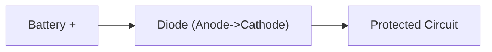
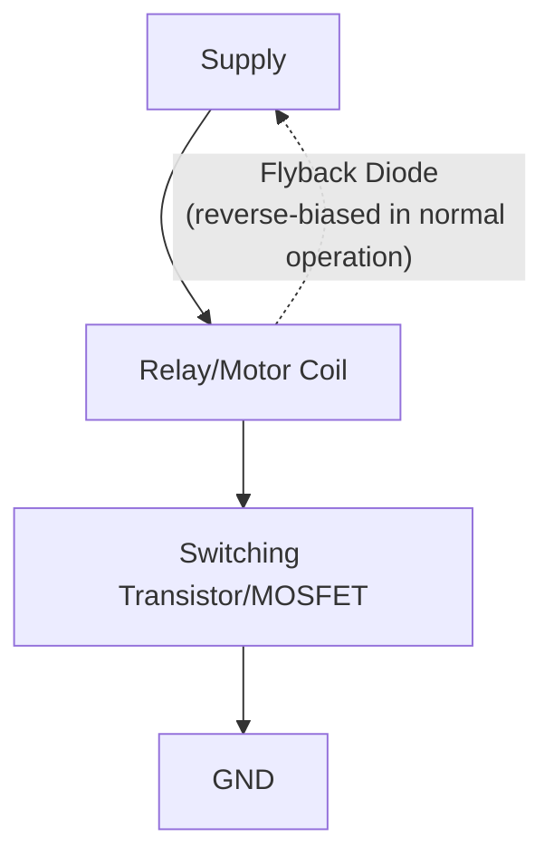
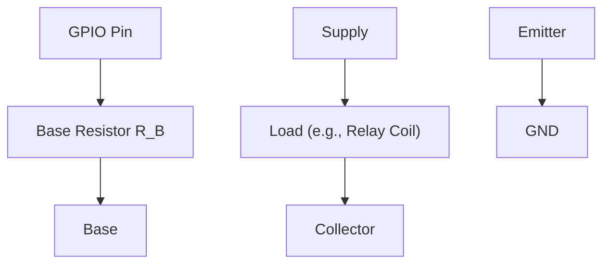
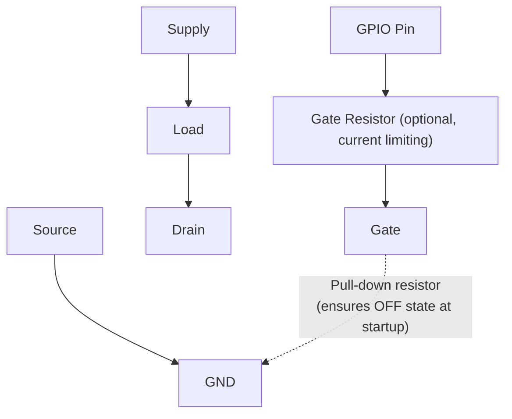
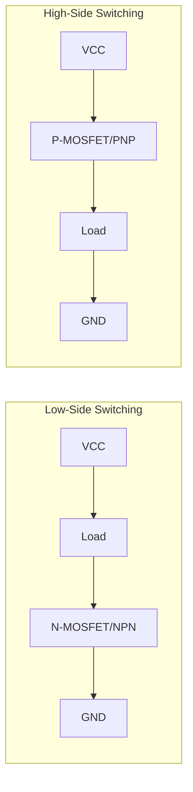
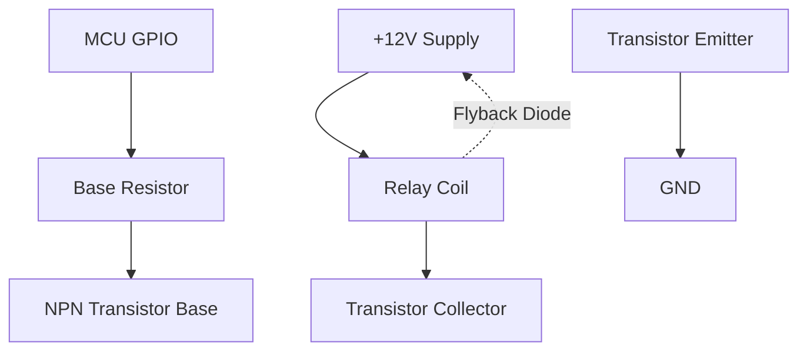

## Diodes, Transistors, and Switching Elements

### Overview

Diodes and transistors are the fundamental semiconductor building blocks that give embedded circuits the ability to rectify, protect, switch, and amplify — behaviors that pure resistive/reactive passive networks (covered in Analog Circuit Basics) cannot achieve. This topic expands on the brief introductions given previously, covering diode types and applications, BJT and MOSFET operation, and the practical switching-element circuits embedded engineers build to control motors, relays, and high-current loads from low-current microcontroller GPIO pins.

### Diode Fundamentals

#### Basic Operation

A diode is a two-terminal semiconductor device (anode and cathode) that conducts current primarily in one direction. In forward bias (anode more positive than cathode by at least the forward voltage threshold), the diode conducts; in reverse bias, it blocks current up to its rated breakdown voltage.

$$I_D = I_S\left(e^{V_D/nV_T} - 1\right)$$

This is the Shockley diode equation, where $I_S$ is reverse saturation current, $V_T$ is thermal voltage (~26mV at room temperature), and $n$ is the ideality factor. [Inference] This equation describes idealized diode behavior; real diode datasheets typically provide simplified forward voltage vs. current curves that are more directly useful for practical embedded design than deriving values from the exponential model.

**Key Points**

- For most embedded hand-calculations, diodes are approximated as having a fixed forward voltage drop (commonly ~0.6–0.7V for silicon) once conducting, rather than using the full exponential relationship
- Diodes are fundamentally non-linear and do not obey Ohm's Law
- **Reverse breakdown voltage**: the maximum reverse voltage a diode can withstand before uncontrolled reverse conduction (and typically damage) occurs, except in diodes specifically designed to operate in this region

#### Diode Types and Embedded Applications

| Type | Key Characteristic | Common Embedded Use |
| --- | --- | --- |
| Standard silicon (rectifier) | ~0.6–0.7V forward drop | Reverse-polarity protection, rectification |
| Schottky | Lower forward drop (~0.2–0.4V), faster switching | Efficient rectification, reduced power loss protection diodes |
| Zener | Stable reverse breakdown voltage | Voltage reference, overvoltage clamping/protection |
| LED (Light-Emitting Diode) | Emits light when forward biased; ~1.8–3.3V drop varying by color | Status indicators, displays |
| TVS (Transient Voltage Suppression) | Very fast clamping response | ESD/surge protection on exposed I/O lines |

[Inference] Specific forward voltage and breakdown ratings vary by manufacturer and part number within each diode type; datasheet values should always be used for final component selection rather than these general ranges.

#### Reverse-Polarity Protection

A diode placed in series with a power input protects downstream circuitry from damage if the supply is connected backward:

**Key Points**

- Simple and reliable, but incurs a continuous forward-voltage-drop power loss during normal (correct-polarity) operation, which reduces available voltage and wastes power as heat — a meaningful concern in battery-powered designs
- An alternative using a P-channel MOSFET wired for ideal-diode behavior can eliminate most of this voltage drop and power loss at the cost of additional circuit complexity

#### Flyback (Freewheeling) Diodes

When switching an inductive load (relay coil, motor, solenoid) off, the collapsing magnetic field induces a large voltage spike (per $V = L\,dI/dt$, introduced in Analog Circuit Basics) that can damage the switching transistor if not managed.

**Key Points**

- A diode placed in parallel with the inductive load, oriented to be reverse-biased during normal operation, provides a safe path for the coil's current to circulate and decay when the switch opens, clamping the voltage spike to a safe level
- Omitting flyback protection is a common cause of transistor/MOSFET failure when driving relays or motors directly from a switching element
- Schottky diodes are often preferred for flyback protection in fast-switching applications due to their faster response and lower forward drop

### Bipolar Junction Transistors (BJTs)

#### Basic Operation

A BJT is a three-terminal device (base, collector, emitter) that is current-controlled: a small current flowing into the base terminal controls a proportionally larger current flowing between collector and emitter.

$$I_C = \beta \times I_B$$

where $\beta$ (also called $h_{FE}$) is the current gain, and $I_C$, $I_B$ are collector and base currents respectively.

**Key Points**

- **NPN transistors**: conduct when base is more positive than emitter; the more common type for low-side switching (switching the ground-side connection of a load)
- **PNP transistors**: conduct when base is more negative than emitter; commonly used for high-side switching (switching the supply-side connection)
- $\beta$ varies significantly between individual transistors of the same part number (often specified as a wide range on datasheets) and with temperature and collector current — circuit designs relying on precise gain should not assume a fixed $\beta$ value [Unverified — exact beta variation ranges are part-specific and should be confirmed against the specific transistor's datasheet]
- BJTs used as switches are typically driven into **saturation** (fully "on," minimal voltage drop across collector-emitter) by ensuring sufficient base current, rather than operated in the linear amplification region

#### BJT as a Switch

**Base resistor sizing example:**

Given: $V_{GPIO} = 3.3\text{V}$, transistor $V_{BE} \approx 0.7\text{V}$, desired $I_C = 100\text{mA}$, and a conservative minimum $\beta = 50$ (choosing a low value from the datasheet's specified range to ensure saturation across manufacturing variation):

$$I_B = \frac{I_C}{\beta} = \frac{100\text{mA}}{50} = 2\text{mA}$$

$$R_B = \frac{V_{GPIO} - V_{BE}}{I_B} = \frac{3.3\text{V} - 0.7\text{V}}{0.002\text{A}} = 1300\,\Omega$$

A designer would typically choose a somewhat lower resistor value than this calculated minimum to ensure adequate base drive (driving the transistor further into saturation) across component variation and temperature, subject to not exceeding the GPIO pin's maximum current rating.

### MOSFETs (Metal-Oxide-Semiconductor Field-Effect Transistors)

#### Basic Operation

A MOSFET is a three-terminal device (gate, drain, source) that is voltage-controlled: the voltage applied between gate and source controls the resistance (and thus current) between drain and source, with essentially no continuous gate current required in steady state (unlike a BJT's base current).

**Key Points**

- **N-channel MOSFETs**: conduct when gate is sufficiently positive relative to source; common for low-side switching
- **P-channel MOSFETs**: conduct when gate is sufficiently negative relative to source; common for high-side switching, though less commonly used than N-channel due to generally higher on-resistance for a given die size
- **Threshold voltage** ($V_{GS(th)}$): the minimum gate-source voltage at which the MOSFET begins to conduct; must be compared against the microcontroller's GPIO output voltage to determine whether direct GPIO drive is sufficient
- **Logic-level MOSFETs**: specifically designed to fully turn on with the lower gate voltages typical of microcontroller GPIO outputs (e.g., 3.3V or 5V), as opposed to some MOSFETs designed for higher gate-drive voltages that would not fully saturate when driven directly from a low-voltage GPIO pin
- **On-resistance** ($R_{DS(on)}$): the drain-source resistance when fully on; lower values minimize power dissipation ($P = I^2 R_{DS(on)}$) in high-current switching applications

#### MOSFET as a Switch

**Key Points**

- A gate pull-down resistor is commonly included to ensure the MOSFET remains off (rather than floating into an undefined state) before the GPIO pin is actively driven, such as during power-up before firmware initializes the pin
- Since MOSFETs draw negligible steady-state gate current, no base-resistor-style current calculation is needed for DC switching, though a small series gate resistor is often included to limit inrush current and reduce ringing/EMI during fast switching transitions
- MOSFET gate capacitance means switching speed (particularly for high-current or high-frequency PWM applications) is limited by how quickly the driving circuit can charge/discharge this capacitance; dedicated MOSFET gate driver ICs are used when a GPIO pin alone cannot supply sufficient drive current for fast switching

### BJT vs. MOSFET Comparison

| Attribute | BJT | MOSFET |
| --- | --- | --- |
| Control mechanism | Current-controlled (base current) | Voltage-controlled (gate voltage) |
| Steady-state control input current | Non-negligible (must be sized) | Negligible |
| Typical switching speed | Moderate | Generally faster |
| On-state voltage drop behavior | $V_{CE(sat)}$, roughly fixed | $I \times R_{DS(on)}$, scales with current |
| Common embedded low-side switching use | Yes (smaller loads) | Yes (dominant for higher-current loads) |
| Gate/base drive circuit complexity | Requires calculated base resistor | Simpler; may need pull-down + optional gate resistor |

[Inference] The choice between BJT and MOSFET for a given embedded switching application depends on the specific current, voltage, switching speed, and cost requirements; MOSFETs are generally favored in modern embedded designs for GPIO-driven load switching due to negligible steady-state drive current and good availability of logic-level parts, but BJTs remain a valid and sometimes simpler choice for lower-current applications.

### High-Side vs. Low-Side Switching

**Key Points**

- **Low-side switching**: the switching element is placed between the load and ground; the load's other terminal connects directly to the supply. Simpler to drive (N-channel MOSFET/NPN gate/base referenced to ground), but leaves the load's high side always at supply potential even when off, which may be undesirable for safety or fault-isolation reasons in some designs
- **High-side switching**: the switching element is placed between the supply and the load; the load's other terminal connects directly to ground. Fully isolates the load from the supply when off, but requires either a P-channel device (referenced to the supply rail) or a gate-driver circuit capable of driving an N-channel MOSFET's gate above the supply rail (a "high-side driver" or charge pump/bootstrap circuit)

### Driving Multiple/Higher-Power Loads: Common ICs

**Key Points**

- **Darlington transistor arrays** (e.g., ULN2003-family parts): integrate multiple NPN Darlington pairs (two cascaded BJTs for higher effective current gain) with built-in flyback diodes, commonly used for driving multiple relays, solenoids, or stepper motor coils directly from microcontroller GPIO pins
- **MOSFET gate driver ICs**: provide the higher drive current and voltage levels needed to switch power MOSFETs quickly, especially important in high-frequency PWM motor control or switching power supply applications
- **Motor driver ICs** (e.g., H-bridge driver chips): integrate multiple MOSFETs or BJTs in a bridge configuration with built-in protection, allowing bidirectional motor control from simple logic-level control inputs

### Practical Example: Relay Driver Circuit

A complete low-side NPN transistor relay driver, combining several concepts from this topic:

**Design walkthrough:**

1. GPIO drives the base through a current-limiting resistor, turning the NPN transistor on (saturated)
2. The transistor's low-side switching connects the relay coil's return path to ground, energizing the coil
3. The flyback diode, reverse-biased during normal (energized) operation, provides a safe current path when the GPIO/transistor switches off, absorbing the coil's collapsing-field voltage spike
4. This pattern — GPIO → base/gate resistor → switching transistor → inductive load → flyback diode — is one of the most common circuit blocks in embedded hardware design, appearing in relay drivers, motor control, and solenoid actuation

### Design Trade-offs Summary

| Consideration | Favors BJT | Favors MOSFET |
| --- | --- | --- |
| Minimizing steady-state control current | No | Yes |
| Very low-cost, low-current switching | Often adequate | Often adequate |
| High-current, low-loss switching | Less favorable ($V_{CE(sat)}$ loss) | Favorable (low $R_{DS(on)}$ available) |
| Fast PWM switching | Moderate | Generally better, with adequate gate drive |
| Simplicity of direct GPIO drive | Requires base resistor calculation | Often simpler with logic-level parts + pull-down |

**Related Topics**

- Analog Circuit Basics
- Ohm's Law and Kirchhoff's Laws
- Voltage, Current, Resistance, and Power
- Motor Driver ICs and H-Bridge Topologies
- Pulse-Width Modulation (PWM) Fundamentals
- Power Supply Design (Linear and Switching Regulators)
- Gate Driver ICs and High-Side Switching Techniques
- EMI/EMC Considerations in Switching Circuits
- Relay and Solenoid Interfacing