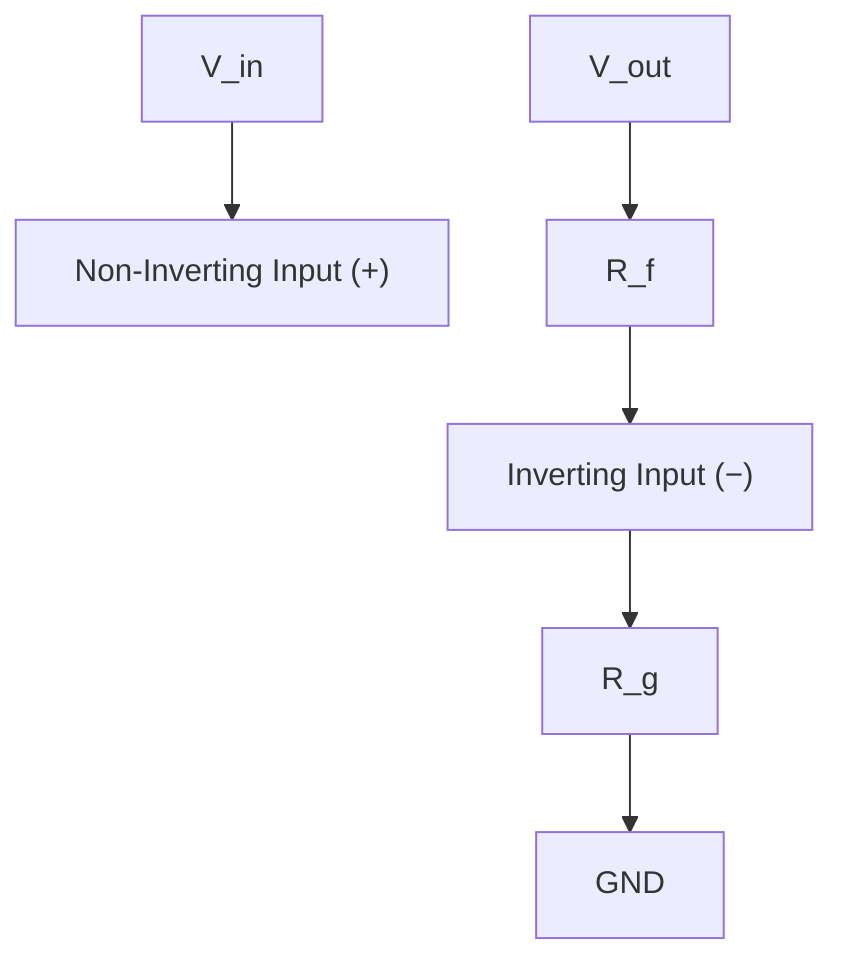
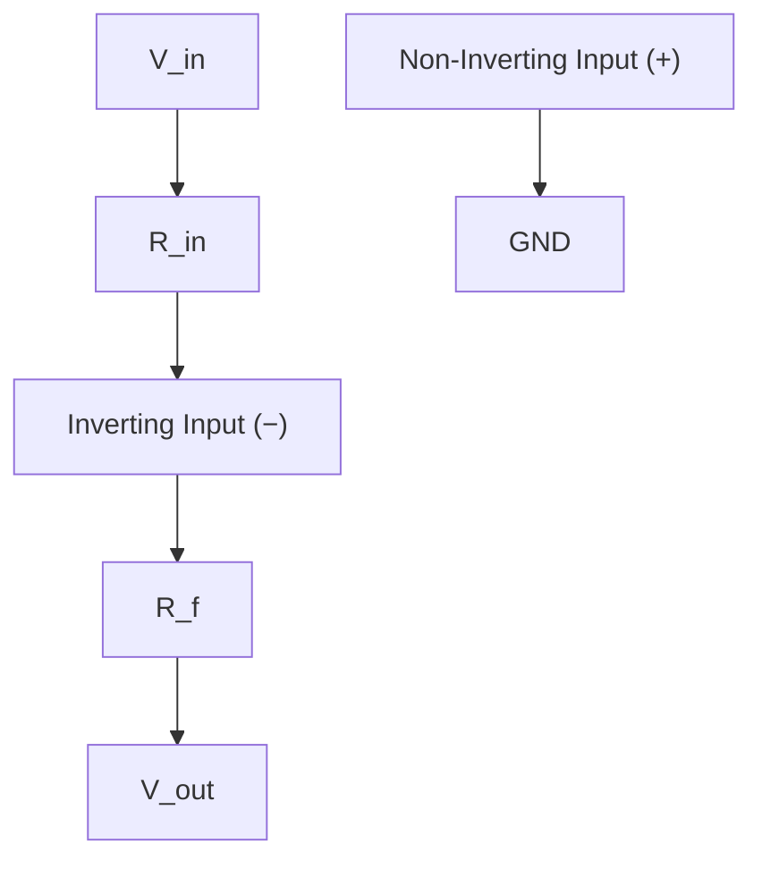
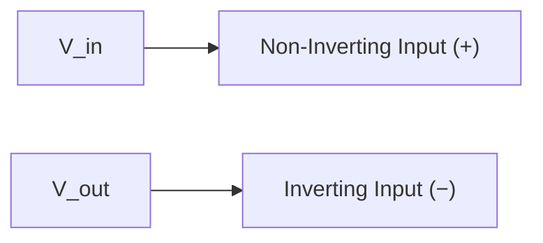
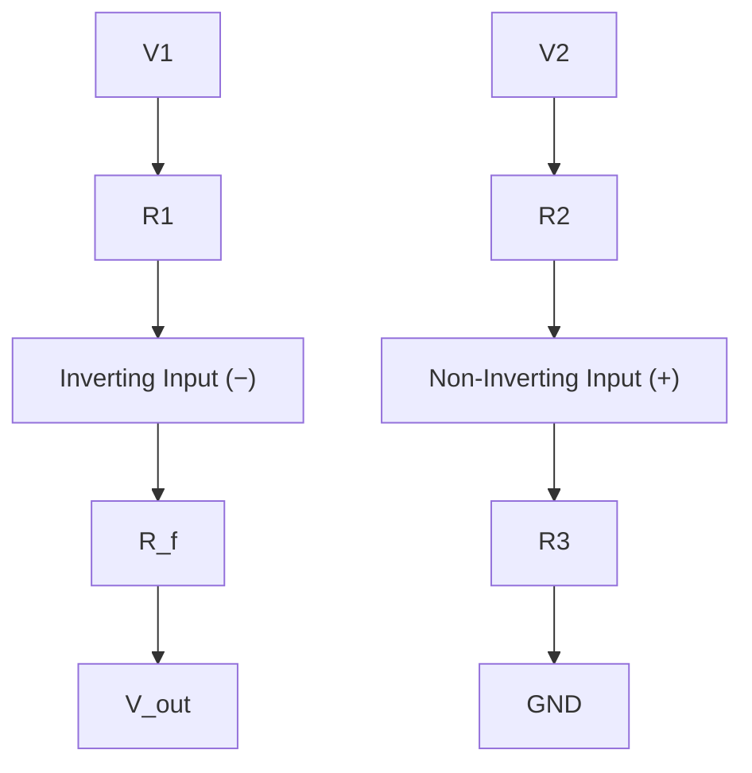

## Operational Amplifiers

### Overview

An operational amplifier (op-amp) is a high-gain, differential-input voltage amplifier integrated circuit that serves as the workhorse component of analog signal conditioning in embedded systems. Introduced briefly in Analog Circuit Basics, op-amps deserve detailed treatment because nearly every embedded sensor interface — from thermocouples to strain gauges to photodiodes — relies on op-amp circuits to amplify, buffer, or filter weak analog signals before digitization. This topic covers ideal op-amp theory, standard circuit topologies, and the practical non-idealities that matter in real embedded designs.

### The Ideal Op-Amp Model

An op-amp has two inputs — the **non-inverting input** ($V_+$) and **inverting input** ($V_-$) — and one output. The ideal model makes several simplifying assumptions that make hand analysis tractable:

**Key Points**

- **Infinite open-loop gain**: the output equals $A(V_+ - V_-)$ where $A \to \infty$, meaning any non-zero differential input theoretically drives the output to a rail
- **Infinite input impedance**: no current flows into either input terminal
- **Zero output impedance**: the output can source/sink current without any voltage drop
- **Infinite bandwidth**: the op-amp responds instantly to input changes with no frequency-dependent gain rolloff

These idealizations are never fully true in practice, but they provide a starting analysis framework that closed-loop (negative feedback) configurations make remarkably accurate for many real-world design purposes.

### The Virtual Short/Golden Rules

For an op-amp operating with **negative feedback** (output connected back to the inverting input, directly or through components), two simplifying rules emerge from the ideal model and are used throughout practical op-amp circuit analysis:

**Key Points**

- **Rule 1**: No current flows into either input terminal (from infinite input impedance)
- **Rule 2**: The op-amp's negative feedback action drives $V_+$ and $V_-$ to be equal (the "virtual short" — they behave as if shorted together, though no actual current flows between them)

These two rules alone allow straightforward Ohm's Law and KVL/KCL analysis (see Ohm's Law and Kirchhoff's Laws) of most standard op-amp circuits without needing to invoke the actual open-loop gain value.

### Op-Amp Symbol and Pinout Concept

<svg xmlns="http://www.w3.org/2000/svg" viewBox="0 0 480 260" font-family="monospace" font-size="13">
<text x="240" y="20" text-anchor="middle" font-size="15" font-weight="bold">Op-Amp Symbol (svg_diagram)</text>
<polygon points="150,60 150,180 320,120" fill="#f0f0f0" stroke="black" stroke-width="1.5" />
<text x="200" y="90" font-size="13">−</text>
<text x="200" y="160" font-size="13">+</text>
<line x1="60" y1="80" x2="150" y2="80" stroke="black" stroke-width="1.2" />
<text x="40" y="85" font-size="11">V₋</text>
<line x1="60" y1="160" x2="150" y2="160" stroke="black" stroke-width="1.2" />
<text x="40" y="165" font-size="11">V₊</text>
<line x1="320" y1="120" x2="400" y2="120" stroke="black" stroke-width="1.2" />
<text x="410" y="125" font-size="11">V_out</text>
<line x1="235" y1="60" x2="235" y2="30" stroke="black" stroke-width="1.2" />
<text x="235" y="20" text-anchor="middle" font-size="11">V+ (supply)</text>
<line x1="235" y1="180" x2="235" y2="210" stroke="black" stroke-width="1.2" />
<text x="235" y="225" text-anchor="middle" font-size="11">V− (supply)</text>
</svg>

### Standard Op-Amp Circuit Topologies

#### Non-Inverting Amplifier

Applying the virtual short rule ($V_- = V_+ = V_{in}$) and Rule 1 (no input current, so the same current flows through $R_f$ and $R_g$), voltage-divider analysis at the inverting node yields:

$$V_{out} = V_{in}\left(1 + \frac{R_f}{R_g}\right)$$

**Key Points**

- Gain is always $\geq 1$ (never attenuates)
- Very high input impedance at the non-inverting input (ideal: infinite), making this topology well-suited for buffering/amplifying high-impedance sensor sources without loading them
- Output is in phase with the input (non-inverted)

#### Inverting Amplifier

With $V_+$ grounded, the virtual short forces $V_- \approx 0\text{V}$ (a "virtual ground"). Applying KCL at the inverting node (current through $R_{in}$ equals current through $R_f$, since no current enters the input):

$$V_{out} = -\frac{R_f}{R_{in}} V_{in}$$

**Key Points**

- Gain magnitude can be less than, equal to, or greater than 1, and is always negative (inverted output phase)
- Input impedance seen by the source is approximately $R_{in}$ (finite, unlike the non-inverting configuration), which can load some high-impedance sensor sources
- Widely used in current-to-voltage conversion (transimpedance amplifiers, for photodiode/photodiode-array sensor interfacing) and summing circuits

#### Voltage Follower (Unity-Gain Buffer)

A special case of the non-inverting amplifier with direct feedback (no resistors, or equivalently $R_f = 0$, $R_g = \infty$):

$$V_{out} = V_{in}$$

**Key Points**

- Provides gain of exactly 1 while offering very high input impedance and very low output impedance — its entire purpose is impedance transformation, not amplification
- Commonly used to buffer a high-impedance sensor output (e.g., a simple resistive divider sensor) before feeding a lower-impedance load such as an ADC input or a following filter stage, preventing the load from "loading down" and distorting the sensor signal

#### Difference (Differential) Amplifier

For the matched-resistor case ($R_1 = R_2$, $R_f = R_3$):

$$V_{out} = \frac{R_f}{R_1}(V_2 - V_1)$$

**Key Points**

- Amplifies the difference between two input signals while ideally rejecting any voltage common to both (common-mode signal) — quantified by **Common-Mode Rejection Ratio (CMRR)**
- Useful for interfacing sensors that produce a differential output, or for rejecting common-mode noise picked up along signal wiring
- Resistor matching precision directly limits real-world CMRR performance; precision resistor networks or dedicated instrumentation amplifier ICs are often used instead of discrete resistors when high CMRR is required

#### Instrumentation Amplifier (Brief Note)

An instrumentation amplifier is a specialized three-op-amp (or integrated single-IC) circuit built from a differential amplifier stage preceded by two buffering/gain stages, offering very high input impedance on both inputs, precisely settable gain (often via a single external resistor), and excellent CMRR. Widely used for interfacing low-level sensors such as strain gauges, load cells, and thermocouples where signal integrity and common-mode noise rejection are critical.

### Op-Amp as a Filter or Integrator/Differentiator

Replacing purely resistive feedback elements with reactive components (capacitors) extends op-amp circuits into frequency-dependent behavior:

**Key Points**

- **Active low-pass/high-pass filters**: combining resistors and capacitors in the feedback network creates filters with the added benefit of gain and buffering, avoiding the signal loading issues of passive RC filters alone (introduced in Analog Circuit Basics)
- **Integrator**: a capacitor in the feedback path of an inverting configuration produces an output proportional to the time-integral of the input, used in some signal-processing and control applications
- **Differentiator**: a capacitor at the input of an inverting configuration produces an output proportional to the input's rate of change, though practical differentiator circuits require careful stability consideration due to high-frequency noise amplification

### Real-World Op-Amp Non-Idealities

Practical embedded designs must account for deviations from the ideal model, since these directly affect measurement accuracy, especially for low-level sensor signals.

**Key Points**

- **Input offset voltage** ($V_{OS}$): a small, non-zero voltage difference that appears to exist between the inputs even when both are at the same actual potential, causing a small output error — significant when amplifying very small sensor signals
- **Input bias current**: real op-amps draw a small but non-zero current into their input terminals (particularly BJT-input op-amps), which can create voltage errors across high-value source resistances; CMOS/JFET-input op-amps typically have much lower bias current
- **Slew rate**: the maximum rate at which the output voltage can change (V/µs), limiting how quickly the output can respond to fast input transitions or high-frequency signals — relevant when amplifying fast sensor pulses or driving certain waveforms
- **Gain-bandwidth product (GBW)**: the finite bandwidth of a real op-amp means closed-loop gain and usable bandwidth trade off against each other — higher gain configurations have proportionally lower usable bandwidth
- **Output voltage swing / rail limitations**: real op-amp outputs cannot swing fully to the supply rails (except "rail-to-rail" parts specifically designed for this), which must be considered when selecting supply voltages relative to expected signal range

[Inference] The specific magnitude of each non-ideality (offset voltage, bias current, slew rate, GBW) varies enormously across op-amp part numbers and is a primary factor in op-amp selection for a given embedded sensor application; general awareness of these parameters matters more than any specific typical value, and the target part's datasheet should always be consulted.

### Single-Supply Operation in Embedded Systems

Many embedded systems provide only a single positive supply rail (e.g., 3.3V and GND) rather than the dual (+/-) supplies assumed in classic op-amp textbook examples.

**Key Points**

- Single-supply (or "rail-to-rail input/output") op-amps are specifically designed to operate correctly with inputs and outputs referenced near 0V and the positive supply rather than requiring a negative supply
- Signals with a negative or bipolar component (e.g., an AC-coupled microphone signal) require a DC bias/offset network to shift them into the valid input range of a single-supply op-amp — a common design pattern combining the biasing concepts from Analog Circuit Basics with op-amp circuitry
- Selecting an op-amp not explicitly rated for single-supply, rail-to-rail operation when designing a single-supply embedded circuit is a common design mistake that can result in clipped or non-functional output near the rails

### Practical Example: Amplifying a Low-Level Sensor Signal

A thermocouple produces a small voltage (commonly tens of microvolts per degree Celsius) that must be amplified before an ADC (with, for example, a 0–3.3V input range) can resolve it usefully.

**Design approach:**

1. A non-inverting amplifier stage (or dedicated instrumentation amplifier) provides high input impedance, avoiding loading the thermocouple's naturally high source resistance
2. Gain is set (via $R_f/R_g$) to scale the expected microvolt-to-millivolt-level thermocouple signal up into a usable fraction of the ADC's input range
3. A DC bias network shifts the amplified signal to sit within the single-supply ADC's valid 0–3.3V input window, since thermocouple output can be bipolar around a reference junction
4. A low-pass filter stage (either passive RC or incorporated into the amplifier's feedback network as an active filter) removes high-frequency noise and provides anti-aliasing before the ADC samples the signal

[Inference] This is a generalized design pattern; actual thermocouple interfacing in practice commonly uses a dedicated thermocouple amplifier IC (which integrates cold-junction compensation and appropriate gain internally) rather than discrete op-amp design, though the underlying principles illustrated here remain the same.

### Design Trade-offs Summary

| Topology | Gain Formula | Input Impedance | Primary Embedded Use |
| --- | --- | --- | --- |
| Non-inverting amplifier | $1 + R_f/R_g$ | Very high | Amplifying high-impedance sensor sources |
| Inverting amplifier | $-R_f/R_{in}$ | Moderate ($\approx R_{in}$) | Current-to-voltage conversion, summing |
| Voltage follower | 1 | Very high | Buffering before ADC or filter stage |
| Difference amplifier | $R_f/R_1 \times (V_2-V_1)$ | Moderate | Differential sensor signals, noise rejection |
| Instrumentation amplifier | Precisely set via one resistor | Very high (both inputs) | Strain gauges, thermocouples, load cells |

**Related Topics**

- Analog Circuit Basics
- Diodes, Transistors, and Switching Elements
- Ohm's Law and Kirchhoff's Laws
- Analog-to-Digital Conversion Fundamentals
- Active Filter Design (Low-Pass, High-Pass, Band-Pass)
- Instrumentation Amplifier ICs and Precision Sensor Interfacing
- Common-Mode Rejection Ratio and Noise Rejection Techniques
- Single-Supply Analog Design Practices