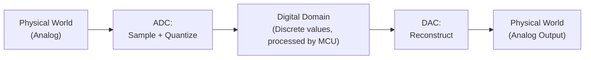

## Signal Types: Analog vs. Digital

### Overview

The distinction between analog and digital signals underlies nearly every design decision in embedded systems — which interface to use for a sensor, how to specify a communication protocol, and where in a signal chain conversion between the two domains must occur. This distinction was introduced briefly in Analog Circuit Basics; this topic treats it as a dedicated subject, examining signal domain characteristics, the conversion boundary, common signal encoding schemes used in embedded communication, and the practical implications of choosing or interfacing with each domain.

### Fundamental Definitions

#### Analog Signals

An analog signal is one whose value varies continuously over a range, both in amplitude and (typically) in time — it can, in principle, take on infinitely many values within its operating range at any given instant.

**Key Points**

- Directly represents physical phenomena: a thermocouple's voltage varies smoothly with temperature; a microphone's voltage varies continuously with sound pressure
- Subject to continuous degradation from noise, since any unwanted disturbance directly alters the signal's meaningful value with no inherent error correction
- Precision is limited by the physical measurement/generation chain (component tolerances, noise floor) rather than by a fixed number of discrete levels

#### Digital Signals

A digital signal is restricted to a finite set of discrete states — most commonly two (binary: high/low, 0/1) — and is typically also discrete in time, changing value only at defined clock or sampling instants.

**Key Points**

- Represents information using discrete levels, providing strong noise immunity: as long as noise doesn't push a signal past the threshold separating valid logic levels, the represented value remains unambiguous
- Can be regenerated (re-clocked, re-driven) at intermediate points without accumulating the signal degradation analog signals experience over distance or through multiple stages
- Enables exact, lossless storage, copying, and processing of the represented information, in contrast to analog signals which inherently degrade with each additional processing or transmission stage [Inference — this describes the well-established theoretical advantage of digital representation; specific real-world digital systems can still introduce controlled, quantifiable loss (e.g., lossy compression) as a deliberate design choice, distinct from the inherent noise accumulation analog signals experience]

### Visual Comparison

<svg xmlns="http://www.w3.org/2000/svg" viewBox="0 0 640 300" font-family="monospace" font-size="13">
<text x="320" y="20" text-anchor="middle" font-size="15" font-weight="bold">Analog vs Digital Signal Waveforms (svg_diagram)</text>

<text x="60" y="55" font-size="13" font-weight="bold">Analog</text>

<line x1="50" y1="130" x2="580" y2="130" stroke="black" stroke-width="1" />

<path d="M 60 130 Q 110 60, 160 130 T 260 130 Q 310 190, 360 130 T 460 130 Q 510 80, 560 130" fill="none" stroke="black" stroke-width="2" />

<text x="60" y="190" font-size="13" font-weight="bold">Digital</text>

<line x1="50" y1="270" x2="580" y2="270" stroke="black" stroke-width="1" />

<path d="M 60 270 L 60 220 L 140 220 L 140 270 L 140 270 L 220 270 L 220 220 L 300 220 L 300 270 L 380 270 L 380 220 L 380 220 L 460 220 L 460 270 L 540 270 L 540 220 L 560 220" fill="none" stroke="black" stroke-width="2" />

</svg>

### The Conversion Boundary: ADC and DAC

Since physical quantities are inherently analog but embedded processors compute digitally, conversion between domains is a foundational requirement of nearly any sensing or actuation system.

**Key Points**

- **Sampling**: capturing the analog signal's value at discrete points in time, governed by the Nyquist-Shannon sampling theorem (sampling rate must exceed twice the highest frequency component of interest to avoid aliasing)
- **Quantization**: rounding each sampled value to the nearest representable digital level, determined by the ADC's resolution (number of bits); this introduces **quantization error**, an inherent and unavoidable characteristic of analog-to-digital conversion
- This conversion boundary and its detailed mechanics (successive-approximation, sigma-delta, and other ADC architectures; DAC reconstruction filtering) are covered in dedicated Analog-to-Digital and Digital-to-Analog Conversion topics

### Digital Logic Levels (Recap in Signal-Type Context)

Even a "digital" signal is, at the physical/electrical layer, an analog voltage that is *interpreted* digitally by comparing it against defined threshold voltages.

**Key Points**

- A digital HIGH is any voltage above a defined minimum threshold ($V_{IH}$); a digital LOW is any voltage below a defined maximum threshold ($V_{IL}$); voltages between these thresholds are undefined/invalid logic states
- This threshold-based interpretation is precisely what gives digital signals their noise immunity — small voltage perturbations from noise do not change the interpreted logical value as long as the signal stays within its valid HIGH or LOW band
- Digital logic voltage levels (5V TTL/CMOS legacy, 3.3V modern MCU-dominant, 1.8V and lower low-power) were introduced in Voltage, Current, Resistance, and Power and remain the physical basis for all digital signaling

### Signal Types Along a Spectrum: Beyond Pure Binary Digital

Not every embedded signal is purely binary-digital or purely continuous-analog; several encoding schemes sit conceptually between the two or represent digital information using analog-style modulation.

#### Pulse-Width Modulation (PWM)

A digital signal (switching only between two fixed voltage levels) whose *average* value over time is controlled by varying the proportion of time spent HIGH versus LOW (duty cycle), effectively representing an analog-equivalent quantity using a digital switching signal.

$$V_{average} = V_{HIGH} \times \text{Duty Cycle}$$

**Key Points**

- Widely used in embedded systems to control motor speed, LED brightness, and to approximate an analog output (via subsequent low-pass filtering) without requiring a true DAC
- The signal itself is digital at any given instant, but its time-averaged behavior conveys continuously variable (effectively analog) information

#### Frequency and Pulse-Based Encoding

Some sensors and communication schemes encode information in the frequency or timing of digital pulses rather than in a continuously varying voltage level — for example, a rotary encoder producing a pulse train whose frequency indicates rotational speed, or certain sensor types outputting a frequency-modulated digital signal proportional to a measured quantity.

**Key Points**

- Retains much of digital signaling's noise immunity (since the receiver only needs to detect edge timing, not precise voltage levels) while conveying continuously variable information
- Common in some industrial and automotive sensor interfaces where robustness over long cable runs is prioritized over the simplicity of a direct analog voltage output

### Analog vs. Digital Communication Interfaces

**Key Points**

- Most modern embedded sensor and peripheral communication (I2C, SPI, UART) is fundamentally digital, transmitting binary data as sequences of discrete voltage/timing states, even though the underlying electrical signal is physically continuous (an analog waveform interpreted digitally, as noted above)
- Legacy and specialized analog sensor interfaces (e.g., simple analog voltage output sensors, 4-20mA current loop sensors common in industrial settings) remain in wide use, particularly where simplicity, established industry standards, or noise immunity over very long distances (current loops are notably robust against voltage-drop-induced errors) are prioritized
- The choice between an analog-output sensor requiring an ADC channel versus a digital-output sensor (e.g., I2C temperature sensor with onboard ADC) is a common early design decision affecting MCU pin/peripheral budget, wiring complexity, and achievable measurement precision

### Noise Immunity Comparison

| Attribute | Analog Signal | Digital Signal |
| --- | --- | --- |
| Noise sensitivity | Any noise directly alters represented value | Noise tolerated up to threshold margins |
| Signal regeneration over distance | Degrades progressively; requires careful amplification | Can be cleanly re-driven/re-clocked without accumulated loss |
| Precision limit | Physical/electrical noise floor and component tolerance | Fixed by number of discrete levels (resolution) |
| Error detection/correction | Not inherently possible | Checksums, parity, CRC, and similar techniques are practical |
| Long-distance transmission robustness | Requires careful design (e.g., 4-20mA current loops) | Generally more robust, especially with standard digital protocols |

### Practical Embedded Design Implications

**Key Points**

- **Signal chain planning**: identifying where in a system's data flow a signal exists in the analog domain, digital domain, or a hybrid encoding (PWM, frequency-based) determines what conditioning, conversion, and protocol-handling hardware/firmware is required at each stage
- **Resolution and precision trade-offs**: a digital representation's precision is bounded by its bit resolution (see Analog-to-Digital Conversion Fundamentals), while an analog signal's usable precision is bounded by real-world noise and component tolerance — meaning "digital is always more precise" is not universally true without considering the specific ADC resolution and analog noise floor involved
- **Cost and complexity trade-offs**: purely analog sensor interfacing can sometimes be simpler and cheaper (no onboard ADC or digital communication logic needed in the sensor itself) but pushes conversion and noise-handling responsibility onto the receiving embedded system's ADC and signal conditioning chain
- **Mixed-signal board design**: most real embedded PCBs are mixed-signal, combining digital logic, analog sensor interfacing, and power circuitry on the same board, requiring careful attention to grounding, layout, and noise isolation between domains (introduced in Analog Circuit Basics)

### Signal Type Decision Summary

| Consideration | Favors Analog Signal Path | Favors Digital Signal Path |
| --- | --- | --- |
| Long cable run noise immunity | Current loop (4-20mA) can be robust | Standard digital protocols generally more robust |
| Simplicity of the sensor itself | Simpler (raw analog output) | More complex (onboard ADC/logic) |
| Precision determined by | Analog noise floor, component tolerance | ADC/DAC resolution |
| Ease of digital processing/storage | Requires conversion first | Directly usable by MCU |
| Signal regeneration over multiple stages | Degrades progressively | Can be cleanly regenerated |

**Related Topics**

- Analog Circuit Basics
- Analog-to-Digital Conversion Fundamentals
- Digital-to-Analog Conversion Fundamentals
- Pulse-Width Modulation (PWM) Fundamentals
- Voltage, Current, Resistance, and Power
- Communication Protocols (UART, SPI, I2C) Fundamentals
- Nyquist-Shannon Sampling Theorem and Aliasing
- 4-20mA Current Loop Industrial Sensor Interfacing