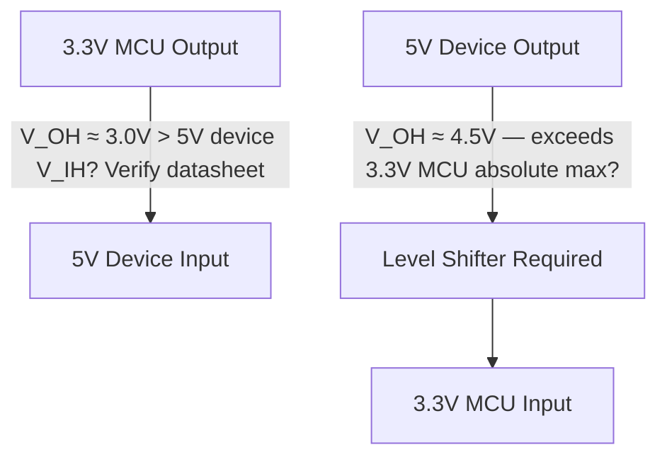

## Voltage Levels and Logic Families

### Overview

Logic families define the specific voltage ranges, thresholds, and electrical characteristics that digital circuits use to represent binary 0 and 1 states. While Signal Types: Analog vs. Digital covered the conceptual distinction between analog and digital signals, and digital HIGH/LOW thresholds were introduced briefly in Voltage, Current, Resistance, and Power, this topic examines the specific voltage standards and logic family technologies embedded engineers must understand to correctly interface chips, avoid damage, and ensure reliable signal recognition across a board or between boards.

### Why Logic Families Matter

Digital logic devices don't simply respond to "0V = LOW" and "supply voltage = HIGH." Real logic gates and microcontroller I/O pins define specific voltage thresholds that separate valid HIGH, valid LOW, and an undefined "forbidden zone" in between. Mismatched logic families or voltage levels between two interfaced devices is one of the most common sources of embedded hardware bugs and, in some cases, permanent damage.

### Key Voltage Threshold Parameters

For any digital input or output, datasheets specify four critical threshold voltages:

**Key Points**

- **$V_{IH}$ (Input High Voltage, minimum)**: the minimum voltage an input must receive to be reliably recognized as a logic HIGH
- **$V_{IL}$ (Input Low Voltage, maximum)**: the maximum voltage an input can receive and still be reliably recognized as a logic LOW
- **$V_{OH}$ (Output High Voltage, minimum)**: the minimum voltage a device guarantees at its output when driving a HIGH state (under specified load conditions)
- **$V_{OL}$ (Output Low Voltage, maximum)**: the maximum voltage a device guarantees at its output when driving a LOW state (under specified load conditions)

### Noise Margin

The gap between an output's guaranteed level and the receiving input's required threshold defines the **noise margin** — how much unwanted voltage disturbance a signal can tolerate before being misread.

$$NM_H = V_{OH} - V_{IH}$$

$$NM_L = V_{IL} - V_{OL}$$

**Key Points**

- Larger noise margins provide greater tolerance to electrical noise, ground bounce, and voltage drop over interconnects
- A driving device's $V_{OH}$ must exceed the receiving device's $V_{IH}$ requirement (and $V_{OL}$ must be below $V_{IL}$) for reliable communication — mismatches here are a common root cause of intermittent or fully non-functional digital interfaces
- The region between $V_{IL}$ and $V_{IH}$ at a receiving input is an undefined "forbidden zone" where correct interpretation is not guaranteed

### Voltage Level Threshold Diagram

<svg xmlns="http://www.w3.org/2000/svg" viewBox="0 0 480 320" font-family="monospace" font-size="13">
<text x="240" y="20" text-anchor="middle" font-size="15" font-weight="bold">Logic Level Thresholds (svg_diagram)</text>
<line x1="80" y1="280" x2="80" y2="50" stroke="black" stroke-width="1.5" />
<polygon points="80,50 75,60 85,60" fill="black" />
<text x="60" y="45" font-size="11">V</text>
<rect x="80" y="55" width="200" height="35" fill="#e8e8e8" />
<text x="290" y="77" font-size="12">Valid HIGH region</text>
<line x1="80" y1="90" x2="280" y2="90" stroke="black" stroke-width="1" />
<text x="60" y="93" font-size="11">V_IH</text>
<rect x="80" y="90" width="200" height="60" fill="#f8f8f8" />
<text x="290" y="125" font-size="12">Forbidden / undefined zone</text>
<line x1="80" y1="150" x2="280" y2="150" stroke="black" stroke-width="1" />
<text x="60" y="153" font-size="11">V_IL</text>
<rect x="80" y="150" width="200" height="35" fill="#e8e8e8" />
<text x="290" y="172" font-size="12">Valid LOW region</text>
<line x1="70" y1="185" x2="90" y2="185" stroke="black" stroke-width="1.5" />
<text x="60" y="200" font-size="11">0V (GND)</text>
</svg>

### Common Logic Families

#### TTL (Transistor-Transistor Logic)

A legacy bipolar-transistor-based logic family historically operating at a 5V supply, with defined thresholds of approximately $V_{IH} \geq 2.0\text{V}$ and $V_{IL} \leq 0.8\text{V}$ for standard TTL. [Inference — exact TTL threshold specifications vary slightly by specific TTL sub-family (e.g., standard TTL, LS-TTL, ALS-TTL) and should be confirmed against the specific part's datasheet]

**Key Points**

- Largely superseded by CMOS in new embedded designs due to CMOS's substantially lower power consumption, but TTL-compatible input thresholds remain referenced as a compatibility standard for some interfacing scenarios
- Original TTL logic draws continuous current even in a static (non-switching) state, unlike CMOS, contributing to its higher power consumption relative to CMOS logic

#### CMOS (Complementary Metal-Oxide-Semiconductor)

The dominant logic family in modern embedded systems, using complementary pairs of N-channel and P-channel MOSFETs. CMOS thresholds are typically specified as a fraction of the supply voltage ($V_{DD}$) rather than fixed absolute values.

**Key Points**

- Typical CMOS threshold convention: $V_{IH} \approx 0.7 \times V_{DD}$, $V_{IL} \approx 0.3 \times V_{DD}$ (exact fractions vary by specific logic family/part and should be verified against the datasheet)
- Very low static (quiescent) power consumption, since in a steady HIGH or LOW state, one of the complementary transistor pair is always off, minimizing continuous current draw — dynamic (switching) power consumption dominates instead
- Modern microcontroller I/O pins are overwhelmingly CMOS-based, operating at 3.3V or lower supply voltages in most current embedded designs

#### "TTL-Compatible" Logic Levels at Lower Supply Voltages

A frequent point of confusion: many modern low-voltage logic families (e.g., certain 5V CMOS families) specify input thresholds intentionally compatible with legacy TTL output levels, even though the internal technology is CMOS, not bipolar TTL. This distinction between the *logic family/technology* and the *voltage threshold standard it targets* is important when reading datasheets referencing "TTL-compatible inputs."

### Common Embedded Supply/Logic Voltage Levels

| Voltage Level | Typical CMOS $V_{IH}$ (≈0.7×$V_{DD}$) | Typical CMOS $V_{IL}$ (≈0.3×$V_{DD}$) | Common Use |
| --- | --- | --- | --- |
| 5V | ~3.5V | ~1.5V | Legacy microcontrollers, some industrial I/O |
| 3.3V | ~2.3V | ~1.0V | Dominant modern MCU logic level |
| 1.8V | ~1.26V | ~0.54V | Low-power/advanced process node ICs |

[Inference] These are approximate values derived from the general CMOS threshold convention; actual datasheet-specified thresholds for a specific part often differ from this simple percentage rule and should always be confirmed directly against the target device's datasheet before finalizing an interface design.

### Interfacing Between Different Logic Voltage Levels

Mixing components operating at different supply/logic voltages (a very common embedded scenario — e.g., a 3.3V microcontroller communicating with a 5V sensor) requires careful handling.

**Key Points**

- **Driving a higher-voltage input from a lower-voltage output**: whether this works reliably depends on whether the lower output's $V_{OH}$ exceeds the higher-voltage device's $V_{IH}$ requirement — sometimes acceptable (e.g., many 5V CMOS inputs accept 3.3V HIGH signals if $V_{OH} > V_{IH}$), but must be verified against both devices' datasheets rather than assumed
- **Driving a lower-voltage input from a higher-voltage output**: often risky or explicitly unsafe without additional circuitry, since exceeding a lower-voltage device's absolute maximum input voltage rating can cause permanent damage; a voltage divider (introduced in Ohm's Law and Kirchhoff's Laws) or a dedicated level-shifter circuit/IC is typically required
- **Dedicated level-shifter ICs**: purpose-built for reliably translating logic levels bidirectionally, especially important for interfaces like I2C where the same physical line must be correctly driven and read by devices at different logic voltages
- **Open-drain outputs with a shared pull-up**: some communication protocols avoid part of this problem structurally, since an open-drain output only pulls a line LOW (never actively drives HIGH), allowing devices at different logic voltages to share a bus safely as long as the pull-up resistor is connected to a voltage compatible with all devices' maximum input ratings [Inference — this open-drain approach mitigates but does not fully eliminate all logic-level compatibility concerns, since the pull-up voltage must still be verified as within every connected device's safe/valid input range]

### Absolute Maximum Ratings

Distinct from the functional $V_{IH}$/$V_{IL}$ thresholds, every device datasheet specifies **absolute maximum ratings** — voltage (and other) limits that must never be exceeded, even momentarily, without risking permanent damage.

**Key Points**

- Exceeding a pin's absolute maximum input voltage, even briefly (e.g., from a voltage spike, incorrect level-shifting, or a floating/undriven line during power sequencing), can cause immediate or latent damage to the device
- Some modern microcontroller I/O pins are specifically rated as "5V-tolerant" despite operating on a 3.3V internal logic supply, meaning their absolute maximum input rating safely accommodates a 5V input signal even though the device itself runs at 3.3V — this is a specific, deliberately designed feature and must not be assumed present on parts not explicitly documented as 5V-tolerant
- Power sequencing (the order and timing in which multiple supply rails power up/down in a multi-voltage design) can also create transient conditions where an input momentarily exceeds a safe level if not carefully designed, particularly relevant in mixed-voltage embedded boards

[Inference] Whether a specific microcontroller's GPIO pins are 5V-tolerant, and to what degree/under what conditions, varies significantly by part and even by specific pin within the same part on some devices; this must be verified directly against the target part's datasheet and pin-specific electrical characteristics tables before assuming tolerance.

### Logic Family Comparison Summary

| Attribute | TTL (Legacy) | CMOS (Modern Standard) |
| --- | --- | --- |
| Typical supply voltage | 5V | 5V, 3.3V, 1.8V, and lower |
| Threshold convention | Fixed absolute voltages | Fraction of $V_{DD}$ |
| Static power consumption | Higher (continuous current draw) | Very low |
| Prevalence in current embedded MCU design | Rare (legacy/compatibility only) | Dominant |
| Input impedance | Lower | Very high |

### Practical Design Checklist

**Key Points**

- Always confirm the actual supply/logic voltage of every device in an interface, not just its "typical" or commonly assumed operating voltage
- Compare driving device $V_{OH}$/$V_{OL}$ against receiving device $V_{IH}$/$V_{IL}$ for every signal direction in a bidirectional interface
- Check absolute maximum input voltage ratings before connecting any external signal, especially from a higher-voltage source
- Use a level shifter, voltage divider, or verified 5V-tolerant pins when interfacing devices at meaningfully different logic voltages
- For shared multi-device buses (I2C in particular), verify all devices and the shared pull-up voltage are mutually compatible

**Related Topics**

- Signal Types: Analog vs. Digital
- Voltage, Current, Resistance, and Power
- Diodes, Transistors, and Switching Elements
- Communication Protocols (UART, SPI, I2C) Electrical Characteristics
- Level-Shifter Circuits and ICs
- CMOS Gate Internal Structure and Power Consumption
- Power Sequencing in Multi-Voltage Embedded Designs
- Absolute Maximum Ratings and Component Reliability