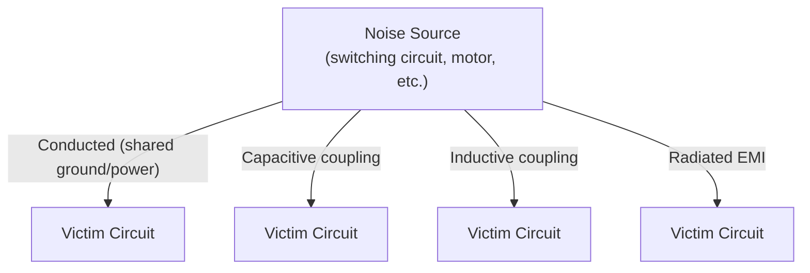
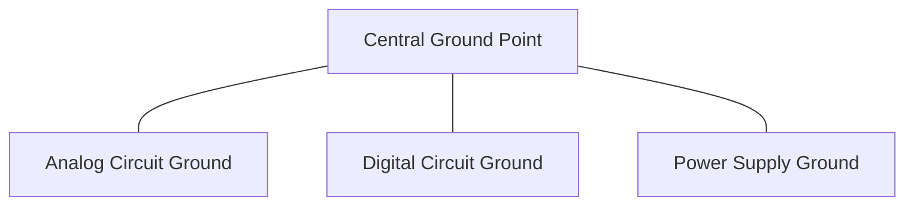

## Noise, Grounding, and Signal Integrity

### Overview

Noise, grounding, and signal integrity together determine whether a correctly designed circuit actually functions reliably once built on a real PCB, in a real electrical environment. Concepts touched on briefly in Analog Circuit Basics and Voltage Levels and Logic Families — decoupling capacitors, grounding practices, and noise margin — are expanded here into a dedicated treatment of noise sources, coupling mechanisms, grounding strategies, and practical signal integrity techniques essential for robust embedded hardware design.

### Sources of Electrical Noise

**Key Points**

- **Thermal (Johnson-Nyquist) noise**: random voltage fluctuation inherent to any resistive element due to thermal agitation of charge carriers, present in all conductors and unavoidable at a fundamental physical level, though typically small relative to other noise sources in digital and moderate-signal-level embedded circuits
- **Switching noise**: voltage transients caused by digital circuits rapidly switching state, particularly from simultaneous switching of multiple output pins or high-current transitions (e.g., motor driver switching), coupling onto nearby power and signal traces
- **Electromagnetic Interference (EMI)**: noise coupled from external sources (other electronic equipment, RF transmitters, power lines, motors) via radiated or conducted paths
- **Crosstalk**: unwanted coupling between adjacent signal traces or wires, caused by parasitic capacitive and inductive coupling between conductors running close and parallel to each other
- **Power supply noise**: ripple and transient disturbances on supply rails, from switching regulators, load transients, or insufficient decoupling, propagating into sensitive analog or digital circuits sharing that supply

### Noise Coupling Mechanisms

#### Conducted Coupling

Noise travels through a direct electrical connection — shared power rails, shared ground paths, or direct wiring — from a noise source to a victim circuit.

#### Radiated (Electromagnetic) Coupling

Noise couples through electromagnetic fields without a direct electrical connection, becoming more significant at higher frequencies and longer conductor lengths (which behave increasingly like antennas).

**Key Points**

- **Capacitive coupling**: a changing voltage on one conductor induces a coupled voltage on a nearby conductor via parasitic capacitance between them, more significant for high-impedance victim circuits
- **Inductive coupling**: a changing current on one conductor induces a coupled voltage on a nearby conductor via parasitic mutual inductance, more significant for low-impedance victim circuits and for conductors carrying rapidly switching currents

### Grounding Fundamentals

#### The Ideal vs. Real Ground

An ideal ground is assumed to be a perfect, zero-resistance, zero-impedance reference at 0V everywhere. Real ground conductors (PCB copper, wires) have non-zero resistance and inductance, meaning current flowing through them creates a small but real voltage drop — the ground is not actually at exactly the same potential everywhere.

$$V_{ground\ drop} = I \times Z_{ground}$$

where $Z_{ground}$ is the ground path's real (non-zero) impedance.

**Key Points**

- **Ground bounce**: a transient voltage difference across a ground conductor caused by rapidly changing current (particularly from digital switching), which can cause logic level misinterpretation or noise injection into nearby analog circuits sharing that ground path
- This non-ideal ground behavior is the fundamental reason grounding topology (how and where different circuit sections connect to a common ground) matters significantly in mixed-signal embedded PCB design

#### Single-Point (Star) Grounding

All ground connections converge to a single common point rather than daisy-chaining through shared paths.

**Key Points**

- Prevents noisy digital or power-stage return currents from flowing through the same conductor path as sensitive analog return currents, since each section has its own dedicated path back to the common point
- More practical at the schematic/conceptual level for smaller or lower-frequency designs; becomes harder to implement cleanly (and less commonly the sole strategy) on complex, high-frequency, multi-layer PCBs where a solid ground plane approach is often preferred instead

#### Ground Planes (Modern PCB Practice)

Rather than routing ground as thin traces, a dedicated PCB copper layer (or large copper pour) serves as a low-impedance, low-inductance ground reference for the entire board.

**Key Points**

- Significantly reduces ground impedance compared to trace-based grounding, minimizing ground bounce and providing a well-defined return current path for high-speed signals
- **Return current path**: a critical, sometimes overlooked concept — high-frequency signal return current does not spread evenly across a ground plane but tends to flow directly beneath the signal trace it's associated with; splitting or interrupting a ground plane beneath a signal trace can force return current into a longer, higher-impedance path, degrading signal integrity and increasing EMI
- **Split ground planes** (separate analog and digital ground plane regions on the same layer, sometimes connected at a single point) are a design technique used to isolate noisy digital return currents from sensitive analog circuits, but must be implemented carefully to avoid the return-path problems noted above — an increasingly debated practice in signal integrity engineering, with solid unified ground planes plus careful component placement/routing often preferred in many modern designs [Inference — the split-plane-versus-unified-plane debate reflects genuinely differing expert guidance depending on the specific design's frequency content, layer stack-up, and component placement; this is not a settled, one-size-fits-all rule and should be evaluated per-design, ideally with reference to current PCB signal integrity literature]

### Decoupling and Bypass Capacitors Revisited

Introduced in Analog Circuit Basics and Passive Components, decoupling capacitors are one of the most direct and effective noise mitigation techniques available to embedded PCB designers.

**Key Points**

- Placed as close as physically possible to an IC's power pins, minimizing the parasitic inductance of the current loop between the capacitor, the IC, and the ground return path
- A combination of capacitor values (e.g., a larger bulk capacitor alongside a smaller high-frequency ceramic capacitor) addresses different frequency ranges of supply noise, since each capacitor's effective impedance-vs-frequency behavior (including its self-resonant frequency, discussed in Passive Components) differs
- Insufficient or poorly placed decoupling is a common root cause of intermittent digital logic errors, unexplained resets, or noisy ADC readings that can be difficult to diagnose without signal-integrity-aware debugging

### Signal Integrity in High-Speed and Sensitive Circuits

**Key Points**

- **Trace length matching**: for high-speed parallel digital buses, keeping trace lengths closely matched avoids timing skew between signal lines that must arrive synchronized
- **Controlled impedance traces**: high-speed signal traces (and their associated return path) are often designed to a specific characteristic impedance (commonly 50Ω single-ended or 100Ω differential, though exact target values are design-specific) to minimize reflections at impedance discontinuities
- **Termination**: resistive termination (series or parallel, depending on topology) is used on high-speed digital lines to absorb signal reflections that would otherwise cause ringing or false logic transitions
- **Differential signaling**: transmitting a signal as a complementary pair (introduced briefly in Analog Circuit Basics) provides strong immunity to common-mode noise, since noise coupling onto both conductors equally is rejected by a differential receiver — widely used in robust industrial and communication interfaces (e.g., RS-485, USB, Ethernet)

[Inference] The specific need for controlled impedance, termination, and trace-length matching depends heavily on signal frequency/edge rate and trace length relative to signal wavelength; many embedded designs with slower signals and short traces do not require these more advanced high-speed techniques, while others (fast SPI buses, high-resolution parallel displays, high-speed serial links) may require them — this determination is design-specific.

### Analog and Digital Isolation on Mixed-Signal Boards

**Key Points**

- **Physical separation**: placing sensitive analog circuitry (sensor front-ends, precision references, ADC input traces) physically apart from noisy digital switching circuitry and power stages on the PCB reduces both conducted and radiated coupling
- **Component/pin placement relative to ground plane features**: routing sensitive analog signal traces away from digital clock lines, switching regulator inductors, and high-current digital traces reduces crosstalk and inductive/capacitive coupling
- **Careful ADC reference and ground routing**: many ADC ICs provide separate analog ground (AGND) and digital ground (DGND) pins specifically to allow isolation of noisy digital return currents from the sensitive analog reference and conversion circuitry, typically joined at a single, carefully chosen point per the specific ADC's datasheet recommendations
- **Shielding**: enclosing sensitive analog circuitry or cabling in a grounded conductive shield can substantially reduce radiated EMI pickup, particularly relevant for low-level sensor signals (e.g., strain gauge or thermocouple wiring) run over any meaningful distance

### Power Supply Noise and Filtering

**Key Points**

- Switching voltage regulators, while more power-efficient than linear regulators, inherently generate switching-frequency ripple and harmonics on their output (and sometimes input) rails, requiring careful output filtering (LC or additional capacitive filtering) especially when powering noise-sensitive analog circuitry
- A common mitigation for sensitive analog sections is using a separate linear regulator (fed from the switching regulator's output) specifically for the analog supply rail, since linear regulators generally produce much lower output noise than switching regulators, at the cost of additional power dissipation
- **PSRR (Power Supply Rejection Ratio)**: a datasheet parameter for ICs (particularly op-amps and precision analog components) describing how effectively the device rejects noise present on its power supply pins from appearing at its output — a relevant selection criterion when a component must operate from a noisy or shared supply rail

### Practical Noise Debugging Approach

**Key Points**

- **Oscilloscope-based investigation**: directly observing supply rail ripple, ground bounce, or signal integrity issues on an oscilloscope (rather than relying solely on a multimeter's averaged DC reading) is often essential, since many noise-related problems are transient or high-frequency and invisible to slower measurement tools
- **Comparing against expected calculated values**: using Ohm's Law/KVL/KCL-based expected values (as covered in Ohm's Law and Kirchhoff's Laws) as a baseline against which measured, noisy real-world readings can be compared helps distinguish a genuine design/component fault from a noise-related measurement artifact
- **Isolating variables**: systematically disconnecting or disabling sections of a circuit (e.g., temporarily disabling a switching regulator or a specific digital peripheral) can help localize which subsystem is the actual noise source in a complex board with multiple candidate contributors

### Design Trade-offs Summary

| Technique | Noise Reduction Benefit | Cost/Trade-off |
| --- | --- | --- |
| Ground plane (vs. trace-based ground) | Significant, low ground impedance | Requires multi-layer PCB |
| Decoupling capacitor placement | High, especially for high-frequency noise | Minimal cost; requires careful layout discipline |
| Physical analog/digital separation | Reduces crosstalk and radiated coupling | Consumes additional board area |
| Differential signaling | Strong common-mode noise rejection | Requires two conductors and a differential receiver |
| Linear regulator for analog rail | Lower noise than switching regulator | Lower power efficiency, more heat dissipation |
| Shielding | Reduces radiated EMI pickup | Added cost, size, and mechanical complexity |

**Related Topics**

- Analog Circuit Basics
- Passive Components: Resistors, Capacitors, Inductors
- Voltage Levels and Logic Families
- Power Supply Design (Linear and Switching Regulators)
- PCB Layout Fundamentals and Design Rules
- EMI/EMC Design Practices and Regulatory Compliance
- Differential Signaling Standards (RS-485, USB, Ethernet)
- Analog-to-Digital Conversion Fundamentals