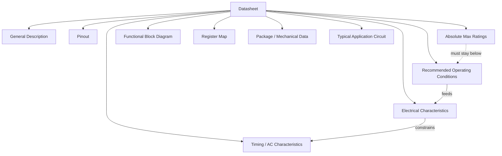
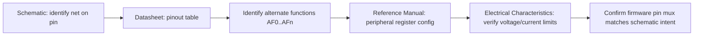

## Reading Datasheets and Schematics

### Overview

Datasheets and schematics are the primary technical references an embedded engineer uses to select components, design circuits, debug hardware, and write low-level firmware that talks to real silicon. A datasheet describes the electrical, mechanical, and functional behavior of a single component. A schematic shows how multiple components are wired together into a working circuit. Fluency in reading both is a prerequisite for nearly every other embedded hardware skill.

### Why This Skill Matters

- **Key Points**
  - Datasheets are the authoritative source for register maps, timing, and electrical limits — more reliable than vendor sample code or forum posts.
  - Schematics reveal how a microcontroller's pins are actually connected on a specific board, which determines what your firmware can and cannot do.
  - Misreading a datasheet parameter (e.g., confusing absolute maximum ratings with recommended operating conditions) is a common cause of hardware damage or field failures.
  - Schematic literacy lets you trace a signal from a connector, through protection circuitry, into a microcontroller pin — essential for debugging "it doesn't work" problems.

### Anatomy of a Datasheet

Most datasheets from major manufacturers (STMicroelectronics, Texas Instruments, Microchip, NXP, Analog Devices) follow a broadly similar structure, though section order and naming vary by vendor.

#### 1. General Description / Features

A one-page summary of what the part is, its core specs, and typical applications. Useful for quickly determining if a part fits your needs before diving deeper.

#### 2. Ordering Information / Part Numbering Scheme

Decodes the part number into package type, temperature grade, memory size, and revision. Critical when sourcing replacements or second sources.

**Example**

For an STM32F103C**8**T6:
- `STM32` = family
- `F1` = performance line (mainstream)
- `03` = subfamily
- `C` = pin count category (48 pins)
- `8` = Flash size code (64 KB)
- `T` = package (LQFP)
- `6` = temperature range (−40°C to +85°C)

#### 3. Pin Configuration and Pinout Diagram

Maps physical pin numbers to signal names, including alternate functions (a single pin might serve as GPIO, a UART TX line, or a timer output depending on configuration).

#### 4. Absolute Maximum Ratings

The hard limits beyond which the device may be permanently damaged, even briefly. These are **not** operating conditions.

- [Unverified] Exceeding an absolute maximum rating for even a few nanoseconds can cause latch-up or immediate failure on some processes — this depends on the specific silicon and is not guaranteed to be documented precisely by every vendor.
- Always design with margin below these limits; they are not targets.

#### 5. Recommended Operating Conditions

The range within which the part is guaranteed to function as specified (e.g., supply voltage 1.65 V–3.6 V, operating temperature −40°C to 85°C). Design should target this range, not the absolute maximums.

#### 6. Electrical Characteristics

Detailed tables of parameters such as:
- Input/output voltage thresholds ($V_{IH}$, $V_{IL}$, $V_{OH}$, $V_{OL}$)
- Supply current at various clock speeds and modes (run, sleep, standby)
- Pull-up/pull-down resistance values
- ADC accuracy, DNL/INL

Each parameter usually has **Min**, **Typ**, and **Max** columns. Firmware and hardware designs should generally be built around worst-case (Min/Max) values, not Typ, since Typ is not guaranteed across all units or temperatures.

#### 7. Timing Diagrams and AC Characteristics

Show setup/hold times, clock-to-output delays, and communication protocol timing (SPI clock periods, I2C rise/fall times). These are essential when interfacing peripherals at high speed or verifying signal integrity.

$$t_{setup} + t_{hold} \leq T_{clock}$$

Where $T_{clock}$ is the period of the sampling clock — a widely used timing-margin relationship for synchronous digital interfaces.

#### 8. Functional Block Diagram

A high-level internal architecture view showing major subsystems (CPU core, memory, peripherals, buses) and how they interconnect internally.

#### 9. Register Maps / Memory Maps

For microcontrollers and complex peripherals, this section (often a separate "Reference Manual" rather than the datasheet itself) lists every control and status register, bit fields, reset values, and access permissions (read/write, read-only, write-1-to-clear).

#### 10. Package and Mechanical Data

Physical dimensions, pin pitch, thermal resistance ($\theta_{JA}$, $\theta_{JC}$), and recommended PCB land patterns — needed for PCB footprint design and thermal analysis.

#### 11. Application Circuits / Typical Application

Reference designs showing recommended decoupling capacitors, crystal loading capacitors, and other supporting components — a good starting point, though not always optimal for every use case.

Below is a simplified map of how these sections relate:

### Key Datasheet Parameters Explained

#### Voltage Thresholds

- $V_{IH}$ (Input High Voltage): minimum voltage reliably read as logic 1.
- $V_{IL}$ (Input Low Voltage): maximum voltage reliably read as logic 0.
- $V_{OH}$ / $V_{OL}$: guaranteed output voltage levels under a specified load current.

A voltage between $V_{IL}$ and $V_{IH}$ is undefined and should never be relied upon in a design.

#### Current Ratings

- $I_{OL}$ / $I_{OH}$: maximum current a pin can sink/source while maintaining specified output voltage levels.
- Total package current limits (sum across all pins) are often lower than the per-pin maximum multiplied by pin count — a common oversight.

#### Timing Parameters

- $t_{su}$ (setup time), $t_h$ (hold time): required for reliable latching of data by a clock edge.
- $t_r$ / $t_f$ (rise/fall time): affects maximum usable bus frequency, especially on I2C and older logic families.

#### Thermal Parameters

$$T_J = T_A + (P_D \times \theta_{JA})$$

Where $T_J$ is junction temperature, $T_A$ is ambient temperature, $P_D$ is power dissipated, and $\theta_{JA}$ is junction-to-ambient thermal resistance. Exceeding maximum $T_J$ risks damage or triggers thermal shutdown on parts that have it.

### Anatomy of a Schematic

#### 1. Title Block

Contains document title, revision number, date, author, and sheet number — critical for confirming you're looking at the correct, current version of a design.

#### 2. Component Symbols

Standardized graphical representations (resistor, capacitor, IC) with a **reference designator** (e.g., R1, C4, U2) and often a value or part number label.

#### 3. Nets and Wires

Lines connecting pins represent electrical nets. A **net name** (e.g., `SPI1_MOSI`, `VDD_3V3`) lets the same signal be referenced across multiple sheets without drawing a continuous wire.

#### 4. Power and Ground Symbols

Triangles, arrows, or ground symbols denote supply rails and ground rather than drawing every wire back to a source, keeping schematics readable.

#### 5. Hierarchical Blocks / Sheet References

Complex designs are split across multiple sheets, with block symbols representing sub-circuits (e.g., "Power Supply," "USB Interface," "MCU Core") that connect via labeled ports.

#### 6. Net Classes / Bus Notation

Groups of related signals (e.g., an 8-bit data bus `D[7:0]`) are drawn as a single thick line with a bus name, expanding into individual wires at each end.

**Example** — A minimal microcontroller reset circuit read left to right: a pull-up resistor from $V_{DD}$ to the `NRST` pin, a decoupling capacitor from `NRST` to ground, and a push-button switch also connecting `NRST` to ground, allowing manual reset while holding the pin high by default.

Below is a schematic-style illustration of a basic MCU decoupling and reset network:

<svg xmlns="http://www.w3.org/2000/svg" viewBox="0 0 640 300" font-family="monospace" font-size="13">
  <text x="220" y="24" font-size="15" font-weight="bold">MCU Reset &amp; Decoupling Circuit (svg_diagram)</text>

  
  <line x1="60" y1="60" x2="580" y2="60" stroke="black" stroke-width="2" />
  <text x="20" y="64">VDD 3.3V</text>

  
  <line x1="150" y1="60" x2="150" y2="90" stroke="black" stroke-width="2" />
  <rect x="138" y="90" width="24" height="40" fill="none" stroke="black" stroke-width="2" />
  <text x="170" y="115">R1 10k</text>
  <line x1="150" y1="130" x2="150" y2="160" stroke="black" stroke-width="2" />

  
  <line x1="150" y1="160" x2="380" y2="160" stroke="black" stroke-width="2" />
  <text x="380" y="155">NRST</text>

  
  <line x1="250" y1="160" x2="250" y2="190" stroke="black" stroke-width="2" />
  <line x1="235" y1="190" x2="265" y2="190" stroke="black" stroke-width="2" />
  <line x1="235" y1="198" x2="265" y2="198" stroke="black" stroke-width="2" />
  <line x1="250" y1="198" x2="250" y2="230" stroke="black" stroke-width="2" />
  <text x="270" y="200">C1 100nF</text>

  
  <line x1="150" y1="160" x2="150" y2="190" stroke="black" stroke-width="2" />
  <rect x="130" y="190" width="40" height="20" fill="none" stroke="black" stroke-width="2" />
  <text x="175" y="205">SW1</text>
  <line x1="150" y1="210" x2="150" y2="230" stroke="black" stroke-width="2" />

  
  <line x1="60" y1="230" x2="580" y2="230" stroke="black" stroke-width="2" />
  <polygon points="145,240 155,240 150,250" fill="black" />
  <text x="20" y="234">GND</text>

  
  <rect x="420" y="120" width="120" height="100" fill="none" stroke="black" stroke-width="2" />
  <text x="440" y="145">MCU</text>
  <line x1="380" y1="160" x2="420" y2="160" stroke="black" stroke-width="2" />
  <text x="425" y="165" font-size="11">NRST</text>

  
  <line x1="480" y1="60" x2="480" y2="120" stroke="black" stroke-width="2" />
  <text x="486" y="90" font-size="11">VDD</text>

  
  <line x1="500" y1="220" x2="500" y2="230" stroke="black" stroke-width="2" />
</svg>

### Common Schematic Symbols Reference

| Symbol | Meaning |
|---|---|
| Zigzag or rectangle | Resistor |
| Two parallel lines | Capacitor (non-polarized) |
| Parallel lines, one curved | Capacitor (polarized/electrolytic) |
| Triangle pointing at a bar | Diode |
| Circle with arrows/coil | Inductor or transformer |
| Arrow into a rectangle | Amplifier / op-amp |
| Labeled rectangle with numbered pins | IC (generic) |
| Downward triangle or three horizontal lines | Ground |
| Arrow pointing up with a label | Power rail |

### Cross-Referencing Schematics with Datasheets

A core workflow skill: given a schematic net connected to an MCU pin, look up that pin in the datasheet's pinout table to determine its alternate functions, then cross-check the electrical characteristics table for that function's voltage/current limits.

**Example**

If a schematic shows `PA9` routed to a USB-to-serial header labeled `TX`, the datasheet pinout table might show `PA9` supports `USART1_TX` as an alternate function. The reference manual then shows which register bits enable that alternate function mode, and the electrical characteristics table confirms the pin's output voltage swing is compatible with the level-shifting circuitry on the header.

### Reading Multi-Sheet and Hierarchical Designs

Larger designs (multi-MCU boards, boards with FPGAs, multi-rail power systems) split schematics across sheets:

- **Top sheet**: block diagram showing sheet-to-sheet connections at a high level.
- **Power sheet**: regulators, protection circuitry, power sequencing.
- **MCU sheet**: processor, crystal, decoupling, reset, programming/debug header.
- **Peripheral sheets**: sensors, connectors, communication interfaces.
- **I/O sheet**: connectors, headers, test points.

Net names must match exactly across sheets for connections to be electrically valid in most EDA tools; a typo in a net label silently creates an unconnected net, a frequent source of "why doesn't this signal show up" debugging sessions.

### Practical Reading Strategy

1. Start with the block diagram (datasheet) or top sheet (schematic) to build a mental model before drilling into details.
2. Identify power and ground distribution first — most debugging starts here.
3. Trace signals of interest pin-by-pin, noting net names at each hop.
4. Cross-reference any unfamiliar component's reference designator against the bill of materials (BOM) for its exact part number, then pull that part's own datasheet.
5. Note any hand-written or printed annotations, jumper/DNP (Do Not Populate) markings, and revision notes — these often reflect real-world fixes not yet reflected in later documentation.

### Common Pitfalls

- Confusing **absolute maximum ratings** with **recommended operating conditions**, leading to designs that "work" but degrade reliability or lifespan.
- Ignoring **Min/Max** columns in favor of **Typ** values, resulting in designs that fail on some percentage of manufactured units or across temperature extremes.
- Missing that a pin's **alternate function** requires specific register configuration and is not automatically active.
- Overlooking **DNP** (Do Not Populate) or **NC** (No Connect) labels and assuming a component is present when it is not.
- Misreading multi-page schematics due to mismatched net names across sheets.
- [Inference] Engineers new to a particular vendor's datasheet conventions often underestimate how much section structure and terminology varies between manufacturers, which can lead to overlooking a critical parameter simply because it appears in an unexpected section.

### Tools Commonly Used Alongside Datasheets and Schematics

- PDF readers with strong search/bookmark support, since datasheets can run to hundreds of pages (especially reference manuals).
- EDA tools (KiCad, Altium, Eagle) for viewing and annotating schematics, including "net highlight" and "cross-probe to layout" features.
- Vendor-provided pin-mapping/configuration tools (e.g., STM32CubeMX) that visually cross-reference pinout and peripheral assignment, reducing manual datasheet lookups.
- Multimeters and oscilloscopes to verify that real-world measurements match datasheet-specified electrical and timing characteristics.

**Next Steps**
- Power Supply Design and Regulation for Embedded Systems
- Signal Integrity Basics: Rise Time, Ringing, and Termination
- Microcontroller Peripheral Configuration (GPIO, Timers, ADC)
- Communication Protocols: UART, SPI, and I2C Timing Deep Dive
- PCB Layout Fundamentals: Grounding, Decoupling, and Trace Routing
- Using EDA Tools: Schematic Capture and Net Management in KiCad
- Bill of Materials (BOM) Management and Component Sourcing
- Debugging Hardware with Multimeters and Oscilloscopes