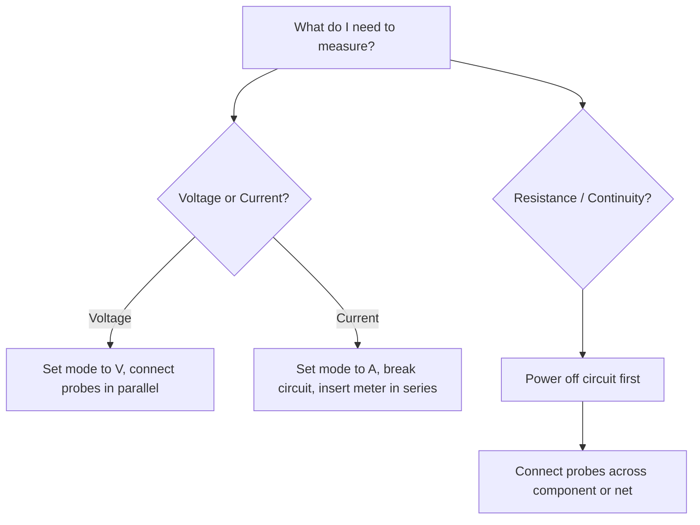
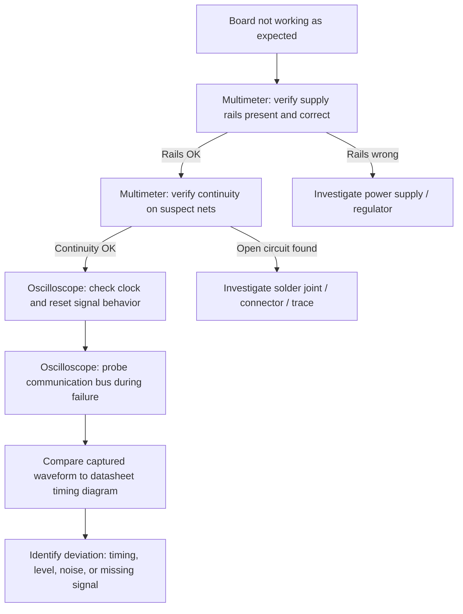

## Multimeter and Oscilloscope Usage

### Overview

Multimeters and oscilloscopes are the two primary instruments an embedded engineer uses to verify that a circuit's real-world electrical behavior matches what the schematic and datasheet predict. A multimeter measures static or slowly-varying quantities (voltage, current, resistance, continuity) as single numeric readings. An oscilloscope captures voltage as it varies over time, revealing waveform shape, timing, noise, and transient events that a multimeter cannot show.

### Why This Skill Matters

- **Key Points**
  - Most embedded hardware bugs (dead boards, communication failures, intermittent resets) are diagnosed faster with an oscilloscope or multimeter than by reading code alone.
  - A multimeter answers "is the voltage/current correct right now?" while an oscilloscope answers "what is this signal actually doing over time?"
  - Correct probing technique and instrument settings are essential — a poorly configured measurement can produce misleading readings or damage the instrument or circuit.
  - These tools bridge the gap between the abstract schematic/datasheet view and the physical behavior of an assembled board.

### Multimeter Fundamentals

#### Core Measurement Modes

- **DC Voltage (VDC)**: measures steady voltage between two points, such as a regulator output or supply rail.
- **AC Voltage (VAC)**: measures the RMS value of an alternating signal, relevant for mains-adjacent circuits or transformer secondaries.
- **DC/AC Current (A)**: measures current flowing through the meter itself, requiring the circuit to be broken and the meter inserted in series.
- **Resistance (Ω)**: measures resistance of an unpowered component or net; injects a small test current and reads the resulting voltage drop.
- **Continuity**: a special resistance mode that beeps below a threshold (typically a few tens of ohms), used to verify a connection exists or that two points are the same net.
- **Diode Test**: applies a small forward voltage and reports the forward voltage drop of a diode or diode-like junction (e.g., a protection diode inside an IC).
- **Capacitance**: measures capacitor value, useful for verifying an unmarked or suspect capacitor.

#### Multimeter Specifications That Matter

- **Resolution / Digits** (e.g., "6½ digit"): how finely the meter can display a value, not the same as accuracy.
- **Accuracy**: typically specified as ± (percentage of reading + a fixed number of counts), e.g., ±(0.5% + 2 counts).
- **Input Impedance**: on DC voltage ranges, typically 1 MΩ or 10 MΩ; a low input impedance can noticeably load down high-impedance circuit nodes and distort the reading.
- **Bandwidth**: the frequency range over which AC measurements remain accurate; most handheld meters roll off well below 100 kHz, making them unsuitable for verifying fast digital or switching signals.
- **CAT Rating** (CAT I–IV): safety rating describing the transient energy the meter and probes are designed to withstand at a given point in an electrical installation; relevant mainly when a design interfaces with mains power.

#### Correct Multimeter Usage

1. **Select the correct mode and range** before connecting probes; on non-auto-ranging meters, an incorrect range can produce a saturated or zero reading that looks plausible but is wrong.
2. **Move the red probe to the correct jack** — many meters have a separate jack for current measurement (often fused), and leaving the probe there while measuring voltage is a common cause of a blown fuse or, in rare cases, a short circuit.
3. **Measure voltage in parallel**: probes placed across the two points of interest, circuit remains intact.
4. **Measure current in series**: the circuit must be opened and the meter inserted into the current path.
5. **Measure resistance only on unpowered circuits**: residual voltage or an active source in the circuit will produce an inaccurate or unstable reading, and in some cases can damage the meter.
6. **Check probe placement relative to ground reference** when measuring low-level signals near noisy digital circuitry.

**Example**

To verify a 3.3 V regulator is producing correct output: set the meter to DC voltage, place the black probe on ground, place the red probe on the regulator's output pin or a nearby test point, and read the display. A reading of 3.28 V would typically be considered within normal tolerance for most 3.3 V regulators, whereas 0 V or a value far from 3.3 V indicates a fault upstream or downstream of the regulator.

### Common Multimeter Pitfalls

- Leaving the meter in current mode (probe in the current jack) and then probing across a voltage source, which can blow the internal fuse or, in poorly protected meters, create a short circuit.
- Measuring resistance on a powered circuit, producing meaningless or unstable readings.
- Assuming a "0 Ω" continuity beep confirms a good connection under load — continuity mode uses a very small test current and does not verify a connection can handle real operating current.
- Using an underrated meter (wrong CAT rating) on higher-energy circuits, which is a safety hazard.
- Ignoring test lead resistance in low-resistance measurements (a few tenths of an ohm from leads can matter when measuring very low-value resistors or shunts).

### Oscilloscope Fundamentals

#### Core Concepts

- **Vertical (Volts/Div)**: sets how many volts each vertical grid division represents, controlling the amplitude scale of the displayed waveform.
- **Horizontal (Time/Div)**: sets how much time each horizontal grid division represents, controlling the time scale.
- **Trigger**: the condition (e.g., rising edge crossing a set voltage) that tells the scope when to start displaying a waveform, essential for producing a stable, readable trace of a repetitive or one-shot signal.
- **Bandwidth**: the highest frequency the scope can faithfully display; as a rough guideline, a scope's bandwidth should be several times higher than the highest frequency component of the signal being measured to avoid amplitude and edge-rate errors.
- **Sample Rate**: for digital scopes, how many samples per second the ADC captures; must be sufficiently higher than the signal's bandwidth to avoid aliasing.
- **Memory Depth**: how many samples the scope can store per acquisition, which determines how long a capture window can be maintained at a given sample rate.

$$f_{sample} \geq 2 \times f_{signal}$$

This is the Nyquist criterion, a lower theoretical bound; in practice, oscilloscope manufacturers recommend sample rates several times higher than this minimum for accurate waveform reconstruction rather than just spectral presence.

#### Probe Types

- **Passive 10x Probe**: the most common general-purpose probe; attenuates the signal by 10x, which increases input impedance and reduces circuit loading compared to a 1x setting.
- **Passive 1x Probe**: lower bandwidth and higher circuit loading than 10x, generally reserved for low-frequency or low-amplitude signals where the full-scale sensitivity is needed.
- **Active Probe**: contains an amplifier near the probe tip, offering very high bandwidth and very low input capacitance, at higher cost and typically requiring careful handling.
- **Differential Probe**: measures the voltage difference between two floating points without referencing instrument ground, used for signals not referenced to the scope's ground (e.g., across a shunt resistor in a high-side current measurement).
- **Current Probe**: clamps around a conductor and measures current via the magnetic field it produces, avoiding the need to break the circuit.

#### Probe Compensation

Passive 10x probes must be compensated (adjusted via a small trimmer, typically matched to the scope's built-in calibration square wave output) so that the probe's capacitance is matched to the scope's input capacitance.

- Under-compensation produces a rounded, overshooting square wave edge.
- Over-compensation produces a square wave with excessive overshoot and ringing.
- Correct compensation produces a flat-topped square wave with a clean edge.

<svg xmlns="http://www.w3.org/2000/svg" viewBox="0 0 640 320" font-family="monospace" font-size="12">
  <text x="140" y="24" font-size="15" font-weight="bold">Probe Compensation Waveforms (svg_diagram)</text>

  
  <text x="20" y="60">Under-compensated</text>
  <polyline points="20,90 60,90 60,70 90,75 120,78 150,80 180,80 180,110 210,105 240,102 270,100 300,100" fill="none" stroke="black" stroke-width="2" />

  
  <text x="20" y="160">Correctly compensated</text>
  <polyline points="20,190 60,190 60,170 300,170 300,190 340,190" fill="none" stroke="black" stroke-width="2" />
  <polyline points="20,190 60,190 60,170 180,170 180,190 300,190" fill="none" stroke="black" stroke-width="2" />

  
  <text x="20" y="260">Over-compensated</text>
  <polyline points="20,290 60,290 60,255 75,265 90,260 105,263 120,262 150,262 180,262 180,292 195,282 210,287 225,285 240,286 270,286 300,286" fill="none" stroke="black" stroke-width="2" />
</svg>

#### Triggering Modes

- **Edge Trigger**: fires on a rising or falling edge crossing a threshold voltage; the most commonly used mode.
- **Pulse Width Trigger**: fires when a pulse is shorter or longer than a specified duration, useful for catching glitches.
- **Slope/Runt Trigger**: catches pulses that fail to reach a full logic level, useful for diagnosing marginal signal integrity.
- **Serial Protocol Trigger**: many modern scopes can trigger on and decode specific I2C, SPI, UART, or CAN frame conditions (e.g., a specific I2C address byte).
- **Single Sequence**: captures exactly one trigger event, useful for one-shot or rare events like a reset glitch.

**Example**

To debug why an I2C bus is not communicating: connect one scope channel to SDA and another to SCL, set both channels to roughly 1–2 V/div (for a 3.3 V bus), set time/div to capture a few clock cycles, and use an edge trigger on SCL's falling edge. A properly functioning bus shows SDA transitioning only while SCL is low, with both lines resting high at idle due to pull-up resistors; a bus stuck low on either line, or SDA changing while SCL is high (other than during start/stop conditions), indicates a fault.

### Interpreting Common Waveform Issues

| Observation | Likely Cause |
|---|---|
| Signal rests at 0 V, never toggles | Broken connection, dead driver, or firmware not outputting |
| Signal rests high, occasional dip | Bus contention, weak driver, missing/incorrect pull-up or pull-down |
| Rounded edges on a digital signal | Excessive capacitive loading, missing termination, or long trace/wire |
| Ringing/overshoot on edges | Impedance mismatch, poor grounding, uncompensated probe, or fast edge rate without termination |
| Periodic noise riding on a DC rail | Switching regulator ripple, inadequate decoupling |
| Signal amplitude lower than expected | Probe left in 1x when scope is set for 10x (or vice versa), or excessive loading |
| Jittery or unstable trigger | Trigger level set too close to noise floor, or genuinely unstable signal |

- [Inference] When a signal's edges appear unexpectedly slow or rounded, the root cause is frequently a probe grounding issue (a long ground lead adding inductance) rather than the circuit itself, though this should be confirmed by shortening the ground connection and re-measuring rather than assumed outright.

### Grounding and Probing Best Practices

- Use the shortest possible ground lead on the probe; a long ground wire (like the standard alligator-clip lead many probes ship with) adds inductance that distorts fast edges, an artifact frequently mistaken for a genuine circuit problem.
- Many probes support a short "ground spring" accessory specifically to minimize this inductance for high-speed measurements.
- Avoid probing directly on fine-pitch IC pins without a stable mechanical connection; a slipped probe tip can bridge adjacent pins and cause a short.
- When multiple channels are used, remember that most bench oscilloscopes tie all channel grounds together internally (and to the instrument's mains earth), which prohibits directly measuring across two points that are not both referenced to the same ground — a differential probe or an isolated/battery-powered scope is required in that scenario.
- Isolate the device under test from mains-referenced equipment where relevant to avoid ground loops or unintended current paths.

### Working Together: A Combined Debugging Workflow

**Example**

A board fails to enumerate over USB. Multimeter check confirms the 3.3 V rail is present and within tolerance. Continuity check confirms the USB connector's D+/D− lines reach the MCU pins. An oscilloscope capture on D+/D− during enumeration shows no differential signaling activity at all, narrowing the fault to either firmware not initializing the USB peripheral or a clock configuration issue feeding the USB block — a conclusion reached without needing to inspect source code first.

### Instrument Selection Considerations

- **Budget/Entry-Level Multimeters**: adequate for voltage, resistance, and continuity checks in most digital embedded work; often lack the bandwidth or accuracy for precision analog work.
- **Bench Multimeters**: higher accuracy, more digits, often include data logging — useful for calibration or precision measurement tasks.
- **Entry-Level Digital Oscilloscopes** (tens of MHz bandwidth): sufficient for basic digital logic, UART/I2C/SPI at moderate speeds.
- **Mid-Range Oscilloscopes** (100s of MHz to low GHz): needed for high-speed digital buses, fast switching power supplies, or detailed signal integrity work.
- [Speculation] For most general embedded firmware and hardware bring-up work outside of RF or high-speed serial design, a mid-bandwidth scope with basic serial protocol decode is likely to cover the large majority of day-to-day debugging needs, though highly specialized projects may require substantially more capable instruments.

### Common Pitfalls Across Both Instruments

- Trusting a measurement without first confirming probe/lead integrity (a broken probe lead can produce a plausible-looking but wrong reading).
- Not accounting for probe loading effects on high-impedance or sensitive analog nodes.
- Forgetting that ground clips on multiple probes are internally connected, risking a short circuit when probing different reference points on live circuitry.
- Misinterpreting AC-coupled scope input (which removes DC offset) as showing the "actual" signal when DC coupling was needed to see offset or absolute level.
- Overlooking probe attenuation setting mismatches between the physical probe switch and the scope channel's configured attenuation, causing amplitude readings to be off by 10x.

**Next Steps**
- Power Supply Design and Regulation for Embedded Systems
- Signal Integrity Basics: Rise Time, Ringing, and Termination
- Debugging Communication Protocols with Logic Analyzers
- PCB Layout Fundamentals: Grounding, Decoupling, and Trace Routing
- Using Serial Protocol Decode Features on Modern Oscilloscopes
- Power Rail Noise and Ripple Analysis Techniques
- Bench Equipment Safety and CAT Ratings