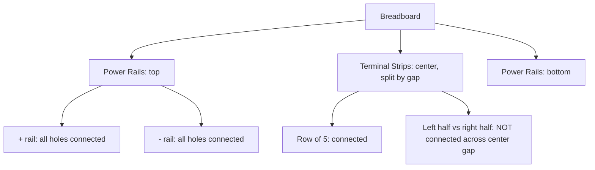
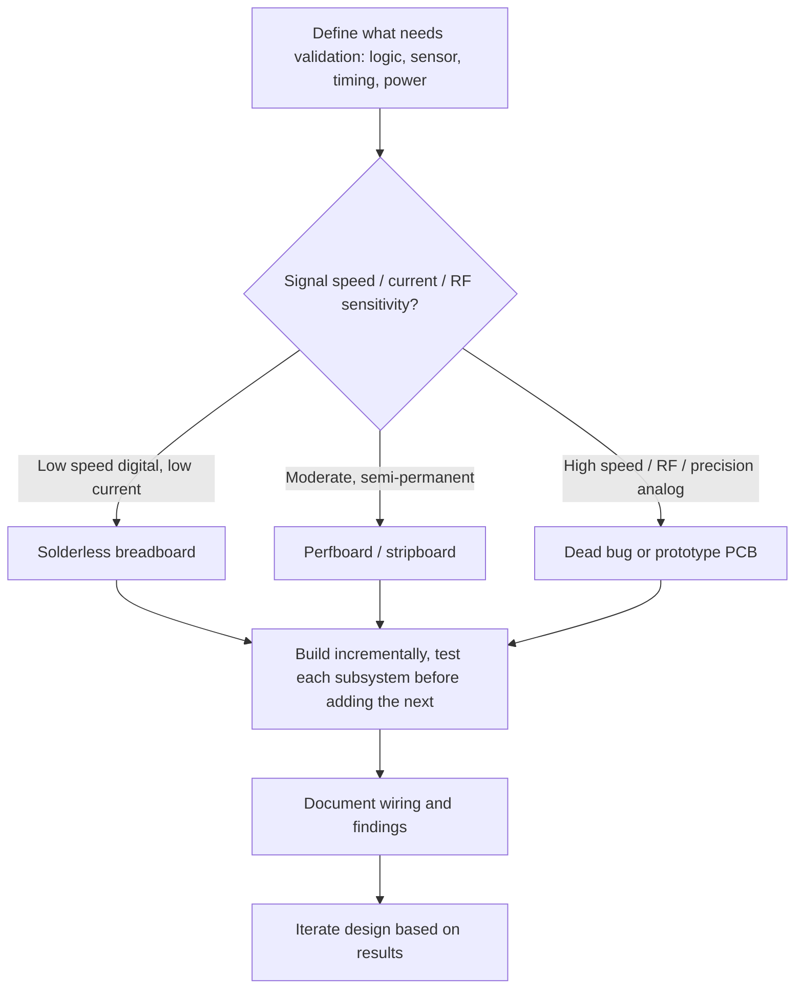

## Breadboarding and Prototyping Practices

### Overview

Prototyping is the process of building a physical, testable version of a circuit before committing to a final PCB design. Breadboarding — using a solderless breadboard — is the fastest and most common way to do this for embedded projects, though it is one of several prototyping methods, each with different tradeoffs in speed, signal integrity, and fidelity to the final product.

### Why This Skill Matters

- **Key Points**
  - Prototyping catches design errors (wrong component values, incorrect pinouts, logic mistakes) before they are committed to an expensive, slow-to-iterate PCB.
  - Breadboards are fast to modify but introduce parasitic capacitance, inductance, and contact resistance that can cause problems invisible on a final PCB.
  - Choosing the right prototyping method (breadboard, perfboard, dead bug, PCB prototype) depends on the signal speeds, power levels, and mechanical requirements involved.
  - Good prototyping discipline (labeling, documentation, incremental testing) prevents wasted time chasing self-inflicted wiring errors.

### Solderless Breadboards

#### Construction and Internal Connectivity

A standard breadboard consists of rows of metal spring clips hidden beneath the plastic body, grouped into two zones:

- **Terminal strips**: the central area, where each row of 5 holes (on a standard breadboard) is internally connected, typically split into two halves by a center gap that separates them electrically.
- **Power rails**: strips running along the top and bottom edges, usually two per side (commonly marked red for positive and blue/black for negative), internally connected along their length but not connected to the terminal strips.

#### Basic Wiring Conventions

- Place ICs straddling the center gap so each pin's row is electrically isolated from the pins on the opposite side.
- Run dedicated jumper wires from the power rails to each IC's power and ground pins rather than relying on a single shared connection.
- Use consistent wire colors (e.g., red for VCC, black/blue for ground) to reduce wiring errors and speed up debugging.
- Keep wire lengths reasonably short and dressed to avoid an unreadable tangle that hides mistakes.

**Example**

Wiring an MCU module with a pushbutton and LED: the MCU module straddles the center gap; a jumper connects the top power rail to the module's VCC pin; a second jumper connects the bottom rail to GND; a pushbutton is placed with one leg on a free row connected via jumper to a GPIO pin, and the other leg connected to GND through a pull-down resistor; an LED with a current-limiting resistor connects from another GPIO pin to the ground rail.

#### Limitations of Solderless Breadboards

- **Parasitic capacitance and inductance**: the spring clips and adjacent rows introduce enough parasitic reactance to distort signals above roughly a few MHz, making breadboards unsuitable for most RF, high-speed digital, or fast-switching power circuits.
- **Contact resistance and reliability**: repeated insertion/removal wears the spring contacts, and thin or bent component leads can make unreliable contact, causing intermittent faults.
- **Current handling**: the thin spring contacts are typically rated for under an amp per contact; higher-current circuits risk overheating the contacts or rail wiring.
- **Poor ground return paths**: the long, thin rail conductors and lack of a solid ground plane make high-speed digital or noise-sensitive analog circuits behave differently than they will on a PCB with proper ground planes.
- [Unverified] Exact parasitic values (capacitance and inductance per contact/row) vary meaningfully between breadboard manufacturers and are not typically documented, so the "few MHz" usability ceiling is a practical rule of thumb rather than a specified limit.

### Alternative Prototyping Methods

#### Perfboard / Stripboard

A rigid board with a grid of pre-drilled holes, either bare copper pads (perfboard, requiring point-to-point soldered wiring) or copper strips connecting rows/columns (stripboard/veroboard, where strips must sometimes be cut to break unwanted connections).

- Advantages: solid, permanent connections; much better for slightly higher currents and slightly higher frequencies than a solderless breadboard.
- Disadvantages: slower to build and modify than a breadboard; mistakes require desoldering.

#### Dead Bug / Ugly Construction

Components (often surface-mount, glued dead-bug-style with leads bent upward) are soldered directly to each other or to a ground-plane scrap of copper-clad board, without any predefined hole grid.

- Advantages: can achieve significantly better high-frequency performance than breadboard or perfboard due to short lead lengths and, when built on copper-clad board, a solid ground reference.
- Disadvantages: physically fragile, difficult to modify, not practical for complex or large circuits.

#### Wire-Wrap

Uses specialized square-post headers and a wire-wrap tool to tightly coil thin wire around posts, creating a gas-tight, reliable connection without solder.

- Advantages: reliable for moderate-density digital prototyping; easier to rework than soldered perfboard.
- Disadvantages: largely superseded by other methods in most modern embedded work; requires specific tools and wire-wrap-compatible sockets.

#### Prototype / Proto PCB

A custom PCB, ordered from a fabrication house, that mirrors the intended final design closely (or is a simplified early revision of it).

- Advantages: closest electrical behavior to the final product; validates the actual PCB layout, footprints, and stackup.
- Disadvantages: slower turnaround (days to weeks depending on fabrication service) and higher cost per iteration than breadboard/perfboard.

#### Modular Development Boards

Off-the-shelf MCU or sensor breakout boards (e.g., Nucleo, Discovery, Arduino-style boards, module breakouts) used together, often on a breadboard, to validate firmware and sensor behavior before finalizing custom hardware.

- Advantages: fast bring-up, known-good reference circuitry (crystal, regulator, decoupling already handled).
- Disadvantages: may not reflect the exact part, footprint, or power budget of the final custom design.

### Comparing Prototyping Methods

| Method | Speed to Build | Rework Ease | Max Practical Signal Speed | Typical Use Case |
|---|---|---|---|---|
| Solderless breadboard | Very fast | Very easy | Low (roughly sub-MHz to low MHz) | Initial logic/sensor bring-up |
| Perfboard/stripboard | Moderate | Moderate | Low–moderate | Semi-permanent prototypes, small production runs |
| Dead bug / ugly construction | Slow | Difficult | Moderate–high | RF or high-speed analog experiments |
| Wire-wrap | Moderate | Moderate | Low–moderate | Dense digital prototyping (largely legacy) |
| Prototype PCB | Slow (fab turnaround) | Difficult | High | Pre-production validation |
| Dev board + breadboard | Very fast | Very easy | Depends on dev board design | Firmware and sensor bring-up |

### Prototyping Workflow

### Incremental Build and Test Discipline

- Build and verify one subsystem at a time (e.g., power supply first, then MCU core, then one peripheral at a time) rather than wiring an entire circuit before applying power.
- Verify supply voltages with a multimeter before connecting sensitive ICs.
- Add components in small groups and retest after each addition, so a new fault can be isolated to the most recently added wiring.
- Keep a running log or annotated schematic marking which sections have been verified working, especially on complex or long-running prototypes.

**Example**

When bringing up a new sensor board on a breadboard: first verify the power rail voltage with a multimeter, then add just the MCU and confirm it boots (e.g., blinking an LED or printing over UART), then add the sensor's power and ground connections and confirm current draw is reasonable, then finally wire the communication bus (I2C/SPI) and attempt a basic register read — rather than wiring the entire sensor interface at once and debugging a fully-assembled unknown state.

### Documentation and Labeling Practices

- Maintain a schematic (even a hand-drawn one) alongside the physical breadboard build; physical wiring is easy to forget or misremember after a break.
- Label wires or use consistent color conventions, especially on boards with many similar-looking connections.
- Photograph working prototypes before disassembly, preserving a reference for rebuilding or for documenting a design review.
- Note component values directly on a schematic or in a parts list rather than relying on memory of "the resistor I grabbed."

### Common Pitfalls

- Using a breadboard for high-speed signals (fast SPI, USB, high-frequency clocks) and misdiagnosing resulting signal integrity issues as firmware or component defects.
- Overloading a single set of power rail contacts with high current draw, causing voltage drop or localized heating.
- Leaving unused IC inputs floating (particularly CMOS logic), which can cause unpredictable behavior or excess power consumption.
- Failing to isolate the two halves of a breadboard's center gap correctly, unintentionally shorting two separate nets.
- Reusing old or worn breadboards/jumpers with degraded spring contacts, introducing intermittent faults that resemble software bugs.
- Skipping incremental testing and wiring an entire complex circuit before first power-up, making fault isolation far more time-consuming.
- [Inference] Many "mystery" bugs reported by engineers new to embedded prototyping trace back to breadboard contact or wiring issues rather than firmware defects, since breadboard-induced faults often present as intermittent or timing-dependent symptoms that closely resemble software race conditions.

### Transitioning from Prototype to PCB

- Treat the breadboard/perfboard prototype as a functional reference, not a literal layout guide — PCB layout introduces its own considerations (trace length matching, ground planes, decoupling placement) not present in prototype wiring.
- Re-verify critical timing and signal integrity on the actual PCB rather than assuming breadboard-validated timing will hold, since parasitic effects differ substantially between the two.
- Carry forward the incremental bring-up discipline (power first, then core, then peripherals) when testing the new PCB, since a new physical implementation can introduce its own errors independent of the prototype's validated logic.

**Next Steps**
- PCB Layout Fundamentals: Grounding, Decoupling, and Trace Routing
- Power Supply Design and Regulation for Embedded Systems
- Signal Integrity Basics: Rise Time, Ringing, and Termination
- Multimeter and Oscilloscope Usage (debugging prototypes)
- Bill of Materials (BOM) Management and Component Sourcing
- Soldering Techniques for Through-Hole and Surface-Mount Components
- Design for Testability in Embedded Hardware