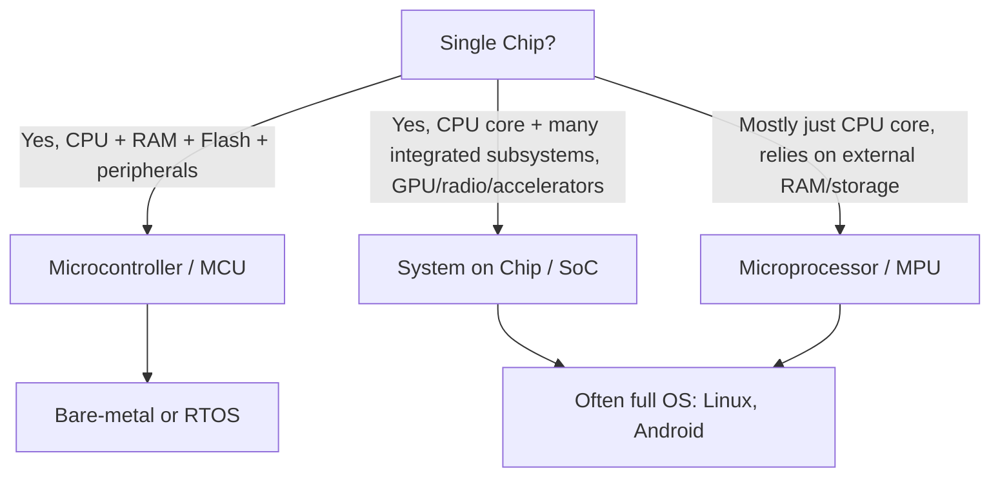
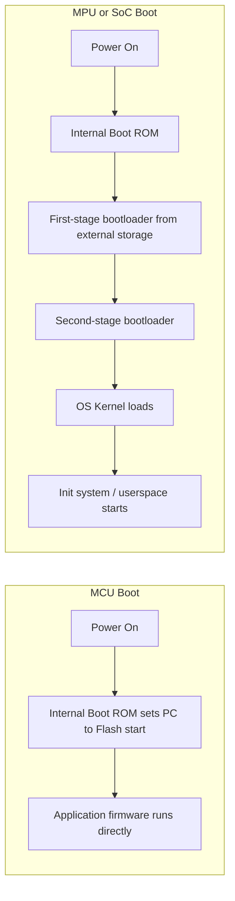
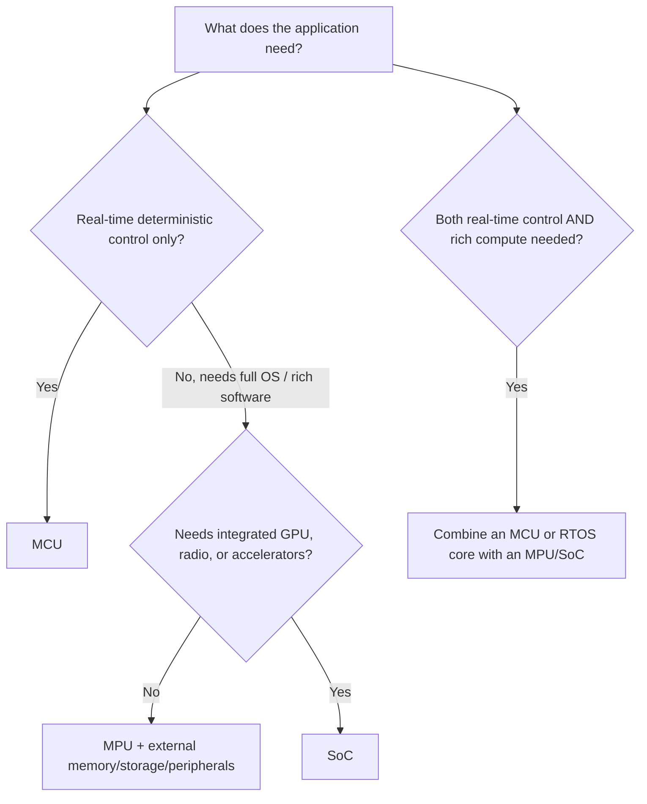

## Microcontroller vs Microprocessor vs SoC

### Overview

Microcontrollers (MCUs), microprocessors (MPUs), and Systems-on-Chip (SoCs) are three overlapping but distinct categories of integrated circuit used to build embedded systems. The distinctions matter because they drive fundamentally different hardware design decisions, software architectures, boot processes, and cost/power tradeoffs.

### Why This Distinction Matters

- **Key Points**
  - Choosing the wrong category for a project can result in unnecessary cost, power consumption, design complexity, or missing capability.
  - MCUs, MPUs, and SoCs require different supporting hardware (external memory, power sequencing, clocking) and different software stacks (bare-metal/RTOS vs full OS).
  - The terms are used inconsistently in casual conversation and marketing material, so understanding the underlying technical distinctions matters more than memorizing labels.
  - Many modern "SoC" devices blur the line further by combining MCU-like and MPU-like subsystems on a single die.

### Microcontrollers (MCUs)

#### Definition

A microcontroller integrates a CPU core, volatile memory (RAM), non-volatile program memory (Flash or similar), and a wide range of peripherals (timers, GPIO, ADC/DAC, communication interfaces) all on a single chip, designed to run with minimal or no external components.

#### Characteristics

- Typically runs firmware directly from on-chip Flash, often without an external bootloader chain of the complexity seen in MPUs.
- Usually executes bare-metal code or a lightweight Real-Time Operating System (RTOS) rather than a general-purpose OS.
- Clock speeds commonly range from a few MHz up to a few hundred MHz.
- On-chip RAM is typically measured in kilobytes to a few megabytes, and Flash similarly in kilobytes to low megabytes — far less than typical MPU/SoC main memory.
- Designed for deterministic, real-time control tasks: motor control, sensor sampling, protocol handling, simple user interfaces.
- Power consumption can scale down to microamps in low-power sleep modes, making MCUs common in battery-powered devices.

**Example**

An STM32F103 (ARM Cortex-M3 core, up to 72 MHz, up to 128 KB Flash, up to 20 KB RAM) integrates timers, ADC, SPI, I2C, USART, and USB peripherals on a single chip, and can run directly from its internal Flash with just a power supply, decoupling capacitors, and optionally a crystal — no external RAM or storage required for typical applications.

### Microprocessors (MPUs)

#### Definition

A microprocessor integrates primarily the CPU core (and often closely coupled cache and a memory controller) but relies on external chips for RAM, non-volatile storage, and many peripheral functions, rather than integrating them on-die.

#### Characteristics

- Requires external DRAM (commonly DDR-type memory) for working memory, since on-chip memory alone is generally insufficient for the workloads MPUs target.
- Boots via a more elaborate process, often involving a boot ROM, a bootloader stage (e.g., U-Boot), and then loading a full operating system kernel (commonly Linux) from external non-volatile storage such as eMMC or an SD card.
- Runs general-purpose operating systems capable of multitasking, virtual memory, and rich peripheral driver ecosystems.
- Clock speeds typically range from several hundred MHz to multiple GHz.
- Power consumption is generally much higher than a comparable MCU, both at full load and typically in idle/sleep states, though this varies significantly by design and process node.
- Common in applications needing significant computational power, networking stacks, graphical displays, or complex user interfaces.

**Example**

A classic microprocessor-based embedded design pairs a CPU chip (or an MPU-class SoC's processor subsystem) with a separate DDR memory chip, a separate eMMC or NAND flash chip for storage, and a separate Ethernet PHY chip, all connected via defined external buses — contrasted with an MCU, where most of this would already be integrated internally, albeit at smaller memory capacities.

### Systems-on-Chip (SoCs)

#### Definition

A System-on-Chip integrates multiple major subsystems — one or more CPU cores, and frequently additional processing elements (GPU, DSP, dedicated accelerators, radio/wireless modules) — onto a single die, blurring the line between "microprocessor" and "everything else a full system would need."

#### Characteristics

- May include a full MPU-class application processor alongside additional specialized cores (e.g., a real-time co-processor, a GPU, an AI/ML accelerator, or a wireless baseband).
- External DRAM is still typically required for the application processor, similar to a standalone MPU, though the SoC integrates many of the peripheral controllers (display, camera, USB, wireless) that would otherwise be separate chips.
- Common in smartphones, tablets, single-board computers (e.g., Raspberry Pi's SoC), and increasingly in higher-end embedded/IoT devices requiring wireless connectivity, graphics, or machine learning inference.
- May combine an MCU-like low-power domain with an MPU-like application domain on the same die (heterogeneous SoC), allowing power-hungry subsystems to be powered down while a low-power core continues monitoring sensors.

**Example**

A typical smartphone-class SoC integrates one or more general-purpose CPU clusters, a GPU, an image signal processor for camera input, a cellular modem or Wi-Fi/Bluetooth radio, and various hardware accelerators, all on one die — requiring external DRAM and storage, similar to a discrete MPU, but eliminating the need for many other separate peripheral chips a discrete-MPU design would require.

### Comparative Overview

| Aspect | Microcontroller (MCU) | Microprocessor (MPU) | System on Chip (SoC) |
| --- | --- | --- | --- |
| On-chip RAM/Flash | Yes, integrated | No (or minimal), external DRAM/storage required | Partial — often still needs external DRAM |
| Typical software | Bare-metal / RTOS | Full OS (e.g., Linux) | Full OS, sometimes plus RTOS on a co-processor |
| Boot complexity | Low (often runs directly from internal Flash) | High (boot ROM → bootloader → OS kernel) | High, similar to MPU |
| Clock speed range | MHz to a few hundred MHz | Hundreds of MHz to multiple GHz | Hundreds of MHz to multiple GHz |
| Typical power range | Sub-mW (sleep) to low watts | Watts | Watts, sometimes higher under load |
| Integration level | Very high (single chip solution) | Low (many external chips needed) | Very high (many subsystems integrated) |
| Common use cases | Sensor nodes, motor control, simple IoT devices | Higher-compute embedded Linux systems | Smartphones, SBCs, advanced IoT/edge AI devices |

### Boot Process Comparison

### Choosing Between MCU, MPU, and SoC

- **Choose an MCU when**: the task is primarily deterministic control/IO, power budget is tight, cost sensitivity is high, and full OS features (rich networking stacks, file systems, complex UI) are not required.
- **Choose an MPU when**: the application needs a full operating system, substantial compute power, or an existing rich software ecosystem (Linux drivers, libraries), and the added cost, power, and design complexity of external memory/storage is acceptable.
- **Choose an SoC when**: the application needs MPU-class compute plus additional integrated capability (graphics, wireless connectivity, hardware acceleration) without wanting to design and source each of those as separate discrete chips.
- Many real products combine categories: an SoC or MPU handling high-level application logic (UI, connectivity) paired with a separate MCU handling real-time, safety-critical, or always-on low-power tasks (motor control, sensor polling during sleep).

### The Blurring of These Categories

- Many modern "MCU" parts now include enough integrated peripherals (Wi-Fi/Bluetooth radios, crypto accelerators, even small graphics controllers) that they functionally resemble a small SoC, despite still being marketed and architected as microcontrollers.
- Many "SoC" application processors used in embedded Linux products include a dedicated low-power microcontroller-class co-processor on the same die specifically to handle always-on sensing or real-time tasks without waking the main application cores.
- [Inference] Because vendor marketing tends to use "SoC" as a general term for "highly integrated chip" rather than strictly for devices combining full MPU-class cores with additional major subsystems, the practical distinction between a "feature-rich MCU" and a "small SoC" is often a matter of degree rather than a sharp technical boundary, and engineers should evaluate a part's actual specifications rather than relying on its marketing category.

### Practical Hardware Design Implications

- **MCU designs** typically need only a power supply, decoupling capacitors, and possibly a crystal — dramatically simplifying PCB layout and bill of materials compared to MPU/SoC designs.
- **MPU/SoC designs** require careful attention to DDR memory routing (length matching, impedance control), power sequencing (many rails must power up/down in a specific order), and thermal management, since power dissipation is typically much higher.
- **Boot media selection** (eMMC, NAND, SD card, SPI NOR) for MPU/SoC designs affects boot time, reliability, and update strategy in ways that rarely apply to MCU designs booting from internal Flash.
- **Real-time guarantees** are generally easier to achieve on an MCU running bare-metal or RTOS code than on an MPU/SoC running a general-purpose OS, where scheduling jitter and interrupt latency are typically higher and less deterministic, unless a real-time-patched kernel or dedicated real-time co-processor is used.

### Common Pitfalls

- Assuming "SoC" always implies more capability than "MCU" — some ultra-low-power SoCs are functionally closer to enhanced MCUs than to smartphone-class application processors.
- Underestimating the power sequencing and DDR routing complexity when moving from MCU-based to MPU/SoC-based hardware design for the first time.
- Selecting an MPU/SoC for a project that only needed deterministic real-time control, resulting in unnecessary cost, power consumption, and software complexity (full OS maintenance, longer boot times).
- Selecting an MCU for a project that later needs full networking stacks, complex file systems, or a graphical UI, requiring a late and costly platform change.
- Overlooking that many real designs need both an MCU-class and an MPU/SoC-class component working together, rather than treating the choice as strictly either/or.

**Next Steps**

- ARM Cortex-M vs Cortex-A Architecture Differences
- RTOS Fundamentals and Task Scheduling
- Embedded Linux Boot Process: Boot ROM, U-Boot, and Kernel Loading
- Power Sequencing and Rail Design for Multi-Rail SoC Systems
- DDR Memory Interfacing and PCB Layout Considerations
- Choosing Between Bare-Metal, RTOS, and Embedded Linux for a Project
- Heterogeneous Multi-Core Architectures (Application Core + Real-Time Co-Processor)