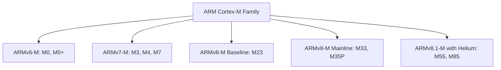
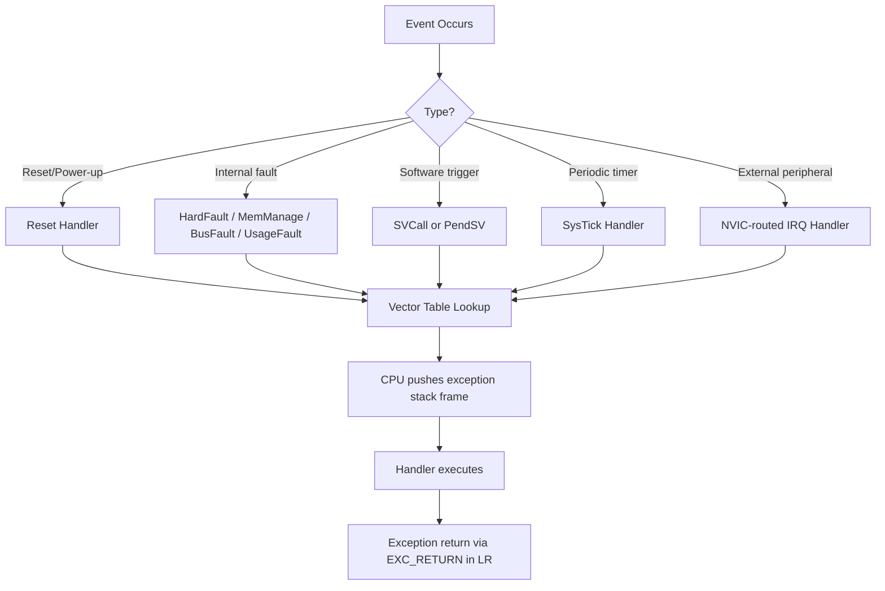
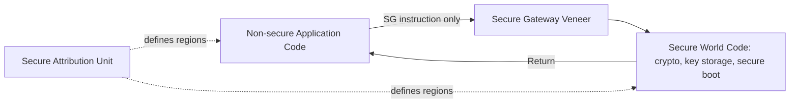
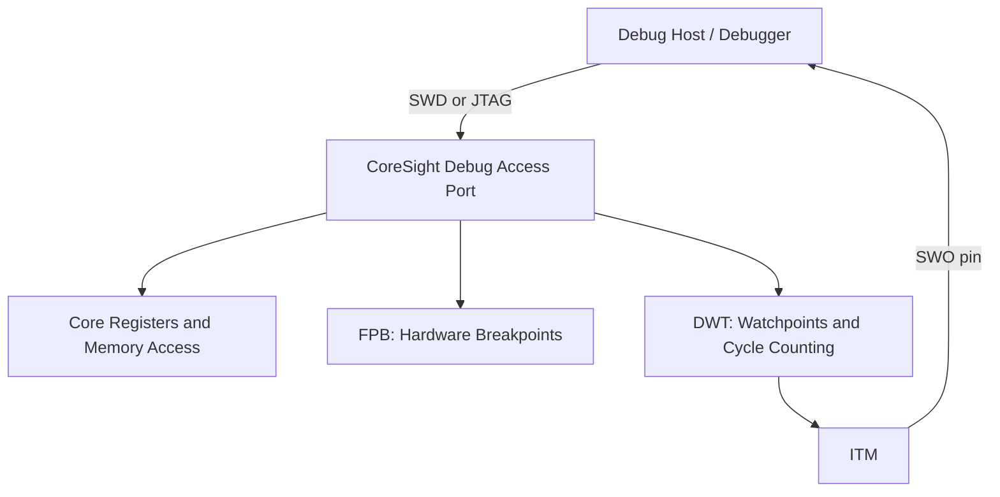

## Core Architectures: ARM Cortex-M Family

### Overview

The ARM Cortex-M family is a series of 32-bit RISC processor cores designed by ARM specifically for microcontroller and deeply embedded applications. It is the most widely used core architecture in modern embedded microcontrollers, licensed by dozens of silicon vendors (STMicroelectronics, NXP, Microchip, Texas Instruments, Nordic Semiconductor, and many others) and implemented with vendor-specific peripherals around a common processor core and instruction set.

### Why This Architecture Matters

- **Key Points**
  - Cortex-M cores share a common architectural foundation (instruction set, exception model, debug interface) across vendors, so skills learned on one Cortex-M part transfer substantially to others.
  - The family spans a wide range of performance and feature levels (M0 through M85 at present), letting designers pick a core matched to power, cost, and performance requirements.
  - Understanding the core's exception model, memory map, and register set is foundational for writing efficient firmware, bootloaders, and RTOS ports.
  - Cortex-M is distinct from Cortex-A (application processors, generally paired with an OS like Linux) and Cortex-R (real-time processors for high-reliability control applications).

### Family Overview

| Core | Typical Use Case | Notable Characteristics |
|---|---|---|
| Cortex-M0 / M0+ | Ultra-low-cost, ultra-low-power | Minimal instruction set (ARMv6-M), 2-stage (M0) or von Neumann single-cycle I/O (M0+) pipeline |
| Cortex-M3 | General-purpose mainstream MCU | ARMv7-M, 3-stage pipeline, hardware divide, bit-banding on some implementations |
| Cortex-M4 | General-purpose with DSP/math needs | Adds DSP extensions and optional single-precision FPU over M3 |
| Cortex-M7 | Higher-performance embedded | Superscalar, deeper pipeline, optional double-precision FPU, cache support |
| Cortex-M23 | Ultra-low-power with security | ARMv8-M Baseline, adds TrustZone-M security extensions |
| Cortex-M33 | Mainstream with security | ARMv8-M Mainline, TrustZone-M, DSP/FPU options |
| Cortex-M55 | ML/DSP-focused | ARMv8.1-M, adds Helium (M-Profile Vector Extension) for SIMD/ML workloads |
| Cortex-M85 | Highest-performance M-profile (as of current generations) | ARMv8.1-M, Helium, higher performance microarchitecture |

- [Unverified] Exact pipeline stage counts, cache configurations, and peak clock speeds vary by specific silicon vendor implementation, since ARM licenses the core design and vendors integrate it with their own process technology and memory systems.

### Architecture Versions

- **ARMv6-M**: used by Cortex-M0/M0+/M1; a reduced Thumb-only instruction subset targeting minimal gate count and power.
- **ARMv7-M**: used by Cortex-M3/M4/M7; adds a broader Thumb-2 instruction set, hardware integer divide, and (on M4/M7) DSP and floating-point extensions.
- **ARMv8-M**: used by Cortex-M23/M33/M55/M85; introduces TrustZone-M for hardware-enforced secure/non-secure separation and comes in Baseline (M0/M0+-like feature set) and Mainline (M3/M4/M7-like feature set) variants.

### Core Registers

Cortex-M cores expose a common register set to software:

- **R0–R12**: general-purpose registers.
- **R13 (SP)**: Stack Pointer — banked into Main Stack Pointer (MSP) and Process Stack Pointer (PSP), commonly used to separate handler-mode/kernel stack from thread-mode/task stack in an RTOS.
- **R14 (LR)**: Link Register, holds the return address for subroutine calls and a special EXC_RETURN value during exception handling.
- **R15 (PC)**: Program Counter.
- **xPSR**: Program Status Register (combining Application, Interrupt, and Execution status), reporting condition flags, current exception number, and Thumb state.
- **PRIMASK, FAULTMASK, BASEPRI**: special registers controlling interrupt masking, used for critical section management.
- **CONTROL**: selects which stack pointer (MSP/PSP) is active in Thread mode and, on cores with an FPU, tracks floating-point context state.

### Exception and Interrupt Model

Cortex-M processors use a unified exception model where both internal system exceptions and external interrupts (via the Nested Vectored Interrupt Controller, NVIC) are handled through the same mechanism, each with a configurable priority.

#### Key System Exceptions

- **Reset**: entry point after power-up or reset.
- **NMI (Non-Maskable Interrupt)**: highest-priority interrupt after Reset, cannot be disabled by software.
- **HardFault**: catch-all fault handler, often triggered when a more specific fault handler is disabled or a fault occurs during another fault's handling.
- **MemManage, BusFault, UsageFault**: (on cores that implement the Memory Protection Unit and configurable fault handling) more specific fault types for memory protection violations, bus errors, and instruction/data usage errors respectively.
- **SVCall (SVC)**: software-triggered exception, commonly used for RTOS system calls.
- **PendSV**: a lower-priority, software-triggered exception commonly used by RTOS kernels to perform context switches without blocking higher-priority interrupt handling.
- **SysTick**: a dedicated periodic timer exception commonly used as an RTOS or bare-metal time base.

#### NVIC (Nested Vectored Interrupt Controller)

- Supports a configurable number of external interrupt lines (varies by vendor implementation, often 32–240+).
- Each interrupt has a programmable priority level; higher-priority interrupts can preempt lower-priority ones (nesting).
- Tail-chaining and late-arrival optimizations reduce the overhead of handling back-to-back pending interrupts compared to naive interrupt architectures.

### Memory Map

Cortex-M defines a standardized 4 GB address space layout (regions are architecturally defined, though actual populated memory within each region is vendor- and part-specific):

| Address Range | Region | Typical Contents |
|---|---|---|
| 0x00000000–0x1FFFFFFF | Code | Flash memory, vector table (or remapped boot memory) |
| 0x20000000–0x3FFFFFFF | SRAM | On-chip RAM, includes optional bit-band alias region on some cores |
| 0x40000000–0x5FFFFFFF | Peripheral | Memory-mapped peripheral registers |
| 0x60000000–0x9FFFFFFF | External RAM | External memory-mapped RAM (where supported) |
| 0xA0000000–0xDFFFFFFF | External Device | External memory-mapped devices |
| 0xE0000000–0xFFFFFFFF | Private Peripheral Bus / System | NVIC, SysTick, debug components, vendor-specific system control |

**Example**

On many Cortex-M3/M4 implementations, addresses 0x20000000–0x200FFFFF alias into a bit-band region starting at 0x22000000, where each individual bit in the SRAM region maps to a full 32-bit word in the alias region — allowing atomic single-bit set/clear operations without a read-modify-write sequence, a feature used by some low-level driver code for flag manipulation, though this feature is not present on all Cortex-M variants (notably absent from many Cortex-M0/M0+ and newer ARMv8-M implementations).

### Pipeline and Performance Characteristics

- **Cortex-M0/M0+**: simple 2-stage (M0+ uses a single-cycle I/O interface and reduced pipeline overhead compared to M0's 3-stage design in most implementations), optimized for minimal area and power rather than raw throughput.
- **Cortex-M3**: 3-stage pipeline with branch speculation, hardware integer divide, delivering meaningfully higher performance-per-clock than M0/M0+.
- **Cortex-M4**: adds a single-precision floating-point unit (optional per implementation) and DSP instruction extensions (SIMD-like operations on packed data) for signal-processing-heavy workloads.
- **Cortex-M7**: superscalar (can issue more than one instruction per cycle in some cases), deeper pipeline, optional instruction/data caches and tightly-coupled memory (TCM) for deterministic low-latency access alongside cached slower memory.
- [Inference] Because clock speed alone does not determine throughput, comparing two Cortex-M parts purely by MHz rating without accounting for core generation (M0 vs M4 vs M7) and memory wait-state configuration is likely to produce a misleading performance comparison.

### TrustZone-M Security (ARMv8-M)

Cortex-M23/M33/M55/M85 cores support TrustZone-M, a hardware mechanism partitioning the system into Secure and Non-secure worlds at the architecture level, distinct from TrustZone on Cortex-A which uses a different (software monitor-based) mechanism.

- Memory and peripherals can be assigned to Secure or Non-secure regions via the Secure Attribution Unit (SAU) and an implementation-defined memory protection controller.
- Calls between worlds occur through defined Secure Gateway (SG) instructions, preventing arbitrary jumps into secure code.
- Used to isolate sensitive operations (cryptographic key storage, secure boot logic, firmware update validation) from the bulk of application code, reducing the attack surface exposed to a compromised non-secure application.

### Floating-Point and DSP Extensions

- **FPU (Floating-Point Unit)**: optional on M4/M7/M33/M55/M85; when present, typically single-precision only on M4/M33, with optional double-precision on M7 implementations.
- **DSP Extensions**: SIMD-style instructions operating on packed 8-bit/16-bit data within a 32-bit register, accelerating operations like filtering and basic signal processing without a dedicated DSP core.
- **Helium (MVE — M-Profile Vector Extension)**: introduced with Cortex-M55/M85, provides wider vector processing capability aimed at ML inference and more demanding DSP workloads directly on an M-profile core.

### Debug and Trace Infrastructure

- **CoreSight Debug Access Port (DAP)**: standard debug access mechanism, typically exposed via SWD (Serial Wire Debug, 2-pin) or JTAG.
- **Flash Patch and Breakpoint (FPB)**: hardware breakpoint unit allowing code breakpoints without modifying Flash contents.
- **Data Watchpoint and Trace (DWT)**: provides hardware watchpoints (break on data access) and cycle counting.
- **Instrumentation Trace Macrocell (ITM)** and **Serial Wire Output (SWO)**: enable lightweight printf-style debug output and event tracing without halting the core, useful for timing-sensitive debugging where a full breakpoint-based debug session would disturb real-time behavior.

### Practical Implications for Firmware Development

- The vector table layout (order of exception/interrupt entries) is defined by the architecture for system exceptions and extended by each vendor for device-specific interrupts, and must match exactly what the linker script and startup code expect.
- Stack pointer selection (MSP vs PSP) is central to most RTOS implementations, with the kernel typically running on MSP and each task running on its own PSP-based stack.
- Interrupt priority grouping (split between preempt priority and subpriority) must be configured consistently with whatever RTOS or bare-metal scheme is in use, since misconfigured priority grouping is a common source of subtle interrupt nesting bugs.
- Selecting a core variant should be driven by actual workload requirements (need for hardware floating point, DSP/vector extensions, security isolation) rather than defaulting to the most powerful or most familiar option, since cost and power scale with core capability.

### Common Pitfalls

- Assuming all Cortex-M cores share identical features (e.g., assuming bit-banding or an FPU is present on a core that does not implement it).
- Misconfiguring NVIC priority grouping, leading to unexpected interrupt preemption behavior or priority inversion.
- Overlooking that PendSV and SysTick are typically configured at the lowest interrupt priority in most RTOS designs, and inadvertently assigning a peripheral interrupt the same or lower priority in a way that disrupts context switching.
- Confusing ARMv8-M TrustZone-M with Cortex-A TrustZone; the two are architecturally different despite sharing a marketing name.
- Selecting a core generation based on clock speed alone rather than considering pipeline efficiency, cache/TCM presence, and instruction set extensions relevant to the workload.
- Neglecting to save/restore floating-point context correctly in RTOS task switching on FPU-equipped cores, which can corrupt floating-point state between tasks if not handled by the kernel port.

**Next Steps**
- Cortex-M Exception Handling and Interrupt Priority Configuration in Practice
- Writing and Understanding Startup Code and Vector Tables
- RTOS Context Switching Mechanics (PendSV, MSP/PSP)
- TrustZone-M Secure/Non-secure Partitioning in Practice
- Using SWD, SWO, and CoreSight for Low-Overhead Debugging
- Cortex-M vs Cortex-A vs Cortex-R: Choosing the Right ARM Profile
- Memory Protection Unit (MPU) Configuration for Fault Isolation