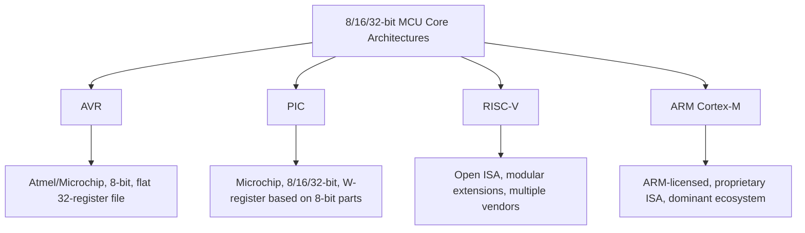
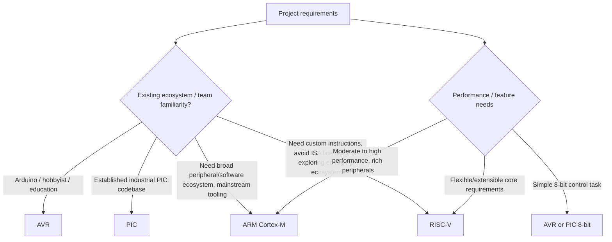

## Core Architectures: AVR, PIC, RISC-V

### Overview

AVR, PIC, and RISC-V represent three distinct approaches to microcontroller core architecture, alongside ARM Cortex-M. AVR and PIC are long-established, vendor-specific 8-bit (and in some PIC cases 16/32-bit) architectures widely used in simpler embedded designs, education, and hobbyist electronics. RISC-V is a newer, open-standard instruction set architecture (ISA) gaining rapid adoption across both simple microcontrollers and higher-performance embedded processors due to its royalty-free, extensible nature.

### Why These Architectures Matter

- **Key Points**
  - AVR and PIC remain heavily used in cost-sensitive, simple control applications and are foundational in embedded systems education (notably via Arduino for AVR).
  - RISC-V's open ISA model removes licensing fees and allows silicon vendors and even individual designers to implement or extend the architecture, a fundamentally different business and technical model than ARM or proprietary architectures.
  - Each architecture has a distinct register model, instruction set philosophy, and toolchain ecosystem that affects how firmware is written and optimized.
  - Understanding multiple architectures clarifies which design tradeoffs (code density, register count, pipeline complexity, ecosystem maturity) are fundamental versus incidental to any one vendor's implementation.

### AVR Architecture

#### Overview

AVR is an 8-bit RISC architecture originally developed by Atmel (now part of Microchip Technology), widely known through its use in Arduino boards (e.g., ATmega328P on the Arduino Uno).

#### Key Characteristics

- **Harvard architecture**: separate address spaces and buses for program memory (Flash) and data memory (SRAM), allowing simultaneous instruction fetch and data access.
- **Register file**: 32 general-purpose 8-bit working registers (R0–R31), with R26–R31 also usable as three 16-bit index register pairs (X, Y, Z) for indirect addressing.
- **Single-cycle instruction execution**: most instructions execute in a single clock cycle, a design point that gives AVR relatively high performance-per-MHz for an 8-bit architecture.
- **Memory-mapped I/O with dedicated instructions**: many AVR I/O registers are accessible via faster dedicated I/O instructions (IN/OUT) in addition to standard memory-mapped access.
- **Typical clock speeds**: commonly 1–20+ MHz depending on part and voltage.

**Example**

The classic Arduino digital write operation, when compiled, typically resolves to a small number of single-cycle AVR instructions (such as `SBI`/`CBI` — set/clear bit in I/O register) directly manipulating a GPIO port register — a large part of why simple AVR-based I/O toggling can achieve precise, predictable timing even without hardware timer peripherals, though exact cycle counts depend on the specific compiler and optimization settings used.

#### Common AVR Families

- **ATtiny series**: very small pin-count, low-cost parts for simple control tasks.
- **ATmega series**: mainstream AVR parts (e.g., ATmega328P, ATmega2560) used in most classic Arduino boards.
- **AVR Dx / newer AVR**: modern AVR cores with additional peripherals and improved core features, continuing under Microchip.

#### Toolchain and Ecosystem

- Primarily programmed in C/C++ using GCC-based toolchains (`avr-gcc`), with the Arduino IDE providing a simplified abstraction layer over this toolchain.
- Programming/debugging typically via ISP (In-System Programming), debugWIRE, or UPDI (on newer AVR parts), depending on the specific device.

### PIC Architecture

#### Overview

PIC (Peripheral Interface Controller) is a family of microcontrollers originally from General Instruments, long developed and marketed by Microchip Technology, spanning 8-bit, 16-bit, and 32-bit variants.

#### Key Characteristics

- **Harvard architecture** (like AVR), with program and data memory on separate buses.
- **Variable instruction word width by family**: for example, many baseline/mid-range 8-bit PIC parts use a 12-bit or 14-bit wide instruction word, differing from the 8-bit or 16-bit-wide instructions common in AVR or ARM, which affects code density and instruction set design in ways not directly comparable across families.
- **Working register (W) based architecture** on many 8-bit PIC parts: many operations funnel through a single accumulator-like W register rather than the larger flat register file seen in AVR, a design choice with implications for code generation efficiency depending on the specific workload.
- **PIC32 family**: 32-bit PIC parts based on the MIPS architecture (in earlier PIC32 generations) or, in newer PIC32 product lines, based on RISC-V or Arm cores as Microchip's product strategy has evolved.
- [Unverified] The specific core architecture underlying current and future PIC32 product lines has been reported to be transitioning across MIPS, Arm, and RISC-V options depending on the specific family and generation, so the underlying ISA for any particular PIC32 part should be confirmed directly against current Microchip documentation rather than assumed from older product lines.

#### Common PIC Families

- **PIC10/PIC12**: very low pin-count, minimal 8-bit parts for simple control tasks.
- **PIC16/PIC18**: mainstream 8-bit families widely used across industrial and consumer control applications.
- **PIC24/dsPIC**: 16-bit families, with dsPIC variants adding DSP-oriented instructions for motor control and signal processing.
- **PIC32**: 32-bit families, historically MIPS-based, with the underlying core architecture varying by specific product generation.

#### Toolchain and Ecosystem

- Programmed primarily via Microchip's MPLAB X IDE with the XC8/XC16/XC32 compiler suite (based on GCC with Microchip-specific extensions and optimizations).
- Programming/debugging via ICSP (In-Circuit Serial Programming) using Microchip's PICkit or ICD debug probes.

### RISC-V Architecture

#### Overview

RISC-V is an open, royalty-free instruction set architecture originally developed at UC Berkeley, now maintained and extended by RISC-V International, a nonprofit organization with broad industry membership.

#### Key Characteristics

- **Open ISA specification**: unlike ARM or proprietary architectures, anyone may implement a RISC-V-compliant core without paying licensing or royalty fees for the ISA itself, though a specific vendor's core implementation (the actual chip design) may still be proprietary.
- **Modular, extensible instruction set**: a small mandatory base integer instruction set (e.g., RV32I for 32-bit) is extended by optional standard extensions (M for multiply/divide, A for atomics, F/D for single/double-precision floating point, C for compressed 16-bit instructions, and others), allowing implementations to include only the extensions relevant to their target application.
- **Large uniform register file**: 32 general-purpose integer registers (x0–x31) in the standard integer base, with x0 hardwired to zero — a convention that simplifies certain instruction encodings (e.g., using an add with x0 as a move operation).
- **Standard naming convention**: extensions are combined into a designator such as `RV32IMAC` (32-bit, base integer, multiply/divide, atomics, compressed instructions), describing exactly which instruction subsets a given core implements.

**Example**

A minimal, low-power RISC-V microcontroller core might implement only `RV32EC` (a reduced 16-register embedded base plus compressed instructions) to minimize gate count and code size, while a higher-performance embedded RISC-V core might implement `RV32IMAFDC` to add multiply/divide, atomics, and full floating-point support — both being valid RISC-V implementations targeting very different points on the performance/power/cost curve.

#### Why Openness Matters Technically and Commercially

- Silicon vendors can implement custom RISC-V cores tailored to a specific application without paying per-unit ISA licensing fees, potentially lowering cost at high volume, though actual core design, verification, and toolchain support still carry substantial engineering investment regardless of ISA licensing cost.
- Custom instruction extensions are explicitly supported by the RISC-V specification's reserved opcode space, allowing vendors to add domain-specific instructions (e.g., for cryptography or DSP) while remaining compatible with the standard toolchain for the base instructions.
- The open specification has driven adoption not only in simple embedded microcontrollers but increasingly in more complex embedded processors and even some higher-performance application processors, though ARM and x86 retain substantially larger installed bases and software ecosystems as of current industry data.
- [Speculation] Given current adoption trends across microcontroller vendors offering RISC-V-based product lines alongside their existing ARM-based lines, RISC-V's share of the embedded microcontroller market is likely to continue growing, though the pace and eventual scale of this shift relative to ARM's continued dominance is not something that can be stated as settled fact.

#### Toolchain and Ecosystem

- GCC and LLVM both provide mature RISC-V backend support, and the ISA's design was influenced in part by making compiler code generation straightforward.
- Debug support commonly uses JTAG with the RISC-V Debug Specification, a standardized debug architecture analogous in purpose to ARM's CoreSight, though a distinct specification.
- The ecosystem includes both open-source core implementations (e.g., cores from the RISC-V open-source hardware community) and proprietary vendor cores (from companies such as SiFive and others) built to the same open ISA.

### Comparative Overview

| Aspect | AVR | PIC (8-bit) | RISC-V | ARM Cortex-M (for reference) |
|---|---|---|---|---|
| Bit width | 8-bit | 8-bit (also 16/32-bit families exist) | Commonly 32-bit in embedded (also 64-bit) | 32-bit |
| ISA licensing | Proprietary (Microchip) | Proprietary (Microchip) | Open, royalty-free | Proprietary (ARM Holdings) |
| Register model | 32 general-purpose registers | Working register (W) centric on 8-bit parts | 32 general-purpose registers (base integer) | 13 general-purpose + special registers |
| Common toolchain | avr-gcc | XC8/XC16/XC32 (GCC-based) | GCC / LLVM | GCC / LLVM / vendor IDEs |
| Typical use case | Simple control, education, hobbyist | Simple to moderate industrial control | Growing across simple to complex embedded | Mainstream general-purpose embedded |
| Vendor diversity | Primarily Microchip (post-Atmel acquisition) | Microchip | Many vendors (open ISA) | Many vendors (licensed core) |

### Selecting an Architecture in Practice

- **Choose AVR when**: working within the Arduino ecosystem, teaching fundamentals, or building simple, well-understood 8-bit control applications with a mature hobbyist toolchain.
- **Choose PIC when**: continuing an existing PIC-based product line, needing Microchip's specific peripheral set, or working in industries with established PIC design expertise.
- **Choose RISC-V when**: ISA licensing cost/control matters at scale, custom instruction extensions are needed, or evaluating an actively growing ecosystem with multiple competing vendor implementations.
- **Choose ARM Cortex-M when** (for contrast): broad peripheral availability, mainstream RTOS/middleware support, and the largest existing embedded software ecosystem are priorities.

### Common Pitfalls

- Assuming instruction set width or register count correlates directly with real-world performance without considering clock speed, pipeline design, and compiler code generation quality.
- Treating "RISC-V" as a single fixed architecture rather than a base ISA plus a variable set of extensions — two RISC-V cores can differ substantially in capability depending on implemented extensions.
- Assuming all PIC32 parts share the same underlying core architecture across product generations, when Microchip's PIC32 lines have used different underlying cores over time.
- Underestimating toolchain and debug ecosystem maturity differences between a decades-established architecture (AVR, PIC) and newer RISC-V vendor implementations, which can affect available IDE features, static analysis tools, and community support.
- Porting code between architectures (e.g., AVR to ARM) without accounting for differences in register width, endianness, or peripheral register layout, leading to subtle bugs beyond simple recompilation.

**Next Steps**
- Microcontroller vs Microprocessor vs SoC
- Core Architectures: ARM Cortex-M Family
- Instruction Set Architecture Fundamentals: RISC vs CISC
- Choosing a Toolchain: GCC, LLVM, and Vendor IDEs
- Cross-Architecture Firmware Portability Considerations
- Understanding Harvard vs Von Neumann Memory Architectures
- Evaluating New Silicon Ecosystems: RISC-V Vendor Landscape