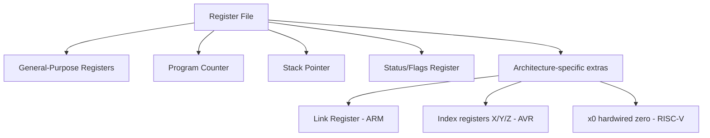
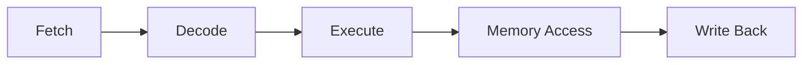
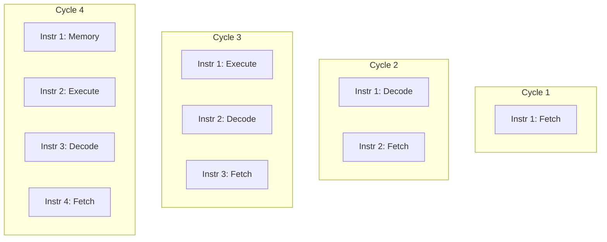
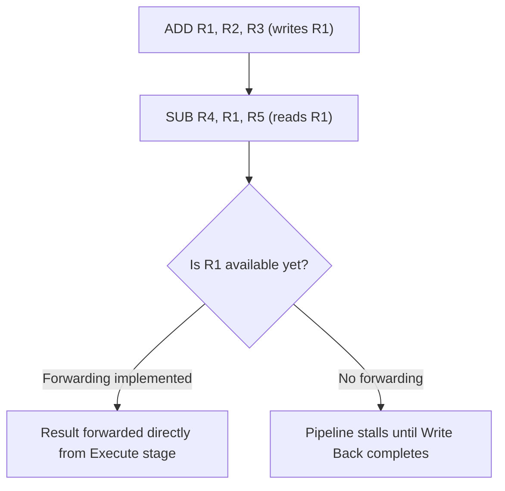
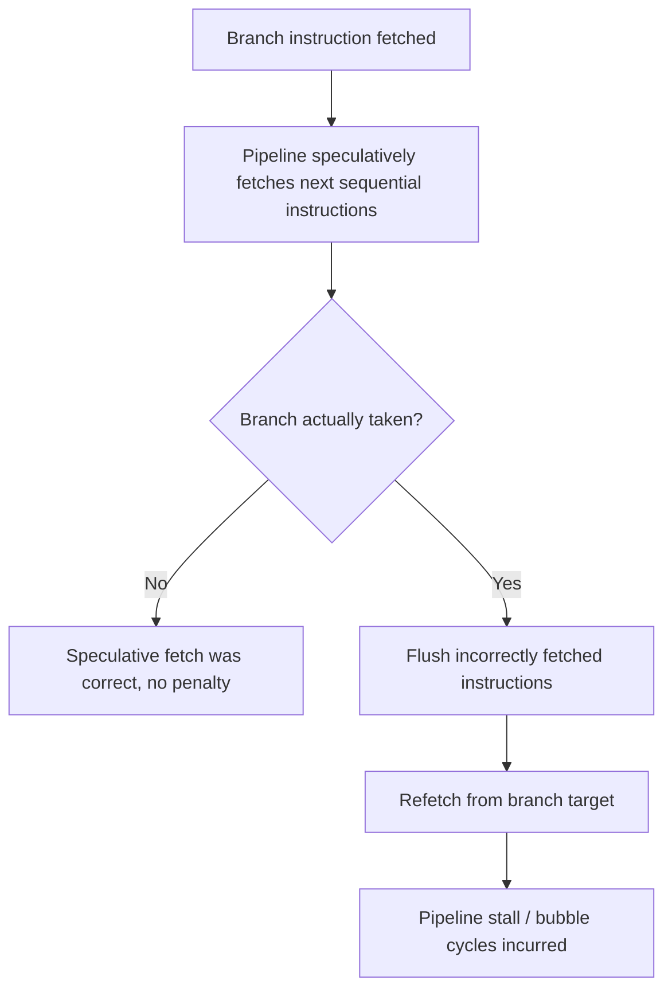
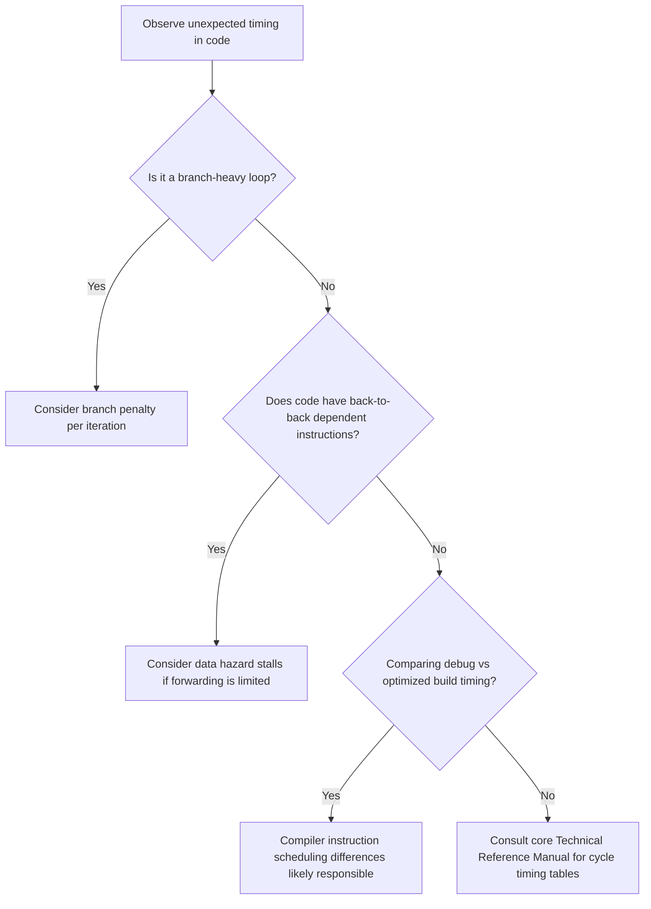

## CPU Registers and Instruction Pipeline

### Overview

CPU registers and the instruction pipeline are the core mechanisms by which a processor stores working state and executes instructions over time. Understanding both is foundational for writing efficient embedded code, reading disassembly during debugging, reasoning about timing-critical code, and diagnosing performance or correctness issues that only manifest at the instruction-execution level.

### Why This Matters

- **Key Points**
  - Registers are the fastest storage a CPU has access to; how effectively a compiler (or hand-written assembly) uses them directly affects code speed and size.
  - The instruction pipeline allows a CPU to overlap the execution of multiple instructions, but introduces hazards that can stall execution or, if misunderstood, lead to incorrect assumptions about instruction timing.
  - Embedded developers frequently need pipeline awareness for cycle-accurate timing, interrupt latency analysis, and understanding why identical-looking code can execute at different speeds depending on context.
  - Register and pipeline behavior differs meaningfully across architectures (e.g., ARM Cortex-M vs AVR vs RISC-V), so general principles must be validated against the specific target's documentation.

### CPU Registers

#### General-Purpose Registers

Small, extremely fast storage locations directly accessible by the CPU's arithmetic and logic circuitry, used to hold operands and results during computation.

- Typically far fewer in number than memory locations (e.g., 8 to 32 general-purpose registers depending on architecture), making efficient register allocation by the compiler a significant factor in code performance.
- Register width matches the architecture's native word size (8-bit for AVR/PIC-8, 32-bit for ARM Cortex-M and RV32 RISC-V, with wider variants on higher-end processors).

#### Special-Purpose Registers

- **Program Counter (PC)**: holds the address of the next instruction to fetch; automatically incremented after each fetch except when a branch, call, or exception redirects it.
- **Stack Pointer (SP)**: holds the address of the top of the current call stack, used implicitly by call/return and push/pop-style instructions.
- **Link Register (LR)**, where present (e.g., ARM): holds the return address for a subroutine call, avoiding a memory write to the stack for simple leaf function calls.
- **Status/Flags Register**: holds condition flags (zero, carry, negative, overflow) set by arithmetic/logic operations and read by conditional branch instructions.
- **Interrupt Mask/Control Registers**: control whether and which interrupts are currently permitted to preempt execution.

#### Register File Organization Examples

**Example**

On ARM Cortex-M, a function call typically stores the return address in the Link Register (LR) rather than immediately writing to the stack; only if the called function itself makes another call (a non-leaf function) does it need to push LR onto the stack to preserve it, since the second call would otherwise overwrite LR — this is a common compiler-generated pattern visible in disassembly as a `PUSH {LR}` at function entry only when the function is non-leaf or otherwise needs to preserve LR.

#### Why Register Count and Width Matter

- More general-purpose registers reduce how often the compiler must "spill" values to memory (store a register's value to RAM temporarily because no register is free), which costs extra cycles and code size.
- Wider registers can hold larger values or perform wider operations per instruction, but do not by themselves guarantee faster execution — actual throughput depends on the full pipeline and memory system.
- [Inference] Architectures with fewer general-purpose registers (such as many 8-bit designs) often compensate with instruction sets or addressing modes optimized for common small-data patterns, since the register pressure tradeoff differs significantly from register-rich 32-bit architectures.

### The Instruction Pipeline

#### Basic Concept

A pipeline divides instruction execution into discrete stages, allowing the CPU to work on multiple instructions simultaneously — one instruction being fetched while another is decoded and a third is executing — increasing overall instruction throughput compared to fully completing one instruction before starting the next.

#### Classic Stages (Simplified 5-Stage Model)

1. **Fetch (IF)**: read the next instruction from memory at the address in the Program Counter.
2. **Decode (ID)**: interpret the instruction's opcode and operands, and read required register values.
3. **Execute (EX)**: perform the arithmetic/logic operation or compute a memory address.
4. **Memory Access (MEM)**: read from or write to memory, if the instruction requires it.
5. **Write Back (WB)**: write the result back into the destination register.

#### Pipelining in Time

Without pipelining, each instruction would fully complete all stages before the next begins. With pipelining, stages overlap:

Most embedded Cortex-M cores use shorter, simpler pipelines (2–3 stages for M0/M0+/M3/M4) compared to the illustrative 5-stage model above, while higher-performance embedded cores (Cortex-M7, higher-end RISC-V, application processors) implement deeper and sometimes superscalar pipelines; the 5-stage model is a widely used teaching abstraction rather than a literal description of any one specific embedded core.

### Pipeline Hazards

#### Structural Hazards

Occur when two instructions need the same hardware resource simultaneously (e.g., both need to access memory in the same cycle). Resolved architecturally through techniques like separate instruction/data memory (Harvard architecture) or resource duplication.

#### Data Hazards

Occur when an instruction depends on the result of a previous instruction that has not yet completed the pipeline.

- **Read After Write (RAW)**: an instruction needs a value that a previous instruction has not yet written back — the most common hazard type.
- Resolved via **forwarding/bypassing** (routing a result directly from an earlier pipeline stage to where it's needed, without waiting for write-back) or, where forwarding isn't implemented, by **stalling** the pipeline until the value is available.

**Example**

#### Control Hazards

Occur when the pipeline has already fetched instructions following a branch before knowing whether that branch will actually be taken, potentially fetching the wrong instructions.

- Resolved via **branch prediction** (guessing the outcome and speculatively continuing, then flushing and correcting if wrong) on more advanced cores, or simply via a fixed **pipeline flush and restart** penalty on simpler embedded cores that do not implement prediction.
- Simpler Cortex-M cores (e.g., M0/M0+) typically incur a small, fixed-cycle penalty on taken branches rather than implementing dynamic branch prediction, making branch cost relatively predictable but non-zero.

### Why This Matters for Embedded Firmware

- **Cycle-counting code** (bit-banged protocols, precise delay loops) must account for pipeline effects like branch penalties, since a loop's actual cycle count can differ from a naive instruction-count estimate.
- **Interrupt latency** is affected by pipeline depth: on entry to an exception handler, in-flight instructions may need to complete or be flushed, and the vector fetch itself takes a defined number of cycles specified in the architecture/core documentation.
- **Compiler optimization levels** change how instructions are scheduled to minimize pipeline stalls (e.g., reordering independent instructions to fill in bubbles caused by a data hazard), which is one reason optimized and unoptimized builds of the same source code can have significantly different timing, sometimes surprising engineers debugging timing-sensitive code who compare debug vs release builds.
- **Self-modifying code and just-fetched instruction execution** can behave unexpectedly on pipelined architectures, since instructions may already be fetched into the pipeline before a modification to that memory location takes effect — a rare but real source of bugs in flash self-programming or bootloader scenarios.

### Superscalar and Out-of-Order Execution (Higher-End Cores)

Some higher-performance embedded cores (e.g., Cortex-M7, higher-end application processors) extend the basic pipeline model further:

- **Superscalar execution**: capable of issuing more than one instruction per clock cycle to multiple parallel execution units, when instructions are independent and hardware resources allow.
- **Out-of-order execution**: (more common in application-class Cortex-A processors than Cortex-M) allows the CPU to execute later instructions ahead of an earlier stalled instruction, provided data dependencies allow it, then reorders results to preserve correct program semantics.
- [Unverified] The exact degree of superscalar issue width and whether any out-of-order capability is present varies by specific core implementation and is documented in each core's technical reference manual rather than being a fixed property of "Cortex-M" as a whole.

### Reading Pipeline Effects in Practice

**Example**

A tight bit-banging loop toggling a GPIO pin might be written expecting a fixed number of cycles per iteration based on counting instructions in the source code; if the loop contains a conditional branch, the branch's taken/not-taken cycle cost (as specified in the core's Technical Reference Manual) must be added to get an accurate cycle count, and this cost can differ between architectures or even between core revisions of the same architecture family.

### Common Pitfalls

- Assuming instruction count alone determines execution time, ignoring pipeline stalls, branch penalties, and memory wait states.
- Comparing timing between debug (unoptimized) and release (optimized) builds and attributing the difference to hardware behavior rather than compiler instruction scheduling and register allocation differences.
- Writing cycle-precise delay loops without consulting the specific core's documented branch and memory access timing, leading to inaccurate delays that may vary across silicon revisions or compiler versions.
- Overlooking flash wait-state configuration when reasoning about pipeline timing — on many MCUs, running at higher clock speeds requires additional flash wait states, which interacts with instruction fetch timing independently of the core pipeline itself.
- Assuming all cores in a "family" (e.g., all Cortex-M parts) have identical pipeline depth or hazard-handling behavior, when these details vary by specific core variant.
- Ignoring self-modifying code / pipeline flush considerations when writing bootloaders or flash-programming routines that execute code near memory currently being modified.

**Next Steps**
- Core Architectures: ARM Cortex-M Family
- Interrupt Latency and Exception Entry Timing
- Compiler Optimization Levels and Their Effect on Generated Code
- Writing Cycle-Accurate Delay Loops and Bit-Banged Protocols
- Understanding Flash Wait States and Memory Access Timing
- Reading Disassembly for Debugging and Performance Analysis
- Superscalar and Out-of-Order Execution Concepts