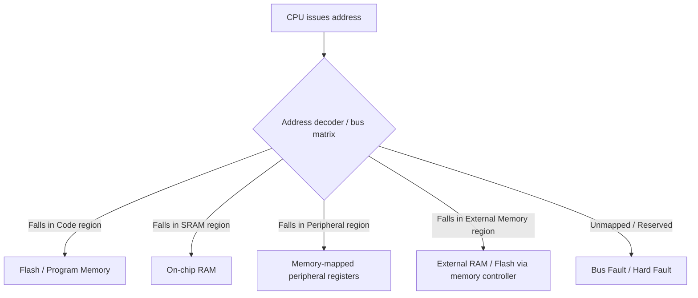
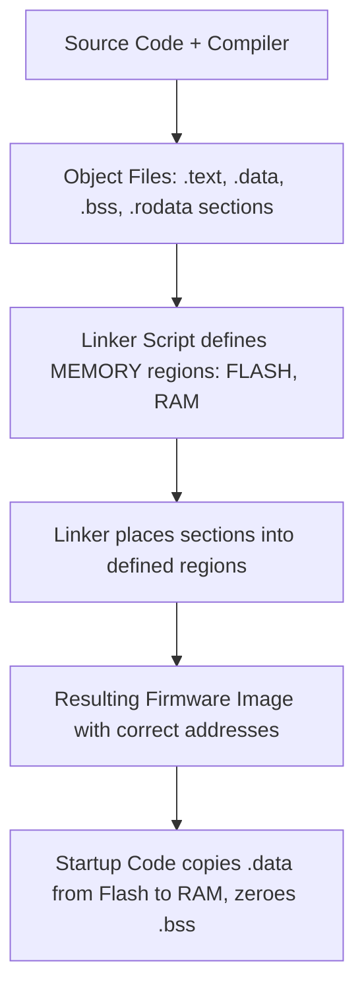
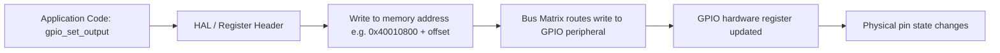
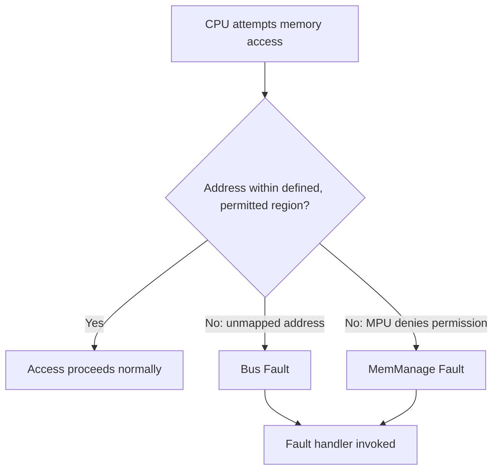

## Memory Map and Address Space

### Overview

A memory map defines how the full range of addresses a processor can generate is allocated to different kinds of storage and devices — Flash, RAM, peripheral registers, external memory, and system control regions. Understanding a target's memory map is essential for writing linker scripts, configuring peripherals, debugging memory-related faults, and correctly interfacing external memory or devices.

### Why This Matters

- **Key Points**
  - Every address a CPU issues resolves to exactly one destination according to the memory map — Flash, RAM, a peripheral register, or an unmapped/reserved region.
  - Linker scripts, startup code, and bootloaders all depend on an accurate memory map to place code and data correctly and to configure the stack and heap.
  - Peripheral registers are accessed as ordinary memory reads/writes at fixed addresses, meaning memory map knowledge is inseparable from peripheral driver development.
  - Accessing an unmapped or reserved address typically triggers a fault (e.g., a Cortex-M BusFault), a common and diagnosable class of embedded bug.

### General Concepts

#### Address Space

The complete range of addresses a processor's address bus can express, determined by the width of the address bus (e.g., a 32-bit address bus can address up to $2^{32}$ = 4 GB of address space, though the actual populated/usable portion is almost always far smaller and vendor-specific).

#### Memory-Mapped I/O

Most modern embedded processors use memory-mapped I/O, where peripheral control and status registers appear as ordinary memory addresses rather than requiring separate I/O instructions. Reading or writing a peripheral register is done with the same load/store instructions used for RAM access, at a fixed, documented address.



### Typical Regions in an Embedded Memory Map

#### Code / Flash Region

Holds the firmware image: reset/interrupt vector table, program instructions, and read-only constant data. On most MCUs, this region begins at or near address 0x00000000, though some architectures support remapping so that Flash, System memory (bootloader ROM), or SRAM can be aliased to address 0 depending on boot configuration pins or option bytes.

#### SRAM Region

On-chip volatile memory used for the stack, heap, global/static variables, and any runtime data. Contents are lost on power-down or reset (data is not preserved) and must be initialized by startup code (typically the `.data` section copied from Flash and the `.bss` section zeroed).

#### Peripheral Region

Contains memory-mapped registers for on-chip peripherals: GPIO controllers, timers, UART/SPI/I2C controllers, ADC/DAC, DMA controllers, and clock/reset control blocks. Often subdivided by bus (e.g., separate address ranges for peripherals on a faster "APB2"/high-speed bus versus a slower "APB1"/lower-speed bus in many ARM-based MCU designs).

#### External Memory Region

On parts with an external memory interface (e.g., FSMC/FMC on some STM32 parts, EBI on others), this region maps external RAM or Flash chips into the processor's address space, allowing them to be accessed with ordinary load/store instructions as if they were internal memory.

#### System / Private Peripheral Region

Contains core-level system control resources: on ARM Cortex-M, this includes the NVIC, SysTick timer, System Control Block, and debug components — standardized in location across Cortex-M implementations regardless of vendor.

#### Option Bytes / Configuration Region

Some MCUs expose a small region of non-volatile configuration bits (boot mode selection, readout protection level, watchdog behavior) as a distinctly mapped or specially-accessed region, separate from both main Flash and RAM.

### Example Memory Map (Generic Cortex-M MCU)

| Address Range | Region | Notes |
|---|---|---|
| 0x00000000–0x0007FFFF | Flash (aliased at boot per configuration) | Vector table + program code |
| 0x08000000–0x0807FFFF | Flash (main) | Typical fixed Flash base on many Cortex-M vendor parts |
| 0x1FFF0000–0x1FFF7A0F | System Memory | Factory bootloader (varies by part) |
| 0x20000000–0x2001FFFF | SRAM | Stack, heap, globals |
| 0x40000000–0x4000FFFF | APB1 Peripherals | Lower-speed peripherals |
| 0x40010000–0x4001FFFF | APB2 Peripherals | Higher-speed peripherals |
| 0x60000000–0x6FFFFFFF | External Memory (FSMC/FMC Bank 1) | External RAM/Flash, if used |
| 0xE0000000–0xE00FFFFF | Private Peripheral Bus | NVIC, SysTick, debug components |

- [Unverified] The precise addresses above are illustrative and modeled on common patterns seen in some vendor families; the actual addresses, region sizes, and peripheral bus assignments for any specific part must be confirmed against that part's own reference manual, since these vary meaningfully across vendors and even across product lines from the same vendor.

### Memory Map and the Linker Script

The linker script tells the toolchain where each section of the compiled program (`.text`, `.data`, `.bss`, `.rodata`, stack, heap) should be placed, and it must match the target's actual memory map exactly.



**Example**

A simplified linker script memory definition might specify:
```
MEMORY
{
  FLASH (rx)  : ORIGIN = 0x08000000, LENGTH = 512K
  RAM (rwx)   : ORIGIN = 0x20000000, LENGTH = 128K
}
```
This tells the linker that any code/read-only data should be placed starting at 0x08000000 within a 512 KB window, and RAM-resident data (stack, heap, globals) should be placed starting at 0x20000000 within a 128 KB window — values that must match the specific MCU's actual Flash and RAM sizes and base addresses from its datasheet/reference manual.

### Accessing Peripheral Registers via the Memory Map

Peripheral drivers ultimately reduce to reading and writing specific addresses within the peripheral region, often expressed in C via pointers to hardware-defined register structures or vendor-provided header files defining named constants for each register address.

**Example**

Configuring a GPIO pin as an output on a memory-mapped peripheral typically involves writing specific bit patterns into a mode-configuration register at a known fixed address associated with that GPIO port, then setting or clearing bits in a separate output data register at another fixed address — both addresses defined by the vendor's memory map documentation and usually wrapped by a hardware abstraction layer (HAL) or register-definition header rather than being hand-typed as raw numbers in application code.



### Address Aliasing and Bit-Banding

Some architectures provide alternate ways to access the same underlying memory through different address ranges, most notably ARM's bit-banding feature (present on some, not all, Cortex-M implementations) where an alias region allows atomic access to individual bits of SRAM or peripheral memory by mapping each bit to a full word in a separate address range.

- [Unverified] Bit-banding availability and its exact aliasing formula are core/vendor-specific and are not present on all Cortex-M variants (notably many newer ARMv8-M cores omit it), so its presence must be confirmed against the specific core and vendor documentation rather than assumed.

### Memory Protection and Faults

The Memory Protection Unit (MPU), where present, allows software to define access permissions (read/write/execute, privileged/unprivileged) for regions of the address space, and accessing memory outside permitted regions or outside the defined memory map entirely typically triggers a fault exception (e.g., MemManage Fault or BusFault on Cortex-M).



**Example**

A common embedded bug — dereferencing an uninitialized or corrupted pointer — often manifests as a hard fault precisely because the pointer's garbage value happens to fall in an unmapped or reserved region of the memory map; examining the faulting address reported by the fault handler and comparing it against the memory map is a standard first debugging step for this class of crash.

### External Memory Considerations

When external RAM or Flash is mapped into the address space via a memory controller:

- Access timing (wait states, bus width) must be configured to match the external device's actual timing characteristics, or reads/writes may return incorrect data.
- Some external memory interfaces support execute-in-place (XIP), allowing code to run directly from external Flash/QSPI memory as if it were internal Flash, though typically at reduced performance compared to internal Flash or cached execution.
- Address ranges for external memory banks are fixed by the memory controller's design and documented per part; incorrect base address configuration is a common source of "external memory doesn't work" issues during hardware bring-up.

### Common Pitfalls

- Writing or referencing an outdated or incorrect memory map (wrong Flash/RAM size or base address) in a linker script, causing overflow, corruption, or a firmware image that fails to boot.
- Assuming every part in a "family" (e.g., all STM32F1 devices) shares an identical memory map, when Flash/RAM size and peripheral availability vary significantly across specific part numbers within the same family.
- Dereferencing invalid pointers and being confused by the resulting fault, rather than using the fault handler's reported address to cross-reference the memory map and identify the likely cause.
- Forgetting that SRAM contents are not preserved across reset/power-cycle, and relying on stale RAM values without proper initialization.
- Misconfiguring external memory interface timing, leading to intermittent data corruption that can resemble a software bug rather than a hardware/timing configuration issue.
- Overlooking bus segmentation (e.g., APB1 vs APB2 peripheral speed differences) when reasoning about peripheral access timing or clock configuration requirements.

**Next Steps**
- Core Architectures: ARM Cortex-M Family
- Writing and Understanding Linker Scripts
- Peripheral Register Access and Hardware Abstraction Layers
- Memory Protection Unit (MPU) Configuration for Fault Isolation
- Debugging Hard Faults and Bus Faults
- External Memory Interfacing (FSMC/FMC, QSPI, EBI)
- Boot Configuration and Memory Remapping