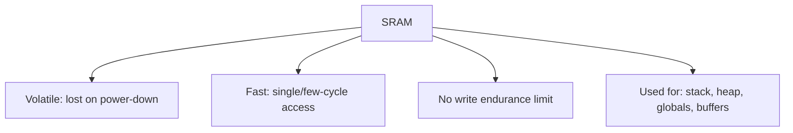
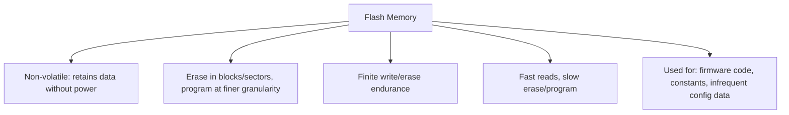
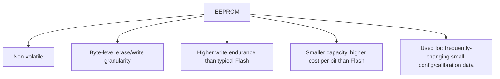
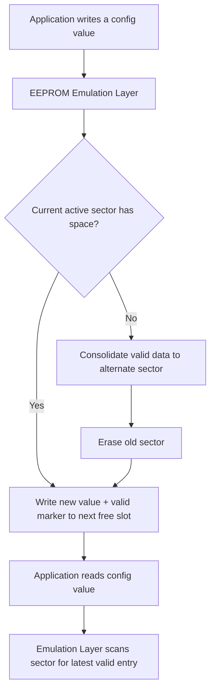
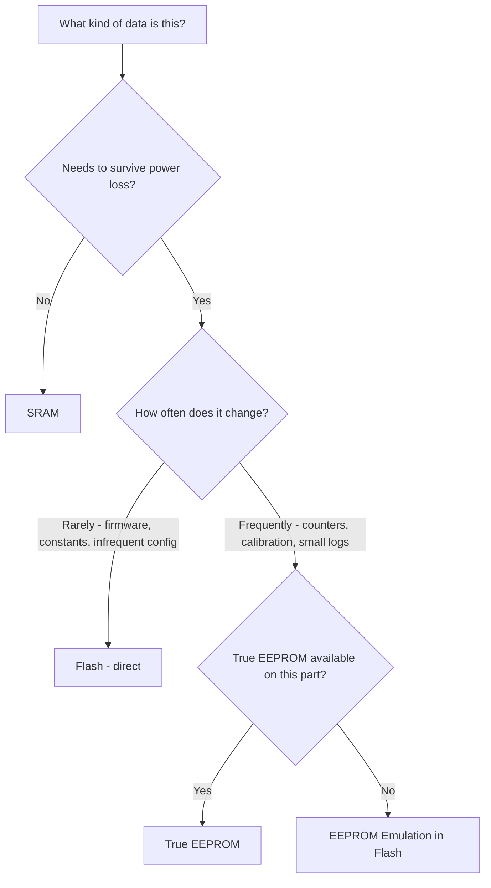

## Flash, SRAM, and EEPROM On-Chip

### Overview

Flash, SRAM, and EEPROM are the three most common on-chip memory technologies found in microcontrollers, each with distinct physical properties, access characteristics, and intended use cases. Choosing the right memory type for a given piece of data — and understanding each type's limitations — is a routine but critical part of embedded firmware design.

### Why This Matters

- **Key Points**
  - Flash, SRAM, and EEPROM differ fundamentally in volatility, write endurance, and access speed, which dictates what kind of data belongs in each.
  - Misusing memory types (e.g., frequently rewriting the same Flash sector for logging) can cause premature wear-out and device failure in the field.
  - Many modern MCUs emulate EEPROM behavior using Flash, which has important implications for wear leveling and write timing that differ from true EEPROM.
  - Startup code and linker scripts rely on correct understanding of which memory is volatile (lost at power-down) versus non-volatile (retained).

### SRAM (Static Random-Access Memory)

#### Characteristics

- **Volatile**: contents are lost when power is removed; must be reinitialized after every power cycle or reset.
- **Fast access**: read and write latency is typically a single cycle or very few cycles, with no special programming/erase sequence required — writes behave like ordinary memory stores.
- **No inherent write endurance limit**: unlike Flash and EEPROM, SRAM can be written an effectively unlimited number of times without wear, since it stores data using bistable transistor circuits rather than charge trapped in a floating gate.
- **Higher cost per bit and larger die area** than Flash for the same capacity, which is why on-chip SRAM capacity on MCUs is typically much smaller than on-chip Flash capacity.

#### Typical Uses

- Stack and heap for running program state.
- Global and static variables requiring read/write access during execution.
- Buffers for peripheral data (DMA buffers, communication receive/transmit buffers).
- Temporary scratch space for algorithms and calculations.

### Flash Memory

#### Characteristics

- **Non-volatile**: retains contents without power, making it suitable for storing firmware and other data that must survive power cycles.
- **Block/sector erase requirement**: unlike RAM, individual bits typically cannot be freely rewritten; Flash must generally be erased in larger blocks or sectors (setting all bits in that region to a fixed state, usually all 1s) before new data can be written into it.
- **Write endurance limit**: each Flash sector can withstand only a finite number of erase/write cycles (commonly on the order of thousands to low tens of thousands of cycles depending on the specific Flash technology and process), after which reliability degrades.
- **Asymmetric read/write speed**: reads are typically fast (comparable to or only somewhat slower than RAM, depending on wait-state configuration at a given clock speed), while erase and program operations are dramatically slower, often taking milliseconds per operation.
- **Write granularity**: many Flash technologies allow writing (programming) at a finer granularity than the erase granularity — for example, individual words or pages might be programmable, while erasure must happen across entire sectors — but a bit can typically only be programmed from 1 to 0, not back from 0 to 1, without a full sector erase.

#### Typical Uses

- Firmware/program code storage (the primary and most common use).
- Read-only constant data (lookup tables, string literals) via the `.rodata` section.
- Application data that changes infrequently (configuration, calibration values, occasional data logging) — though see EEPROM emulation caveats below for frequently-changing data.

**Example**

Updating a single configuration value stored in Flash typically requires reading the entire containing sector into a RAM buffer, modifying the relevant bytes in that RAM copy, erasing the entire Flash sector, and then reprogramming the whole sector with the updated buffer contents — a process that takes considerably longer and is more involved than simply overwriting a value in RAM or true EEPROM, and one that firmware must handle carefully to avoid data loss if power is interrupted mid-operation.

### EEPROM (Electrically Erasable Programmable Read-Only Memory)

#### Characteristics

- **Non-volatile**: like Flash, retains contents without power.
- **Byte-level erase and write granularity**: unlike Flash, true EEPROM typically allows individual bytes (or small groups of bytes) to be erased and rewritten directly, without needing to erase a larger surrounding block first.
- **Write endurance**: also finite, but often rated for a substantially higher number of write cycles than typical Flash sectors (commonly on the order of 100,000 to 1,000,000+ cycles depending on the specific technology), reflecting its design intent for more frequent small updates.
- **Slower and more area-costly per bit** than Flash, which is part of why on-chip EEPROM capacity, where present at all, tends to be small (often just a few hundred bytes to a few kilobytes) compared to Flash capacity on the same chip.
- Not present as a separate physical memory on all MCUs — many modern parts omit true EEPROM entirely and instead rely on EEPROM emulation in Flash (see below).

#### Typical Uses

- Frequently updated small data: calibration values, configuration settings, counters, small logs — data expected to change often enough that Flash's coarse erase granularity and lower endurance would be problematic.

### EEPROM Emulation in Flash

Many modern MCUs (including many that once included true on-chip EEPROM) now omit a physically separate EEPROM block and instead provide **EEPROM emulation**: a firmware or hardware-assisted scheme that presents byte-addressable, EEPROM-like read/write behavior to application code while actually managing the data within one or more dedicated Flash sectors.

#### How EEPROM Emulation Typically Works

- Two or more Flash sectors are reserved and used in rotation: as one sector fills up with updated values (each update written to a new location rather than overwriting in place, since Flash cannot rewrite in place without an erase), the emulation layer periodically consolidates valid data into the other sector and erases the first, in a process often called wear leveling.
- This spreads write/erase cycles across the reserved Flash area more evenly than repeatedly erasing a single fixed sector, extending effective endurance for the emulated EEPROM data compared to naively reusing one sector.
- Some vendors provide this emulation as a documented software library (e.g., an "EEPROM emulation" application note and driver), while others implement it partially in hardware/firmware within the MCU itself.

**Example**

Instead of overwriting a single fixed Flash address every time a configuration value changes (which would wear out that specific location quickly and require a full sector erase per update), an EEPROM emulation scheme writes each new value to the next available slot in the active sector along with a small header marking it as the current valid entry; reads scan for the most recent valid entry, and when the active sector fills, the emulation layer copies all still-valid (most recent) values to the alternate sector before erasing the full sector, distributing wear across the whole reserved region rather than concentrating it on one address.

- [Unverified] The exact emulation algorithm (rotation scheme, header format, consolidation trigger threshold) is vendor- and library-specific, so the effective endurance improvement and worst-case write latency for any specific EEPROM emulation implementation should be confirmed against that vendor's application note rather than assumed to be identical across platforms.

### Comparative Overview

| Aspect | SRAM | Flash | EEPROM (true) | EEPROM Emulation (in Flash) |
|---|---|---|---|---|
| Volatility | Volatile | Non-volatile | Non-volatile | Non-volatile |
| Write granularity | Byte/word, freely | Block erase + page/word program | Byte-level | Byte-level (via emulation layer) |
| Write endurance | Effectively unlimited | Lower (thousands–tens of thousands of cycles per sector) | Higher (often 100K–1M+ cycles) | Improved vs. raw Flash via wear leveling, but bounded by underlying Flash endurance |
| Write speed | Fast (single/few cycles) | Slow erase/program (µs–ms range) | Moderate (faster than Flash erase, slower than SRAM) | Slower than true EEPROM due to emulation overhead |
| Typical on-chip capacity | Smallest (KB range) | Largest (tens of KB to several MB) | Small (bytes to a few KB), where present | Allocated from Flash, size configurable |
| Typical use | Runtime variables, stack, heap | Firmware, constants, infrequent data | Frequently-changed small config data | Frequently-changed small config data on parts lacking true EEPROM |

### Decision Framework

### Practical Firmware Design Implications

- Design data structures with their memory type in mind from the start; retrofitting frequently-changing data from raw Flash storage to EEPROM emulation after a wear-related field failure is far more costly than planning for it upfront.
- Account for Flash erase/program timing (often milliseconds) in any code path that writes to Flash during real-time operation — blocking on a Flash write inside a time-critical interrupt or control loop can cause missed deadlines.
- Handle power-loss-during-write scenarios explicitly for any non-volatile write operation: a power interruption mid-erase or mid-program can leave data in a corrupted or indeterminate state unless the storage scheme (including many EEPROM emulation implementations) is specifically designed to be power-fail-safe.
- Track and, where feasible, budget for write endurance across the product's expected lifetime — for example, estimating total expected write cycles for a logging feature against the Flash sector's or EEPROM's rated endurance to avoid premature wear-out in the field.

### Common Pitfalls

- Repeatedly writing frequently-changing data directly to a single fixed Flash location without wear leveling, leading to premature wear-out of that Flash sector.
- Assuming a specific MCU includes true on-chip EEPROM without verifying against its datasheet, since many modern parts have moved to Flash-based emulation or omit EEPROM-like storage entirely.
- Performing a blocking Flash write/erase operation inside a real-time interrupt handler or tight control loop, causing timing violations elsewhere in the system.
- Failing to design for power-loss-safe non-volatile writes, resulting in corrupted configuration or calibration data after an unexpected power interruption during a write.
- Confusing Flash's read speed (generally fast) with its write/erase speed (generally slow), leading to incorrect timing assumptions in code that both reads and writes Flash.
- Not accounting for the finite lifetime of SRAM contents across power cycles, and mistakenly relying on RAM-resident data to persist after a reset when it must instead be reloaded from non-volatile storage.

**Next Steps**
- Memory Map and Address Space
- Writing Power-Fail-Safe Non-Volatile Storage Routines
- Bootloader Design and Firmware Update Strategies
- Wear Leveling Algorithms for Flash-Based Storage
- External Non-Volatile Memory: SPI Flash, EEPROM, and FRAM
- Real-Time Constraints and Blocking Operations in Interrupt Context
- Data Logging Strategies for Resource-Constrained Devices