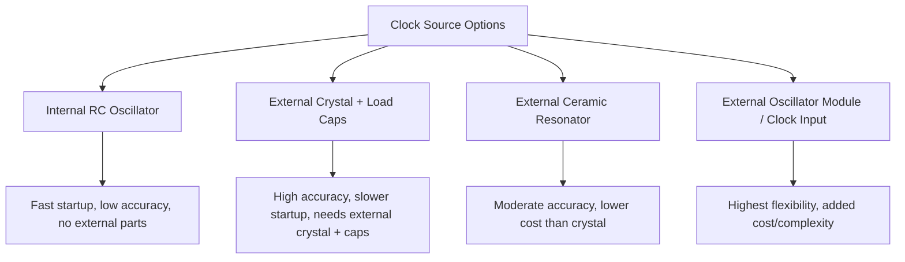
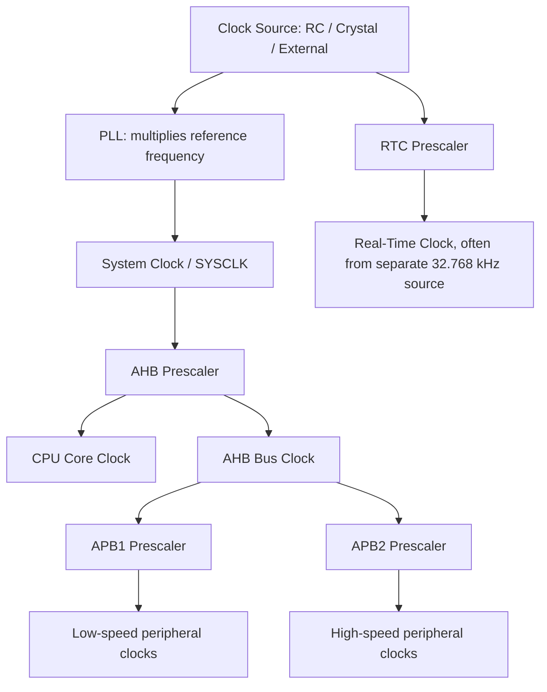
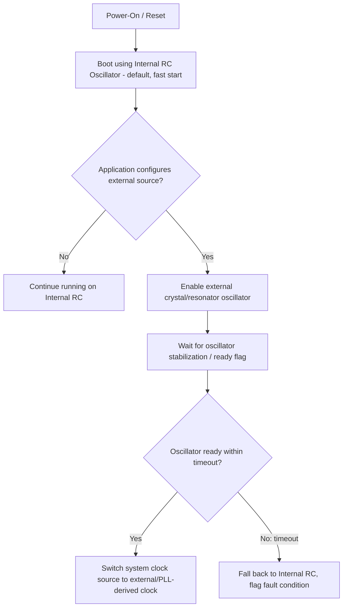

## Clock Sources and Oscillators

### Overview

Every microcontroller peripheral, bus, and CPU core operates synchronized to one or more clock signals, and the accuracy, stability, and startup behavior of those clock signals directly affect timing-critical operations, communication reliability, and power consumption. Understanding the available clock sources, oscillator types, and clock distribution architecture is essential for configuring an MCU correctly and diagnosing timing-related faults.

### Why This Matters

- **Key Points**
  - Clock source choice affects accuracy, startup time, power consumption, and cost — there is no single "best" clock source for all applications.
  - Communication protocols with strict timing tolerances (USB, precision UART baud rates, CAN) often require a more accurate clock source than an MCU's internal oscillator can provide.
  - Incorrect clock configuration is a common cause of boards that appear "dead" (no output, no communication) despite correct power and wiring.
  - Many MCUs support multiple simultaneous clock domains, each potentially sourced and divided differently, adding configuration complexity that must match both hardware and software expectations.

### Types of Clock Sources

#### Internal RC Oscillator

An on-chip resistor-capacitor (RC) based oscillator circuit requiring no external components.

- **Advantages**: zero external component cost, fastest startup time (often microseconds), immune to external component tolerance/placement issues.
- **Disadvantages**: relatively poor frequency accuracy and temperature stability (commonly ±1% to ±5% or worse depending on the specific part and temperature range) compared to crystal-based sources.
- **Typical uses**: general-purpose timing where precise frequency is not critical, initial boot clock before switching to a more accurate source, low-power modes where fast wake-up matters more than accuracy.

#### External Crystal Oscillator (Quartz Crystal)

A quartz crystal, combined with on-chip or external oscillator driver circuitry and typically two small external load capacitors, provides a highly stable and accurate frequency reference based on the crystal's mechanical resonance.

- **Advantages**: high frequency accuracy and stability (commonly on the order of tens of parts-per-million, ppm), good temperature stability over typical operating ranges compared to RC oscillators.
- **Disadvantages**: requires external components (crystal plus load capacitors), longer startup time (often milliseconds) compared to an internal RC oscillator, and susceptible to layout-related issues if PCB traces to the crystal are too long or improperly routed.
- **Typical uses**: precision timing applications, communication protocols with tight timing tolerances, real-time clock (RTC) reference (commonly a separate low-frequency 32.768 kHz crystal for RTC purposes).

#### External Ceramic Resonator

Similar in principle to a crystal but using a ceramic resonant element instead of quartz, often with integrated load capacitors in a single three-terminal package.

- **Advantages**: lower cost than a crystal, simpler PCB layout (fewer discrete components in many packages), still meaningfully more accurate than an internal RC oscillator.
- **Disadvantages**: lower accuracy and stability than a true quartz crystal (though still commonly good enough for many UART/general-purpose timing applications), generally not suitable where crystal-level precision is required.

#### External Clock Input

Some designs feed the MCU's clock input pin directly from an external oscillator module (a self-contained, powered oscillator circuit in its own package) or from another device's clock output, bypassing the MCU's internal oscillator driver circuitry entirely.

- **Advantages**: allows sharing a single precision clock source across multiple ICs, can leverage a higher-accuracy or specialized external reference (e.g., a temperature-compensated crystal oscillator, TCXO).
- **Disadvantages**: added board-level complexity and cost of the external oscillator module, plus the module's own power supply and enable/control requirements.

### Crystal Oscillator Circuit Basics

A typical crystal oscillator circuit (Pierce oscillator topology, common in MCU designs) consists of the crystal connected between two MCU oscillator pins, with a load capacitor from each pin to ground, and the oscillator driver circuitry internal to the MCU providing the sustaining amplification.

$$C_L = \frac{C_1 \times C_2}{C_1 + C_2} + C_{stray}$$

Where $C_L$ is the crystal's specified load capacitance (from its datasheet), $C_1$ and $C_2$ are the external load capacitors, and $C_{stray}$ accounts for PCB trace and pin parasitic capacitance — a calculation used to select appropriate load capacitor values so the oscillator runs at the crystal's specified frequency with correct accuracy.

<svg xmlns="http://www.w3.org/2000/svg" viewBox="0 0 640 300" font-family="monospace" font-size="12">
  <text x="140" y="24" font-size="15" font-weight="bold">Crystal Oscillator Circuit (svg_diagram)</text>

  
  <rect x="250" y="60" width="140" height="120" fill="none" stroke="black" stroke-width="2" />
  <text x="290" y="90">MCU</text>
  <text x="260" y="120">OSC_IN</text>
  <text x="255" y="160">OSC_OUT</text>

  
  <line x1="250" y1="115" x2="180" y2="115" stroke="black" stroke-width="2" />
  <line x1="390" y1="155" x2="460" y2="155" stroke="black" stroke-width="2" />
  <line x1="460" y1="155" x2="460" y2="115" stroke="black" stroke-width="2" />
  <line x1="460" y1="115" x2="180" y2="115" stroke="black" stroke-width="2" />
  <rect x="150" y="105" width="30" height="20" fill="none" stroke="black" stroke-width="2" />
  <text x="120" y="100">Crystal Y1</text>

  
  <line x1="180" y1="115" x2="180" y2="150" stroke="black" stroke-width="2" />
  <line x1="165" y1="150" x2="195" y2="150" stroke="black" stroke-width="2" />
  <line x1="165" y1="158" x2="195" y2="158" stroke="black" stroke-width="2" />
  <line x1="180" y1="158" x2="180" y2="200" stroke="black" stroke-width="2" />
  <text x="200" y="155">C1</text>

  
  <line x1="460" y1="115" x2="460" y2="150" stroke="black" stroke-width="2" />
  <line x1="445" y1="150" x2="475" y2="150" stroke="black" stroke-width="2" />
  <line x1="445" y1="158" x2="475" y2="158" stroke="black" stroke-width="2" />
  <line x1="460" y1="158" x2="460" y2="200" stroke="black" stroke-width="2" />
  <text x="480" y="155">C2</text>

  
  <line x1="180" y1="200" x2="460" y2="200" stroke="black" stroke-width="2" />
  <polygon points="315,210 325,210 320,220" fill="black" />
  <text x="290" y="235">GND</text>
</svg>

### Clock Distribution Architecture

Most MCUs use one or more Phase-Locked Loops (PLLs) to multiply a lower-frequency reference clock up to the higher frequencies needed by the CPU core and peripherals, combined with configurable prescalers/dividers to derive multiple independent clock domains from a single source.

#### Common Clock Domains

- **System Clock (SYSCLK)**: the primary clock feeding the core clock generation logic, typically derived from the selected source (internal RC, crystal, or PLL output).
- **CPU/Core Clock (HCLK on many ARM-based parts)**: drives the CPU core and often the highest-speed bus, usually equal to or a simple division of SYSCLK.
- **Peripheral Bus Clocks (APB1/APB2 or equivalent)**: often run at a divided-down fraction of the core clock, since many peripherals do not require full core speed and running them slower reduces power consumption.
- **RTC Clock**: frequently sourced independently from a dedicated low-frequency (commonly 32.768 kHz, chosen because it divides evenly to 1 Hz via a simple binary counter) crystal, allowing timekeeping to continue even when the main high-speed clock is stopped in low-power modes.
- **USB/Peripheral-Specific Clocks**: some peripherals (notably USB) require a clock of a very specific frequency and tolerance, often necessitating a PLL configuration or external crystal specifically chosen to meet that peripheral's requirements.

### Startup and Clock Switching Sequence

Most MCUs boot using their internal RC oscillator by default (since it requires no external components and starts almost immediately), with application startup code responsible for switching to a more accurate or higher-frequency source if required.

- Firmware typically must poll a status flag (or wait for an interrupt) confirming the external oscillator has stabilized before switching the system clock to depend on it, since attempting to switch too early can result in an unstable or failed clock switch.
- Many MCU startup libraries implement a timeout on this wait, falling back to the internal RC oscillator if the external source fails to start within an expected window — a defensive measure against a missing, damaged, or miswired external crystal.

### Practical Design and Layout Considerations

- Keep crystal and load capacitor traces as short as possible and away from noisy digital signals or switching power supply traces, since parasitic coupling can disrupt oscillator startup or stability.
- Route the crystal and its load capacitors on the same PCB layer where feasible, with a solid ground reference beneath, to minimize stray capacitance and noise pickup.
- Match load capacitor values to the crystal's specified load capacitance (from the crystal's own datasheet) and the MCU's internal parasitic capacitance (documented in the MCU's datasheet/application notes) rather than using arbitrary "typical" values, since mismatch can cause frequency error or unreliable startup.
- Avoid placing other high-speed switching signals directly adjacent to or crossing under crystal traces on the PCB, since this is a common source of intermittent oscillator startup failures found during board bring-up.

### Common Pitfalls

- Assuming the internal RC oscillator's accuracy is sufficient for a protocol with tight timing tolerances (e.g., USB, precise baud-rate UART over long cable runs) without checking the specific accuracy requirement against the RC oscillator's datasheet-specified tolerance.
- Poor crystal circuit PCB layout (long traces, missing or incorrect load capacitors, nearby noise sources) causing intermittent or complete oscillator startup failure — a frequent root cause of "board doesn't boot" issues traced to hardware rather than firmware.
- Forgetting to wait for oscillator stabilization before switching the system clock source, risking an unstable clock or a hard fault if the CPU core clock becomes unreliable mid-switch.
- Misconfiguring PLL multiplier/divider settings, resulting in a system clock frequency outside the MCU's specified maximum operating frequency, which can cause unreliable operation or violate datasheet timing guarantees.
- Overlooking that some peripherals (like USB) require a specific clock tolerance that only certain clock source configurations can meet, and discovering this only after board layout is finalized.
- Not accounting for temperature effects on internal RC oscillator accuracy in applications operating across a wide temperature range, leading to timing drift not seen during room-temperature testing.

**Next Steps**
- Memory Map and Address Space
- PCB Layout Fundamentals: Grounding, Decoupling, and Trace Routing
- Low-Power Modes and Clock Gating Strategies
- Real-Time Clock (RTC) Configuration and Battery Backup Domains
- UART Baud Rate Accuracy and Clock Tolerance Requirements
- PLL Configuration for System Clock Generation
- Debugging Board Bring-Up Failures: A Systematic Approach