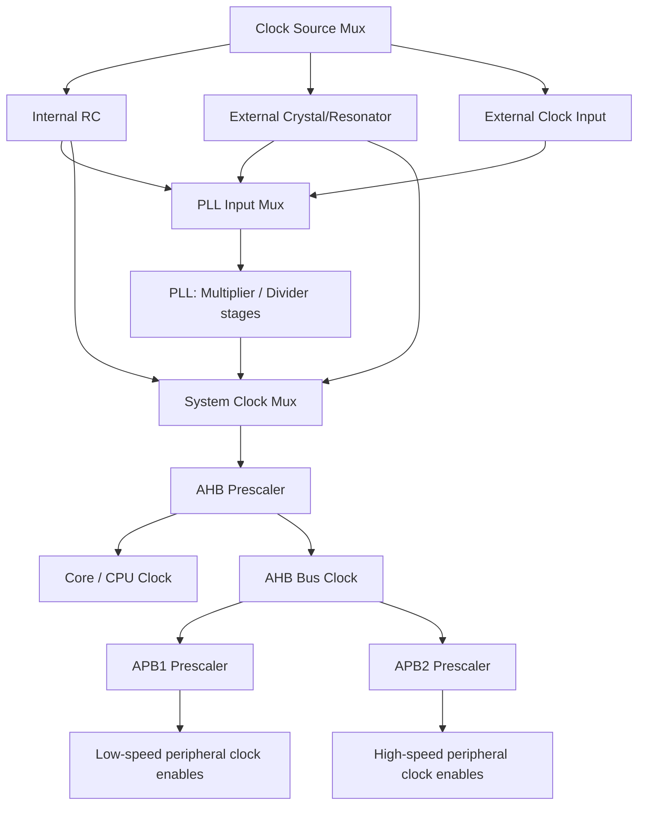
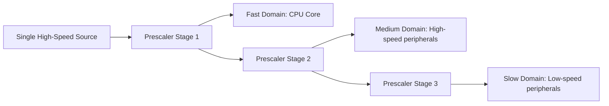
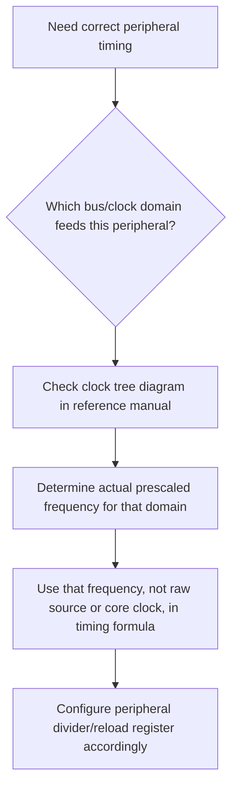
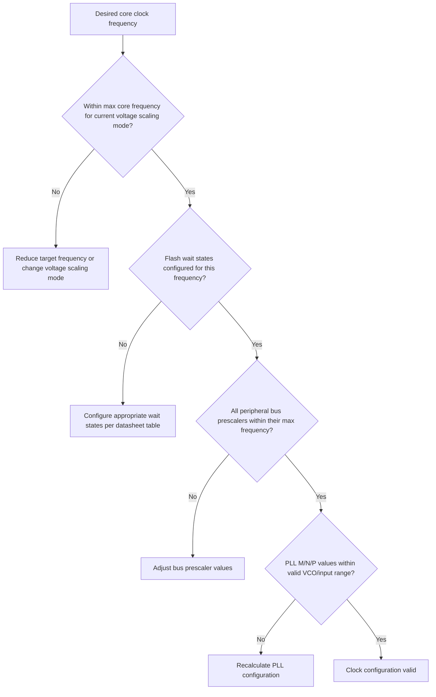

## Clock Trees and Prescalers

### Overview

A clock tree is the internal network of multiplexers, PLLs, and dividers that distributes one or more base clock sources to every clock-consuming block inside a microcontroller — the CPU core, buses, and individual peripherals. Prescalers are the configurable divider stages within that tree that scale a faster clock down to the specific frequency each domain requires. Correctly configuring the clock tree is necessary for achieving a target CPU frequency, meeting peripheral timing requirements, and managing power consumption.

### Why This Matters

- **Key Points**
  - A clock tree determines the actual operating frequency of every peripheral, not just the CPU — miscalculating a prescaler value silently produces wrong peripheral timing even when the CPU itself runs correctly.
  - Many peripheral timing calculations (UART baud rates, timer periods, PWM frequencies, ADC sample rates) depend directly on the specific prescaled clock feeding that peripheral, not on the raw source oscillator frequency.
  - Clock tree configuration interacts with Flash wait states, voltage scaling, and peripheral maximum frequency limits, all of which must be respected simultaneously.
  - Vendor configuration tools (e.g., STM32CubeMX-style clock configurators) exist largely because manual clock tree calculation across many interacting constraints is error-prone when done by hand.

### Clock Tree Structure

#### General Flow

A typical clock tree begins at one or more selectable sources (internal RC oscillator, external crystal, sometimes an internal high-speed RC option), optionally passes through a PLL to reach a higher target frequency, and then fans out through a series of prescalers to the CPU core, main buses, and individual peripheral clock enables.

#### PLL (Phase-Locked Loop) Stage

The PLL takes a reference input frequency and, through internal feedback and division circuitry, produces an output frequency that is a rational multiple of the input — commonly configured via separate input divider (M), feedback multiplier (N), and output divider (P/Q/R or similarly named) settings depending on the vendor.

$$f_{VCO} = f_{input} \times \frac{N}{M}$$
$$f_{output} = \frac{f_{VCO}}{P}$$

Where $f_{input}$ is the PLL reference clock frequency, $M$ and $N$ are the input divider and feedback multiplier respectively, $f_{VCO}$ is the internal voltage-controlled oscillator frequency (which typically has its own valid operating range specified in the datasheet), and $P$ is the output divider producing the final PLL output clock.

- Most PLLs specify a valid input frequency range and a valid VCO frequency range; configuring M, N, and P outside these documented ranges typically produces an unstable or non-functional PLL lock, so vendor-provided configuration tools or careful manual calculation against the datasheet's constraints are both commonly used to avoid this.

#### Prescaler Stages

A prescaler is a configurable integer (or sometimes fractional) divider that reduces an incoming clock frequency by a selectable factor (commonly powers of two, such as ÷1, ÷2, ÷4, ..., ÷512, though exact selectable values are part-specific) before passing it to the next stage or a specific bus/peripheral.

$$f_{output} = \frac{f_{input}}{\text{prescaler divisor}}$$

**Example**

If a system clock (SYSCLK) runs at 168 MHz and the AHB prescaler is set to ÷1, the core and AHB bus clock (HCLK) also run at 168 MHz. If the APB1 prescaler is then set to ÷4, peripherals on the APB1 bus receive a 42 MHz clock, while an APB2 prescaler set to ÷2 might give APB2 peripherals an 84 MHz clock — three different effective clock domains derived from one source, each requiring separate accounting when calculating peripheral timing such as UART baud rate registers or timer reload values.

### Why Multiple Clock Domains Exist

- **Power reduction**: peripherals that do not need high-speed operation (many low-speed communication interfaces, some timers) can run on a slower, lower-power clock domain rather than the full core clock speed.
- **Maximum frequency limits**: many peripherals have a lower maximum operating frequency than the CPU core itself, and a dedicated prescaler ensures that peripheral's input clock stays within its own datasheet-specified limit even as the core clock increases.
- **Timing requirements**: certain peripherals (RTC, some communication interfaces) require a very specific, often much lower, frequency for correct operation and are deliberately fed from an independent, appropriately-scaled clock domain.

### Peripheral Timing Depends on Prescaled Clocks

Many peripheral configuration calculations require knowing the exact frequency of that peripheral's specific clock domain after all relevant prescalers, not the raw source oscillator or even the CPU core frequency.

**Example**

Configuring a UART for a specific baud rate typically involves a formula such as:

$$\text{Baud Rate} = \frac{f_{PCLK}}{16 \times \text{USARTDIV}}$$

Where $f_{PCLK}$ is the frequency of the specific APB bus clock feeding that particular UART peripheral (which may differ from the CPU core clock if that UART sits on a bus with its own prescaler), and USARTDIV is a configurable divisor register value. Using the wrong clock frequency in this calculation — for example, mistakenly using the core clock frequency when the UART is actually fed by a slower, separately-prescaled APB1 clock — produces an incorrect baud rate and unreliable or non-functional serial communication, despite the configuration code otherwise appearing correct.

### Clock Tree Configuration Constraints

Configuring a clock tree correctly requires satisfying several interacting constraints simultaneously, which is why manual configuration is error-prone and vendor tools are widely used:

- **Maximum core clock frequency**: the final CPU core clock must not exceed the part's documented maximum, which itself is sometimes conditional on operating voltage or temperature.
- **Maximum peripheral bus frequency**: each bus (APB1, APB2, or equivalent) typically has its own maximum frequency limit, often lower than the core clock maximum.
- **Flash wait states**: running the core at higher frequencies typically requires configuring additional Flash memory wait states to allow the Flash read access time to keep up; an incorrect (too low) wait-state setting at a given frequency can cause unpredictable instruction fetch behavior.
- **PLL valid input/VCO ranges**: as noted above, PLL configuration values must keep intermediate frequencies within the PLL's documented valid operating ranges.
- **Voltage scaling modes**: some MCUs support multiple internal voltage regulator scaling modes that each permit a different maximum core clock frequency, adding another constraint to the overall configuration.

### Using Vendor Clock Configuration Tools

Tools such as STM32CubeMX (and equivalents from other vendors) present the clock tree graphically, allow interactive adjustment of source selection, PLL parameters, and prescaler values, and automatically flag configurations that violate documented frequency limits or require additional settings (such as Flash wait states) — substantially reducing the manual calculation and cross-referencing otherwise required against the reference manual's clock tree diagram and frequency tables.

- These tools typically also auto-generate the corresponding initialization code (register writes) for the selected configuration, reducing the chance of a manual coding error in an otherwise correct clock plan.
- [Inference] Because these tools encode vendor-specific frequency and configuration constraints directly, relying on them is likely to reduce clock misconfiguration errors compared to fully manual configuration, particularly for less experienced engineers or unfamiliar parts, though understanding the underlying clock tree remains valuable for debugging tool-generated configurations that behave unexpectedly.

### Dynamic Clock Changes at Runtime

Some applications reconfigure the clock tree at runtime — for example, reducing the core clock frequency to save power during idle periods, or switching PLL parameters to change peripheral timing without a full reset.

- Care must be taken that any peripheral actively relying on a specific clock domain frequency (ongoing UART transmission, active PWM output, running timers) either tolerates the change gracefully or is paused/reconfigured consistently with the new frequency.
- Some transitions (particularly switching the system clock source itself, as opposed to just changing a prescaler) may require brief stabilization time or a defined sequence (similar to initial oscillator startup) before the new clock can be considered stable and safe to fully rely on.

### Common Pitfalls

- Using the CPU core clock frequency in a peripheral timing calculation when that peripheral actually receives a different, separately-prescaled bus clock frequency.
- Configuring a PLL or prescaler combination that produces a core or peripheral clock frequency exceeding the part's documented maximum, risking unreliable operation not always immediately obvious during initial testing.
- Increasing core clock frequency without correspondingly updating Flash wait states, leading to intermittent instruction fetch errors or crashes that can appear similar to unrelated software bugs.
- Assuming all peripherals on a chip share a single clock domain, when many parts split peripherals across multiple independently-prescaled buses with different maximum frequencies.
- Changing clock tree configuration at runtime without accounting for in-progress peripheral operations that depend on clock stability or a specific frequency, leading to corrupted communication or incorrect timing during the transition.
- Manually recalculating a full clock tree configuration by hand for a complex part without cross-checking against a vendor configuration tool or the reference manual's clock tree diagram, increasing the risk of an out-of-range intermediate value going unnoticed.

**Next Steps**
- Clock Sources and Oscillators
- Flash Wait States and Memory Access Timing
- UART Baud Rate Configuration and Timing Accuracy
- Low-Power Modes and Dynamic Clock Scaling
- Timer and PWM Peripheral Configuration
- Using Vendor Configuration Tools (e.g., STM32CubeMX) Effectively
- Voltage Scaling and Power Management Trade-offs