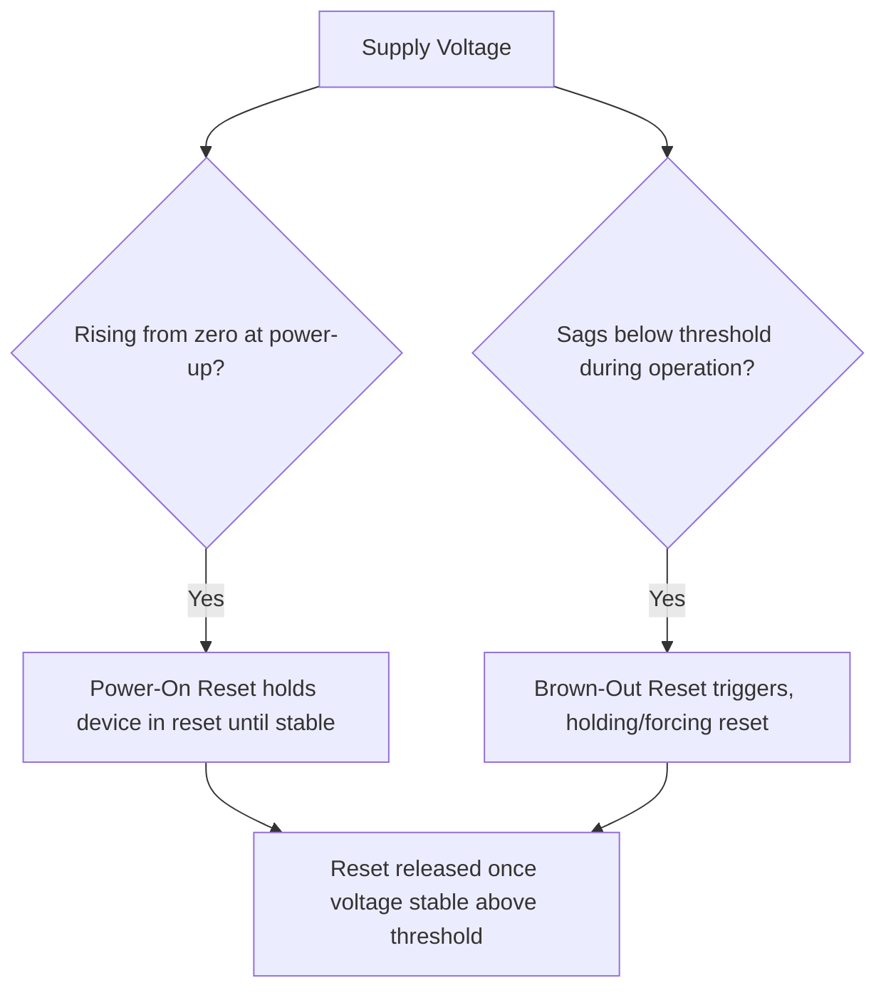
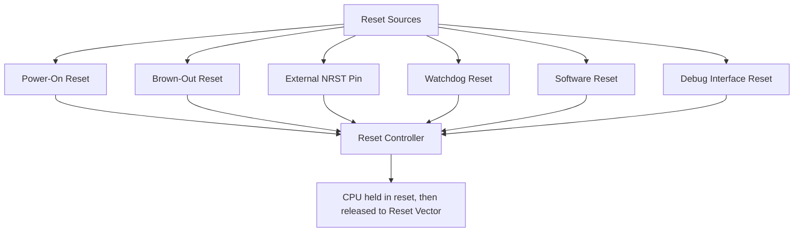
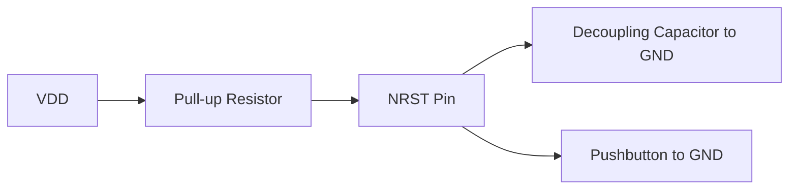
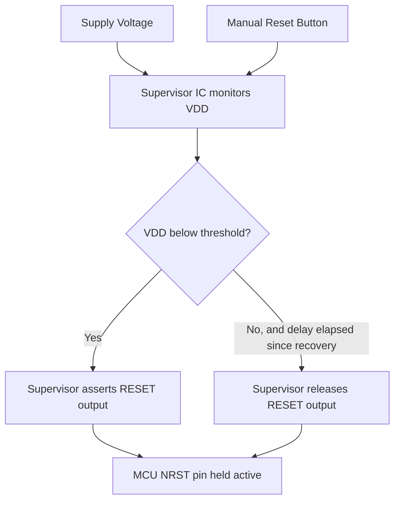

## Reset Types and Reset Circuitry

### Overview

Reset is the mechanism by which a microcontroller returns to a known, well-defined initial state — CPU registers cleared or set to defined values, peripherals disabled or returned to default configuration, and program execution restarted from the reset vector. Understanding the different sources of reset, how reset circuitry is designed at the board level, and how firmware can determine why a reset occurred is essential for reliable system startup, brown-out protection, and diagnosing field failures.

### Why This Matters

- **Key Points**
  - Reset behavior determines what state the system starts in, which affects both normal boot sequences and error-recovery strategies.
  - Multiple distinct reset sources exist (power-on, external pin, watchdog, brown-out, software) and most MCUs record which source triggered the most recent reset, information that firmware can and often should read during startup.
  - Poorly designed reset circuitry (missing decoupling, inadequate pull-up, no debounce on a manual reset switch) is a common source of intermittent, hard-to-reproduce reset behavior.
  - Brown-out detection is a specific, often underappreciated reset mechanism that protects against undefined behavior when supply voltage sags below safe operating levels rather than failing cleanly.

### Types of Reset

#### Power-On Reset (POR)

Triggered automatically when supply voltage rises from zero (or from below a defined threshold) past a minimum operating level, ensuring the device starts in a defined state every time power is applied.

- Typically implemented with an internal voltage-sensing circuit that holds the device in reset until supply voltage has stabilized above a documented threshold.
- Usually includes a built-in reset delay or requires the voltage to be stable for a minimum time before releasing reset, to avoid releasing reset into an unstable, still-rising supply.

#### Power-On Reset vs Brown-Out Reset (BOR)

- **Power-On Reset**: handles the initial power-up transition from zero volts to operating voltage.
- **Brown-Out Reset**: monitors supply voltage continuously during normal operation and forces a reset if voltage sags below a configurable (or fixed, depending on part) threshold — protecting against undefined CPU/peripheral behavior that can occur when a device operates below its specified minimum voltage without actually losing power entirely.



**Example**

A battery-powered device experiencing a weak or aging battery might see its supply voltage droop under load (e.g., during a high-current radio transmission) without fully losing power; without brown-out detection, the MCU could continue attempting to operate below its specified minimum voltage, potentially executing instructions incorrectly, corrupting Flash writes in progress, or behaving unpredictably — brown-out reset instead forces a clean reset and restart once voltage recovers, avoiding this undefined operating region.

#### External Reset Pin (NRST / RESET)

A dedicated pin (commonly active-low, often labeled NRST or RESET) that, when driven to its active level, forces the device into reset. Typically has an internal pull-up (to the inactive/high level) so the pin can be left unconnected or only briefly pulled low by external circuitry (a reset button, a supervisor IC, a debugger) without requiring an external pull-up resistor, though many designs add one anyway for reliability.

#### Watchdog Reset

Triggered when a watchdog timer peripheral, which must be periodically "fed" or "kicked" by firmware within a configured timeout window, is not serviced in time — indicating the firmware has hung, entered an infinite loop, or otherwise failed to execute its normal control flow.

- Serves as a last-resort recovery mechanism for firmware faults that a reset can resolve (e.g., recovering from a hang caused by an unanticipated edge case), rather than a substitute for fixing the underlying defect.
- Many MCUs offer both a simpler "independent" watchdog (running from its own dedicated clock source, more resistant to being disabled by a runaway clock configuration bug) and a "window" watchdog variant (which also faults if fed too early, catching some classes of runaway-but-still-executing firmware).

#### Software Reset

Triggered deliberately by firmware writing to a specific register (often part of the core's system control block on ARM Cortex-M, or a vendor-specific register elsewhere), used to restart the system cleanly after a firmware update, a detected unrecoverable error condition, or an intentional full-state reinitialization.

#### Debug/Programming Interface Reset

Many MCUs allow an external debugger or programmer (connected via SWD/JTAG) to assert reset directly, used during firmware flashing and debug session setup to ensure the device starts execution from a known state.



### Reading the Reset Cause in Firmware

Most MCUs latch the cause of the most recent reset in a dedicated status register, which is not automatically cleared by hardware and must typically be read and then explicitly cleared by firmware early in the startup sequence.

```mermaid
flowchart TD
    A[Startup Code Executes] --> B[Read Reset Cause Status Register]
    B --> C{Which flag(s) set?}
    C -->|Power-On/Power-Down flag| D[Normal cold boot path]
    C -->|Watchdog flag| E[Log/handle unexpected reset, possibly enter diagnostic mode]
    C -->|Brown-out flag| F[Log undervoltage event, possibly adjust behavior]
    C -->|External Pin flag| G[Normal manual/external reset path]
    C -->|Software Reset flag| H[Continue post-update or planned restart sequence]
    D --> I[Clear reset flags for next cycle]
    E --> I
    F --> I
    G --> I
    H --> I
```

**Example**

A field-deployed device experiencing intermittent watchdog resets can use the reset-cause register to distinguish this from normal power cycling; firmware might increment a persistent (non-volatile or backup-domain) watchdog-reset counter each time this flag is detected, allowing engineers to later determine via a diagnostic readout or telemetry report whether unexpected resets are occurring in the field even without live debug access at the time of the fault.

### Reset Circuitry at the Board Level

#### Simple Pull-Up with Manual Reset Button

The most common discrete reset circuit: an external pull-up resistor on the NRST pin (supplementing or in addition to the MCU's internal pull-up, depending on design margin desired) combined with a normally-open pushbutton to ground, plus a small decoupling capacitor across the pin to ground for noise immunity and basic debounce.



- The RC time constant formed by the pull-up resistor and decoupling capacitor provides basic mechanical switch debounce and some immunity to brief noise glitches on the reset line, though it is not a substitute for a dedicated debounce circuit in applications with especially demanding reliability requirements.

#### Supervisor / Reset IC

A dedicated small IC that monitors supply voltage and asserts the reset pin (or an equivalent output) whenever voltage is below a precisely calibrated threshold, often with a built-in delay after voltage recovery before releasing reset — providing more precise and reliable brown-out-like protection than relying solely on an MCU's internal detection circuitry, and useful on MCUs that lack strong internal brown-out detection or where an independent, external safety mechanism is desired.

- Some supervisor ICs also include a manual reset input pin and/or a watchdog input, consolidating multiple reset-related functions into one small external component.



### Reset Sequencing in Multi-Rail or Multi-Chip Systems

In systems with multiple power rails (common on MPU/SoC-class designs) or multiple interconnected chips, reset must often be sequenced correctly relative to power rail stabilization — releasing an MCU's reset before all required supply rails have stabilized can result in undefined startup behavior even if a basic power-on reset circuit is present.

- Some designs use a dedicated power sequencing IC or a supervisor IC monitoring multiple rails to hold reset until every required rail is confirmed stable.
- [Inference] As designs scale from single-rail MCU boards to multi-rail MPU/SoC boards, reset circuitry complexity tends to increase correspondingly, since a single simple pull-up/capacitor circuit is generally insufficient to guarantee correct sequencing across several independently-ramping power rails.

### Common Pitfalls

- Omitting or under-sizing the pull-up resistor on the NRST pin in noisy environments, relying solely on a weak internal pull-up that may be insufficient against external noise coupling onto the reset trace.
- Failing to debounce a manual reset pushbutton adequately, causing multiple spurious resets from a single button press on some designs.
- Not reading and logging the reset-cause register during firmware startup, losing valuable diagnostic information about why an unexpected reset occurred, especially for field-deployed devices without live debug access.
- Relying entirely on a watchdog reset as a substitute for fixing an underlying firmware hang, rather than treating repeated watchdog resets as a signal to investigate and resolve the root cause.
- Overlooking brown-out detection configuration entirely, especially in battery-powered or otherwise voltage-variable-supply designs, risking undefined behavior (including potential Flash corruption during an in-progress write) during voltage sag events rather than a clean, safe reset.
- Assuming a single simple reset circuit design is adequate when scaling from an MCU-only board to a multi-rail MPU/SoC design without redesigning for proper power-sequencing-aware reset behavior.
- Not accounting for reset behavior differences between debug/programming sessions (where a debugger may assert reset directly) and standalone field operation, leading to confusion when firmware behaves differently under a debugger than when running independently.

**Next Steps**
- Clock Sources and Oscillators
- Watchdog Timer Configuration and Firmware Fault Recovery Strategies
- Power Supply Design and Brown-Out Protection
- Boot Configuration and Memory Remapping
- Power Sequencing and Rail Design for Multi-Rail SoC Systems
- Debugging Board Bring-Up Failures: A Systematic Approach
- Field Diagnostics and Persistent Fault Logging Techniques