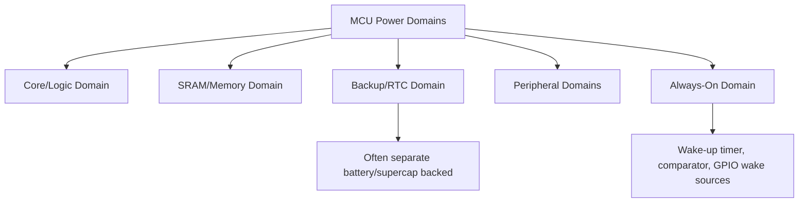
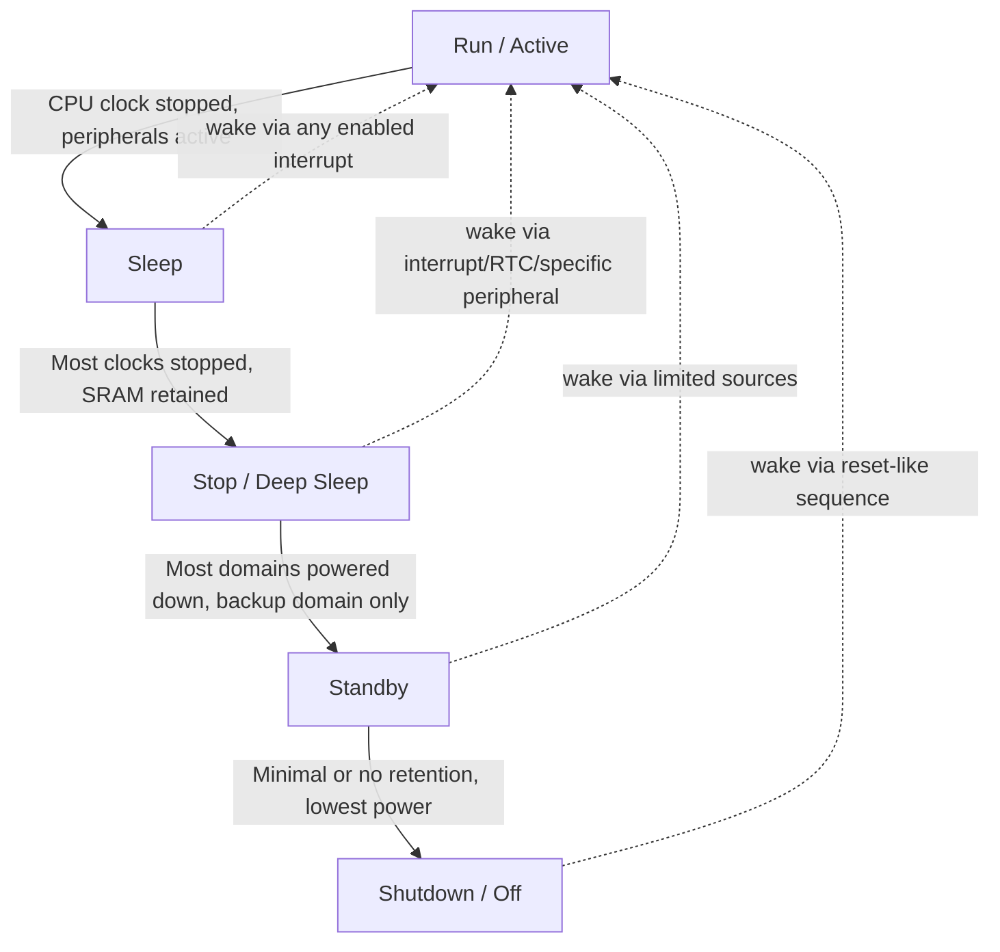
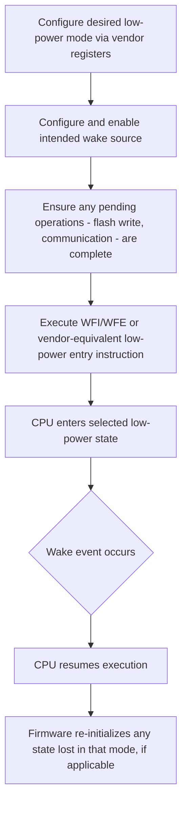

## Power Domains and Low-Power Modes


### Overview

Modern microcontrollers divide their internal circuitry into separate power domains that can be independently enabled, disabled, or held in reduced-power states, and expose a hierarchy of low-power operating modes that trade off wake-up latency, retained state, and power consumption. Effective use of power domains and low-power modes is central to battery-powered and energy-constrained embedded design.

### Why This Matters

- **Key Points**
  - Battery life in most embedded devices is dominated by time spent in low-power modes, not active execution, making correct low-power mode usage one of the highest-leverage design decisions for energy-constrained products.
  - Different low-power modes offer different tradeoffs between power savings, wake-up latency, and which peripherals/memory remain retained or functional.
  - Power domain partitioning allows portions of a chip (e.g., an always-on RTC/backup domain) to remain powered while the bulk of the system is fully powered down.
  - Incorrect low-power mode configuration is a common source of devices that either fail to wake up as expected or consume far more power than anticipated in their intended "sleep" state.

### Power Domain Concepts

#### What a Power Domain Is

A power domain is a region of a chip's circuitry that shares a common power supply rail and can be powered on or off (or held in a retention state) independently of other domains, allowing fine-grained control over which parts of the silicon are actively consuming power at any given time.

#### Common Power Domains on a Typical MCU

- **Core/Logic Domain**: powers the CPU core and most digital logic; typically the domain most aggressively managed across different low-power modes.
- **Memory Domain (SRAM)**: can often be held in a lower-power retention state (preserving contents at reduced voltage) even when the core domain is powered down, or fully powered off if retention is not needed.
- **Backup/RTC Domain**: a small, extremely low-power domain (often powered by a separate small battery or supercapacitor) that keeps the real-time clock running and a small amount of backup registers/memory alive even when the rest of the chip is completely unpowered.
- **Peripheral Domains**: individual peripherals can often be clock-gated or power-gated independently, allowing unused peripherals to consume negligible power even while the core domain remains active.
- **Always-On Domain**: some MCUs include a small always-on domain containing minimal logic (a low-power comparator, a wake-up timer, basic GPIO wake sources) capable of monitoring for wake events while the rest of the chip is powered down.



### Typical Low-Power Mode Hierarchy

While exact names and capabilities vary significantly by vendor, most MCU families expose a hierarchy of low-power modes ranging from a lightly reduced-power state (fast wake, most functionality retained) to a near-zero-power state (slowest wake, least functionality retained).

#### Run/Active Mode

Full operation: CPU executing instructions, all enabled clocks running, all enabled peripherals functional. Highest power consumption, no wake-up latency since nothing is asleep.

#### Sleep Mode

CPU clock is typically stopped (halting instruction execution) while most or all peripherals continue running normally and can generate interrupts to wake the CPU. Fast wake-up (often a few clock cycles), moderate power savings compared to full Run mode.

#### Stop Mode (or "Deep Sleep")

Most clocks are stopped, including typically the main system clock, with only a limited set of peripherals (often a low-power timer, RTC, or specific wake-up-capable peripherals) able to continue operating and generate a wake event. SRAM contents are typically retained. Wake-up latency is higher than Sleep mode since the system clock must restart and stabilize.

#### Standby Mode

Most of the chip, including typically most SRAM, is powered down entirely; only a very small always-on/backup domain remains powered. RAM contents are usually lost (unless a specific backup SRAM region is retained), and wake-up effectively restarts execution similarly to a reset, often only from a limited set of wake sources (specific pins, RTC alarm, watchdog). Very low power consumption, but highest wake-up latency and most state loss among the "sleep" family of modes.

#### Shutdown / Off Mode

The lowest-power state, in some vendor families distinct from Standby, where even more of the chip (potentially including backup domain retention in some implementations) is powered down, generally requiring a full reset-equivalent wake sequence and typically the fewest available wake sources.



- [Unverified] The exact mode names, number of distinct levels, retained memory amount, and available wake sources at each level vary substantially between vendors and even between product families from the same vendor, so the specific capabilities of any given low-power mode must be confirmed against that part's own reference manual rather than assumed from this general hierarchy.

### Comparative Overview

| Mode | CPU State | Clocks | SRAM Retention | Typical Wake Sources | Relative Power | Relative Wake Latency |
|---|---|---|---|---|---|---|
| Run | Executing | All enabled clocks running | Full (active) | N/A | Highest | None |
| Sleep | Halted | Most clocks running | Full | Any enabled interrupt | Moderate | Very low (cycles) |
| Stop/Deep Sleep | Halted | Most stopped, some low-power clock may run | Usually full | Specific peripherals, RTC, external pins | Low | Moderate (clock restart) |
| Standby | Off (effectively reset on wake) | Only backup domain clock, if any | Usually lost (unless backup SRAM present) | Limited: specific pins, RTC alarm, watchdog | Very low | High |
| Shutdown/Off | Off | Minimal or none | Typically lost | Very limited (often reset-pin-equivalent only) | Lowest | Highest |

### Wake-Up Sources

Different low-power modes support different subsets of possible wake-up sources, and correctly configuring the intended wake source(s) for the chosen mode is essential — attempting to use a wake source not supported in a given deep mode simply will not wake the device.

- **External interrupt pins (GPIO)**: commonly available across most sleep-family modes, often configurable for edge or level sensitivity.
- **RTC Alarm/Wakeup Timer**: allows periodic or scheduled wake-up without needing an external event, common even in the deepest low-power modes since the RTC domain often remains powered.
- **Watchdog Timeout**: some designs deliberately use watchdog expiration as a low-power periodic wake mechanism, in addition to its fault-recovery role.
- **Specific Peripheral Events**: some peripherals (certain communication interfaces, analog comparators) can be configured to wake the system on a specific event (e.g., incoming data, a voltage threshold crossing) even while the core is in a low-power mode, though which peripherals support this varies by part and by mode.

```mermaid
flowchart TD
    A[Selecting a Low-Power Mode] --> B{What wake source(s) are required?}
    B -->|Periodic wake only| C[RTC Alarm/Wakeup Timer - compatible with most deep modes]
    B -->|External event / button press| D[GPIO interrupt - check mode compatibility]
    B -->|Incoming communication data| E[Peripheral-specific wake - verify support in target mode]
    C --> F[Confirm target mode's documented wake source support]
    D --> F
    E --> F
    F --> G[Select shallowest mode that supports all required wake sources]
```

### Firmware Design for Low-Power Operation

#### Entering and Exiting Low-Power Modes

Most architectures provide a dedicated instruction or register-based mechanism to enter a low-power mode (e.g., the `WFI`/`WFE` — Wait For Interrupt/Event — instructions on ARM Cortex-M, combined with vendor-specific register configuration selecting which specific mode those instructions trigger).



**Example**

A sensor node designed to sample a sensor once per second and transmit data once per minute might spend the vast majority of its time in a Stop-like mode with only the RTC wake-up timer active, briefly entering Run mode to take a sensor reading and store it in retained SRAM, and only fully waking peripherals (radio, ADC) during the once-per-minute transmission window — a pattern that can reduce average power consumption by orders of magnitude compared to remaining in Run mode continuously, though the exact achievable reduction depends heavily on the specific MCU, peripherals used, and how much time is genuinely spent in the deepest available mode.

#### Handling State Loss Across Modes

- In modes where SRAM is retained (Sleep, most Stop-like modes), firmware can generally resume execution as if returning from a simple pause, with global variables and stack contents intact.
- In modes where SRAM is not retained (many Standby/Shutdown implementations), firmware effectively restarts from the reset vector on wake, and any state that must survive must be explicitly stored in a retained backup register/domain or non-volatile memory before entering that mode.
- Reading the reset/wake cause register (see reset types) after waking from a deep mode is often necessary to distinguish "woke from Standby" from "genuine power-on/external reset," since firmware behavior on each path may need to differ (e.g., skipping full re-initialization if resuming from a planned low-power cycle with state preserved in backup registers).

### Measuring and Verifying Actual Power Consumption

- Datasheet current figures for each low-power mode are typically given under specific, stated conditions (voltage, temperature, oscillator configuration, peripheral state) and can differ substantially from real-world consumption if the actual application configuration differs from those stated conditions.
- Verifying actual current draw in each intended operating mode with a precision current measurement setup (rather than relying solely on datasheet typical values) is standard practice before finalizing a battery-powered product's expected battery life calculations.
- [Inference] Because peripherals left enabled unintentionally, GPIO pins left floating or misconfigured, and pull-up/pull-down resistors on unused pins can each contribute unexpected leakage or static current in a supposedly low-power state, actual measured current in a real design not uncommonly differs meaningfully from a naive datasheet-based estimate until such factors are specifically checked and eliminated.

### Common Pitfalls

- Selecting a wake-up source not supported in the chosen low-power mode, resulting in a device that never wakes as expected.
- Assuming SRAM/state is retained in a mode where it is actually lost (or vice versa), leading to either unnecessary re-initialization logic or, worse, reliance on stale/undefined memory contents after wake.
- Leaving unused peripherals, GPIO pins, or pull-up/pull-down resistors enabled and consuming unnecessary current, undermining the power savings expected from entering a low-power mode.
- Not accounting for wake-up latency when a real-time response requirement exists, choosing a deep mode whose wake time exceeds the application's actual response time budget.
- Failing to complete pending operations (an in-progress Flash write, an active communication transfer) before entering a low-power mode, potentially corrupting data or a transaction.
- Relying solely on datasheet typical current figures without measuring actual application-specific power consumption, leading to inaccurate battery life estimates in the finished product.
- Overlooking that entering the deepest low-power modes (Standby/Shutdown) is often functionally similar to a reset on wake, and not implementing the reset-cause-checking logic needed to resume application state correctly from backup/non-volatile storage.

**Next Steps**
- Reset Types and Reset Circuitry
- Clock Trees and Prescalers
- Battery-Powered Design Considerations for Embedded Systems
- Real-Time Clock (RTC) Configuration and Backup Domains
- Measuring and Optimizing Current Consumption in the Field
- RTOS Tickless Idle and Power-Aware Scheduling
- Wake-on-Event Peripheral Configuration Techniques