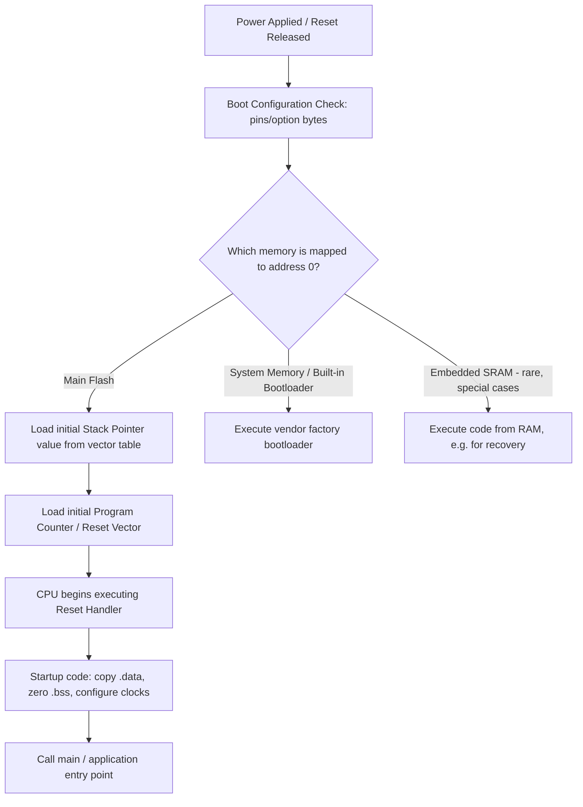
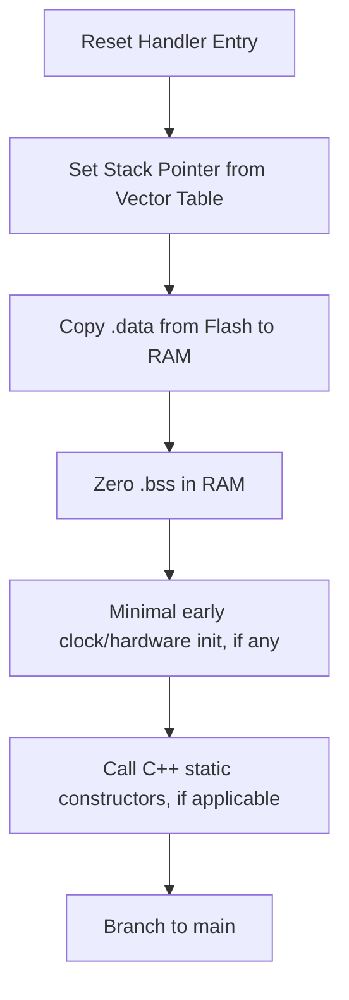
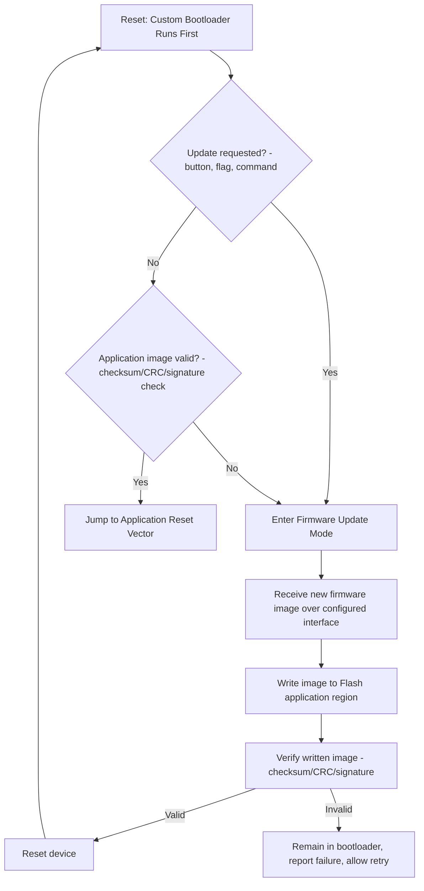
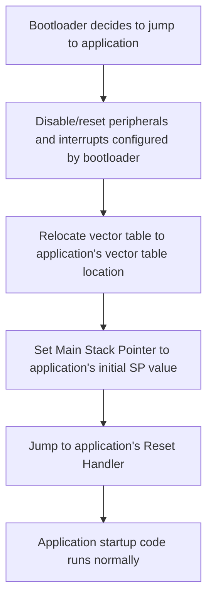
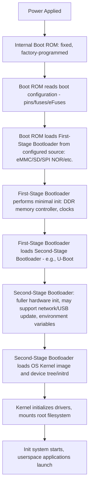

## Bootloaders and Boot Sequence

### Overview

The boot sequence is the ordered set of steps a microcontroller or microprocessor executes between power-up (or reset) and the point where application code begins running normally. A bootloader is a small piece of firmware, often stored separately from the main application, responsible for early initialization and, in many designs, for deciding which application image to run or for receiving and installing firmware updates. Boot sequence design directly affects field-update capability, reliability, and recovery from corrupted firmware.

### Why This Matters

- **Key Points**
  - Boot sequence design determines whether a device can be field-updated safely, and how it behaves if an update is interrupted or an application image is corrupted.
  - MCU boot sequences (typically simple, running directly from internal Flash) differ substantially from MPU/SoC boot sequences (typically multi-stage, loading a full OS from external storage).
  - A well-designed bootloader provides a fallback path so a failed update does not permanently "brick" the device, while a poorly designed one can turn a routine update into an unrecoverable failure.
  - Boot configuration (pins, option bytes, fuses) determines which memory the processor executes from first, and misunderstanding this is a common source of "why won't my board boot" issues during bring-up.

### MCU Boot Sequence

#### Basic Steps

#### Boot Configuration Selection

Many MCUs provide dedicated boot-select pins (sampled at reset) or non-volatile option bytes/fuses that determine which memory region is mapped to address 0 at boot — commonly a choice between main Flash, a factory-programmed system bootloader region, or (on some parts) embedded SRAM.

- Boot pin state is typically only sampled at the moment of reset, meaning changes to boot-select pins after the device has already started running have no effect until the next reset.
- Factory-provided system bootloaders (present in a protected, separate Flash region on many MCU families) often implement a basic protocol over UART, USB, or another interface allowing firmware to be loaded onto a blank or bricked device without any custom bootloader code having been previously programmed — useful for initial production programming or last-resort recovery.

#### Startup Code Responsibilities

Before application `main()` executes, startup code (usually auto-generated by the toolchain or vendor SDK, though it can be customized) typically performs:

- Initializing the stack pointer from the value stored at the start of the vector table.
- Copying initialized global/static variable data (`.data` section) from Flash into RAM, since these values must exist in RAM at runtime but are stored in non-volatile Flash within the firmware image.
- Zeroing uninitialized global/static variable space (`.bss` section) in RAM, since C/C++ semantics guarantee these start at zero.
- Performing minimal early hardware initialization (sometimes just enough clock configuration to run reliably, with fuller peripheral initialization deferred to application code).
- Calling any static/global C++ constructors, on toolchains and languages that require this.
- Branching to the application's `main()` function.

### Custom Application Bootloaders (MCU Context)

Many embedded products implement a custom, application-specific bootloader — separate from any factory system bootloader — that runs first at every boot and decides whether to jump into the main application or instead enter a firmware-update mode.

#### Typical Custom Bootloader Responsibilities

- Check for a firmware update request (a specific button held at boot, a flag set in non-volatile memory by the application, a command received over a communication interface).
- If no update is requested, validate the application image (commonly via a checksum, CRC, or cryptographic signature check) and jump to it if valid.
- If an update is requested or the application image fails validation, remain in bootloader mode and accept a new firmware image over the configured update interface (UART, USB, CAN, wireless, etc.).
- Write the received firmware image into the appropriate Flash region, then typically reset to allow the newly written application to run from a clean state.

**Example**

A common and robust firmware update pattern uses two application "slots" in Flash (sometimes called A/B or dual-bank partitioning): the bootloader always validates and can run from either slot, an update writes the new firmware into the currently inactive slot while the device continues running from the active slot, and only after the new image is fully written and verified does the bootloader mark the new slot as active and reset into it — this approach ensures a device remains bootable into its previous known-good firmware if an update is interrupted partway (e.g., by power loss), since the currently-running slot is never overwritten during the update itself.

- [Inference] Single-slot bootloader designs, where the only application copy is directly overwritten in place during an update, are more vulnerable to leaving a device unbootable if power is lost mid-write, compared to dual-slot/A-B designs, though single-slot designs remain common in cost- or memory-constrained products where the dual-image Flash budget is not available.

### Jumping from Bootloader to Application

Transitioning from bootloader code to application code on the same core (as opposed to a full reset) requires careful manual reconfiguration, since many peripherals, interrupts, and core registers configured by the bootloader must be returned to a clean state before the application's own startup code runs, or the application may behave incorrectly due to inherited configuration it did not expect.

- On ARM Cortex-M, this typically involves reconfiguring the Vector Table Offset Register (VTOR) to point to the application's vector table (rather than the bootloader's), since interrupts occurring in the application must be dispatched using the application's own handler addresses, not the bootloader's.
- Failing to fully reset bootloader-configured state (active interrupts, DMA transfers, altered clock configuration) before jumping is a common source of subtle bugs that only manifest when booting via the custom bootloader path but not when the application is loaded directly via a debugger, which bypasses the bootloader entirely.

### MPU/SoC Boot Sequence (Contrast)

As introduced in the microcontroller vs microprocessor vs SoC comparison, MPU/SoC boot sequences are typically substantially more elaborate, since the CPU must load a full operating system rather than simply beginning execution from internal Flash.

#### Key Differences from MCU Boot

- **Boot ROM**: a fixed, typically immutable (or securely updatable only through a very controlled mechanism) piece of code baked into the silicon at manufacture, responsible only for locating and loading the very first external bootloader stage.
- **Multiple bootloader stages**: often necessary because the boot ROM's capabilities are minimal (it may not know how to initialize DDR memory, for instance), so a small first-stage loader handles just enough hardware bring-up to load a more capable second-stage loader from a wider range of possible sources.
- **Device tree / hardware description**: many embedded Linux boot sequences pass a device tree blob (or equivalent hardware description) to the kernel, describing the specific board's hardware layout so a single kernel binary can support multiple hardware variants.
- **Secure Boot chains**: on security-sensitive designs, each stage in this chain may cryptographically verify the signature of the next stage before executing it, forming a "chain of trust" rooted in an immutable Boot ROM public key or similarly fixed root of trust.

- [Unverified] Whether secure boot / chain-of-trust verification is implemented, and at which stages, depends entirely on the specific SoC's security features and how the board/software is configured; not all MPU/SoC designs implement full chain-of-trust verification even when the underlying silicon supports it.

### Common Pitfalls

- Assuming boot-select pin changes take effect immediately, when they are typically only sampled at reset.
- Writing a custom bootloader that overwrites the only copy of the application firmware in place, leaving no recovery path if power is lost or the transfer is corrupted mid-update.
- Failing to fully reset peripheral, interrupt, and clock configuration when jumping from bootloader to application code, causing bugs that appear only when booting through the bootloader path.
- Forgetting to relocate the vector table (e.g., VTOR on Cortex-M) when transferring control from bootloader to application, causing interrupts to be dispatched to the wrong handler addresses.
- Underestimating the complexity of MPU/SoC multi-stage boot when transitioning a design from a simple MCU platform, particularly around DDR initialization and boot media configuration in the first-stage bootloader.
- Omitting firmware image validation (checksum/CRC/signature) before jumping to the application, risking execution of corrupted or incomplete code that could otherwise have been caught and handled by remaining in bootloader/recovery mode.
- Not testing power-loss-during-update scenarios explicitly, leaving an untested and potentially unrecoverable failure mode in the field.

**Next Steps**
- Reset Types and Reset Circuitry
- Firmware Update Strategies and A/B Partitioning
- Embedded Linux Boot Process: Boot ROM, U-Boot, and Kernel Loading
- Secure Boot and Chain of Trust Implementation
- Memory Map and Address Space
- Writing and Understanding Linker Scripts
- Flash, SRAM, and EEPROM On-Chip