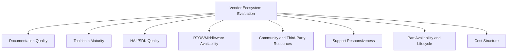
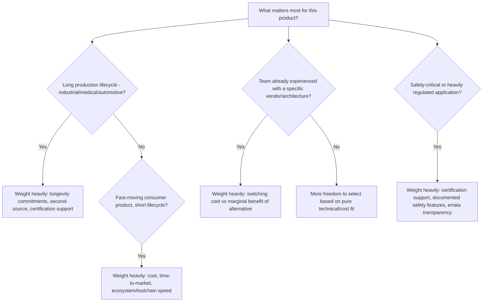

## Vendor Selection Criteria and Ecosystem Comparison

### Overview

Selecting a silicon vendor and its associated software/hardware ecosystem is a strategic decision that affects a project far beyond the initial component cost — it shapes toolchain quality, long-term part availability, support responsiveness, and how much custom infrastructure a team must build versus reuse. This decision is typically made early in a project and is costly to reverse once significant firmware and hardware investment has accumulated around a specific vendor's platform.

### Why This Matters

- **Key Points**
  - Vendor lock-in is real but graduated: some costs (learning a vendor's HAL/SDK conventions) are more portable than others (custom bootloaders tied to vendor-specific Flash layout, vendor-specific security features).
  - Total cost of ownership includes far more than per-unit component price: toolchain licensing, support quality, documentation completeness, and engineering time spent working around ecosystem gaps all factor in.
  - Long-term part availability and lifecycle commitments matter disproportionately for industrial, medical, and automotive products with multi-year or multi-decade production runs, compared to fast-moving consumer products.
  - No single vendor is optimal across all criteria simultaneously; selection should be driven by which criteria matter most for the specific product and its constraints.

### Key Selection Criteria

#### Total Cost of Ownership (Beyond Unit Price)

- **Per-unit component cost** at expected production volume, including any volume price breaks.
- **Toolchain licensing costs**: some vendors provide free, full-featured toolchains, while others gate advanced optimization levels, debug features, or larger code sizes behind paid tiers.
- **Development board and debug probe costs**: evaluation kits, debug probes, and programmer hardware vary significantly in price and in how many are needed per engineer.
- **Engineering time cost**: a cheaper part with poor documentation, buggy peripheral drivers, or a difficult toolchain can cost significantly more in engineering hours than a nominally more expensive part with mature, well-supported tooling — a cost that is real but often harder to quantify upfront than component pricing.

#### Documentation Quality

- Completeness and accuracy of datasheets and reference manuals (see the earlier discussion of reading datasheets and schematics) directly affects development speed and the likelihood of subtle configuration errors.
- Availability of application notes covering common design patterns (clock configuration, low-power modes, specific peripheral use cases) can substantially reduce design time compared to working purely from a bare reference manual.
- Errata document quality and accessibility — every sufficiently complex chip has silicon errata (known deviations from documented behavior), and how clearly and promptly a vendor documents these affects how quickly a team can diagnose whether an observed issue is a known silicon limitation or a design/firmware bug.

#### Toolchain and Software Ecosystem

- **IDE and compiler maturity**: whether the vendor provides (or the community/third parties provide) a mature IDE, debugger integration, and compiler toolchain, and whether that toolchain is based on widely-used tools (GCC, LLVM) or a more proprietary, less transferable toolchain.
- **HAL/SDK quality and stability**: hardware abstraction layers and software development kits vary widely in code quality, API stability across versions, and how much they help versus hinder low-level control when needed.
- **RTOS and middleware support**: availability of ported, well-tested RTOS options, networking stacks, USB stacks, and other middleware for the target part reduces the amount of infrastructure a team must build or integrate themselves.
- **Community size and third-party resources**: larger, more established ecosystems (e.g., widely-used Cortex-M vendor families) tend to have more third-party tutorials, forum discussions, and example projects available, which can meaningfully speed up problem-solving compared to a niche or newly-introduced platform.

#### Support Responsiveness

- Availability and quality of direct vendor technical support (forums, ticketed support, field application engineer access), which can vary significantly depending on production volume commitments and the specific vendor's business model.
- Community-based support (forums, Stack Overflow-style Q&A, third-party consultants familiar with the platform) as a supplement to or substitute for direct vendor support, particularly valuable for smaller-volume customers who may not receive dedicated FAE (Field Application Engineer) attention.

#### Part Availability and Lifecycle Commitments

- **Product longevity commitments**: some vendors publish formal long-term availability commitments (e.g., a stated minimum number of years a part will remain in production) particularly relevant for industrial, medical, and automotive customers with long product lifecycles.
- **Second-source availability**: whether pin-compatible or software-compatible alternatives exist from other vendors, reducing supply chain risk if the primary chosen part becomes unavailable or subject to allocation constraints.
- **End-of-life (EOL) and obsolescence notification practices**: how far in advance and how clearly a vendor communicates when a part is being discontinued, which affects how much lead time a team has to redesign or last-time-buy inventory.
- [Inference] Given the industry-wide component shortages experienced in recent years, supply chain resilience factors (second-source availability, multiple qualified vendors for similar specifications) have likely become a more heavily weighted selection criterion for many organizations than they were in earlier periods of more consistently available supply, though the degree of this shift varies by industry and organization.

#### Feature and Peripheral Fit

- Matching the actual peripheral set (communication interfaces, analog capabilities, timers, specialized accelerators) to application requirements, rather than defaulting to a familiar vendor's part that may be missing a needed peripheral or include unnecessary (and cost-adding) capability.
- Power consumption characteristics relevant to the application's power budget (see low-power modes discussion), since vendors and even parts within the same vendor's lineup can differ substantially in low-power mode granularity and achievable current levels.
- Security feature requirements (secure boot, TrustZone-M or equivalent, cryptographic accelerators, tamper detection) increasingly relevant across many product categories, not just traditionally security-sensitive ones.

#### Certification and Compliance Support

- Availability of vendor-provided documentation or reference designs supporting required certifications (e.g., wireless regulatory certification pre-testing, automotive qualification grades, medical device standards) can meaningfully reduce a product's path to certification compared to a vendor offering no such support.
- Automotive-grade (AEC-Q100 or similar) and extended-temperature-range part variants, where required, may only be available from a subset of vendors or a subset of a vendor's product lines.

### Comparative Framework by Priority

### Evaluating Ecosystem Maturity in Practice

- Review the volume and recency of community discussion (forums, community Discord/Slack channels, Stack Overflow activity) for the specific part or family under consideration, not just the vendor as a whole, since ecosystem maturity can vary significantly even within one vendor's broad product portfolio.
- Attempt a small, realistic proof-of-concept project using the actual intended toolchain and a representative peripheral set before committing, rather than evaluating based solely on datasheet specifications or marketing material.
- Check the age and update frequency of the vendor's HAL/SDK and example code repositories, since stale or infrequently updated SDKs can indicate reduced ongoing vendor investment in that product line.
- Investigate errata document history for existing parts in a family being considered, since a vendor's pattern of errata disclosure (prompt and detailed versus sparse and delayed) is often a reasonably consistent characteristic across that vendor's product lines.

### Common Pitfalls

- Selecting a vendor/part based primarily on unit price while underestimating engineering time costs from poor documentation, immature tooling, or a thin community/support ecosystem.
- Committing to a vendor's proprietary, less-transferable toolchain for a long-lifecycle product without considering the risk of that toolchain being deprecated or inadequately maintained over the product's full support window.
- Overlooking part longevity and second-source availability for products with multi-year production runs, leading to costly redesigns triggered by unexpected end-of-life notices.
- Assuming ecosystem maturity is uniform across an entire vendor's product portfolio, when specific newer or niche part families from an otherwise well-established vendor may have significantly less mature tooling, documentation, or community support than the vendor's flagship lines.
- Failing to prototype with the actual intended toolchain and representative peripherals before committing, discovering ecosystem gaps or driver bugs only after significant design work has already been built around the chosen platform.
- Ignoring certification and compliance support needs during initial vendor selection, resulting in additional cost or schedule delay later when pursuing required certifications without adequate vendor-provided reference material.
- Underweighting supply chain resilience (second-source options, multiple qualified vendors) in product categories where component shortages have historically caused significant production disruption.

**Next Steps**
- Microcontroller vs Microprocessor vs SoC
- Core Architectures: ARM Cortex-M Family
- Core Architectures: AVR, PIC, RISC-V
- Reading Datasheets and Schematics
- Long-Term Product Lifecycle and Obsolescence Management
- Certification and Regulatory Compliance for Embedded Products
- Building a Proof-of-Concept Evaluation Process for New Silicon