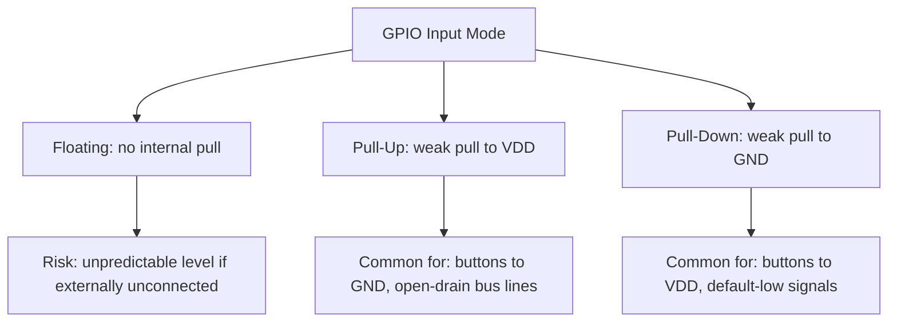
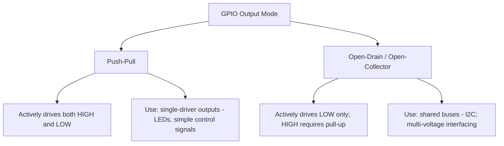
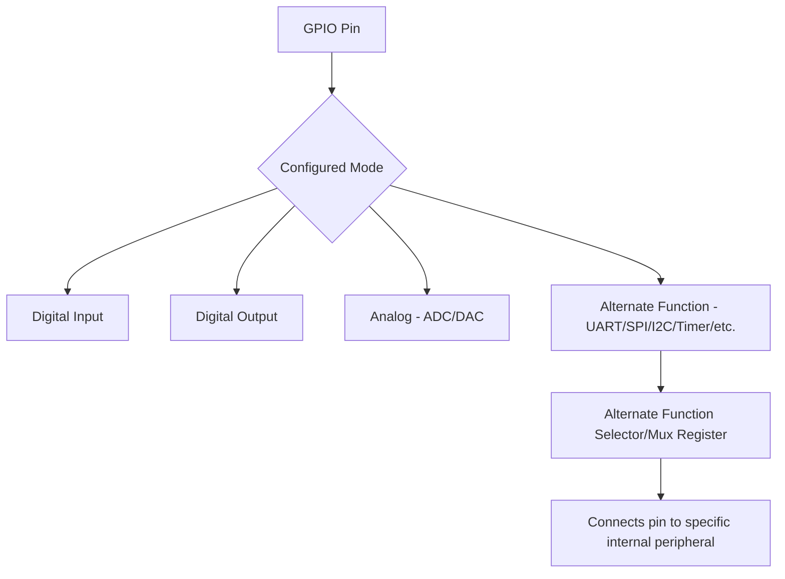
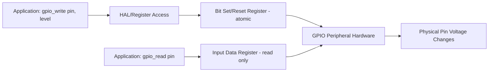

## GPIO Configuration and Modes

### Overview

General-Purpose Input/Output (GPIO) pins are the most fundamental interface between a microcontroller and the outside world, allowing firmware to read digital signals from external circuitry or drive digital outputs to control it. Correctly configuring GPIO mode, drive strength, and electrical characteristics is a prerequisite for nearly every other hardware interaction an embedded system performs.

### Why This Matters

- **Key Points**
  - Every GPIO pin's electrical behavior (input/output, pull resistor state, drive strength, speed) is independently configurable, and incorrect configuration is one of the most common sources of "it doesn't work" hardware bugs.
  - Floating (unconfigured) digital inputs can pick up noise and cause unpredictable logic-level readings, unnecessary power consumption, or spurious interrupt triggers.
  - GPIO pins are frequently multiplexed with alternate peripheral functions, meaning correct configuration involves both mode/electrical settings and function selection.
  - Understanding output types (push-pull vs open-drain) is essential for correctly interfacing with shared buses and mixed-voltage systems.

### GPIO Pin Modes

#### Input Mode

Configures the pin as a digital input, where the GPIO peripheral's input buffer reads the voltage present on the pin and reports it as a logic level (0 or 1) to firmware, without the pin actively driving the external circuit.

- **Floating Input**: no internal pull resistor enabled; the pin's logic level is determined entirely by external circuitry. If left genuinely unconnected, a floating input can read an unpredictable, noise-susceptible value.
- **Pull-Up Input**: an internal resistor (commonly tens of kilohms, though exact value is part-specific) weakly pulls the pin toward the supply voltage (logic 1) unless external circuitry actively pulls it low.
- **Pull-Down Input**: an internal resistor weakly pulls the pin toward ground (logic 0) unless external circuitry actively pulls it high.

**Example**

A pushbutton connected between a GPIO pin and ground is typically paired with that pin configured in pull-up input mode: when the button is not pressed, the internal pull-up holds the pin at logic 1; when pressed, the button connects the pin directly to ground, pulling it to logic 0, which firmware detects as the "pressed" state — avoiding the need for an external pull-up resistor and ensuring a defined logic level at all times, whether the button is pressed or not.

#### Output Mode

Configures the pin so the GPIO peripheral actively drives the pin to a logic level determined by firmware, rather than reading an external signal.

##### Push-Pull Output

The pin can actively drive both logic high (connecting to VDD through an internal transistor) and logic low (connecting to GND through another internal transistor), providing strong, defined drive in both directions.

- Most common output configuration for simple GPIO control (LEDs, general digital outputs) where only one device drives the line.
- Not suitable for lines shared by multiple drivers, since two devices simultaneously driving a push-pull output to opposite levels can create a direct short circuit (contention) between them.

##### Open-Drain (or Open-Collector) Output

The pin can actively pull the line to logic low, but cannot actively drive it high; achieving a high level requires an external (or sometimes internal) pull-up resistor to passively pull the line up when no device is actively driving it low.

- Essential for shared bus lines where multiple devices may need to drive the same line (e.g., I2C SDA/SCL), since any device can pull the shared line low without risk of contention, and the line only returns high when all devices release it.
- Also commonly used when interfacing between different voltage domains, since the pull-up resistor can be connected to whichever voltage rail matches the receiving device's logic levels, independent of the driving device's own supply voltage.

**Example**

On an I2C bus, both the master and any addressed slave device must be able to pull SDA low to communicate, and no single device should ever force the line high, since another device might be simultaneously trying to pull it low; configuring each device's SDA/SCL pins as open-drain outputs with a shared external pull-up resistor (sized appropriately for the bus capacitance and desired speed) allows this multi-driver arrangement to work correctly without any risk of two devices contending to drive the line to opposite levels simultaneously.

#### Analog Mode

Disconnects the pin's digital input/output circuitry entirely, connecting it instead to an analog peripheral (typically an ADC input or DAC output), since leaving digital input buffers active on a pin carrying an analog voltage can waste power and, in some cases, cause the digital input circuitry to oscillate or draw excess current when the analog voltage sits near the digital threshold region.

#### Alternate Function Mode

Connects the pin to a specific on-chip peripheral (UART, SPI, I2C, timer output, etc.) rather than the general-purpose digital input/output logic, with the specific peripheral function selected via a separate multiplexer/selector register — as discussed in the datasheet-reading and reset-circuitry topics, a pin's available alternate functions are documented in the part's pinout tables and must be explicitly selected in addition to configuring general electrical characteristics (speed, pull resistors) appropriately for that function.

### Additional Electrical Configuration Options

#### Output Speed / Slew Rate

Many MCUs allow configuring the maximum switching speed (slew rate) of an output pin, trading off faster edge transitions against increased electromagnetic emissions and higher instantaneous current draw during switching.

- Lower speed settings are generally preferred for simple, low-frequency signals (LEDs, slow control lines) to reduce noise and power.
- Higher speed settings are typically required for higher-frequency signals (fast SPI clocks, high-speed communication lines) where slower edges would violate the target protocol's timing requirements or cause excessive signal distortion.

#### Drive Strength

Some MCUs allow configuring the maximum current an output pin can source or sink, which must be matched to the actual load being driven (an LED with appropriate series resistor, a logic-level input on another chip, or a higher-current load requiring an external driver transistor).

#### Schmitt Trigger Input

Many GPIO input buffers include (or optionally enable) hysteresis via a Schmitt trigger characteristic, which provides a different threshold voltage for rising versus falling transitions, improving noise immunity for slowly-changing or noisy input signals compared to a simple fixed-threshold comparator.

### GPIO Register Model (Conceptual)

Most GPIO peripherals expose several memory-mapped registers per port, as introduced in the memory-mapped I/O discussion:

- **Mode Register**: selects input, output, analog, or alternate function for each pin.
- **Output Type Register**: selects push-pull or open-drain for pins configured as output.
- **Output Speed Register**: selects slew rate/drive characteristics.
- **Pull-Up/Pull-Down Register**: selects floating, pull-up, or pull-down for each pin.
- **Input Data Register**: read-only register reflecting the current logic level on each input pin.
- **Output Data Register**: read/write register controlling the driven logic level on each output pin.
- **Bit Set/Reset Register**: on many parts, a separate write-only register allowing individual bits to be atomically set or cleared without a read-modify-write sequence on the main output data register, avoiding a race condition if an interrupt modifies the same port between a read and a write.
- **Alternate Function Selector Register(s)**: selects which specific peripheral function (if any) is routed to each pin.

**Example**

Toggling an LED using a bit set/reset register rather than a read-modify-write on the output data register avoids a subtle race condition: if an interrupt handler modifies a different bit in the same output data register between the main code's read and write steps, a naive read-modify-write sequence could inadvertently undo the interrupt handler's change; using a dedicated set/reset register instead allows each context to atomically affect only its own bit(s) without needing to know or preserve the current state of unrelated bits in the same register.

### Common Pitfalls

- Leaving unused digital input pins floating rather than configuring them with a defined pull-up/pull-down, risking noise-induced spurious readings or unnecessary power consumption from indeterminate input buffer states.
- Configuring a push-pull output on a shared bus line intended for multi-driver open-drain operation (e.g., accidentally misconfiguring I2C pins), risking bus contention and potential damage to driver circuitry.
- Forgetting to select the correct alternate function for a pin intended to be used by a peripheral, resulting in the peripheral being correctly configured internally but never actually connected to the physical pin.
- Using a read-modify-write sequence on a shared output data register in both main code and an interrupt handler without atomic set/reset register support or appropriate interrupt disabling, risking lost updates to unrelated pins.
- Selecting an output speed/slew rate setting too high for a simple, low-frequency signal, causing unnecessary electromagnetic emissions and power consumption without any timing benefit.
- Selecting an output speed/slew rate setting too low for a genuinely fast signal, causing excessively slow edges that violate the target protocol's timing requirements or degrade signal integrity.
- Assuming a pin's default power-on reset state (mode, pull resistor configuration) matches the application's needs without explicitly configuring it, risking undefined behavior during the brief window between reset release and application-level GPIO initialization.
- Not accounting for voltage domain differences (e.g., interfacing a 3.3V MCU pin with 5V external logic) and risking damage or unreliable operation without appropriate level shifting or open-drain/pull-up-based interfacing.

**Next Steps**
- Reading Datasheets and Schematics
- Interfacing with Buttons, Switches, and Debouncing Techniques
- I2C, SPI, and UART Protocol Fundamentals
- Interrupt-Driven GPIO and External Interrupt Configuration
- Voltage Level Shifting and Mixed-Voltage Interfacing
- Driving LEDs, Relays, and Simple Actuators from GPIO
- PCB Layout Fundamentals: Grounding, Decoupling, and Trace Routing