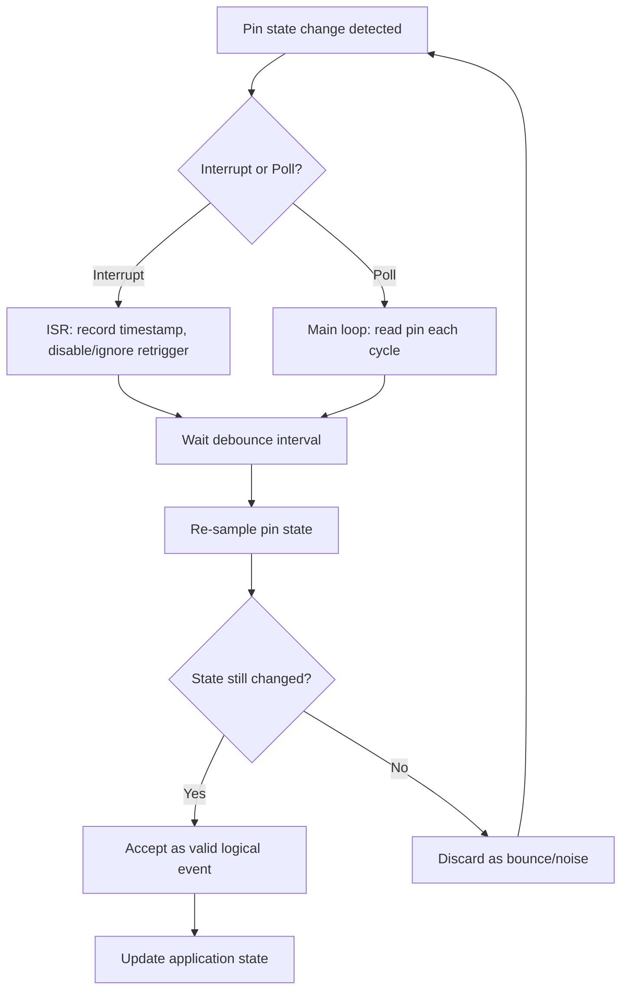

## Input Debouncing Techniques

### Overview

Mechanical switches and buttons do not transition cleanly between open and closed states. When a switch's physical contacts come together, they bounce — making and breaking contact several times within a span of microseconds to a few milliseconds — before settling into a stable state. A microcontroller reading a GPIO pin fast enough will see this bounce as multiple rapid transitions instead of a single clean edge, which can cause a single button press to be registered as several presses, corrupt counters, or trigger unintended state changes.

Debouncing is the general term for techniques — hardware, software, or a combination — that filter out this noise so a single physical actuation produces a single logical event.

### Why Bounce Happens

- **Contact physics**: switch contacts are springy metal surfaces. On closure, they physically collide, deform slightly, and rebound a few times before resting.
- **Bounce duration**: typically ranges from about 1 ms to 20+ ms depending on switch type, size, and mechanical wear. Larger relay contacts and older/worn switches tend to bounce longer. [Inference — exact duration is switch-specific and should be measured for a given component rather than assumed]
- **Consequence for digital logic**: a microcontroller polling or interrupting on every edge sees a burst of transitions like `0-1-0-1-0-1` within the bounce window rather than a clean `0-1`.

### Bounce Waveform (SVG Diagram)

<svg xmlns="http://www.w3.org/2000/svg" viewBox="0 0 700 260">
  <text x="20" y="20" font-family="monospace" font-size="14" fill="#333">Switch Bounce Waveform (svg_diagram)</text>
  <line x1="50" y1="220" x2="650" y2="220" stroke="#333" stroke-width="1" />
  <line x1="50" y1="220" x2="50" y2="40" stroke="#333" stroke-width="1" />
  <text x="15" y="60" font-family="monospace" font-size="12" fill="#333">HIGH</text>
  <text x="15" y="215" font-family="monospace" font-size="12" fill="#333">LOW</text>
  <polyline points="50,200 70,200 70,60 90,60 90,190 110,190 110,50 130,50 130,180 150,180 150,60 650,60" fill="none" stroke="#0066cc" stroke-width="2" />
  <rect x="70" y="40" width="90" height="180" fill="#ff0000" fill-opacity="0.08" />
  <text x="80" y="240" font-family="monospace" font-size="11" fill="#a00">bounce window (~ms)</text>
  <line x1="160" y1="40" x2="160" y2="220" stroke="#008800" stroke-dasharray="4,3" />
  <text x="170" y="235" font-family="monospace" font-size="11" fill="#080">stable HIGH</text>
  <text x="500" y="50" font-family="monospace" font-size="11" fill="#333">time →</text>
</svg>

### Hardware Debouncing Techniques

**RC Low-Pass Filter**

A resistor-capacitor network placed at the switch input slows down the edge transition, smoothing out the fast bounce spikes so they no longer cross the microcontroller's input logic threshold.

- Typical values: a few kΩ resistor with a 0.01–0.1 µF capacitor, tuned so the RC time constant $\tau = RC$ exceeds the expected bounce duration by a healthy margin.
- Often paired with a Schmitt-trigger input buffer to sharpen the filtered edge back into a clean digital transition, since a plain RC filter alone produces a slow, sloped edge that can cause a standard CMOS input to oscillate mid-transition.
- Trade-off: adds board components, and if `R` and `C` are chosen incorrectly the filter either fails to remove bounce (too small) or introduces unacceptable input lag (too large).

**RS Latch (Cross-Coupled Gates) Debouncer**

Uses a single-pole double-throw (SPDT) switch wired to two cross-coupled NAND or NOR gates forming an SR latch. Because the latch only changes state on the first contact closure and ignores subsequent bounces on that same throw, this produces a perfectly clean edge with no timing calculation required.

- Requires an SPDT switch, which is bulkier and costlier than a simple SPST push button.
- Considered one of the most reliable hardware-only debounce methods since it is immune to bounce duration variance. [Inference — "most reliable" is a design generalization; actual reliability still depends on gate propagation delays and switch quality]

**Dedicated Debounce ICs**

Parts such as the MAX6816/MAX6817/MAX6818 family integrate debounce logic for one, two, or eight switch inputs respectively, outputting a clean logic-level signal. Useful in designs where board space for discrete RC/latch networks per-button is impractical, such as keypads with many switches.

### Software Debouncing Techniques

**Fixed Delay Polling**

After detecting a state change, the software waits a fixed delay (commonly 10–50 ms) and then re-reads the pin. If the pin still reads the new state, the change is accepted as valid.

```c
if (digitalRead(BUTTON_PIN) != lastState) {
    delay(20); // crude blocking debounce
    uint8_t newState = digitalRead(BUTTON_PIN);
    if (newState != lastState) {
        lastState = newState;
        handleButtonEvent(newState);
    }
}
```

- Simplest to implement.
- Uses a blocking `delay()`, which stalls the entire program loop — unacceptable in any application handling multiple concurrent tasks, real-time control, or communication protocols with strict timing requirements.

**Non-Blocking Timer-Based Debounce**

Uses a timestamp comparison instead of a blocking delay, allowing the rest of the program to keep running.

```c
uint32_t lastDebounceTime = 0;
const uint32_t debounceDelay = 20; // ms
uint8_t lastReading = HIGH;
uint8_t buttonState = HIGH;

void loop() {
    uint8_t reading = digitalRead(BUTTON_PIN);

    if (reading != lastReading) {
        lastDebounceTime = millis();
    }

    if ((millis() - lastDebounceTime) > debounceDelay) {
        if (reading != buttonState) {
            buttonState = reading;
            handleButtonEvent(buttonState);
        }
    }

    lastReading = reading;
}
```

- This is the standard pattern used in most Arduino-style debounce libraries and tutorials.
- Non-blocking, so it coexists cleanly with other polled tasks in a cooperative main loop.

**Counter / Integrator Debounce**

Instead of timing, an integer counter increments when the pin reads "pressed" and decrements when it reads "released," clamped between 0 and a maximum threshold. The logical state only flips once the counter saturates at either extreme.

```c
int8_t counter = 0;
const int8_t counterMax = 10;
uint8_t debouncedState = 0;

void updateDebounce(uint8_t rawReading) {
    if (rawReading) {
        if (counter < counterMax) counter++;
    } else {
        if (counter > 0) counter--;
    }

    if (counter == counterMax) debouncedState = 1;
    else if (counter == 0) debouncedState = 0;
}
```

- Naturally rejects short noise spikes since a single stray bounce only moves the counter by one step rather than immediately flipping state.
- Well suited to being called from a fixed-rate timer interrupt (e.g., every 1 ms), since the counter's effective "settle time" is `counterMax × interrupt period`.

**Shift-Register / Bitmask Debounce**

Samples the pin at a fixed interval and shifts the reading into an 8-bit (or wider) history register. The button is considered debounced-pressed only when the register matches a specific pattern (commonly all 1s, `0xFF`), and debounced-released when it matches all 0s.

```c
uint8_t history = 0x00;

void updateDebounce(uint8_t rawReading) {
    history = (history << 1) | (rawReading ? 1 : 0);

    if (history == 0xFF) {
        debouncedState = 1;
    } else if (history == 0x00) {
        debouncedState = 0;
    }
}
```

- Popular in embedded C for its simplicity, low memory footprint, and lack of floating-point or division operations, making it well suited to resource-constrained microcontrollers.
- A well-known variant checks for a full transition pattern (e.g., `history == 0b00001111`... `0b11111111` sequences) to detect an edge, not just a stable level, which some implementations use to fire an event exactly once per press rather than continuously while held.

**Interrupt-Based Debounce**

Rather than polling, a GPIO interrupt fires on pin change, and the interrupt service routine (ISR) either starts a debounce timer or defers final validation to the main loop. A common approach:

1. ISR fires on the pin's edge, disables further interrupts on that pin (or ignores retriggers), and starts/resets a debounce timer.
2. When the timer expires, the pin is re-sampled.
3. If the level is still in the new state, the event is accepted, and interrupts are re-enabled.

This avoids continuous polling overhead but requires care: ISRs should do minimal work (set a flag or timestamp) and defer processing to the main loop, since long-running ISR code can block other time-sensitive interrupts. [Inference — the specific blocking impact depends on interrupt priority scheme and MCU architecture]

### Debounce Flow (Mermaid Diagram)



### Choosing Debounce Interval Length

The debounce window must be longer than the worst-case bounce duration of the specific switch used, but short enough not to introduce perceptible input lag or miss legitimate fast repeated presses (e.g., double-clicks, rapid keypad entry).

- Typical starting point for tactile push buttons: 10–50 ms.
- For high-speed rotary encoders, debounce intervals are usually much shorter (on the order of 1–5 ms), since encoder pulses occur far more rapidly than button presses and an overly long debounce window would drop legitimate transitions. [Inference — exact values are application- and encoder-specific]
- Best practice is to measure actual bounce behavior with an oscilloscope or logic analyzer on the target switch rather than assuming a textbook value, since bounce characteristics vary by manufacturer, switch age, and mechanical wear.

### Debouncing Rotary Encoders

Rotary encoders present two-channel (quadrature) signals and are more sensitive to debounce errors than single buttons, since bounce on either channel can be misread as spurious direction changes.

- A common technique uses a state-transition table indexed by the previous and current 2-bit (A,B) reading, incrementing or decrementing a position counter only on valid transition sequences and ignoring invalid/bounced transitions.
- Hardware RC filtering combined with Schmitt-trigger inputs is common on encoder channels, especially for encoders read via interrupt.

### Debouncing in RTOS/Multitasking Contexts

In systems using a real-time operating system (RTOS), debounce logic is often implemented as:

- A GPIO interrupt that signals a semaphore or posts to a queue, waking a dedicated debounce task.
- The debounce task performs `vTaskDelay()`-style non-blocking waits (in FreeRTOS terms) rather than busy-waiting, freeing the CPU for other tasks during the debounce interval.
- Debounced events are then published via a queue or event group to consumer tasks (e.g., a UI task), decoupling low-level electrical noise handling from application logic.

### Common Pitfalls

- Using a blocking `delay()` inside an ISR or main loop of a time-critical system, stalling other operations.
- Setting the debounce interval too short, allowing bounce-induced multiple triggers to slip through.
- Setting it too long, causing missed inputs during rapid interaction or laggy perceived responsiveness.
- Forgetting that debounce is needed on **both** press and release edges, not just the press edge — release bounce can trigger unintended repeated "key up" events in some state machines.
- Applying software-only debounce to very noisy mechanical switches without any hardware filtering, when in genuinely electrically noisy environments (e.g., near motors or relays) a software-only approach may be insufficient. [Inference — dependent on environmental EMI characteristics of the specific deployment]

**Related Topics**
- Interrupt service routine (ISR) design best practices on embedded MCUs
- Quadrature rotary encoder decoding algorithms
- Schmitt-trigger input buffering
- GPIO interrupt configuration (edge vs. level triggering)
- State machine design for input handling
- Keypad matrix scanning and debouncing
- RTOS task synchronization primitives (semaphores, queues, event groups)