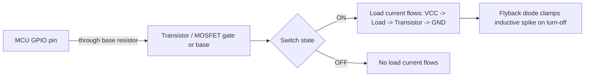

## Output Drive Strength and Current Limits

### Overview

Every GPIO pin configured as an output has physical limits on how much current it can source (push current out to a load) or sink (pull current in from a load), and how "strong" that drive is in terms of output impedance and switching speed. Exceeding these limits does not simply fail to work — it risks permanently damaging the pin driver, degrading the signal, or causing voltage drops that make logic levels unreliable. Understanding drive strength is essential any time a GPIO is used to directly drive LEDs, other logic inputs, or determine bus signal integrity.

### Sourcing vs. Sinking Current

- **Sourcing current ($I_{OH}$)**: current flowing out of the pin into an external load when the pin outputs a logic HIGH, with the load's other end tied to ground.
- **Sinking current ($I_{OL}$)**: current flowing into the pin from an external load when the pin outputs a logic LOW, with the load's other end tied to the supply rail.
- Many microcontrollers can sink more current than they can source, because sinking is typically handled by a simple NMOS pull-down transistor to ground, which tends to have lower on-resistance than the PMOS pull-up structure used for sourcing. [Inference — this asymmetry is common but the exact source/sink ratio is device-specific and must be checked in the datasheet]

### Sourcing/Sinking Diagram (SVG)

<svg xmlns="http://www.w3.org/2000/svg" viewBox="0 0 700 300">
  <text x="20" y="20" font-family="monospace" font-size="14" fill="#333">Sourcing vs Sinking Current (svg_diagram)</text>

  
  <text x="60" y="50" font-family="monospace" font-size="12" fill="#333">Sourcing (pin = HIGH)</text>
  <rect x="60" y="60" width="60" height="30" fill="none" stroke="#333" />
  <text x="70" y="80" font-family="monospace" font-size="11">MCU Pin</text>
  <line x1="120" y1="75" x2="200" y2="75" stroke="#0066cc" stroke-width="2" />
  <polygon points="195,70 205,75 195,80" fill="#0066cc" />
  <rect x="200" y="60" width="50" height="30" fill="none" stroke="#333" />
  <text x="205" y="80" font-family="monospace" font-size="10">Load</text>
  <line x1="250" y1="75" x2="300" y2="75" stroke="#333" stroke-width="2" />
  <line x1="300" y1="60" x2="300" y2="90" stroke="#333" stroke-width="2" />
  <text x="305" y="80" font-family="monospace" font-size="11">GND</text>
  <text x="60" y="110" font-family="monospace" font-size="10" fill="#a00">I_OH flows pin → load → GND</text>

  
  <text x="60" y="160" font-family="monospace" font-size="12" fill="#333">Sinking (pin = LOW)</text>
  <text x="60" y="185" font-family="monospace" font-size="11">VCC</text>
  <line x1="90" y1="190" x2="90" y2="210" stroke="#333" stroke-width="2" />
  <line x1="90" y1="210" x2="140" y2="210" stroke="#333" stroke-width="2" />
  <rect x="140" y="195" width="50" height="30" fill="none" stroke="#333" />
  <text x="145" y="215" font-family="monospace" font-size="10">Load</text>
  <line x1="190" y1="210" x2="260" y2="210" stroke="#0066cc" stroke-width="2" />
  <polygon points="255,205 265,210 255,215" fill="#0066cc" />
  <rect x="265" y="195" width="60" height="30" fill="none" stroke="#333" />
  <text x="275" y="215" font-family="monospace" font-size="11">MCU Pin</text>
  <text x="60" y="250" font-family="monospace" font-size="10" fill="#a00">I_OL flows VCC → load → pin</text>
</svg>

### Key Datasheet Parameters

- **$I_{OH}$ / $I_{OL}$ (max)**: the absolute maximum source/sink current per pin, beyond which pin damage or undefined behavior may occur.
- **$I_{OH}$ / $I_{OL}$ (rated, at specified $V_{OH}$/$V_{OL}$)**: the current the pin can supply while still guaranteeing a valid logic-level voltage — this is usually a more realistic design limit than the absolute maximum.
- **Total package/chip current limit**: many microcontrollers specify a maximum *aggregate* current across all GPIO pins combined (and often per GPIO port/bank), which can be exceeded even if no single pin exceeds its individual rating.
- **Drive strength configuration bits**: some MCU families (e.g., many ARM Cortex-M parts, ESP32, various PIC and AVR-adjacent devices) allow firmware to select between multiple drive strength levels (commonly something like 2 mA / 4 mA / 8 mA / 12 mA steps) per pin via a control register, trading off current capability, EMI, and switching speed.

### Typical Example Values

Representative ranges seen across common microcontroller families: [Unverified — always confirm against the exact part's datasheet, as values vary significantly by manufacturer, process node, and voltage domain]

| Family (representative) | Typical per-pin max | Typical aggregate limit |
|---|---|---|
| Classic 5V AVR (e.g., ATmega328P-class) | ~40 mA absolute max, ~20 mA recommended | ~200 mA per port group |
| 3.3V ARM Cortex-M (general) | ~20–25 mA per pin | Often 100–150 mA per port |
| ESP32-class | ~40 mA per pin (with configurable drive strength) | Aggregate limit specified per GPIO bank |

These numbers are illustrative starting points, not substitutes for a specific part's electrical characteristics table.

### Why Drive Strength Configuration Matters

- **Rise/fall time**: higher drive strength settings push more current into a trace's parasitic capacitance, producing faster edge transitions.
- **EMI**: faster edges have higher-frequency harmonic content, which can increase electromagnetic interference and crosstalk on adjacent traces — so higher drive strength is not automatically "better."
- **Power consumption**: stronger drivers consume more instantaneous current per transition, which matters for battery-powered and low-EMI designs.
- **Signal integrity on longer traces or higher-capacitance loads**: driving a long trace or multiple parallel inputs may require higher drive strength to maintain acceptable rise time; under-driving can cause a signal to arrive too slowly relative to the receiving device's timing requirements.

Firmware configuration of drive strength (register-level, illustrative — exact register names vary by MCU family):

```c
// Example: conceptual pattern, not a specific vendor API
GPIO_SetDriveStrength(PIN_LED, DRIVE_STRENGTH_8MA);
GPIO_SetOutputMode(PIN_LED, PUSH_PULL);
```

### Driving High-Current Loads Directly

Attempting to drive a load that exceeds the pin's rated current directly from the GPIO is a common design error. Typical thresholds to watch:

- A standard 5 mm LED often wants roughly 10–20 mA through it — generally within a typical GPIO's capability with an appropriate series resistor, but still worth checking against the pin's rated (not absolute maximum) current.
- Relays, solenoids, motors, and higher-current LEDs (or several LEDs in parallel on one pin) typically exceed safe direct-drive limits and require a current-amplifying interface stage.

### Interfacing for Higher Current Loads

When a load's current requirement exceeds the GPIO's safe drive capability, an intermediate driving stage is used:

- **NPN/PNP bipolar transistor** in switch configuration: GPIO drives the base (through a current-limiting resistor), transistor switches the higher-current load in its collector/emitter (or emitter/collector) path.
- **N-channel/P-channel MOSFET**: gate is driven by the GPIO (often through a gate resistor), and the MOSFET's much lower on-resistance allows switching significantly higher currents with minimal voltage drop; logic-level MOSFETs are chosen specifically to fully turn on at typical GPIO voltage levels (e.g., 3.3 V).
- **Darlington transistor arrays** (e.g., ULN2003-class parts): provide multiple pre-packaged current-sink channels, commonly used for driving relays, stepper motor coils, or multiple LEDs from a microcontroller with minimal external components.
- **Dedicated gate driver ICs**: used when switching speed and drive current requirements exceed what a simple transistor/MOSFET stage conveniently provides, common in motor control and power-switching applications.
- **Flyback diode**: required across any inductive load (relay coil, motor, solenoid) to clamp the voltage spike generated when current through the inductor is suddenly interrupted, protecting the switching transistor/MOSFET and the GPIO from that spike.

### Transistor Switching Stage (Mermaid Diagram)



### Sourcing/Sinking Multiple Pins Simultaneously

- Total current drawn across many pins switching simultaneously (e.g., driving an 8-segment display or a bank of LEDs) must be checked against the aggregate/package current limit, not just per-pin limits.
- A common mistake is verifying each pin individually against its per-pin maximum while overlooking that the sum across a port or the whole chip exceeds the datasheet's aggregate rating, which can cause excessive voltage drop on internal supply rails or localized heating.
- Multiplexed/scanned displays reduce average current draw per pin by only activating one row or column at a time, relying on persistence of vision, which is one common technique for working within aggregate current budgets.

### Voltage Drop Under Load

As a GPIO output approaches its rated current limit, $V_{OH}$ tends to sag below the nominal supply voltage, and $V_{OL}$ tends to rise above 0 V. Datasheets specify $V_{OH}$/$V_{OL}$ guarantees only at a stated test current — exceeding that current invalidates the guaranteed logic-level voltage, which can cause a downstream device to misinterpret the logic level, especially if that device has tight input threshold requirements.

$$V_{OH} = V_{DD} - I_{OH} \times R_{ON(P)}$$

$$V_{OL} = I_{OL} \times R_{ON(N)}$$

where $R_{ON(P)}$ and $R_{ON(N)}$ represent the effective on-resistance of the pull-up (PMOS) and pull-down (NMOS) output transistor structures respectively. [Inference — this is a simplified first-order model; real output stages include additional non-linear effects not captured by a single resistance term]

### Common Pitfalls

- Driving an LED without a current-limiting series resistor, relying only on the GPIO's internal current limiting (many MCUs do not clamp current internally at all, and even ones with protection circuitry should not be relied upon for normal operation).
- Wiring multiple LEDs in parallel on a single GPIO pin without individual series resistors, causing uneven current sharing since LEDs do not have identical forward voltage characteristics.
- Directly driving a relay coil or motor from a GPIO without a transistor/MOSFET buffer stage, which can destroy the pin instantly.
- Omitting a flyback diode across inductive loads, allowing voltage spikes that can damage the switching transistor and potentially the GPIO driving it.
- Assuming all GPIO pins on a chip share identical drive capability — some pins (especially those shared with special functions like crystal oscillator drive or ADC references) may have different or reduced current ratings.
- Ignoring aggregate/package current limits when driving many pins simultaneously, even though each individual pin appears within spec.

**Related Topics**
- LED and current-limiting resistor calculations
- MOSFET vs. BJT selection for switching applications
- Flyback diode and snubber circuit design for inductive loads
- Multiplexed display scanning techniques
- Level shifting between different logic voltage domains
- Power budgeting and thermal considerations in embedded design
- Open-drain vs. push-pull output configurations