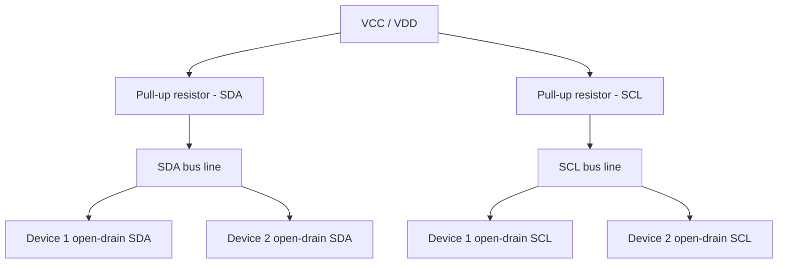

## Pull-Up and Pull-Down Resistors

### Overview

A digital input pin left electrically unconnected (floating) has no defined logic level — it picks up stray capacitive coupling from nearby signals, electromagnetic noise, and even the input transistor's own leakage current, causing it to read randomly as HIGH or LOW and often to oscillate rapidly between the two. Pull-up and pull-down resistors solve this by weakly tying the pin to a known voltage rail through a resistor, so the pin settles to a defined state whenever nothing else is actively driving it, while still allowing an external device (a switch, an open-drain output, another IC) to override that state when needed.

### The Floating Input Problem

- An input pin's logic level is determined by whether the voltage at the pin crosses the device's defined input threshold ($V_{IH}$ for HIGH, $V_{IL}$ for LOW).
- With no resistor and nothing actively driving the pin, that voltage is undefined and drifts based on parasitic capacitance and induced noise, which can cause spurious interrupt triggers, erratic logic behavior, and — in CMOS input stages specifically — a pathological failure mode where both the internal pull-up and pull-down transistors partially conduct simultaneously, drawing excess current and generating heat. [Inference — the severity of this CMOS "shoot-through" effect is process- and device-specific]

### Floating vs. Pulled Input (SVG Diagram)

<svg xmlns="http://www.w3.org/2000/svg" viewBox="0 0 700 260">
  <text x="20" y="20" font-family="monospace" font-size="14" fill="#333">Floating vs Pulled-Up Input (svg_diagram)</text>

  
  <text x="60" y="50" font-family="monospace" font-size="12" fill="#333">Floating input</text>
  <rect x="60" y="60" width="70" height="30" fill="none" stroke="#333" />
  <text x="65" y="80" font-family="monospace" font-size="10">MCU Pin</text>
  <line x1="130" y1="75" x2="180" y2="75" stroke="#333" stroke-width="2" />
  <circle cx="185" cy="75" r="4" fill="none" stroke="#a00" />
  <text x="150" y="60" font-family="monospace" font-size="10" fill="#a00">no connection</text>
  <path d="M 60 110 Q 100 90, 140 110 T 220 110" stroke="#a00" stroke-width="1.5" fill="none" stroke-dasharray="3,2" />
  <text x="60" y="130" font-family="monospace" font-size="10" fill="#a00">undefined / noisy voltage</text>

  
  <text x="380" y="50" font-family="monospace" font-size="12" fill="#333">Pulled-up input</text>
  <text x="420" y="70" font-family="monospace" font-size="11">VCC</text>
  <line x1="430" y1="80" x2="430" y2="100" stroke="#333" stroke-width="2" />
  <rect x="415" y="100" width="30" height="40" fill="none" stroke="#333" />
  <text x="418" y="123" font-family="monospace" font-size="9">R</text>
  <line x1="430" y1="140" x2="430" y2="160" stroke="#333" stroke-width="2" />
  <line x1="430" y1="160" x2="480" y2="160" stroke="#333" stroke-width="2" />
  <rect x="480" y="145" width="70" height="30" fill="none" stroke="#333" />
  <text x="485" y="165" font-family="monospace" font-size="10">MCU Pin</text>
  <line x1="430" y1="160" x2="430" y2="210" stroke="#0066cc" stroke-width="2" stroke-dasharray="4,3" />
  <text x="440" y="210" font-family="monospace" font-size="10">switch to GND (optional)</text>
</svg>

### Pull-Up Resistor Operation

A pull-up resistor connects the input pin to the positive supply rail (VCC/VDD) through a resistor.

- **Idle state**: with no external device pulling the line low, the resistor holds the pin at a solid logic HIGH.
- **Active state**: when a switch or open-drain/open-collector output on the same line connects it to ground, current flows through the resistor to ground, and the pin voltage drops to a logic LOW.
- **Common convention**: for a push-button wired this way, the pin reads HIGH when the button is *not* pressed and LOW when it *is* pressed — often called "active-low" input logic.

```c
// Example: enabling an internal pull-up on a typical MCU
pinMode(BUTTON_PIN, INPUT_PULLUP);

void loop() {
    if (digitalRead(BUTTON_PIN) == LOW) {
        // button is pressed (pulled to ground)
    }
}
```

### Pull-Down Resistor Operation

A pull-down resistor connects the input pin to ground through a resistor.

- **Idle state**: the resistor holds the pin at a solid logic LOW when nothing else is driving the line.
- **Active state**: when a switch or output on the line connects it to VCC, the pin reads HIGH.
- This is the mirror image of the pull-up case, and is described as "active-high" input logic.

```c
// Example: conceptual external pull-down configuration
// (many MCUs offer INPUT_PULLDOWN; not universal across all families)
pinMode(BUTTON_PIN, INPUT_PULLDOWN);

void loop() {
    if (digitalRead(BUTTON_PIN) == HIGH) {
        // button is pressed (pulled to VCC)
    }
}
```

### Internal vs. External Pull Resistors

Most modern microcontrollers include configurable internal pull-up (and often pull-down) resistors on GPIO pins, selectable via firmware register bits, which eliminates the need for a discrete resistor in many designs.

- **Internal pull resistor values**: commonly in the tens of kΩ range (e.g., roughly 20–50 kΩ is typical across many MCU families), though the exact value varies by manufacturer and is sometimes not tightly specified/guaranteed in the datasheet. [Unverified — check exact resistance and tolerance for the specific part]
- **When external resistors are still preferred over internal ones**:
  - When a specific, tightly toleranced resistance value is required for timing or current calculations.
  - When driving a longer bus or higher-capacitance line (e.g., I2C) where the internal pull-up's relatively high resistance results in edges too slow for the required bus speed.
  - When a pin's internal pull capability is unavailable or not configurable in that mode (e.g., pin configured for a peripheral function where pull-configuration is restricted).
  - When multiple devices share a bus and a specific overall parallel resistance is being targeted deliberately.

### Resistor Value Selection

Choosing a pull resistor value involves a trade-off:

- **Too low (strong pull)**: draws more continuous current whenever the line is held in the "active" state, increasing power consumption — a particular concern in battery-powered designs where a switch might be held closed for extended periods.
- **Too high (weak pull)**: makes the node more susceptible to noise coupling and slows the rise/fall time when the line's parasitic capacitance is charged/discharged through the resistor, since the RC time constant $\tau = RC$ grows directly with resistance.
- **Typical general-purpose values**: 4.7 kΩ to 10 k�012 for standard digital I/O pull-ups/pull-downs; lower values (commonly 2.2–4.7 kΩ) for higher-speed buses like I2C, and even lower in some high-speed/long-bus I2C configurations. [Inference — exact optimal value depends on bus capacitance, speed, and voltage domain per the I2C specification's rise-time requirements]

$$\tau = R \times C_{parasitic}$$

### I2C Bus Pull-Ups (A Common Special Case)

I2C is an open-drain bus by design — devices only ever pull the SDA/SCL lines LOW, never actively drive them HIGH — so external pull-up resistors are mandatory (not optional) for the bus to function at all, since without them the lines would never return to a HIGH state after being pulled low.

- Pull-up value depends on bus speed, total bus capacitance (which increases with more devices and longer traces), and supply voltage; the I2C specification provides guidance on maximum rise time as a function of these factors.
- Using internal MCU pull-ups alone for I2C is common for short, low-speed, few-device buses but often inadequate for longer buses, higher speeds (Fast-mode and above), or buses with many devices, where dedicated external resistors are the standard, recommended practice.

### I2C Bus Pull-Up Topology (Mermaid Diagram)



### Interaction with Open-Drain and Open-Collector Outputs

Open-drain (MOSFET-based) and open-collector (BJT-based) output stages can only actively pull a line LOW; they cannot drive it HIGH on their own. A pull-up resistor is what allows the line to return to a HIGH state when the output transistor is off, which is precisely why open-drain/open-collector buses (I2C, some interrupt lines, wired-AND configurations) always require a pull-up somewhere on the line.

- **Wired-AND behavior**: with multiple open-drain outputs sharing one pulled-up line, the line reads LOW if *any* device pulls it low, and HIGH only when *all* devices release it — a property directly exploited by I2C for clock stretching and multi-master arbitration.

### Switch Wiring Patterns

| Configuration | Idle reading | Pressed reading | Resistor location |
|---|---|---|---|
| Pull-up + switch to GND | HIGH | LOW | Between pin and VCC |
| Pull-down + switch to VCC | LOW | HIGH | Between pin and GND |
| Internal pull-up + switch to GND | HIGH | LOW | Inside MCU (firmware-enabled) |

### Common Pitfalls

- Leaving a digital input pin completely floating when no active driver is guaranteed to be present at all times, especially problematic on interrupt-configured pins where noise can generate spurious interrupt triggers.
- Using pull resistor values far too low for a battery-powered design, causing unnecessary continuous current draw whenever the "active" state is held.
- Relying solely on internal pull-ups for a long or fast I2C bus, resulting in unreliable communication or failure at higher clock speeds.
- Forgetting that both pull-up and pull-down cannot be meaningfully enabled at the same time on the same pin in most architectures — many MCUs simply disallow or override one when both bits are set, and the resulting behavior is implementation-specific.
- Mismatching switch wiring convention with firmware logic — e.g., wiring a switch to VCC while firmware assumes active-low pull-up logic, inverting the expected behavior.
- Not accounting for pull resistor current draw when calculating total system power budget in sleep/low-power modes, where GPIO pull states remain active and can dominate an otherwise very low sleep current.

**Related Topics**
- Open-drain vs. push-pull output configurations
- I2C bus timing and clock stretching
- GPIO interrupt configuration (edge vs. level triggering)
- Input debouncing techniques
- Low-power/sleep mode design considerations for GPIO
- Schmitt-trigger input buffering