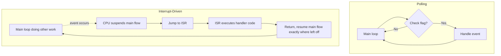
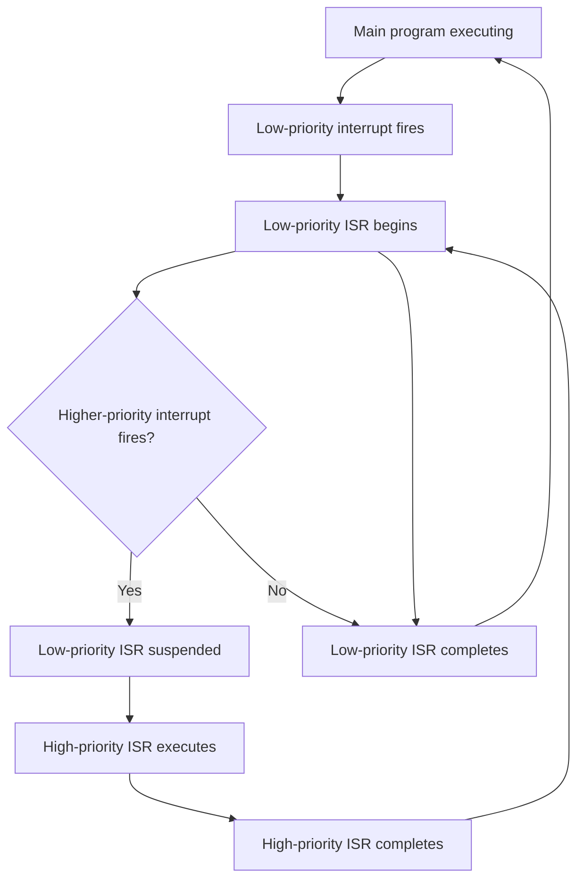

## Interrupt-Driven I/O Concepts

### Overview

Interrupt-driven I/O is a mechanism by which a microcontroller responds to events — a pin changing state, a timer reaching a count, a peripheral finishing a data transfer — immediately as they occur, rather than by continuously checking (polling) for them in a loop. When the event happens, the processor's normal instruction flow is suspended, control jumps to a dedicated handler routine, and once that routine finishes, execution resumes exactly where it left off. This approach is central to responsive, power-efficient, and CPU-efficient embedded design.

### Polling vs. Interrupts

- **Polling**: the CPU repeatedly checks a status flag or pin state in a loop, consuming CPU cycles continuously regardless of whether the event has occurred, and potentially missing brief events that occur between poll checks if the loop is too slow.
- **Interrupt-driven**: the CPU is notified immediately when the event occurs via dedicated hardware, freeing it to do other work (or enter low-power sleep) in the meantime, and typically catching short-duration events far more reliably than a polling loop could.
- **Trade-off**: interrupts introduce their own complexity — race conditions, reentrancy concerns, and timing determinism issues that a purely polled design does not have to consider.

### Polling vs. Interrupt Flow (Mermaid Diagram)



### Core Interrupt Concepts

- **Interrupt Service Routine (ISR)**: the function that executes when an interrupt fires. Registered ahead of time (via a vector table entry or a registered callback, depending on architecture).
- **Interrupt Vector Table**: a table in memory mapping each interrupt source to the address of its corresponding ISR, consulted by hardware when an interrupt occurs so the CPU knows where to jump.
- **Interrupt Flag**: a bit, usually in a peripheral or NVIC (Nested Vectored Interrupt Controller, in ARM Cortex-M terms) register, set by hardware when the triggering condition occurs. Many architectures require this flag to be explicitly cleared by software inside (or sometimes after) the ISR, or the interrupt will immediately re-fire.
- **Interrupt Enable/Mask**: a bit controlling whether a given interrupt source is allowed to actually interrupt the CPU; masked (disabled) interrupts still set their flag in hardware but do not trigger the ISR until unmasked.
- **Global Interrupt Enable**: a master switch (e.g., the `I` bit in AVR's `SREG`, or `PRIMASK`/`CPSIE`/`CPSID` on ARM Cortex-M) that enables or disables interrupt handling for the entire CPU, used to create critical sections where interrupts must not occur.
- **Priority**: on architectures supporting nested interrupts (like Cortex-M's NVIC), each interrupt source can be assigned a priority level, determining which interrupt wins if multiple are pending simultaneously, and whether a lower-priority ISR can itself be interrupted by a higher-priority one.

### GPIO Interrupt Trigger Types

- **Edge-triggered**: fires once at the moment of a signal transition.
  - *Rising edge*: LOW → HIGH transition.
  - *Falling edge*: HIGH → LOW transition.
  - *Both edges (change)*: fires on either transition direction.
- **Level-triggered**: fires continuously (or re-fires) as long as the pin remains in the specified state, rather than only at the moment of transition. Level-triggered interrupts require the triggering condition to be actively removed (e.g., by the connected device releasing the line) or the interrupt masked, or the CPU can be repeatedly re-interrupted.

```c
// Example: conceptual edge-triggered interrupt configuration
attachInterrupt(digitalPinToInterrupt(PIN), myISR, FALLING);

void myISR() {
    // Minimal, fast code only
    eventFlag = true;
}
```

### Interrupt Latency and Determinism

- **Interrupt latency**: the time between the triggering event occurring and the first instruction of the ISR executing. Composed of hardware response time (fixed, architecture-dependent) plus any delay caused by higher-priority interrupts or critical sections currently in progress.
- **Jitter**: variation in that latency from one occurrence to the next, which matters significantly in timing-sensitive applications such as generating precise waveforms or sampling at fixed intervals.
- Disabling interrupts for extended periods (e.g., inside a long critical section) increases worst-case latency for all other interrupts, since none of them can fire while the global interrupt enable is cleared. [Inference — exact latency figures are architecture- and clock-speed-specific and should be measured or derived from the specific MCU's documented interrupt response cycle count]

### ISR Design Best Practices

- **Keep ISRs short**: an ISR should do the minimum necessary work — typically reading a value, setting a flag, or pushing data into a buffer — and defer any lengthy processing to the main loop or a dedicated task, since long ISR execution delays all other pending interrupts of equal or lower priority.
- **Avoid blocking calls inside an ISR**: functions that use `delay()`, wait on other interrupts, or otherwise block are inappropriate inside an ISR context on most embedded platforms.
- **Use `volatile` for shared variables**: any variable written inside an ISR and read in the main loop (or vice versa) must be declared `volatile` in C/C++, which instructs the compiler not to optimize away or cache reads/writes of that variable in a register, since the ISR can modify it asynchronously at any point relative to main-loop execution.

```c
volatile uint32_t pulseCount = 0;

void countPulseISR() {
    pulseCount++;
}
```

- **Atomicity of shared variable access**: on 8-bit architectures, a multi-byte variable (e.g., a 16-bit or 32-bit counter) may be read or written by the main loop as multiple separate byte operations, and if an ISR modifies that variable mid-read, the main loop can observe a corrupted, partially-updated value — a scenario generally addressed by briefly disabling interrupts around the access.

```c
uint32_t safeRead;
noInterrupts();       // or cli(), __disable_irq(), etc. depending on platform
safeRead = pulseCount;
interrupts();         // or sei(), __enable_irq()
```

- **Avoid calling non-reentrant functions from an ISR**: many standard library functions (e.g., certain `malloc`/`free` implementations, some `printf`-family functions) are not safe to call from an ISR context because they may not be reentrant, potentially corrupting internal state if interrupted mid-execution and re-entered.

### Debounce Considerations in Interrupt Context

GPIO interrupts on mechanical switch inputs are especially prone to firing multiple times per single physical actuation due to contact bounce (see input debouncing techniques), since each individual bounce edge can independently trigger the interrupt if it is configured for edge detection.

### Nested Interrupts and Priority

On architectures supporting interrupt nesting (such as ARM Cortex-M's NVIC), a currently executing lower-priority ISR can itself be interrupted by a higher-priority interrupt request, with the lower-priority ISR resuming once the higher-priority one completes.

- Priority levels are typically configured via a peripheral-specific priority register, with lower numeric values conventionally representing higher priority on many ARM implementations. [Inference — the specific priority numbering convention is defined by each architecture/vendor and should be confirmed in that MCU's reference manual]
- Some simpler 8-bit architectures (e.g., classic AVR) do not support true interrupt nesting by default — an executing ISR blocks all other interrupts until it completes, unless the ISR itself explicitly re-enables the global interrupt flag partway through, which is a technique reserved for advanced use cases due to added reentrancy risk.

### Interrupt Nesting Flow (Mermaid Diagram)



### Common Peripheral Interrupt Sources

- **GPIO/EXTI (external interrupt) lines**: pin state change detection, as covered above.
- **Timer/Counter overflow or compare match**: fires when a hardware timer reaches a specific count, commonly used for precise periodic tasks (scheduling, PWM generation, timeouts).
- **UART/SPI/I2C peripheral interrupts**: fire on events like "byte received," "transmit buffer empty," or "transfer complete," allowing communication to proceed without CPU polling of status registers.
- **ADC conversion complete**: fires once an analog-to-digital conversion finishes, allowing the result to be read and a new conversion started without busy-waiting on the conversion.
- **DMA transfer complete**: fires when a Direct Memory Access controller finishes moving a block of data autonomously, notifying the CPU only at completion rather than requiring involvement during the transfer itself.
- **Watchdog timer**: can be configured on some architectures to generate an interrupt (in addition to or instead of a reset) as an early warning before a watchdog-triggered reset occurs.

### Interrupts and Low-Power Modes

Interrupts are the standard mechanism for waking a microcontroller from sleep or low-power modes, since the CPU is otherwise halted and cannot poll for events while asleep.

- Not all interrupt sources are capable of waking every sleep mode — deeper sleep modes often disable clocks to peripherals that would normally generate interrupts, restricting wake sources to a smaller subset (commonly external GPIO interrupts and specific always-on peripherals like an RTC). [Inference — exact wake-source restrictions per sleep mode are device-specific and documented per MCU family]
- This combination (sleep + interrupt wake) is a foundational pattern for battery-powered embedded designs, allowing the CPU to remain in a low-current state until genuinely needed.

### Software (Triggered) Interrupts vs. Hardware Interrupts

- **Hardware interrupts**: triggered by an external event or peripheral condition, as discussed throughout this document.
- **Software interrupts**: deliberately triggered by executing a specific instruction or setting a pending-interrupt bit in software, used in some architectures for purposes such as implementing system calls, forcing a context switch in an RTOS, or testing ISR code paths without needing the real triggering condition present.

### Common Pitfalls

- Writing long-running or blocking code inside an ISR, delaying other interrupts and degrading overall system responsiveness.
- Forgetting to declare shared variables as `volatile`, leading to the compiler caching a stale value in a register and the main loop never observing updates made by the ISR.
- Failing to clear an interrupt flag inside the ISR when required by the architecture, causing the ISR to fire again immediately upon return (an infinite interrupt loop).
- Accessing multi-byte shared variables without disabling interrupts around the access on architectures where such access is not atomic, risking torn/corrupted reads.
- Enabling interrupts too early during peripheral initialization, before all necessary setup (buffers, state variables) is complete, risking the ISR executing against an only partially initialized system state.
- Not accounting for interrupt-induced jitter in timing-critical applications, assuming a fixed and perfectly deterministic response time that the hardware does not actually guarantee under all conditions.
- Calling non-reentrant library functions from within an ISR.

**Related Topics**
- Input debouncing techniques
- DMA (Direct Memory Access) fundamentals
- RTOS task scheduling and interrupt interaction
- Timer/counter peripheral configuration
- Low-power/sleep mode design
- Critical sections and atomic operations in embedded C