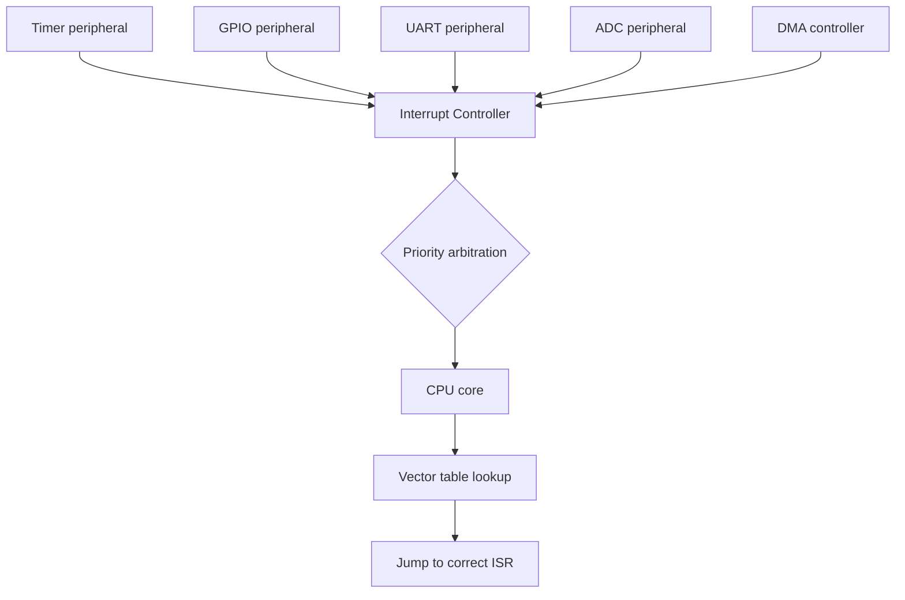
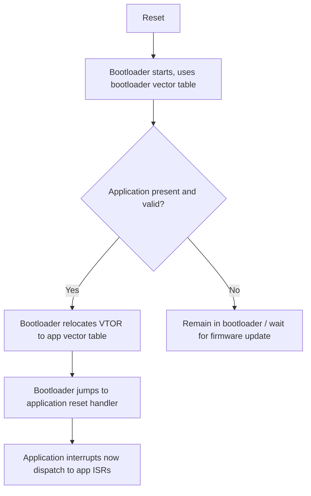

## Interrupt Controllers and Vector Tables

### Overview

Behind every interrupt handled by a microcontroller sits a piece of hardware — the interrupt controller — responsible for detecting pending interrupt requests from many possible sources, resolving priority when several occur simultaneously, and directing the CPU to the correct handler through a vector table. Understanding this layer is what separates writing individual ISRs from understanding how the whole interrupt subsystem is initialized, prioritized, and debugged at a low level.

### Role of the Interrupt Controller

An interrupt controller is a hardware block, either integrated into the CPU core or as a separate on-chip peripheral, that:

- Collects interrupt request (IRQ) signals from many peripheral sources (timers, GPIO, UART, ADC, DMA, etc.).
- Determines which pending interrupt should be serviced next based on configured priority.
- Signals the CPU core to suspend current execution and begin the interrupt-handling sequence.
- Provides registers for enabling/disabling, prioritizing, and querying the pending/active status of individual interrupt sources.

Without a centralized controller, the CPU core itself would need dedicated logic to arbitrate among potentially dozens of simultaneous interrupt sources — the controller offloads this arbitration into purpose-built hardware.

### Interrupt Controller Architecture (Mermaid Diagram)



### The Vector Table

The vector table is a data structure, typically located at a fixed or configurable base address in memory, containing the addresses (or in some architectures, actual jump instructions) of each interrupt source's handler routine.

- **Fixed-position architectures** (e.g., classic AVR): each interrupt source has a hardwired, fixed slot in the vector table at a specific memory address; the compiler/linker places the appropriate handler's address (or a jump instruction) at that fixed location based on the interrupt's name in code (e.g., `ISR(TIMER1_COMPA_vect)`).
- **Configurable/relocatable vector tables** (e.g., ARM Cortex-M): the vector table's base address can often be relocated in memory via a register (`VTOR` — Vector Table Offset Register, in Cortex-M terms), which is useful for bootloader designs where the bootloader and application each need their own vector table at different memory offsets.
- **Table contents on ARM Cortex-M specifically**: the first entry is conventionally the initial stack pointer value, the second is the reset handler address, and subsequent entries cover system exceptions (NMI, HardFault, SVCall, PendSV, SysTick, etc.) followed by peripheral-specific interrupt handlers, in an order defined by the specific microcontroller vendor's device header files.

### Vector Table Layout Example (SVG Diagram)

<svg xmlns="http://www.w3.org/2000/svg" viewBox="0 0 700 320">
  <text x="20" y="20" font-family="monospace" font-size="14" fill="#333">Example Vector Table Layout (svg_diagram)</text>
  <rect x="60" y="40" width="300" height="30" fill="#eef" stroke="#333" />
  <text x="70" y="60" font-family="monospace" font-size="11">0x0000: Initial Stack Pointer</text>
  <rect x="60" y="70" width="300" height="30" fill="#eef" stroke="#333" />
  <text x="70" y="90" font-family="monospace" font-size="11">0x0004: Reset Handler</text>
  <rect x="60" y="100" width="300" height="30" fill="#fee" stroke="#333" />
  <text x="70" y="120" font-family="monospace" font-size="11">0x0008: NMI Handler</text>
  <rect x="60" y="130" width="300" height="30" fill="#fee" stroke="#333" />
  <text x="70" y="150" font-family="monospace" font-size="11">0x000C: HardFault Handler</text>
  <rect x="60" y="160" width="300" height="30" fill="#fee" stroke="#333" />
  <text x="70" y="180" font-family="monospace" font-size="11">... other system exceptions ...</text>
  <rect x="60" y="190" width="300" height="30" fill="#efe" stroke="#333" />
  <text x="70" y="210" font-family="monospace" font-size="11">0x0040: IRQ0 - Peripheral A Handler</text>
  <rect x="60" y="220" width="300" height="30" fill="#efe" stroke="#333" />
  <text x="70" y="240" font-family="monospace" font-size="11">0x0044: IRQ1 - Peripheral B Handler</text>
  <rect x="60" y="250" width="300" height="30" fill="#efe" stroke="#333" />
  <text x="70" y="270" font-family="monospace" font-size="11">... additional peripheral IRQs ...</text>
  <text x="60" y="300" font-family="monospace" font-size="10" fill="#666">Addresses illustrative; actual layout is vendor/device-specific</text>
</svg>

### Interrupt Handling Sequence (General Model)

1. A peripheral sets its interrupt request signal (and typically a status flag readable in a register).
2. The interrupt controller checks whether that source is enabled (unmasked) and, if so, marks it pending.
3. If the CPU is not currently servicing a higher- or equal-priority interrupt (per the configured priority scheme), the controller signals the CPU core.
4. The CPU completes its current instruction (or reaches a defined interruptible boundary), automatically saves the minimum context needed to resume later (commonly the program counter and status/flags register, saved onto the stack), and fetches the ISR address from the vector table.
5. The ISR executes.
6. Upon ISR completion (a `return from interrupt` instruction, or its architecture-specific equivalent), the saved context is restored, and normal execution resumes.

This sequence's exact mechanics — what gets automatically saved, whether saving is done in hardware or must be done manually in the ISR prologue, and how "return from interrupt" is signaled — vary meaningfully between architectures. [Inference — described here as a generalized model; consult the specific CPU architecture reference for exact automatic-save behavior]

### Interrupt Priority Schemes

- **Fixed priority**: interrupt sources have a hardwired priority order (often based on their position in the vector table), with no runtime configurability.
- **Programmable priority**: each interrupt source has an assigned priority level, configurable via a register, and the controller uses this to arbitrate among simultaneously pending interrupts and to decide whether a currently executing lower-priority ISR should be preempted.
- **Priority grouping (sub-priorities)**: some controllers (again, ARM's NVIC being a common example) split priority into "preempt priority" (which can interrupt an in-progress ISR) and "sub-priority" (which only matters for ordering among simultaneously pending interrupts of the same preempt priority, without causing preemption).

### ARM Cortex-M NVIC as a Concrete Example

The Nested Vectored Interrupt Controller (NVIC) is the interrupt controller integrated into ARM Cortex-M cores. Commonly referenced concepts:

- **IRQn**: a numeric identifier for each interrupt source, defined per-device in vendor header files (e.g., `TIM2_IRQn`, `USART1_IRQn`).
- **NVIC_EnableIRQ() / NVIC_DisableIRQ()**: functions (part of the CMSIS — Cortex Microcontroller Software Interface Standard — layer) to enable or disable a specific interrupt source at the controller level.
- **NVIC_SetPriority()**: sets the priority level for a given interrupt source, with the number of available priority bits/levels varying by specific Cortex-M implementation.
- **Priority levels and preemption**: on Cortex-M, numerically lower priority values generally indicate higher priority, and an ISR can be preempted by another pending interrupt with a strictly higher (numerically lower) priority. [Inference — bit width and exact configuration options for priority vary by specific Cortex-M variant and vendor implementation]

```c
// Example: conceptual CMSIS-style NVIC configuration
NVIC_SetPriority(TIM2_IRQn, 2);
NVIC_EnableIRQ(TIM2_IRQn);
```

### System Exceptions vs. Peripheral Interrupts (ARM Cortex-M Terminology)

- **Exceptions**: a broader category including both core-defined system events (Reset, NMI, HardFault, SVCall, PendSV, SysTick) and external peripheral interrupts.
- **NMI (Non-Maskable Interrupt)**: cannot be disabled by software, reserved for critical conditions that must always be serviced (e.g., clock failure detection on some devices).
- **HardFault**: triggered by serious processor-level errors, such as executing an invalid instruction or accessing an invalid memory address, often used during debugging to catch and diagnose such errors.
- **PendSV and SysTick**: frequently used by RTOS implementations — PendSV is commonly used to trigger context switches at a low, configurable priority, and SysTick provides a periodic timer interrupt commonly used to drive the RTOS scheduler's time base.

### Interrupt Vector Table Relocation (Bootloader Use Case)

In systems with a bootloader followed by a separate main application, each may need its own vector table, since each has its own set of ISRs:

1. The bootloader's vector table resides at the base flash address and is used while the bootloader runs.
2. Before (or as part of) jumping to the application, the bootloader typically relocates the vector table pointer (e.g., writes to `VTOR` on Cortex-M) to point to the application's vector table location.
3. The application's interrupts then correctly dispatch to the application's own ISRs rather than the bootloader's.

Failing to perform this relocation correctly is a common bootloader bug, resulting in interrupts jumping to bootloader code (or invalid addresses) after control has already passed to the application.

### Bootloader Vector Table Relocation (Mermaid Diagram)



### Spurious and Unhandled Interrupts

- **Spurious interrupt**: an interrupt that fires without a clearly identifiable or expected cause, sometimes due to electrical noise, a misconfigured peripheral, or a race condition between flag-setting and flag-clearing.
- **Default/unhandled interrupt handler**: many vendor-provided startup code templates fill unused vector table entries with a default handler (often an infinite loop or a call to a fault-reporting routine) to catch the case where an interrupt fires that the application did not explicitly implement a handler for — useful for catching configuration mistakes during development rather than jumping to an undefined/garbage address.

### Common Pitfalls

- Failing to enable an interrupt at every required level — many architectures require enabling the interrupt at the peripheral level, at the interrupt controller level, and via the global interrupt enable, and missing any one of the three results in the interrupt silently never firing.
- Assigning conflicting or unintended priority levels, causing a critical interrupt to be starved by frequent lower-priority-but-higher-configured interrupts.
- Forgetting to relocate the vector table after a bootloader hands off to an application, causing interrupts to jump to bootloader ISRs (or crash) instead of the application's own handlers.
- Leaving unused/default vector table entries unhandled without any fallback, making an unexpected interrupt source silently corrupt program flow or hang without any diagnostic indication.
- Misunderstanding numeric priority ordering conventions (assuming higher numbers mean higher priority when the architecture's convention is the opposite).
- Not accounting for the CPU cycle cost of the interrupt entry/exit sequence (context save/restore) itself when doing tight timing budgets, since this overhead exists on top of the ISR's own code execution time.

**Related Topics**
- Interrupt-driven I/O concepts
- ARM Cortex-M exception model in depth
- Bootloader design and firmware update mechanisms
- RTOS context switching (PendSV/SysTick usage)
- CMSIS and vendor HAL abstraction layers
- Fault handling and debugging (HardFault analysis)