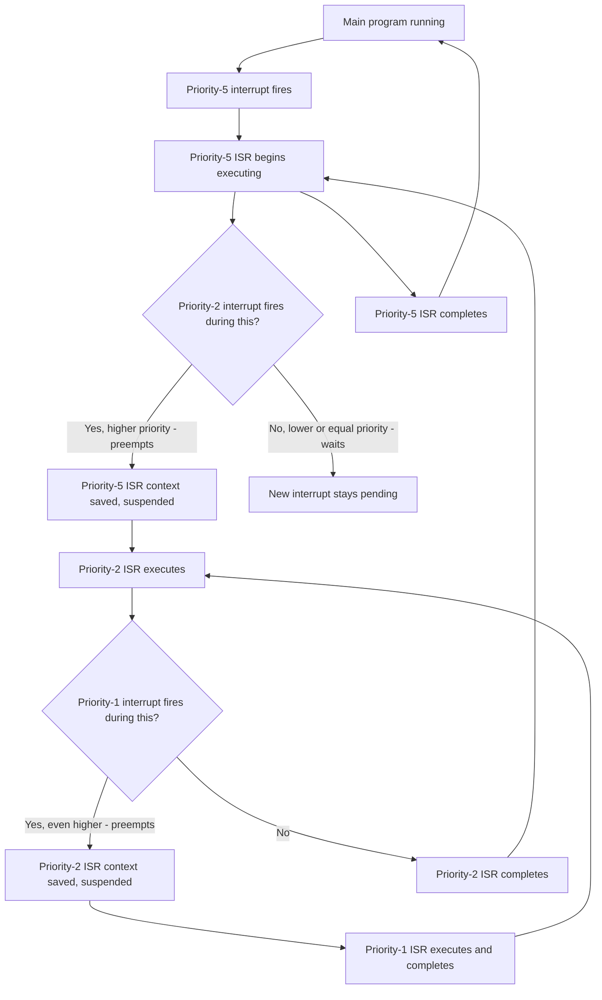

## Interrupt Priority and Nesting

### Overview

When multiple interrupt sources can fire independently and asynchronously, a microcontroller needs rules for deciding which one gets serviced first, and whether an interrupt currently being handled can itself be interrupted by another, more urgent one. Priority and nesting are the two mechanisms that govern this: priority determines ordering among pending interrupts, and nesting determines whether a lower-priority interrupt in progress can be preempted by a higher-priority one before it finishes.

### Why Priority Matters

Without prioritization, all interrupt sources would need to be treated equally, forcing designers to either service them in a fixed, often arbitrary order or accept that any interrupt could indefinitely delay any other. Real embedded systems typically have interrupt sources with very different urgency levels — a safety-critical fault condition versus a routine periodic sensor sample, for instance — and priority lets more time-critical interrupts preempt or precede less urgent ones.

### Priority Without Nesting (Simple Model)

On simpler architectures without nested interrupt support (many classic 8-bit microcontrollers, for example), priority typically only determines:

- Which pending interrupt is serviced *first* if multiple become pending simultaneously (e.g., in the same instruction cycle).
- It does **not** allow a lower-priority ISR already executing to be interrupted by a higher-priority source that becomes pending afterward — once an ISR begins, it generally runs to completion (interrupts often remain globally disabled for the ISR's duration by default) before any other interrupt, regardless of priority, can be serviced. [Inference — exact default behavior varies; some architectures allow explicit re-enabling of interrupts partway through an ISR to opt into nesting-like behavior, which is an advanced and error-prone pattern]

### Priority With Nesting (Nested Vectored Model)

Architectures with genuine interrupt nesting support (such as ARM Cortex-M's NVIC) allow:

- A currently executing ISR to be preempted by a newly pending interrupt of strictly higher priority.
- The preempted ISR's context to be automatically saved (in hardware, on Cortex-M), the higher-priority ISR to run to completion, and then the original ISR to resume exactly where it left off.
- This can happen multiple levels deep — a high-priority ISR can itself be preempted by an even-higher-priority interrupt, forming a nested stack of suspended handlers.

### Nested Preemption Sequence (Mermaid Diagram)

### Priority Levels and Grouping

- **Priority value/level**: a numeric value assigned to each interrupt source, with the specific convention (does lower number mean higher priority, or vice versa?) defined by the architecture. On ARM Cortex-M's NVIC, numerically lower values conventionally indicate higher priority.
- **Preempt priority vs. sub-priority**: some controllers split the priority configuration into two components:
  - *Preempt priority*: determines whether this interrupt can preempt an already-executing lower-preempt-priority ISR.
  - *Sub-priority*: only used to break ties in servicing order among simultaneously pending interrupts that share the same preempt priority level — it does not by itself cause preemption of an already-running ISR.
- **Priority grouping configuration**: on Cortex-M, a priority grouping register setting determines how the total available priority bits are split between preempt priority and sub-priority (e.g., more bits for preempt priority and fewer for sub-priority, or vice versa), a configuration choice made once during system initialization.

### Interrupt Masking and Critical Sections

- **Global interrupt disable**: temporarily disabling all maskable interrupts (e.g., via `CPSID I` / `__disable_irq()` on Cortex-M, or clearing the `I` bit in AVR's `SREG`) to create a critical section where a sequence of operations must complete without interruption — commonly used when reading/writing a multi-byte variable also touched by an ISR.
- **BASEPRI (ARM Cortex-M specific)**: a register allowing selective masking of interrupts *below* a specified priority threshold, while still permitting higher-priority interrupts (including, notably, NMI and sometimes HardFault) to fire — a more surgical alternative to globally disabling all interrupts, useful when a critical section must remain protected from routine interrupts but should not delay a genuinely critical one.
- **Minimizing critical section duration**: since any interrupt masked during a critical section experiences added latency proportional to that section's length, critical sections should be kept as short as practically possible.

### Priority Inversion

A classic pitfall in prioritized systems: a high-priority task or interrupt can be effectively blocked by a lower-priority one if the lower-priority code holds a critical section (interrupts disabled) or a shared resource that the higher-priority interrupt needs, or if lower-priority interrupts are serviced in a way that inadvertently delays a higher-priority one due to a masking or design error.

- **In interrupt-only (non-RTOS) systems**: this typically manifests as an overly long critical section in a low-priority ISR (or main loop code with interrupts disabled) delaying a higher-priority interrupt's response time beyond what its configured priority would suggest.
- **In RTOS contexts**: priority inversion is a well-documented issue in task scheduling (a low-priority task holding a mutex needed by a high-priority task, while a medium-priority task keeps the CPU busy) and is generally addressed via mechanisms like priority inheritance, which is a distinct but related topic from interrupt-level priority nesting itself. [Inference — RTOS priority inversion and interrupt priority nesting are related concepts operating at different levels of the system and should not be conflated]

### Choosing Priority Assignments

General guidance for assigning priority levels across interrupt sources: [Inference — the following are common design heuristics, not universal rules, and the correct assignment is always application-specific]

- Reserve the highest priority levels for interrupts with the tightest real-time deadlines or safety implications (e.g., a fault-detection interrupt, a hardware overcurrent condition).
- Assign lower priority to interrupts that are frequent but tolerant of some delay (e.g., a UART receive interrupt where a small hardware FIFO buffers incoming bytes).
- Avoid assigning unnecessarily high priority to non-critical, frequently-firing interrupts, since doing so can starve out genuinely time-critical lower-priority sources by keeping the CPU perpetually servicing the high-priority-but-non-critical one.
- In RTOS-based designs, interrupts driving the scheduler itself (e.g., SysTick) are often deliberately given a relatively low priority (on Cortex-M, PendSV is conventionally set to the *lowest* priority) so that time-critical peripheral interrupts are not delayed by routine scheduling activity.

### Tail-Chaining and Late-Arriving Interrupts (Cortex-M Specific Optimization)

ARM Cortex-M cores implement optimizations to reduce interrupt-handling overhead in specific scenarios: [Unverified — implementation details vary by specific Cortex-M core generation; consult the architecture reference manual for exact behavior]

- **Tail-chaining**: when one ISR completes and another interrupt is already pending, the core can skip the full context-restore/context-save cycle between them, jumping directly to the next ISR, reducing overhead compared to fully returning to the interrupted code and then re-entering exception handling.
- **Late-arrival**: if a higher-priority interrupt becomes pending during the context-save phase for a lower-priority interrupt that hasn't yet started executing, the core can switch to servicing the higher-priority one first without completing entry into the lower-priority ISR.

### Common Pitfalls

- Assuming all architectures support nested interrupts by default — many simpler 8-bit MCUs do not, and treating priority as if it enables preemption when it only affects initial servicing order is a frequent point of confusion.
- Setting overly broad, long-duration critical sections (global interrupt disable) that inflate worst-case latency for every other interrupt in the system, including ones nominally configured with higher priority.
- Misconfiguring priority grouping (preempt vs. sub-priority split) such that intended preemption behavior does not actually occur because two interrupts end up sharing the same effective preempt priority level.
- Assigning high priority indiscriminately to many interrupt sources "just in case," which defeats the purpose of prioritization and can reintroduce the same starvation issues a flat, unprioritized scheme would have.
- Confusing RTOS task priority with interrupt priority — these are managed by different mechanisms (the RTOS scheduler vs. the hardware interrupt controller) and are not directly comparable or interchangeable concepts.
- Not accounting for nested interrupt stack usage — every level of nesting consumes additional stack space for saved context, and sufficiently deep nesting on a stack-constrained system can risk stack overflow. [Inference — the specific stack depth risk depends on the number of nesting levels actually possible in the given design and the stack size allocated]

**Related Topics**
- Interrupt controllers and vector tables
- Interrupt-driven I/O concepts
- RTOS task scheduling and priority inheritance
- Critical sections and atomic operations in embedded C
- ARM Cortex-M exception model in depth
- Stack usage analysis in embedded systems