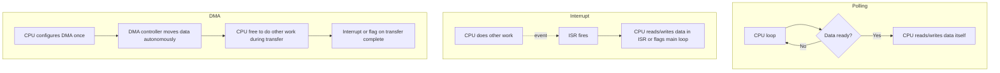
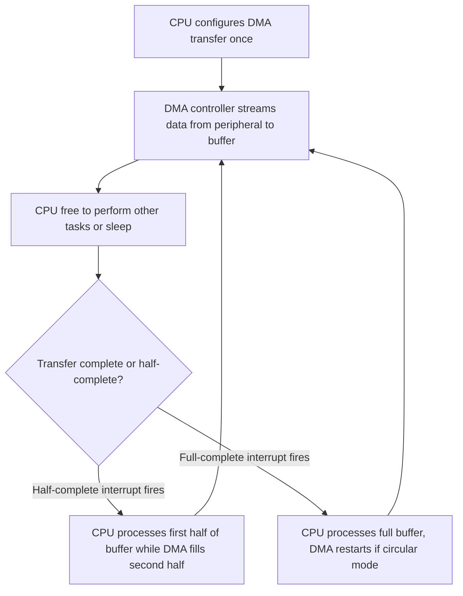

## Polling vs Interrupt vs DMA Tradeoffs

### Overview

Polling, interrupts, and DMA (Direct Memory Access) represent three fundamentally different strategies for how a microcontroller moves data or responds to events involving peripherals. Each trades off CPU involvement, latency, complexity, and power consumption differently, and most real embedded systems use a mix of all three depending on the specific peripheral and timing requirement involved rather than committing exclusively to one approach.

### The Three Approaches at a Glance

- **Polling**: the CPU actively and repeatedly checks a status flag or register to determine whether an event has occurred or data is ready, consuming CPU cycles the entire time it waits.
- **Interrupt-driven**: the CPU is notified asynchronously by hardware when an event occurs, allowing it to do other work in the meantime; a small handler (ISR) then services the event.
- **DMA (Direct Memory Access)**: a dedicated hardware controller moves data directly between a peripheral and memory (or memory to memory) without CPU involvement in the actual data transfer, typically only notifying the CPU (often via interrupt) once the transfer completes or reaches a configured milestone.

### Conceptual Comparison Diagram (Mermaid)

### Polling: Characteristics

**Advantages**

- Simplest to implement and reason about — no asynchronous control flow, no reentrancy concerns, no shared-variable synchronization issues.
- Deterministic in the sense that the exact point of data access in the code is explicit and sequential.
- Appropriate for very simple, low-complexity systems, or during early bring-up/debugging of a peripheral before more complex interrupt or DMA handling is added.

**Disadvantages**

- Wastes CPU cycles busy-waiting, which is especially costly at higher clock speeds relative to how infrequently the awaited event actually occurs.
- Cannot allow the CPU to enter low-power sleep modes while waiting, since sleep requires the CPU to stop executing instructions — which precludes checking a status flag in a loop.
- May miss short-duration or rapidly-repeating events if the polling loop's iteration rate is not fast enough relative to how quickly the condition can change and revert.
- Scales poorly as the number of peripherals needing servicing grows, since a single polling loop must sequentially check every source, increasing the worst-case latency for any individual one.

### Interrupt-Driven: Characteristics

**Advantages**

- Frees the CPU to perform other work (or sleep) while waiting for an event, rather than busy-waiting.
- Generally catches short or infrequent events reliably, since the hardware itself notifies the CPU rather than relying on a polling loop's timing.
- Enables low-power design, since interrupts are the standard mechanism for waking a CPU from sleep modes.
- Supports prioritization among multiple simultaneous event sources (see interrupt priority and nesting).

**Disadvantages**

- Introduces asynchronous execution, requiring careful handling of shared variables (`volatile`, critical sections) and awareness of reentrancy.
- Still requires CPU involvement for every individual event — for high-throughput data transfers (e.g., streaming ADC samples or large UART/SPI transfers), firing an interrupt per byte or per sample can itself become a significant CPU overhead burden at high data rates.
- Interrupt latency and jitter, while generally low, are not zero, and can matter in genuinely hard-real-time applications.
- Adds design complexity: ISR design discipline (keeping ISRs short, avoiding blocking calls) becomes a real constraint on how the codebase is structured.

### DMA: Characteristics

**Advantages**

- Removes the CPU almost entirely from the data-movement path for the duration of a transfer, freeing it for other computation even during large or continuous transfers.
- Particularly effective for high-throughput peripherals (e.g., high-speed ADC sampling, SPI/UART bulk transfers, memory-to-memory copies, display frame buffer updates) where per-byte or per-sample interrupt overhead via a pure interrupt-driven approach would be prohibitive.
- Can be configured in circular/continuous mode for use cases like continuously sampling into a rotating buffer without any CPU intervention between individual samples.
- Reduces the number of interrupts the CPU must field, since a single "transfer complete" (or "half-transfer complete," on controllers supporting that) interrupt can represent hundreds or thousands of individual data items moved.

**Disadvantages**

- Adds configuration complexity — DMA channels, triggers, source/destination addressing modes, and transfer-complete handling all require correct setup, which has a steeper learning curve than a simple polled read or a basic interrupt handler.
- Consumes a limited hardware resource: most microcontrollers have a finite number of DMA channels, and multiple peripherals may need to share or compete for them.
- Data is moved into memory autonomously, so buffer management (avoiding the CPU reading a buffer while DMA is still writing to it, i.e., avoiding a race condition) becomes an explicit design concern.
- Still ultimately requires some form of CPU notification (commonly via interrupt) to know when a transfer has completed, so DMA is typically combined with interrupts rather than fully replacing them.

### Latency and CPU Overhead Comparison

| Approach | CPU overhead during wait | Typical latency to respond | Enables sleep while waiting | Best suited for |
|---|---|---|---|---|
| Polling | High (continuous busy-wait) | Depends entirely on loop iteration rate | No | Simple, low-complexity, or bring-up scenarios |
| Interrupt | Low (CPU free between events) | Low, bounded by architecture + priority | Yes | Infrequent or moderate-rate discrete events |
| DMA | Near-zero during transfer | Transfer proceeds autonomously; CPU notified at completion | Yes (during transfer) | High-throughput, continuous, or bulk data movement |

### Choosing Among the Three in Practice

- **Low-frequency, simple events** (e.g., a button press, a rarely-changing sensor threshold): interrupt-driven is usually the natural fit, balancing simplicity against efficiency.
- **High-throughput, continuous data streams** (e.g., audio sampling, high-speed sensor arrays, large block transfers): DMA is generally preferred, often paired with a single completion (or half-complete, for double-buffering patterns) interrupt rather than per-item interrupts.
- **Extremely simple or resource-constrained designs, or early development/debugging**: polling may be acceptable, particularly when timing requirements are loose and code simplicity is prioritized over CPU efficiency.
- **Hybrid patterns are common in practice**: for example, using DMA to move UART received bytes into a buffer, an interrupt to signal when a specific delimiter byte or buffer threshold is reached, and polling within the main loop to process the now-available buffered data at a convenient point in the program's own flow.

### Combined DMA + Interrupt Pattern (Common in Practice)

### Power Consumption Implications

- Polling generally prevents the CPU from entering any sleep state, since it requires continuous active execution — this is typically the least power-efficient of the three approaches for battery-powered designs. [Inference — this generalization assumes a design where sleep would otherwise be viable; some always-on control loops may not have a meaningful sleep opportunity regardless of I/O strategy]
- Interrupt-driven design allows the CPU to enter sleep between events, waking only when genuinely needed, generally yielding meaningfully lower average power consumption in event-sparse applications.
- DMA further improves on this for data-movement-heavy workloads, since the CPU can remain asleep for the duration of an entire transfer rather than waking for every individual interrupt that a pure interrupt-driven byte-by-byte approach would require.

### Common Pitfalls

- Defaulting to polling out of familiarity even in designs where CPU cycles or power consumption genuinely matter, without evaluating whether an interrupt-driven or DMA-based approach would be a better fit.
- Using per-byte/per-sample interrupts for a high-throughput data stream where a DMA-based approach would substantially reduce CPU overhead, without ever having profiled or measured the actual interrupt burden.
- Configuring DMA without corresponding buffer-safety logic, leading to the CPU reading from or writing to a buffer that DMA is concurrently modifying.
- Assuming DMA eliminates the need for interrupts entirely, when in practice a completion or milestone interrupt is almost always still needed to inform the CPU that new data is ready to process.
- Not accounting for DMA channel contention when multiple peripherals require DMA service simultaneously, especially on parts with a limited number of available channels or channels shared/muxed across peripherals.
- Choosing polling for an event whose timing is unpredictable or bursty, resulting in either excessive CPU waste (over-polling) or missed events (under-polling), when an interrupt would have handled both cases robustly by design.

**Related Topics**
- Interrupt-driven I/O concepts
- DMA (Direct Memory Access) fundamentals
- Low-power/sleep mode design considerations
- UART/SPI/I2C peripheral buffering strategies
- Double-buffering and circular buffer techniques
- Real-time system design and worst-case timing analysis