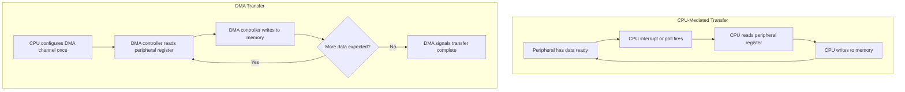

## Direct Memory Access Fundamentals

### Overview

Direct Memory Access (DMA) is a hardware subsystem that transfers data between memory and peripherals — or between two memory locations — without requiring the CPU to execute an instruction for each individual data item moved. Once configured, a DMA controller operates autonomously, freeing the CPU to perform other work and enabling substantially higher data throughput than a CPU-mediated (polled or interrupt-per-item) transfer could achieve for the same workload.

### The Core Problem DMA Solves

Without DMA, moving data between a peripheral and memory requires the CPU to explicitly read from the peripheral's data register and write to memory (or vice versa) for every single item — a byte, a sample, a word. For high-throughput peripherals (fast ADCs, high-speed SPI/UART links, display frame buffers), this per-item CPU involvement becomes a significant bottleneck, consuming CPU cycles proportional to the data volume rather than being a fixed, one-time setup cost.

### DMA vs. CPU-Mediated Transfer (Mermaid Diagram)



### Key DMA Concepts

- **DMA Channel**: an independently configurable transfer path within the DMA controller; most microcontrollers provide multiple channels, often assignable (or fixed, depending on architecture) to specific peripheral request sources.
- **Source and Destination**: DMA transfers move data from a source address to a destination address — either can be a fixed peripheral data register or an incrementing memory buffer address, depending on transfer direction and mode.
- **Transfer Direction**: commonly categorized as peripheral-to-memory, memory-to-peripheral, or memory-to-memory.
- **Burst vs. Single Transfers**: some DMA controllers can move multiple data items per bus arbitration cycle (burst mode) rather than one item per cycle, improving bus efficiency for large transfers, depending on architecture support.
- **Transfer Width**: the size of each individual data item moved (e.g., byte, half-word, word), configurable independently for source and destination in many DMA controllers to support width-mismatched transfers.
- **Transfer Count**: the total number of items to move in a given DMA operation, after which (in non-circular modes) the DMA channel stops and typically raises a completion interrupt/flag.

### DMA Request and Trigger Mechanisms

A DMA transfer doesn't run continuously and unconditionally — it needs to be triggered:

- **Peripheral-triggered**: the peripheral itself signals a DMA request line when it has data ready (e.g., ADC conversion complete, UART receive register full, SPI transmit register empty), and the DMA controller responds by performing one transfer (or a burst) per request.
- **Software-triggered**: DMA is initiated directly by software, typically used for memory-to-memory transfers where no peripheral is involved in pacing the transfer.
- **Timer-triggered**: some DMA controllers can be triggered by a timer event, useful for pacing transfers at a fixed rate independent of a data-ready peripheral flag (e.g., periodically sampling a peripheral register into a buffer at a controlled interval).

### DMA Transfer Modes

- **Single/Normal mode**: the DMA channel performs the configured number of transfers once and then stops, requiring software to reconfigure and restart it for another transfer.
- **Circular/Continuous mode**: upon reaching the end of the configured buffer, the DMA channel automatically wraps back to the beginning and continues transferring without CPU intervention, useful for continuously sampling into a rotating buffer (e.g., continuous ADC sampling, continuous audio streaming).
- **Double-buffering (ping-pong) mode**: some DMA controllers support switching between two buffers automatically, allowing the CPU to safely process one buffer's contents while DMA fills the other, then swapping roles — a pattern that avoids the race condition of the CPU reading a buffer that DMA is still actively writing to.

### Circular DMA Buffer Diagram (SVG)

<svg xmlns="http://www.w3.org/2000/svg" viewBox="0 0 700 260">
  <text x="20" y="20" font-family="monospace" font-size="14" fill="#333">Circular DMA Buffer (svg_diagram)</text>
  <circle cx="350" cy="150" r="90" fill="none" stroke="#333" stroke-width="2" />
  <circle cx="350" cy="60" r="6" fill="#0066cc" />
  <text x="360" y="55" font-family="monospace" font-size="11">Write pointer (DMA)</text>
  <path d="M 350 60 A 90 90 0 0 1 440 150" fill="none" stroke="#0066cc" stroke-width="3" stroke-dasharray="6,3" />
  <circle cx="260" cy="150" r="6" fill="#a00" />
  <text x="150" y="150" font-family="monospace" font-size="11" fill="#a00">Read pointer (CPU)</text>
  <text x="300" y="245" font-family="monospace" font-size="10" fill="#666">Wraps to start automatically at buffer end</text>
</svg>

### Half-Transfer and Full-Transfer Interrupts

Many DMA controllers can raise an interrupt not only at full transfer completion but also at the halfway point of a configured circular buffer transfer. This enables a common pattern:

1. DMA continuously fills a buffer in circular mode.
2. When the buffer is half full, a half-transfer interrupt fires, and the CPU begins processing the first half while DMA continues filling the second half.
3. When the buffer is completely full (and DMA has wrapped to refill the first half again), a full-transfer interrupt fires, and the CPU processes the second half while DMA refills the first.

This effectively implements double-buffering using a single physical buffer, avoiding the memory overhead of two separate buffers while still preventing the CPU from reading data that DMA is concurrently overwriting, provided the CPU's processing of each half completes before DMA wraps back around to overwrite it.

### Memory-to-Memory DMA

DMA is not limited to peripheral transfers — it can also copy data directly between two memory locations without CPU involvement, useful for:

- Large buffer copies or memory clears where using the CPU to loop through each byte/word would consume significant cycles.
- Offloading data reorganization tasks (e.g., copying a fully assembled buffer to a different memory region for further processing) while the CPU continues other work.

### DMA and Cache Coherency (Relevant on Cache-Enabled MCUs)

On more capable microcontrollers that include a data cache (some higher-end Cortex-M7 or Cortex-A-class parts, for instance), a subtlety arises: DMA transfers move data directly to/from main memory, bypassing the CPU's cache. If the CPU has cached a copy of a memory region that DMA subsequently modifies (or vice versa), the CPU may read stale cached data unless cache maintenance operations (invalidate/clean cache lines) are explicitly performed around the DMA transfer. [Inference — this concern applies specifically to cache-enabled architectures; many simpler microcontrollers have no data cache and are unaffected by this issue]

### Common DMA Use Cases

- **ADC continuous sampling**: DMA moves each completed ADC conversion result into a buffer automatically, allowing high-rate sampling without a per-sample interrupt.
- **UART/SPI bulk transfer**: DMA handles transmission or reception of a large buffer of bytes over a serial peripheral without the CPU needing to service each byte individually.
- **Display/frame buffer updates**: DMA transfers pixel data from a memory buffer to a display peripheral's interface, freeing the CPU from manually pushing individual pixels.
- **Audio streaming**: DMA continuously feeds an audio DAC/codec peripheral from a circular buffer, with the CPU periodically refilling the "already-played" portion of the buffer based on half/full transfer interrupts.
- **Memory-to-memory bulk copy/clear**: offloading large `memcpy`-style operations from CPU-executed loops.

### Configuring a Basic DMA Transfer (Conceptual Example)

```c
// Conceptual pattern; exact register names/API vary significantly by vendor
DMA_Config cfg;
cfg.source = &ADC1->DR;         // peripheral data register
cfg.destination = adcBuffer;    // memory buffer
cfg.transferCount = BUFFER_SIZE;
cfg.mode = DMA_MODE_CIRCULAR;
cfg.direction = DMA_PERIPH_TO_MEM;
cfg.dataWidth = DMA_WIDTH_HALFWORD;

DMA_Init(DMA_CHANNEL_1, &cfg);
DMA_EnableInterrupt(DMA_CHANNEL_1, DMA_IT_TRANSFER_COMPLETE | DMA_IT_HALF_TRANSFER);
DMA_Start(DMA_CHANNEL_1);
```

### DMA Priority and Bus Arbitration

- Since DMA and the CPU both need access to the system memory bus, contention can occur when both attempt to access memory simultaneously; DMA controllers typically support configurable priority levels among channels, and the overall bus arbitration scheme (often called "bus matrix" or similar depending on architecture) determines how CPU and DMA accesses are interleaved.
- On some architectures, heavy DMA activity can measurably stall CPU instruction fetch or data access due to shared bus bandwidth, particularly when both are contending for the same memory region simultaneously. [Inference — the magnitude of this effect is highly architecture- and workload-specific, and negligible on some designs with separate bus paths for CPU and DMA]

### Common Pitfalls

- Reading from or writing to a buffer that DMA is actively transferring into/out of, without proper half/full-transfer synchronization, causing torn or inconsistent data.
- Forgetting cache maintenance operations on cache-enabled architectures, leading to the CPU reading stale data after a DMA transfer has updated memory the cache is unaware of.
- Misconfiguring transfer width mismatches between source and destination (e.g., reading a 16-bit peripheral register into a byte-wide destination), resulting in truncated or misaligned data.
- Not enabling or correctly configuring the transfer-complete (or half-transfer) interrupt, causing the CPU to never learn that new data is available despite the transfer having occurred correctly in hardware.
- Exhausting available DMA channels when multiple peripherals require simultaneous DMA service, especially on parts with a small or shared/muxed channel pool.
- Assuming DMA transfers are "free" from a system perspective — bus bandwidth is a shared resource, and sufficiently intensive DMA activity can still measurably impact CPU performance on some architectures.

**Related Topics**
- Polling vs interrupt vs DMA tradeoffs
- Interrupt-driven I/O concepts
- Double-buffering and circular buffer techniques
- ADC sampling and conversion fundamentals
- Cache coherency in embedded systems
- UART/SPI/I2C peripheral configuration